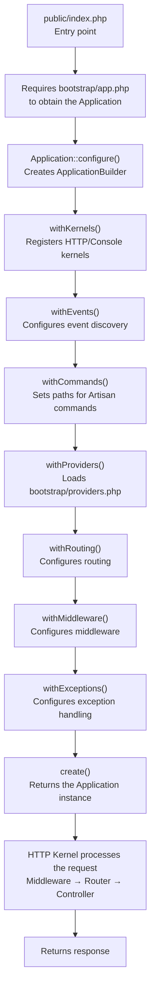

## Comparison with Laravel 10 and earlier

Laravel 11 introduced the "Slim Application Skeleton," a significant overhaul of the application structure. The biggest change is the consolidation of scattered configuration into a single place: `bootstrap/app.php`.

| Item | Laravel 10 and earlier | Laravel 11 and later |
|---|---|---|
| HTTP kernel | `app/Http/Kernel.php` | Removed (merged into framework) |
| Console kernel | `app/Console/Kernel.php` | Removed (moved to `routes/console.php`) |
| Exception handler | `app/Exceptions/Handler.php` | Removed (consolidated into `bootstrap/app.php`) |
| Service providers | 5 files | Single `AppServiceProvider.php` |
| Route files | `web.php` / `api.php` by default | Only `web.php` by default; `api.php` is opt-in |
| Bootstrap | Configuration spread across multiple files | Consolidated into `bootstrap/app.php` |
| Default DB | MySQL/PostgreSQL | SQLite |

<Info>
  This change is intended for **new projects**. Upgrading an existing application from an older version leaves the previous structure fully functional.
</Info>

## New directory and file structure

### Skeleton directory layout

```
laravel-app/
├── app/
│   ├── Http/
│   │   └── Controllers/
│   ├── Models/
│   │   └── User.php
│   └── Providers/
│       └── AppServiceProvider.php
├── bootstrap/
│   ├── app.php          ← Central application configuration
│   ├── cache/
│   └── providers.php    ← List of service providers
├── config/
├── database/
├── public/
│   └── index.php        ← Entry point
├── resources/
├── routes/
│   ├── web.php          ← Web routes (loaded by default)
│   └── console.php      ← Artisan commands and schedules
├── storage/
└── tests/
```

### `bootstrap/app.php` — the center of application configuration

```php
<?php

use Illuminate\Foundation\Application;
use Illuminate\Foundation\Configuration\Exceptions;
use Illuminate\Foundation\Configuration\Middleware;

return Application::configure(basePath: dirname(__DIR__))
    ->withRouting(
        web: __DIR__.'/../routes/web.php',
        commands: __DIR__.'/../routes/console.php',
        health: '/up',
    )
    ->withMiddleware(function (Middleware $middleware): void {
        //
    })
    ->withExceptions(function (Exceptions $exceptions): void {
        //
    })->create();
```

This single file configures routing, middleware, and exception handling. In Laravel 10 and earlier, these settings were spread across `app/Http/Kernel.php`, `app/Console/Kernel.php`, and `app/Exceptions/Handler.php`.

### `bootstrap/providers.php` — list of service providers

```php
<?php

use App\Providers\AppServiceProvider;

return [
    AppServiceProvider::class,
];
```

This file is the registration point for service providers. In Laravel 10, providers were listed in the `providers` array inside `config/app.php`. They have now been separated into `bootstrap/providers.php`. Only `AppServiceProvider` is included by default.

<Tip>
  When you install a package via `composer require`, it may automatically update `bootstrap/providers.php`. While `config/app.php` is still referenced, `bootstrap/providers.php` is the recommended location for new registrations.
</Tip>

### Changes to the `routes/` directory

```
routes/
├── web.php      ← Web routes (loaded by default)
└── console.php  ← Defines Artisan commands and schedules
```

`api.php` and `channels.php` do not exist by default. Generate them with Artisan commands when needed.

```shell
# Add API routes (installs api.php + Sanctum)
php artisan install:api

# Add broadcasting (installs channels.php + Reverb, etc.)
php artisan install:broadcasting
```

You can also define schedules in `routes/console.php`.

```php
<?php

use Illuminate\Foundation\Inspiring;
use Illuminate\Support\Facades\Artisan;
use Illuminate\Support\Facades\Schedule;

Artisan::command('inspire', function () {
    $this->comment(Inspiring::quote());
})->purpose('Display an inspiring quote');

Schedule::command('emails:send')->daily();
```

### Removed files

<AccordionGroup>
  <Accordion title="Removal of app/Http/Kernel.php">
    The HTTP kernel was merged into the framework's `Illuminate\Foundation\Http\Kernel`. Middleware customization is now done via `withMiddleware()` in `bootstrap/app.php`.

    ```php
    // Laravel 10 and earlier: app/Http/Kernel.php
    protected $middleware = [
        \Illuminate\Http\Middleware\TrustProxies::class,
        // ...
    ];

    protected $middlewareGroups = [
        'web' => [
            \App\Http\Middleware\EncryptCookies::class,
            // ...
        ],
    ];
    ```

    ```php
    // Laravel 11 and later: bootstrap/app.php
    ->withMiddleware(function (Middleware $middleware) {
        $middleware->web(append: [
            EnsureUserIsSubscribed::class,
        ]);

        $middleware->validateCsrfTokens(except: ['stripe/*']);
    })
    ```
  </Accordion>

  <Accordion title="Removal of app/Console/Kernel.php">
    The two responsibilities of the console kernel were separated. Artisan commands placed in `app/Console/Commands/` are auto-discovered, and schedules are defined in `routes/console.php`.

    ```php
    // Laravel 10 and earlier: app/Console/Kernel.php
    protected function schedule(Schedule $schedule): void
    {
        $schedule->command('emails:send')->daily();
    }
    ```

    ```php
    // Laravel 11 and later: routes/console.php
    use Illuminate\Support\Facades\Schedule;

    Schedule::command('emails:send')->daily();
    ```
  </Accordion>

  <Accordion title="Removal of app/Exceptions/Handler.php">
    The exception handler was merged into the framework's `Illuminate\Foundation\Exceptions\Handler`. Customization is now done via `withExceptions()` in `bootstrap/app.php`.

    ```php
    // Laravel 10 and earlier: app/Exceptions/Handler.php
    public function register(): void
    {
        $this->reportable(function (InvalidOrderException $e) {
            // ...
        });
    }
    ```

    ```php
    // Laravel 11 and later: bootstrap/app.php
    ->withExceptions(function (Exceptions $exceptions) {
        $exceptions->report(function (InvalidOrderException $e) {
            // ...
        });
    })
    ```
  </Accordion>
</AccordionGroup>

## How `Application::configure()` works

### Internal framework implementation

`Application::configure()` is a static method on `Illuminate\Foundation\Application`.

```php
// From Illuminate\Foundation\Application
public static function configure(?string $basePath = null)
{
    $basePath = match (true) {
        is_string($basePath) => $basePath,
        default => static::inferBasePath(),
    };

    return (new Configuration\ApplicationBuilder(new static($basePath)))
        ->withKernels()
        ->withEvents()
        ->withCommands()
        ->withProviders();
}
```

This method does the following:

1. Determines the application root directory from `basePath`
2. Creates an `Application` instance
3. Wraps it in an `ApplicationBuilder` and applies default configuration
4. Returns the `ApplicationBuilder` instance

The important detail is that `withKernels()`, `withEvents()`, `withCommands()`, and `withProviders()` are **already called inside `configure()`**. You do not need to call them again in `bootstrap/app.php`.

### The method-chaining configuration flow

```php
Application::configure(basePath: dirname(__DIR__))  // Returns ApplicationBuilder
    ->withRouting(...)       // Configures routing, returns $this
    ->withMiddleware(...)    // Configures middleware, returns $this
    ->withExceptions(...)    // Configures exception handling, returns $this
    ->create();              // Returns the Application instance
```

Calling `create()` extracts the `Application` instance from the `ApplicationBuilder`. What `bootstrap/app.php` returns is this `Application` instance.

## Request-to-boot flow



`public/index.php` is the entry point. It loads `bootstrap/app.php` to obtain the `Application`, after which the HTTP Kernel passes the request through the middleware pipeline and the router dispatches it to a controller.

## Deep dive into `ApplicationBuilder` methods

### `withRouting()` — internal route registration

```php
public function withRouting(
    ?Closure $using = null,
    array|string|null $web = null,
    array|string|null $api = null,
    ?string $commands = null,
    ?string $channels = null,
    ?string $pages = null,
    ?string $health = null,
    string $apiPrefix = 'api',
    ?callable $then = null
)
```

Internally, it registers a callback with `AppRouteServiceProvider::loadRoutesUsing()` and registers `AppRouteServiceProvider` during the application's boot phase.

```php
// Simplified internal processing of withRouting()
protected function buildRoutingCallback(...)
{
    return function () use ($web, $api, $pages, $health, $apiPrefix, $then) {
        if (is_string($api) || is_array($api)) {
            Route::middleware('api')->prefix($apiPrefix)->group($api);
        }

        if (is_string($health)) {
            Route::get($health, function () {
                Event::dispatch(new DiagnosingHealth);
                return response(View::file(...), status: 200);
            });
        }

        if (is_string($web) || is_array($web)) {
            Route::middleware('web')->group($web);
        }

        if (is_callable($then)) {
            $then($this->app);
        }
    };
}
```

**Key points:**
- `api` routes automatically get the `api` middleware group and the `/api` prefix
- Passing a string to `health` auto-registers a health-check endpoint (default `/up`)
- The `health` path is excluded during maintenance mode (configured via `PreventRequestsDuringMaintenance::except()`)
- `api` is registered before `web` — if you define routes with the same path for both, the API route takes precedence
- Passing a string to `pages` enables [Laravel Folio](https://github.com/laravel/folio) routing

### `withMiddleware()` — middleware customization

```php
public function withMiddleware(?callable $callback = null)
{
    $this->app->afterResolving(HttpKernel::class, function ($kernel) use ($callback) {
        $middleware = (new Middleware)
            ->redirectGuestsTo(fn () => route('login'));

        if (! is_null($callback)) {
            $callback($middleware);
        }

        $kernel->setGlobalMiddleware($middleware->getGlobalMiddleware());
        $kernel->setMiddlewareGroups($middleware->getMiddlewareGroups());
        $kernel->setMiddlewareAliases($middleware->getMiddlewareAliases());
        // ...
    });

    return $this;
}
```

`withMiddleware()` executes the callback **after** `HttpKernel` is resolved, using an `afterResolving()` hook. The `Middleware` object passed to the callback provides a rich set of customization methods.

```php
->withMiddleware(function (Middleware $middleware) {
    // Add a global middleware
    $middleware->append(MyGlobalMiddleware::class);

    // Append middleware to the web group
    $middleware->web(append: [EnsureUserIsSubscribed::class]);

    // Replace middleware in the api group
    $middleware->api(replace: [
        OldMiddleware::class => NewMiddleware::class,
    ]);

    // Set CSRF exclusion paths
    $middleware->validateCsrfTokens(except: ['stripe/*', 'webhook/*']);

    // Change the redirect destination for unauthenticated users
    $middleware->redirectGuestsTo('/custom-login');

    // Set middleware priority
    $middleware->priority([
        \Illuminate\Session\Middleware\StartSession::class,
        \Illuminate\View\Middleware\ShareErrorsFromSession::class,
    ]);
})
```

### `withExceptions()` — exception handling configuration

```php
public function withExceptions(?callable $using = null)
{
    $this->app->singleton(
        \Illuminate\Contracts\Debug\ExceptionHandler::class,
        \Illuminate\Foundation\Exceptions\Handler::class
    );

    if ($using !== null) {
        $this->app->afterResolving(
            \Illuminate\Foundation\Exceptions\Handler::class,
            fn ($handler) => $using(new Exceptions($handler)),
        );
    }

    return $this;
}
```

`withExceptions()` registers the framework's `Handler` class as a singleton and then sets up the callback via `afterResolving()`. The callback receives an `Exceptions` wrapper object.

```php
->withExceptions(function (Exceptions $exceptions) {
    // Do not report a specific exception
    $exceptions->dontReport(MissedFlightException::class);

    // Custom reporting for a specific exception
    $exceptions->report(function (InvalidOrderException $e) {
        // e.g., send a Slack notification
    });

    // Customize the HTTP response for a specific exception
    $exceptions->render(function (NotFoundHttpException $e, Request $request) {
        if ($request->is('api/*')) {
            return response()->json(['message' => 'Not Found'], 404);
        }
    });

    // Throttle repeated reports of the same exception
    $exceptions->throttle(function (Throwable $e) {
        return Limit::perMinute(20);
    });
})
```

### `withProviders()` — service provider registration

```php
public function withProviders(array $providers = [], bool $withBootstrapProviders = true)
{
    RegisterProviders::merge(
        $providers,
        $withBootstrapProviders
            ? $this->app->getBootstrapProvidersPath()
            : null
    );

    return $this;
}
```

Because `withProviders()` is called by default inside `Application::configure()`, `bootstrap/providers.php` is loaded automatically. If you need to register additional providers, call `withProviders()` explicitly in `bootstrap/app.php`.

```php
Application::configure(basePath: dirname(__DIR__))
    ->withProviders([
        // Additional providers on top of the default bootstrap/providers.php
        App\Providers\CustomServiceProvider::class,
    ])
    ->withRouting(...)
    ->create();
```

<Warning>
  Passing `withBootstrapProviders: false` prevents `bootstrap/providers.php` from being loaded. Omit this option unless you have a specific reason to do so.
</Warning>

### Other key methods

| Method | Description |
|---|---|
| `withKernels()` | Registers the HTTP/Console kernels as singletons. Called automatically by `configure()` |
| `withEvents()` | Enables event discovery. Called automatically by `configure()` |
| `withCommands(array $commands)` | Registers additional Artisan command classes or directories |
| `withSchedule(callable $callback)` | Defines schedules directly in `bootstrap/app.php` |
| `withBroadcasting(string $channels)` | Registers the broadcast channel file |
| `withBindings(array $bindings)` | Registers container bindings |
| `withSingletons(array $singletons)` | Registers singleton bindings |
| `registered(callable $callback)` | Adds a callback to run after service providers are registered |
| `booting(callable $callback)` | Adds a callback to run during the booting phase |
| `booted(callable $callback)` | Adds a callback to run after the application has booted |
| `create()` | Returns the `Application` instance |

## Design intent: why it works this way

### "Code-first" configuration

In Laravel 10 and earlier, `app/Http/Kernel.php` used arrays to enumerate middleware, resembling a configuration file. This approach provided limited benefit from PHP's type system and IDE support.

Laravel 11 switches to the callback style `withMiddleware(function (Middleware $middleware) { ... })`. This enables type completion and makes dynamic configuration using conditionals and loops feel natural.

### From "convention over configuration" to "explicit configuration"

Making `api.php` opt-in removes the overhead of always loading the `api` middleware group for applications that do not use API routes. The philosophy is: if you do not use a feature, it should not exist by default.

### Use of `afterResolving()` hooks

`withMiddleware()` and `withExceptions()` use `afterResolving()` to avoid ordering issues. The `ApplicationBuilder` methods are called before the application is fully bootstrapped, but the actual work (applying configuration to the kernel) is deferred until the kernel is first resolved.

## Practical customization examples

### Combining API and web routes

```php
return Application::configure(basePath: dirname(__DIR__))
    ->withRouting(
        web: __DIR__.'/../routes/web.php',
        api: __DIR__.'/../routes/api.php',
        commands: __DIR__.'/../routes/console.php',
        health: '/up',
        apiPrefix: 'api/v1',  // Change the default /api prefix
    )
    ->withMiddleware(function (Middleware $middleware): void {
        //
    })
    ->withExceptions(function (Exceptions $exceptions): void {
        //
    })->create();
```

### Middleware customization

```php
->withMiddleware(function (Middleware $middleware) {
    // Add an authentication-check middleware to web routes
    $middleware->web(append: [
        \App\Http\Middleware\EnsureEmailIsVerified::class,
    ]);

    // Remove a specific middleware from API routes
    $middleware->api(remove: [
        \Illuminate\Session\Middleware\StartSession::class,
    ]);

    // Exclude webhook endpoints from CSRF protection
    $middleware->validateCsrfTokens(except: [
        'webhook/*',
        'stripe/webhook',
    ]);

    // Assign an alias to a specific middleware
    $middleware->alias([
        'subscribed' => \App\Http\Middleware\EnsureUserIsSubscribed::class,
    ]);
})
```

### Consolidating schedules in `bootstrap/app.php`

You can write schedules in `routes/console.php`, but using `withSchedule()` lets you keep everything in `bootstrap/app.php`.

```php
use Illuminate\Console\Scheduling\Schedule;

return Application::configure(basePath: dirname(__DIR__))
    ->withRouting(
        web: __DIR__.'/../routes/web.php',
        commands: __DIR__.'/../routes/console.php',
        health: '/up',
    )
    ->withSchedule(function (Schedule $schedule) {
        $schedule->command('emails:send')->daily();
        $schedule->command('reports:generate')->weeklyOn(1, '8:00');
        $schedule->job(new PruneOldRecords)->daily();
    })
    ->withMiddleware(function (Middleware $middleware): void {
        //
    })
    ->withExceptions(function (Exceptions $exceptions): void {
        //
    })->create();
```

### Exception handling customization

```php
->withExceptions(function (Exceptions $exceptions) {
    // Always return JSON for API requests
    $exceptions->render(function (Throwable $e, Request $request) {
        if ($request->is('api/*') || $request->wantsJson()) {
            $status = match (true) {
                $e instanceof NotFoundHttpException => 404,
                $e instanceof AuthenticationException => 401,
                $e instanceof AuthorizationException => 403,
                $e instanceof ValidationException => 422,
                default => 500,
            };

            return response()->json([
                'message' => $e->getMessage(),
            ], $status);
        }
    });

    // Notify Slack only in production
    if (app()->isProduction()) {
        $exceptions->report(function (Throwable $e) {
            app(SlackNotifier::class)->notify($e);
        })->stop();
    }
})
```

### Managing container bindings in `bootstrap/app.php`

For small applications, you can define simple bindings in `bootstrap/app.php` instead of `AppServiceProvider`.

```php
return Application::configure(basePath: dirname(__DIR__))
    ->withRouting(...)
    ->withSingletons([
        \App\Contracts\PaymentGateway::class => \App\Services\StripeGateway::class,
        \App\Contracts\MailService::class => \App\Services\SendgridMailService::class,
    ])
    ->withMiddleware(...)
    ->withExceptions(...)
    ->create();
```

## Next steps

<Card title="Service container" icon="box" href="/en/service-container">
  Understand the service container that ApplicationBuilder uses internally.
</Card>
