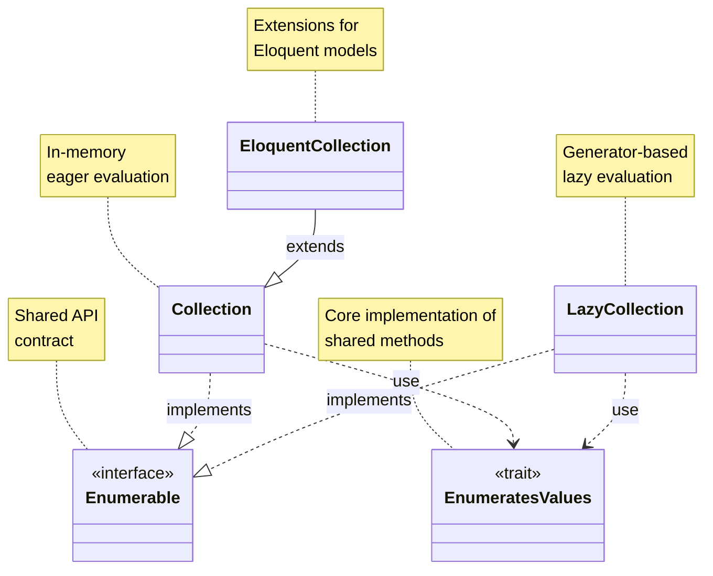

## What this page covers

This page does not explain how to use `collect()`.
It gives you a map for reading Laravel framework source code.

This is for you if you already know Collection methods and now want to understand why the design looks the way it does.

## Historical evolution

The Collection structure was significantly reorganized when `LazyCollection` was introduced.

### Up to Laravel 5.8

- `Illuminate\Support\Collection`
- `Illuminate\Database\Eloquent\Collection` (extends `Collection`)

At this point, `LazyCollection`, `Enumerable`, and `EnumeratesValues` did not exist yet.

- [Collection.php in 5.8](https://github.com/laravel/framework/blob/5.8/src/Illuminate/Support/Collection.php)
- [Eloquent Collection.php in 5.8](https://github.com/laravel/framework/blob/5.8/src/Illuminate/Database/Eloquent/Collection.php)

### Changes in Laravel 6.0

With the introduction of `LazyCollection`, Laravel separated common APIs into `Enumerable` (interface) and `EnumeratesValues` (trait).

- [LazyCollection.php in 6.x](https://github.com/laravel/framework/blob/6.x/src/Illuminate/Support/LazyCollection.php)
- [Enumerable.php in 6.x](https://github.com/laravel/framework/blob/6.x/src/Illuminate/Support/Enumerable.php)
- [EnumeratesValues.php in 6.x](https://github.com/laravel/framework/blob/6.x/src/Illuminate/Support/Traits/EnumeratesValues.php)

## Current overall structure (Laravel 13)

> Reference: [laravel/framework v13.x](https://github.com/laravel/framework/tree/13.x/src/Illuminate)



- [Collection.php](https://github.com/laravel/framework/blob/13.x/src/Illuminate/Collections/Collection.php)
- [LazyCollection.php](https://github.com/laravel/framework/blob/13.x/src/Illuminate/Collections/LazyCollection.php)
- [EnumeratesValues.php](https://github.com/laravel/framework/blob/13.x/src/Illuminate/Collections/Traits/EnumeratesValues.php)
- [Enumerable.php](https://github.com/laravel/framework/blob/13.x/src/Illuminate/Collections/Enumerable.php)
- [Eloquent Collection.php](https://github.com/laravel/framework/blob/13.x/src/Illuminate/Database/Eloquent/Collection.php)

<Info>
  Current file paths are under `src/Illuminate/Collections/*`, but the namespace remains `Illuminate\\Support`. Check both path and namespace when reading source.
</Info>

## PHPDoc and PHPStan-style generics

PHP itself still has no native generics.
Still, Collection-related classes express strong type information through PHPDoc.

The main goals are:

- Accurate IDE autocompletion
- Better static analysis with PHPStan and Larastan

### Common syntax

```php
/**
 * @template TKey of array-key
 * @template-covariant TValue
 * @implements \Illuminate\Support\Enumerable<TKey, TValue>
 */
class Collection implements Enumerable
{
    /**
     * @use \Illuminate\Support\Traits\EnumeratesValues<TKey, TValue>
     */
    use EnumeratesValues;
}
```

| Syntax | Meaning |
|---|---|
| `@template TKey of array-key` | Restricts key type to `int\|string` |
| `@template-covariant TValue` | Treats value type as covariant (safe narrowing to more specific types) |
| `@implements ...<TKey, TValue>` | Passes type arguments to the implemented interface |
| `@extends ...<TKey, TModel>` | Declares type arguments when extending a parent class |
| `@use ...<TKey, TValue>` | Declares type arguments when applying a trait |

### How this looks in Eloquent Collection

```php
/**
 * @template TKey of array-key
 * @template TModel of \Illuminate\Database\Eloquent\Model
 * @extends \Illuminate\Support\Collection<TKey, TModel>
 */
class Collection extends BaseCollection
{
}
```

Because `TValue` becomes concrete as `TModel`, type inference for methods like `map()` and `filter()` becomes model-aware.

## Recommended reading order

### 1. Start with `Enumerable`

First, understand the contract.
Knowing the method list here makes the rest much faster.

### 2. Follow common methods in `EnumeratesValues`

Most shared logic, including `map`, `filter`, and `reduce`, lives here.
Then you only need to read the differences between `Collection` and `LazyCollection`.

### 3. Compare `Collection` and `LazyCollection`

- `Collection`: stores arrays and evaluates eagerly
- `LazyCollection`: uses `Generator` and evaluates lazily

Even for methods with the same name, evaluation timing and memory behavior differ.

### 4. Finish with `Eloquent\Collection`

Focus on model-specific extensions such as `find`, `load`, and `modelKeys`.
It is easier to understand after you know base `Collection`.

<Tip>
  When deep-diving one method, follow this order: declaration in `Enumerable` → implementation in `EnumeratesValues` → override checks in `Collection` / `LazyCollection`.
</Tip>

## Related pages

- [Collections](/en/collections)
- [Higher order messages](/en/advanced/higher-order-messages)
- [The Macroable trait](/en/advanced/macroable)
