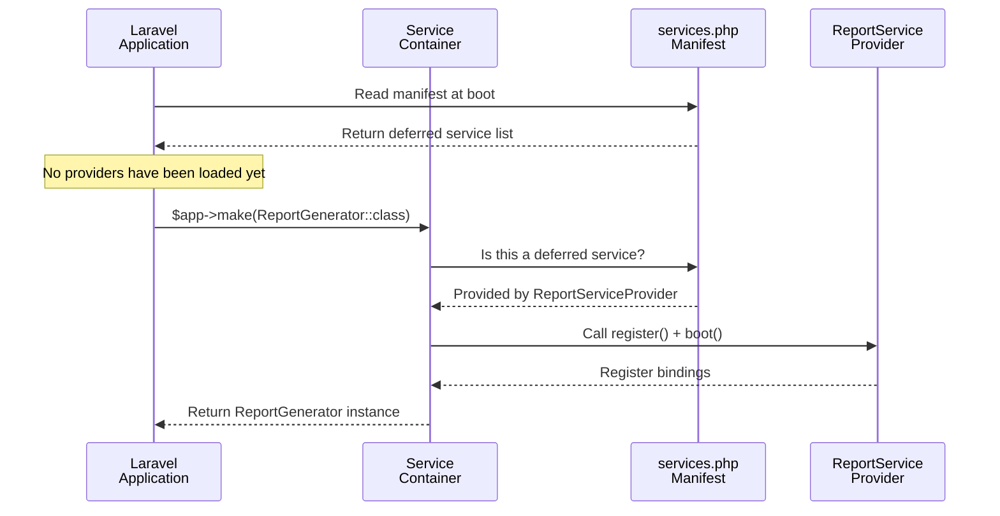

Service providers registered at Laravel's boot time are loaded on every request — even if that service is never used during a given request. Deferred Service Providers solve this problem by deferring the loading of a provider until its service is actually needed.

<Info>
  This page assumes familiarity with [Laravel Package Development](/en/advanced/package-development). Make sure you understand the fundamentals of service providers before reading on.
</Info>

## Why deferred providers matter

A typical service provider runs `register()` and `boot()` on every request. Initializing mail, queues, cache, and other features that are not needed on every page is wasteful.

```php
// This provider's register() is called on every request
class ReportServiceProvider extends ServiceProvider
{
    public function register(): void
    {
        // Binds a heavy reporting service every time
        $this->app->singleton(ReportGenerator::class, function ($app) {
            return new ReportGenerator(
                $app->make(PdfRenderer::class),
                $app->make(ChartRenderer::class),
                $app->make(DataExporter::class),
            );
        });
    }
}
```

By deferring this provider, initialization only happens on requests that actually generate a report.

---

## The DeferrableProvider interface

`Illuminate\Contracts\Support\DeferrableProvider` is a simple interface with a single method: `provides()`.

```php
namespace Illuminate\Contracts\Support;

interface DeferrableProvider
{
    public function provides();
}
```

Implementing this interface is all it takes to put a provider into deferred mode.

---

## Basic implementation

Implementing a deferred provider takes three steps.

<Steps>
  <Step title="Implement DeferrableProvider">
    ```php
    use Illuminate\Contracts\Support\DeferrableProvider;
    use Illuminate\Support\ServiceProvider;

    class ReportServiceProvider extends ServiceProvider implements DeferrableProvider
    {
        // ...
    }
    ```
  </Step>

  <Step title="Register bindings in register()">
    Write your bindings in `register()` just like a regular provider.

    ```php
    public function register(): void
    {
        $this->app->singleton(ReportGenerator::class, function ($app) {
            return new ReportGenerator(
                $app->make(PdfRenderer::class),
                $app->make(ChartRenderer::class),
                $app->make(DataExporter::class),
            );
        });

        $this->app->singleton(ReportRepository::class, function ($app) {
            return new ReportRepository($app->make('db'));
        });
    }
    ```
  </Step>

  <Step title="Return registered services from provides()">
    `provides()` must return **every service** bound in `register()`. Laravel uses this list to determine which provider to load when a given service is requested.

    ```php
    public function provides(): array
    {
        return [
            ReportGenerator::class,
            ReportRepository::class,
        ];
    }
    ```
  </Step>
</Steps>

---

## How the service manifest works

At boot time, Laravel generates a manifest file at `bootstrap/cache/services.php`. This file stores a mapping of all services provided by deferred providers.

```php
// bootstrap/cache/services.php (auto-generated)
return [
    'providers' => [
        // same list as bootstrap/providers.php
    ],
    'eager' => [
        // eagerly loaded providers
        App\Providers\AppServiceProvider::class,
    ],
    'deferred' => [
        // service name => provider class mappings
        'App\Services\ReportGenerator' => ReportServiceProvider::class,
        'App\Repositories\ReportRepository' => ReportServiceProvider::class,
        'cache'       => Illuminate\Cache\CacheServiceProvider::class,
        'cache.store' => Illuminate\Cache\CacheServiceProvider::class,
        'queue'       => Illuminate\Queue\QueueServiceProvider::class,
    ],
    'when' => [],
];
```

Thanks to this manifest, Laravel knows which provider supplies which service without loading any provider files. The actual provider is only loaded the first time its service is resolved.

<Tip>
  After adding or modifying providers, regenerate the manifest:
  ```shell
  php artisan optimize:clear
  # or
  php artisan clear-compiled
  ```
</Tip>

### Internal flow



---

## The importance of provides()

If a binding is **missing from `provides()`**, that service will never be resolved.

```php
public function register(): void
{
    $this->app->singleton(ReportGenerator::class, fn ($app) => new ReportGenerator());

    // Added binding
    $this->app->singleton('report', fn ($app) => $app->make(ReportGenerator::class));
}

public function provides(): array
{
    return [
        ReportGenerator::class,
        'report',  // ← string-keyed bindings must be listed too
    ];
}
```

The same applies when using the `$bindings` / `$singletons` properties — every key must be included in `provides()`.

```php
class AnalyticsServiceProvider extends ServiceProvider implements DeferrableProvider
{
    public $singletons = [
        AnalyticsClient::class => DefaultAnalyticsClient::class,
    ];

    public function provides(): array
    {
        // Return every key listed in $singletons
        return [
            AnalyticsClient::class,
        ];
    }
}
```

---

## Constraints of deferred providers

Deferred providers are designed solely for registering container bindings. Providers that do the following in `boot()` cannot be deferred.

| Constraint | Reason |
|------------|--------|
| Route registration | Routes must be resolved at application boot time |
| Global middleware registration | Must be registered before the request pipeline runs |
| Event listeners (always needed) | Must be registered before the event fires |
| Blade directive registration | Must be registered before views are compiled |

<Warning>
  You can write a `boot()` method in a deferred provider, but its contents will not run until the service is resolved. Placing "always needed" logic like route or middleware registration in `boot()` will lead to unexpected behavior.
</Warning>

---

## The when() method — event-triggered loading

The `when()` method lets you load a provider when a specific event fires, rather than only when a service is resolved. This is useful for providers that are only needed in certain contexts, such as job processing.

```php
class ReportServiceProvider extends ServiceProvider implements DeferrableProvider
{
    public function register(): void
    {
        $this->app->singleton(ReportGenerator::class, fn () => new ReportGenerator());
    }

    public function provides(): array
    {
        return [ReportGenerator::class];
    }

    /**
     * Load this provider when the given events fire,
     * even if the service itself has not been resolved yet.
     */
    public function when(): array
    {
        return [
            \App\Events\ReportRequested::class,
        ];
    }
}
```

When any event listed in `when()` fires, the provider is loaded even if none of its services have been directly resolved.

---

## Using deferred providers in packages

When distributing a third-party package, a deferred service provider directly benefits the performance of the user's application.

### Recommended pattern

```php
namespace Acme\Analytics;

use Illuminate\Contracts\Support\DeferrableProvider;
use Illuminate\Support\ServiceProvider;

class AnalyticsServiceProvider extends ServiceProvider implements DeferrableProvider
{
    public function register(): void
    {
        $this->mergeConfigFrom(__DIR__.'/../config/analytics.php', 'analytics');

        $this->app->singleton(AnalyticsManager::class, function ($app) {
            return new AnalyticsManager($app->make('config')->get('analytics'));
        });

        $this->app->singleton('analytics', fn ($app) => $app->make(AnalyticsManager::class));
    }

    public function boot(): void
    {
        // Keep boot() limited to publish registration
        if ($this->app->runningInConsole()) {
            $this->publishes([
                __DIR__.'/../config/analytics.php' => config_path('analytics.php'),
            ], 'analytics-config');
        }
    }

    public function provides(): array
    {
        return [
            AnalyticsManager::class,
            'analytics',
        ];
    }
}
```

<Info>
  `mergeConfigFrom()` internally checks for a cached config, so it is safe to call inside a deferred provider's `register()`. However, if config is already cached, it has no effect.
</Info>

### Separating Artisan command registration with runningInConsole()

Command registration is only needed when Artisan is running, so guard it with `runningInConsole()`. If you want to defer a provider that also registers commands, either include the command classes in `provides()` or create a separate provider for commands.

```php
public function boot(): void
{
    if ($this->app->runningInConsole()) {
        $this->commands([
            AnalyticsFlushCommand::class,
        ]);
    }
}
```

---

## Deferred providers in Laravel core

Many of Laravel's built-in providers are deferred, avoiding eager initialization of services that are not used on every request.

| Provider | Services provided |
|----------|------------------|
| `CacheServiceProvider` | `cache`, `cache.store`, `RateLimiter` |
| `QueueServiceProvider` | `queue`, `queue.worker`, `queue.failer` |
| `MailServiceProvider` | `mail.manager`, `mailer` |
| `RedisServiceProvider` | `redis`, `redis.connection` |
| `HashServiceProvider` | `hash`, `hash.driver` |
| `ValidationServiceProvider` | `validator`, `validation.presence` |
| `TranslationServiceProvider` | `translator` |
| `BroadcastServiceProvider` | `Broadcast` |

In an API-only application, providers like `MailServiceProvider` and `BroadcastServiceProvider` may never be loaded at all during a request.

---

## When to defer (and when not to)

<AccordionGroup>
  <Accordion title="Good candidates for deferral">
    - Services not used on every request (mailers, report generators, external API clients, etc.)
    - Services requiring external connections or file I/O to initialize
    - Services with a heavy object graph
    - Providers that only register CLI commands
  </Accordion>

  <Accordion title="Poor candidates for deferral">
    - Providers that register routes (e.g., `loadRoutesFrom`)
    - Providers that register always-on middleware or exception handlers
    - Providers that register Eloquent global scopes or observers
    - Lightweight services used on the majority of requests (deferred overhead may exceed the benefit)
  </Accordion>
</AccordionGroup>

---

## Related pages

<Columns cols={2}>
  <Card title="Laravel Package Development" icon="box" href="/en/advanced/package-development">
    A comprehensive guide to developing Laravel packages centered on service providers.
  </Card>
  <Card title="Package Versioning and Compatibility" icon="layers" href="/en/advanced/package-versioning">
    Strategies for maintaining packages across major Laravel and PHP version upgrades.
  </Card>
</Columns>
