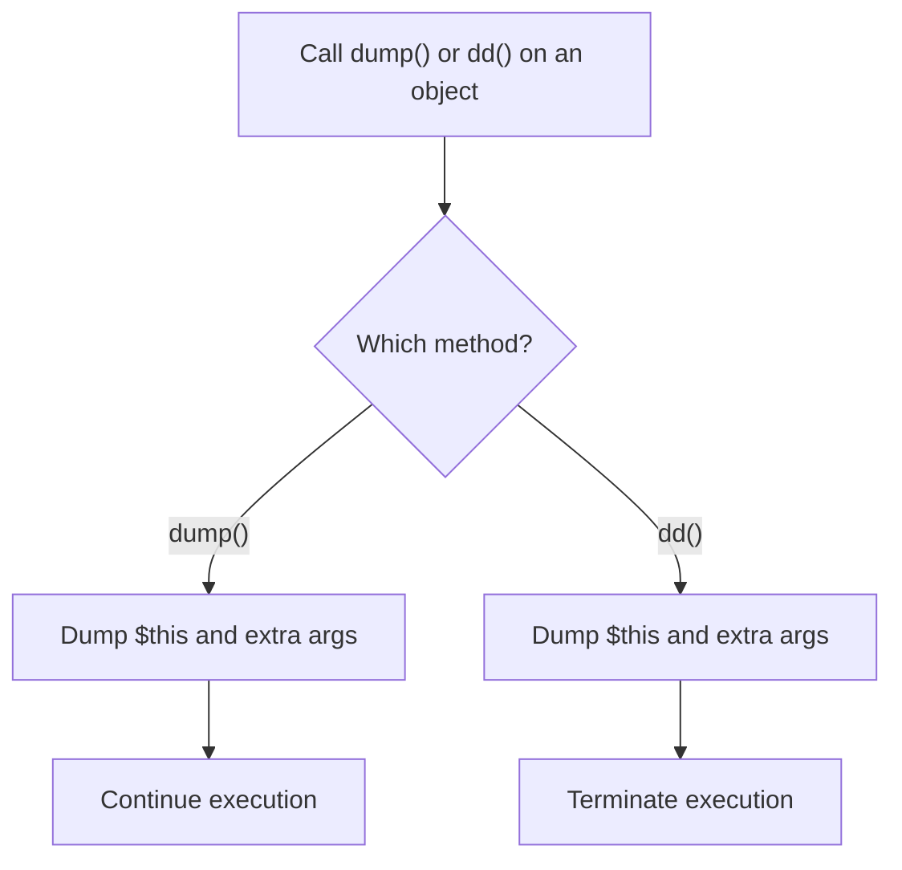

## What is the Dumpable trait?

`Illuminate\Support\Traits\Dumpable` is a small trait that adds `dump()` and `dd()` to any class. It was introduced in Laravel 10 and is widely used to provide a consistent debugging experience across core APIs such as Collection, Eloquent Builder, and Request.

The goal is simple: inspect an object quickly, and optionally stop execution at that exact point.



## Check the implementation

The implementation is minimal. It only forwards to `dump($this, ...$args)` and `dd($this, ...$args)`.

```php
trait Dumpable
{
    public function dump(...$args): static
    {
        dump($this, ...$args);
        return $this;
    }

    public function dd(...$args): never
    {
        dd($this, ...$args);
    }
}
```

<Info>
  In Laravel 13, the source lives in `src/Illuminate/Support/Traits/Dumpable.php`. The runtime implementation expresses return behavior via PHPDoc (`@return $this` and `@return never`).
</Info>

## Add it to your own class

Add `use Dumpable;` and your class gets `dump()` / `dd()` as instance methods.

```php
use Illuminate\Support\Traits\Dumpable;

class UserData
{
    use Dumpable;
    
    public function __construct(
        public readonly string $name,
        public readonly string $email,
    ) {}
}

$user = new UserData('Taro', 'taro@example.com');

$user->dump(); // dump and continue
$user->dd();   // dump and terminate
```

## Debug in the middle of a fluent chain

`dump()` returns `static` (implemented as `$this`), so you can insert it safely in method chains.

```php
$result = collect([1, 2, 3])
    ->map(fn ($n) => $n * 2)
    ->dump()  // inspect the intermediate value
    ->filter(fn ($n) => $n > 2)
    ->values();
```

If you switch to `dd()`, execution stops at that exact point, which is useful before expensive or side-effect-heavy steps.

## Using it in package development

Adding `Dumpable` to your own Value Objects, DTOs, and Builder classes gives package users a built-in way to inspect internal state.

<Steps>
  <Step title="Add it to a Value Object / DTO">
    ```php
    use Illuminate\Support\Traits\Dumpable;

    final class InvoiceData
    {
        use Dumpable;

        public function __construct(
            public readonly string $number,
            public readonly int $total,
        ) {}
    }
    ```
  </Step>
  <Step title="Use it in a fluent builder chain">
    ```php
    $payload = (new PackageRequestBuilder)
        ->forUser($userId)
        ->withLocale('en')
        ->dump('before send')
        ->toArray();
    ```
  </Step>
</Steps>

## Passing extra arguments

Because `Dumpable` calls `dump($this, ...$args)` and `dd($this, ...$args)`, you can pass contextual labels together with the object.

```php
$user->dump('Debug point A');
// Dumps $this and 'Debug point A' together
```

This is useful when you have multiple dump points and need to identify each one immediately.

## Related traits

<Columns cols={3}>
  <Card title="tap() helper / Tappable" icon="hand-point-up" href="/en/advanced/tap">
    Learn how to insert side effects while returning the original value.
  </Card>
  <Card title="The Conditionable trait" icon="git-branch" href="/en/advanced/conditionable">
    Learn conditional branching in fluent chains.
  </Card>
  <Card title="The Macroable trait" icon="puzzle-piece" href="/en/advanced/macroable">
    Learn how to extend existing classes with custom methods.
  </Card>
</Columns>
