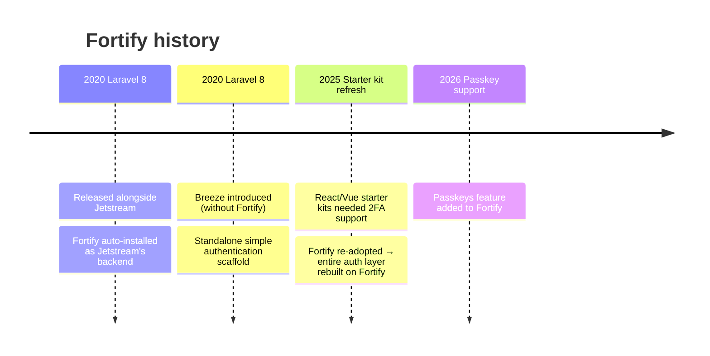

## What is Fortify?

[Laravel Fortify](https://github.com/laravel/fortify) is a frontend-agnostic authentication backend implementation. It provides all the routes and controllers required for login, registration, password reset, email verification, two-factor authentication, and passkeys.

<Info>
  Fortify has no UI of its own. It works by receiving requests from a starter kit or your own frontend and routing them to the appropriate authentication logic.
</Info>

The "frontend-agnostic" design is the key idea. Whether you use Blade, Inertia (React/Vue/Svelte), or a pure API, you can reuse the same authentication backend. This is why Fortify has remained in active use for so long.

## History: from Jetstream to the current starter kits



### Why the current starter kits still use Fortify

The original React/Vue starter kits were implemented without Fortify. However, **when two-factor authentication (2FA) support was needed, Fortify was adopted directly**, which caused the entire authentication layer to switch to a Fortify-based implementation.

Because Fortify is designed to be frontend-agnostic, it integrates naturally with Inertia-based starter kits and continues to be used today.

<Info>
  Fortify is currently the longest-serving official Laravel authentication package. Since its debut in 2020, it has remained active through Jetstream and the current starter kits.
</Info>

## Current starter kit setup

In the React/Vue starter kits, Fortify is configured through these two files:

- `app/Providers/FortifyServiceProvider.php` — registers views, actions, and rate limiters
- `config/fortify.php` — specifies enabled features and authentication settings

### Key settings in `config/fortify.php`

```php
use Laravel\Fortify\Features;

return [
    'guard'    => 'web',
    'username' => 'email',
    'home'     => '/dashboard',

    'limiters' => [
        'login'      => 'login',
        'two-factor' => 'two-factor',
    ],

    'features' => [
        Features::registration(),
        Features::resetPasswords(),
        Features::emailVerification(),
        Features::twoFactorAuthentication([
            'confirm'         => true,
            'confirmPassword' => true,
        ]),
    ],
];
```

Passkeys (`Features::passkeys()`) are not enabled by default in the starter kits. Add the feature to the `features` array to enable them.

## `FortifyServiceProvider` configuration

The starter kit's `FortifyServiceProvider` handles three responsibilities.

### 1. Configuring actions

```php
private function configureActions(): void
{
    Fortify::resetUserPasswordsUsing(ResetUserPassword::class);
    Fortify::createUsersUsing(CreateNewUser::class);
}
```

Classes in `app/Actions/Fortify/` let you customize user creation and password reset logic. Validation and hashing are centralized here.

### 2. Configuring views

```php
private function configureViews(): void
{
    Fortify::loginView(fn (Request $request) => Inertia::render('auth/login', [
        'canResetPassword' => Features::enabled(Features::resetPasswords()),
        'canRegister'      => Features::enabled(Features::registration()),
        'status'           => $request->session()->get('status'),
    ]));

    Fortify::resetPasswordView(fn (Request $request) => Inertia::render('auth/reset-password', [
        'email' => $request->email,
        'token' => $request->route('token'),
    ]));

    Fortify::requestPasswordResetLinkView(
        fn (Request $request) => Inertia::render('auth/forgot-password', [
            'status' => $request->session()->get('status'),
        ])
    );

    Fortify::verifyEmailView(
        fn (Request $request) => Inertia::render('auth/verify-email', [
            'status' => $request->session()->get('status'),
        ])
    );

    Fortify::registerView(fn () => Inertia::render('auth/register'));

    Fortify::twoFactorChallengeView(fn () => Inertia::render('auth/two-factor-challenge'));

    Fortify::confirmPasswordView(fn () => Inertia::render('auth/confirm-password'));
}
```

Each view method accepts a closure that returns an Inertia component. Notice how `Features::enabled()` checks feature flags before passing them to the view.

<Info>
  In a Blade application, return `view('auth.login')` instead of `Inertia::render(...)`. Changing the frontend only requires updating `FortifyServiceProvider`; the authentication logic remains unchanged.
</Info>

### 3. Configuring rate limiting

```php
private function configureRateLimiting(): void
{
    RateLimiter::for('two-factor', function (Request $request) {
        return Limit::perMinute(5)->by($request->session()->get('login.id'));
    });

    RateLimiter::for('login', function (Request $request) {
        $throttleKey = Str::transliterate(
            Str::lower($request->input(Fortify::username())) . '|' . $request->ip()
        );

        return Limit::perMinute(5)->by($throttleKey);
    });
}
```

- `login` limiter: rate-limits by email address and IP address combination (brute-force protection)
- `two-factor` limiter: rate-limits by the login attempt ID stored in the session

Register a `RateLimiter::for()` key that matches each key in the `limiters` array of `config/fortify.php`.

## Features and registered routes

The table below lists the main routes Fortify registers, grouped by feature.

| Feature | Method | Route |
|---|---|---|
| Login | `GET` | `/login` |
| Login | `POST` | `/login` |
| Logout | `POST` | `/logout` |
| Registration | `GET` | `/register` |
| Registration | `POST` | `/register` |
| Password reset request | `GET` / `POST` | `/forgot-password` |
| Password reset | `GET` / `POST` | `/reset-password` |
| Email verification | `GET` | `/email/verify` |
| Resend verification email | `POST` | `/email/verification-notification` |
| Password confirmation | `GET` / `POST` | `/user/confirm-password` |
| Enable 2FA | `POST` | `/user/two-factor-authentication` |
| 2FA challenge | `GET` / `POST` | `/two-factor-challenge` |
| Passkey login | `GET` / `POST` | `/passkeys/login` |
| Passkey management | `GET` / `POST` / `DELETE` | `/user/passkeys` |

Run `php artisan route:list --name=fortify` or simply `php artisan route:list` to inspect all registered routes.

## Two-factor authentication (2FA)

The starter kits enable `Features::twoFactorAuthentication()` with both `confirm` and `confirmPassword` set to `true`.

| Option | Meaning |
|---|---|
| `confirm` | Require the user to confirm with an authentication code after enabling 2FA |
| `confirmPassword` | Require a password confirmation before changing 2FA settings |

From the 2FA settings screen, users can perform the following steps:

<Steps>
  <Step title="Enable 2FA">
    Send a POST request to `/user/two-factor-authentication`. On success, the session receives a `two-factor-authentication-enabled` status.
  </Step>
  <Step title="Scan the QR code">
    Send a GET request to `/user/two-factor-qr-code` to receive the SVG QR code to scan with an authenticator app.
  </Step>
  <Step title="Confirm with an authentication code">
    POST the confirmation code to `/user/confirmed-two-factor-authentication` to complete setup.
  </Step>
  <Step title="Save recovery codes">
    Send a GET request to `/user/two-factor-recovery-codes` to retrieve the recovery codes and store them somewhere safe.
  </Step>
</Steps>

## Passkeys

Passkeys are a recent addition to Fortify. They provide passwordless authentication via WebAuthn, supporting Face ID, Touch ID, Windows Hello, and hardware security keys.

### Enabling passkeys

Add the feature to the `features` array in `config/fortify.php`:

```php
'features' => [
    Features::registration(),
    Features::resetPasswords(),
    Features::emailVerification(),
    Features::twoFactorAuthentication([
        'confirm'         => true,
        'confirmPassword' => true,
    ]),
    Features::passkeys([
        'confirmPassword' => true,
    ]),
],
```

Next, add the `PasskeyUser` contract and `PasskeyAuthenticatable` trait to your `User` model:

```php
use Illuminate\Foundation\Auth\User as Authenticatable;
use Laravel\Fortify\Contracts\PasskeyUser;
use Laravel\Fortify\PasskeyAuthenticatable;

class User extends Authenticatable implements PasskeyUser
{
    use PasskeyAuthenticatable;
}
```

WebAuthn settings are managed under the `passkeys` key in `config/fortify.php`:

```php
'passkeys' => [
    'relying_party_id'  => parse_url(config('app.url'), PHP_URL_HOST),
    'allowed_origins'   => [config('app.url')],
    'user_handle_secret' => config('app.key'),
    'timeout'           => 60000,
],
```

<Info>
  Fortify's passkey support wraps the `laravel/passkeys` Composer package internally. You do not need to publish the `laravel/passkeys` config file — the `passkeys` key in `config/fortify.php` takes precedence.
</Info>

For more on passkeys (the `@laravel/passkeys` JS client, React/Vue/Svelte helpers, and more), see the [passkeys introduction guide](/en/blog/passkeys-introduction).

## Related pages

<Card title="Custom authentication guards" icon="shield" href="/en/advanced/custom-auth-guard">
  Learn how to implement custom authentication guards using the Guard and StatefulGuard interfaces.
</Card>

<Card title="Official docs: Laravel Fortify" icon="book-open" href="https://laravel.com/docs/fortify">
  Full installation instructions, all features, and customization details are in the official documentation.
</Card>
