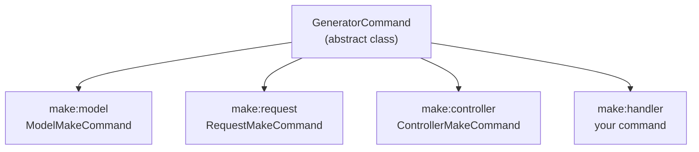

## What is GeneratorCommand?

`Illuminate\Console\GeneratorCommand` is the abstract base class behind every code-generation command built into Laravel. `make:model`, `make:controller`, `make:request`, and the rest all extend it.



By providing your own `make:xxx` command, users can run `php artisan make:handler OrderHandler` and get a correctly namespaced file instead of creating the boilerplate by hand.

<Info>
`GeneratorCommand` is barely mentioned in the official documentation. Understanding it requires reading the framework source code directly — a classic advanced topic.
</Info>

## Minimal implementation

The only method you must implement is `getStub()`. Everything else is optional, but in practice you will also set the following members.

| Member | Kind | Role |
|---|---|---|
| `$name` | property | Command name, e.g. `make:handler` |
| `$description` | property | Human-readable command description |
| `$type` | property | Label used in the success message, e.g. `Handler` |
| `getStub()` | method (required) | Return the path to the stub file |
| `getDefaultNamespace()` | method | Control the default generation namespace |

Here is a complete `make:handler` command:

```php
<?php

namespace Vendor\Package\Console\Commands;

use Illuminate\Console\GeneratorCommand;

class HandlerMakeCommand extends GeneratorCommand
{
    protected $name = 'make:handler';

    protected $description = 'Create a new handler class';

    protected $type = 'Handler';

    protected function getStub(): string
    {
        return __DIR__.'/stubs/handler.stub';
    }

    protected function getDefaultNamespace($rootNamespace): string
    {
        return $rootNamespace.'\Handlers';
    }
}
```

With `getDefaultNamespace()` returning `$rootNamespace.'\Handlers'`, running `php artisan make:handler OrderHandler` generates `App\Handlers\OrderHandler` at `app/Handlers/OrderHandler.php`.

## Creating the stub file

Place the stub file at the path returned by `getStub()`. A stub is a PHP template whose placeholders are replaced with the resolved namespace and class name.

<Tree>
  <Tree.Folder name="src" defaultOpen>
    <Tree.Folder name="Console" defaultOpen>
      <Tree.Folder name="Commands" defaultOpen>
        <Tree.File name="HandlerMakeCommand.php" />
        <Tree.Folder name="stubs" defaultOpen>
          <Tree.File name="handler.stub" />
        </Tree.Folder>
      </Tree.Folder>
    </Tree.Folder>
  </Tree.Folder>
</Tree>

Example stub file:

```php handler.stub
<?php

namespace {{ namespace }};

class {{ class }}
{
    public function handle(): void
    {
        //
    }
}
```

`GeneratorCommand` automatically replaces the following placeholders in the stub:

| Placeholder | Replaced with | Legacy alias |
|---|---|---|
| `{{ namespace }}` | Fully qualified namespace of the generated class | `DummyNamespace` |
| `{{ class }}` | Class name | `DummyClass` |
| `{{ rootNamespace }}` | Application root namespace | `DummyRootNamespace` |

Both `{{ namespace }}` and `DummyNamespace` produce the same result. Use the `{{ }}` style for new stubs — it matches current Laravel conventions.

## Allowing stub customization

To let users override your stubs, use the `resolveStubPath()` pattern. First, publish the stubs from your service provider's `boot()` method:

```php
public function boot(): void
{
    if ($this->app->runningInConsole()) {
        $this->publishes([
            __DIR__.'/../Console/Commands/stubs' => base_path('stubs'),
        ], 'stubs');
    }
}
```

Then update `getStub()` to prefer a user-provided stub when one exists:

```php
protected function getStub(): string
{
    return $this->resolveStubPath('/stubs/handler.stub');
}

protected function resolveStubPath(string $stub): string
{
    return file_exists($customPath = $this->laravel->basePath(trim($stub, '/')))
        ? $customPath
        : __DIR__.$stub;
}
```

After running `php artisan vendor:publish --tag=stubs`, users can edit `stubs/handler.stub` in their project root to customize the generated output.

<Tip>
The `resolveStubPath()` pattern is the same one used in Laravel's built-in `RequestMakeCommand`. Follow it so your package behaves consistently with the framework.
</Tip>

## Registering in a service provider

Register the command in your service provider's `boot()` method. Wrap it in `runningInConsole()` to avoid loading it on every web request.

```php
<?php

namespace Vendor\Package;

use Illuminate\Support\ServiceProvider;
use Vendor\Package\Console\Commands\HandlerMakeCommand;

class PackageServiceProvider extends ServiceProvider
{
    public function boot(): void
    {
        if ($this->app->runningInConsole()) {
            $this->commands([
                HandlerMakeCommand::class,
            ]);

            $this->publishes([
                __DIR__.'/../Console/Commands/stubs' => base_path('stubs'),
            ], 'stubs');
        }
    }
}
```

Add the `extra.laravel` key to your `composer.json` so users do not need to register the provider manually:

```json
"extra": {
    "laravel": {
        "providers": [
            "Vendor\\Package\\PackageServiceProvider"
        ]
    }
}
```

## Use cases

<AccordionGroup>
  <Accordion title="Custom form request generator">
    Generate request classes that extend your own base request, pre-wired with your authorization logic. Return `$rootNamespace.'\Http\Requests'` from `getDefaultNamespace()`.
  </Accordion>
  <Accordion title="DTO generator">
    Generate Data Transfer Objects with readonly properties and a `from()` factory method. Put all the boilerplate in the stub so developers only fill in the data fields.
  </Accordion>
  <Accordion title="Action class generator">
    Generate single-responsibility Action classes at `App\Actions` with an `execute()` method ready to implement.
  </Accordion>
  <Accordion title="How Livewire uses the same approach">
    Livewire's `make:livewire` command extends `GeneratorCommand` and overrides `handle()` to generate two files at once — the component class and the Blade view. Study it when you need to generate multiple files from a single command.
  </Accordion>
</AccordionGroup>

## Testing

Use Orchestra Testbench to assert that your command generates the expected file with the correct content.

```php
<?php

namespace Tests\Feature\Console;

use Illuminate\Support\Facades\File;
use Orchestra\Testbench\TestCase;
use Vendor\Package\PackageServiceProvider;

class HandlerMakeCommandTest extends TestCase
{
    protected function getPackageProviders($app): array
    {
        return [PackageServiceProvider::class];
    }

    protected function tearDown(): void
    {
        File::deleteDirectory(app_path('Handlers'));

        parent::tearDown();
    }

    public function test_make_handler_creates_file(): void
    {
        $path = app_path('Handlers/OrderHandler.php');

        $this->artisan('make:handler', ['name' => 'OrderHandler'])
            ->assertSuccessful();

        $this->assertFileExists($path);
        $this->assertStringContainsString('namespace App\Handlers;', File::get($path));
        $this->assertStringContainsString('class OrderHandler', File::get($path));
    }

    public function test_make_handler_does_not_overwrite_existing_file(): void
    {
        $path = app_path('Handlers/OrderHandler.php');
        File::ensureDirectoryExists(dirname($path));
        File::put($path, '<?php // existing');

        $this->artisan('make:handler', ['name' => 'OrderHandler'])
            ->assertFailed();
    }
}
```

<Warning>
Generator commands write to the real filesystem. Use `tearDown()` for cleanup so it runs even when a test fails midway.
</Warning>

## Related pages

<Columns cols={2}>
  <Card title="Laravel package development" icon="package" href="/en/advanced/package-development">
    Review the service provider foundations before adding commands to your package.
  </Card>
  <Card title="Testing Laravel packages with Orchestra Testbench" icon="flask-conical" href="/en/advanced/package-testing">
    Learn how to set up the Testbench foundation for package tests.
  </Card>
</Columns>

<Info>
Source: [Illuminate\Console\GeneratorCommand](https://github.com/laravel/framework/blob/master/src/Illuminate/Console/GeneratorCommand.php), [Illuminate\Foundation\Console\RequestMakeCommand](https://github.com/laravel/framework/blob/master/src/Illuminate/Foundation/Console/RequestMakeCommand.php)
</Info>
