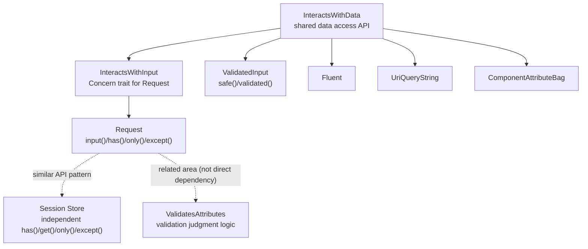

## What is the InteractsWithData trait?

`Illuminate\Support\Traits\InteractsWithData` is a trait that groups common APIs for array-like input data.

The trait itself requires only two abstract methods: `all()` and `data()`.
Each class provides its own data retrieval logic.
In return, the trait gives you many high-frequency methods:

- Presence checks: `has()`, `hasAny()`, `exists()`, `missing()`
- Emptiness checks: `filled()`, `isNotFilled()`, `anyFilled()`
- Conditional execution: `whenHas()`, `whenFilled()`, `whenMissing()`
- Extraction: `only()`, `except()`
- Type conversion: `string()`, `boolean()`, `integer()`, `float()`, `date()`, `enum()`, `collect()`

## Relationship to Request methods

`Illuminate\Http\Request` from the `request()` helper uses `InteractsWithData` through `Concerns\InteractsWithInput`.

So everyday input access patterns are provided through this trait:

```php
$search = request()->input('search');

if (request()->has('search')) {
    $filters = request()->only(['search', 'status']);
}

$payload = request()->except(['_token']);
```

`Request::get()` is a Symfony-compatible method defined in the `Request` class itself.
In Laravel 13 source code, it is explicitly marked `@deprecated use ->input() instead`, so `input()` is the recommended method.

```php
$legacy = request()->get('search');  // Compatibility method (prefer input())
```

## Main implementations in Laravel core

### Classes that directly use `InteractsWithData`

| Class | Purpose |
|---|---|
| `Illuminate\Http\Concerns\InteractsWithInput` | Input access API for `Request` |
| `Illuminate\Support\ValidatedInput` | Wrapper for return values of `validated()` / `safe()` |
| `Illuminate\Support\Fluent` | Fluent access to settings and arbitrary attributes |
| `Illuminate\Support\UriQueryString` | Query string operations for `Uri` |
| `Illuminate\View\ComponentAttributeBag` | Operations on Blade component attributes |

### Related implementations with similar responsibilities

- `Illuminate\Session\Store` implements similar APIs such as `has()`, `get()`, `only()`, and `except()` independently
- `Illuminate\Validation\Concerns\ValidatesAttributes` provides validation judgment logic and is intentionally separate from input access APIs

## Relationship between the trait and core classes



## Add it to your package classes

`InteractsWithData` fits package classes that store input arrays and should expose Laravel-style access APIs.

<Steps>
  <Step title="Create a data container class">
    ```php
    namespace Vendor\Package\Support;

    use Illuminate\Support\Arr;
    use Illuminate\Support\Traits\InteractsWithData;

    class OptionBag
    {
        use InteractsWithData;

        /**
         * @param  array<string, mixed>  $items
         */
        public function __construct(
            protected array $items = [],
        ) {}

        public function all($keys = null): array
        {
            if (! $keys) {
                return $this->items;
            }

            $result = [];

            $keyList = is_array($keys) ? $keys : [$keys];

            foreach ($keyList as $key) {
                Arr::set($result, $key, Arr::get($this->items, $key));
            }

            return $result;
        }

        protected function data($key = null, $default = null): mixed
        {
            return data_get($this->items, $key, $default);
        }
    }
    ```
  </Step>
  <Step title="Read values safely with typed accessors">
    ```php
    $options = new OptionBag([
        'feature.enabled' => 'true',
        'retry.max' => '5',
        'channels' => ['mail', 'slack'],
    ]);

    $enabled = $options->boolean('feature.enabled'); // true
    $retryMax = $options->integer('retry.max');      // 5
    $channels = $options->collect('channels');       // Collection
    $public = $options->except(['secret']);          // Excludes "secret"
    ```
  </Step>
</Steps>

## Practical use cases

- Option bags for external API clients
- Normalization layers for webhook payloads
- Configuration override resolver classes in packages

If you implement only `all()` and `data()`, you avoid rebuilding input access APIs repeatedly and lower maintenance cost.

## Related pages

- [The Macroable trait](/en/advanced/macroable)
- [The Conditionable trait](/en/advanced/conditionable)
- [The tap() helper and Tappable trait](/en/advanced/tap)
