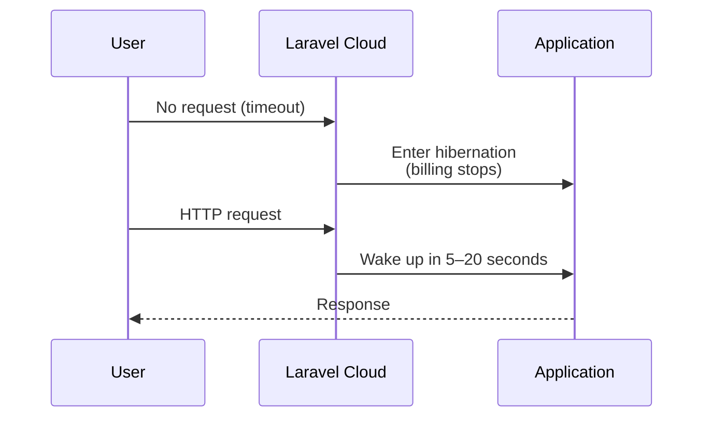

## What is hibernation

Laravel Cloud **hibernation** moves your environment to a dormant state when no HTTP requests are received within a specified timeout period.

Compute billing stops while the environment is hibernating, which makes it effective for reducing costs on staging environments, personal projects, or any workload that does not need to run continuously. The environment wakes up automatically when it receives a new HTTP request (typically within 5–20 seconds).



## Enabling hibernation

<Steps>
  <Step title="Open the App compute cluster">
    From your environment's infrastructure canvas dashboard, click on the App compute cluster.
  </Step>
  <Step title="Enable the Hibernation toggle">
    Turn on the **Hibernation** toggle.
  </Step>
  <Step title="Save and redeploy">
    Click **Save and Redeploy** to apply the change.

    <Warning>
      Changing the toggle alone does not activate hibernation. A Save and Redeploy is required.
    </Warning>
  </Step>
</Steps>

## Limitations during hibernation

When hibernation is enabled and the environment is hibernating, the following features do not run.

| Feature | Behavior while hibernating |
|---|---|
| HTTP request handling | Stopped (processed after wake-up) |
| Task Scheduler | Not executed |
| Queue workers | Not executed |
| Custom background processes | Not executed |

<Info>
  These processes resume automatically after the environment wakes up. Scheduled jobs that were due while the environment was hibernating are not retroactively executed.
</Info>

Hibernation also has these constraints:

- Only **Flex compute** sizes support hibernation. Pro compute sizes cannot hibernate.
- Hibernation operates at the **environment level**. When an environment hibernates, all compute clusters in that environment hibernate, including Worker clusters.

## Common causes of unwanted wake-ups

Any HTTP request will wake the environment, including those you did not intend to trigger:

- **Bots and crawlers** — Search engines and security scanners automatically crawl pages.
- **Slack and Teams link previews** — Messaging apps fetch page metadata when a URL is shared.
- **WordPress scanners** — Automated scripts probe paths like `/wp-admin` looking for WordPress installations.
- **PHP file probing** — Automated attacks scan for accessible PHP files.

Laravel Cloud's `*.laravel.cloud` domains have an `X-Robots-Tag: noindex, nofollow` header to reduce indexing, but once a domain is discovered, this cannot fully prevent automated requests. Custom domains do not receive the `noindex` header.

<Tip>
  Using a less predictable domain name reduces the chance of bots discovering your vanity domain.
</Tip>

## Path Blocking to prevent unwanted wake-ups

**Path Blocking** lets Laravel Cloud block requests to specific file extensions and paths while the environment is hibernating, so those requests do not trigger a wake-up.

The following extensions and paths are blocked by default:

**Blocked extensions:**

```
.php, .php3, .php4, .php5, .php6, .php7, .php8,
.phtml, .pht, .phps, .env, .git
```

**Blocked paths:**

```
/wp-admin, /wp-content, /wp-includes, /wp-json
```

Requests matching these patterns receive a response without waking the environment.

<Info>
  Laravel applications do not use `.php` extension-based routing, so blocking these extensions has no impact on normal application behavior.
</Info>

## Good fit vs. poor fit

<Columns cols={2}>
  <Card title="Good fit" icon="check">
    - **Staging and development environments** — Significant cost reduction since 24/7 uptime is not required.
    - **Personal blogs and portfolios** — Low traffic and occasional access.
    - **Demo or proof-of-concept apps** — On-demand wake-up is sufficient.
    - **Low-frequency internal tools** — Limited usage windows.
  </Card>
  <Card title="Poor fit" icon="xmark">
    - **Workloads relying on Task Scheduler** — `schedule:run` does not execute while hibernating.
    - **Workloads requiring regular queue processing** — Queue workers stop during hibernation.
    - **Production apps with strict latency requirements** — 5–20 second wake-up time may be unacceptable.
    - **Apps using WebSockets** — Connections cannot be maintained and hibernation may be delayed.
  </Card>
</Columns>

<Warning>
  If your application depends on scheduled tasks running reliably (email delivery, data aggregation, etc.), enabling hibernation will break those tasks. Either keep hibernation disabled, or use an external scheduler (such as GitHub Actions) to send periodic requests and keep the environment running.
</Warning>

## Summary

Hibernation can significantly reduce your compute costs when used correctly. Understanding its constraints before enabling it avoids unexpected issues.

- Compute billing stops during hibernation. The environment wakes up automatically on HTTP request.
- Task Scheduler and Queue workers do not run while hibernating.
- Use Path Blocking to prevent bots and scanners from triggering unwanted wake-ups.
- Only Flex compute sizes support hibernation.

## Related pages

<Columns cols={2}>
  <Card title="Scheduling" icon="calendar" href="/en/scheduling">
    Task Scheduler configuration and how it works with Laravel Cloud.
  </Card>
  <Card title="Queues" icon="list" href="/en/queues">
    Queue worker configuration and how to manage workers on Laravel Cloud.
  </Card>
</Columns>
