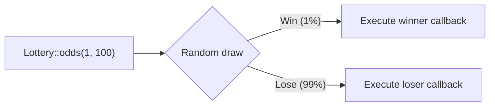

## What is the Lottery class?

`Illuminate\Support\Lottery` is a utility class that lets you express probability-based operations as a clean, fluent API. Instead of sprinkling `random_int()` calls across your codebase, you can write self-documenting code like "run this 1 in 100 times".

<Info>
  The implementation lives in `src/Illuminate/Support/Lottery.php`. Laravel itself uses this class internally for session garbage collection, cache lock pruning, and more.
</Info>



## Basic usage

### Integer ratio odds

Pass `$chances` and `$outOf` to express "win $chances out of $outOf times".

```php
use Illuminate\Support\Lottery;

Lottery::odds(1, 100)           // 1 in 100 chance
    ->winner(fn () => $this->runMaintenance())
    ->loser(fn () => null)
    ->choose();
```

### Float odds

Omit `$outOf` and pass a float between `0.0` and `1.0` to use it directly as a probability.

```php
Lottery::odds(0.01)             // 1% chance
    ->winner(fn () => $this->sample())
    ->choose();
```

<Warning>
  A float value greater than `1.0` throws a `RuntimeException`.
</Warning>

### Boolean return without callbacks

When you do not set winner or loser callbacks, `choose()` returns `true` on a win and `false` on a loss.

```php
$shouldSample = Lottery::odds(1, 50)->choose(); // bool
```

### Run multiple times

Pass an integer to `choose($times)` to run the lottery that many times and receive an array of results.

```php
$results = Lottery::odds(1, 2)
    ->winner(fn () => 'win')
    ->loser(fn () => 'lose')
    ->choose(10);

// Example: ['win', 'lose', 'win', 'win', 'lose', ...]
```

### Passing Lottery as a callable

`Lottery` implements `__invoke`, so you can pass an instance directly anywhere a callable is expected.

```php
// Pass as the second argument to DB::whenQueryingForLongerThan
DB::whenQueryingForLongerThan(
    Interval::seconds(5),
    Lottery::odds(1, 5)->winner(function ($connection) {
        // Alert the team 1 in 5 times a slow query is detected
        Alert::send("Slow query on {$connection->getName()}");
    })
);
```

## Practical use cases

### 1. Cache pruning (run once every 100 requests)

Use Lottery to spread maintenance work across requests instead of running it on every request.

```php
Lottery::odds(1, 100)
    ->winner(fn () => Cache::store('database')->flush())
    ->choose();
```

### 2. Telemetry sampling (detailed log for a subset of requests)

Recording full telemetry on every request is expensive. Sample a fraction instead.

```php
Lottery::odds(1, 20)
    ->winner(function () use ($request) {
        Log::channel('telemetry')->info('Request sampled', [
            'url'      => $request->url(),
            'duration' => microtime(true) - LARAVEL_START,
            'memory'   => memory_get_peak_usage(true),
        ]);
    })
    ->choose();
```

### 3. A/B-style behavior

Split users across two code paths with a controlled probability.

```php
$result = Lottery::odds(1, 2)
    ->winner(fn ($user) => $this->newCheckoutFlow($user))
    ->loser(fn ($user) => $this->legacyCheckoutFlow($user))
    ->choose();
```

### 4. Randomizing scheduled tasks

Avoid all servers in a cluster running the same expensive task simultaneously.

```php
// app/Console/Kernel.php
$schedule->call(function () {
    Lottery::odds(1, 3)
        ->winner(fn () => Artisan::call('cache:prune-stale-tags'))
        ->choose();
})->everyMinute();
```

## Probabilistic patterns in Laravel core

Laravel uses probabilistic maintenance patterns throughout the framework. Some implementations were written before the `Lottery` class existed and use `random_int()` directly, but they follow the same philosophy.

<Steps>
  <Step title="Session: garbage collection">
    `Illuminate\Session\Middleware\StartSession::configHitsLottery()` reads `config/session.php` and uses `random_int` to decide whether to run GC on the current request.

    ```php
    // config/session.php
    'lottery' => [2, 100], // 2 times per 100 requests

    // StartSession internals (uses random_int directly)
    protected function configHitsLottery(array $config): bool
    {
        return random_int(1, $config['lottery'][1]) <= $config['lottery'][0];
    }
    ```
  </Step>
  <Step title="DatabaseLock: pruning expired locks">
    `Illuminate\Cache\DatabaseLock::acquire()` applies the same integer ratio pattern to prune stale lock rows on every lock acquisition.

    ```php
    // config/cache.php (database driver)
    'lock_lottery' => [2, 100], // prune 2 times per 100 acquisitions

    // DatabaseLock::acquire() internals (uses random_int directly)
    if (random_int(1, $this->lottery[1]) <= $this->lottery[0]) {
        $this->pruneExpiredLocks();
    }
    ```
  </Step>
  <Step title="DB::whenQueryingForLongerThan — passing a Lottery instance">
    Because `Lottery` implements `__invoke`, you can pass it directly as the callable argument to APIs like `DB::whenQueryingForLongerThan`.

    ```php
    DB::whenQueryingForLongerThan(
        Interval::seconds(5),
        Lottery::odds(1, 5)->winner(function ($connection) {
            Log::warning("Slow query on {$connection->getName()}");
        })
    );
    ```
  </Step>
</Steps>

<Tip>
  While Session and DatabaseLock use `random_int()` directly, using the `Lottery` class gives you testability through `alwaysWin()`, `alwaysLose()`, and `fix()`. Prefer `Lottery` in your packages for this reason.
</Tip>

## Testing with Lottery

Because Lottery uses `random_int()` internally, you need deterministic control in tests. Laravel provides three APIs for this.

### `Lottery::alwaysWin()` — force every draw to win

```php
public function test_maintenance_runs_on_win(): void
{
    $ranMaintenance = false;

    Lottery::alwaysWin(function () use (&$ranMaintenance) {
        Lottery::odds(1, 100)
            ->winner(function () use (&$ranMaintenance) {
                $ranMaintenance = true;
            })
            ->choose();
    });

    $this->assertTrue($ranMaintenance);
}
```

### `Lottery::alwaysLose()` — force every draw to lose

```php
public function test_maintenance_skipped_on_lose(): void
{
    $ranMaintenance = false;

    Lottery::alwaysLose(function () use (&$ranMaintenance) {
        Lottery::odds(1, 100)
            ->winner(function () use (&$ranMaintenance) {
                $ranMaintenance = true;
            })
            ->choose();
    });

    $this->assertFalse($ranMaintenance);
}
```

### `Lottery::fix()` — pin results to a sequence

Control each draw individually by providing an array of `true`/`false` values.

```php
public function test_alternating_results(): void
{
    Lottery::fix([true, false, true, false]);

    $results = Lottery::odds(1, 100)
        ->winner(fn () => 'winner')
        ->loser(fn () => 'loser')
        ->choose(4);

    $this->assertSame(['winner', 'loser', 'winner', 'loser'], $results);

    Lottery::determineResultNormally(); // always reset after the test
}
```

<Warning>
  `alwaysWin()`, `alwaysLose()`, and `fix()` all mutate a global static property. Always call `Lottery::determineResultNormally()` in `tearDown()` to prevent test pollution.
</Warning>

```php
protected function tearDown(): void
{
    Lottery::determineResultNormally();

    parent::tearDown();
}
```

### `Lottery::setResultFactory()` — inject a custom factory

For fine-grained control, inject a custom callable that receives `$chances` and `$outOf`.

```php
Lottery::setResultFactory(function ($chances, $outOf) {
    // Your custom logic here
    return true; // always win
});

// Reset when done
Lottery::determineResultNormally();
```

## Package development patterns

### Register maintenance in a service provider

Spread expensive housekeeping work across incoming requests instead of running it on a schedule.

```php
use Illuminate\Support\Lottery;
use Illuminate\Support\ServiceProvider;

class AcmeServiceProvider extends ServiceProvider
{
    public function boot(): void
    {
        $this->app->booted(function () {
            Lottery::odds(1, 100)
                ->winner(fn () => $this->pruneExpiredRecords())
                ->choose();
        });
    }

    protected function pruneExpiredRecords(): void
    {
        $this->app['db']->table('acme_logs')
            ->where('expires_at', '<', now())
            ->delete();
    }
}
```

### Make odds configurable

Let package users tune the probability without touching your code.

```php
$lottery = config('acme.prune_lottery', [1, 100]);

Lottery::odds(...$lottery)
    ->winner(fn () => $this->pruneExpiredRecords())
    ->choose();
```

```php
// config/acme.php
return [
    // [wins, outOf] — prune once every 100 requests by default
    'prune_lottery' => [1, 100],
];
```

### Sampling middleware

```php
use Illuminate\Support\Lottery;

class SampleTelemetryMiddleware
{
    public function handle(Request $request, Closure $next): Response
    {
        $response = $next($request);

        Lottery::odds(1, 50)
            ->winner(fn () => $this->recordTelemetry($request, $response))
            ->choose();

        return $response;
    }
}
```

## API reference

| Method | Description |
|---|---|
| `Lottery::odds($chances, $outOf)` | Static factory that creates a new Lottery instance |
| `->winner(callable $callback)` | Set the callback to run on a win |
| `->loser(callable $callback)` | Set the callback to run on a loss |
| `->choose($times = null)` | Run the lottery; returns an array when `$times` is given |
| `Lottery::alwaysWin($callback)` | Testing: force all draws to win |
| `Lottery::alwaysLose($callback)` | Testing: force all draws to lose |
| `Lottery::fix($sequence)` | Testing: pin results to a sequence |
| `Lottery::determineResultNormally()` | Reset any test overrides |
| `Lottery::setResultFactory(callable)` | Inject a custom draw logic |

## Related pages

<Columns cols={2}>
  <Card title="The Macroable trait" icon="puzzle-piece" href="/en/advanced/macroable">
    Learn the API extension pattern for adding methods to existing classes.
  </Card>
  <Card title="The Conditionable trait" icon="git-branch" href="/en/advanced/conditionable">
    Learn conditional fluent chains with `when()` and `unless()`.
  </Card>
</Columns>
