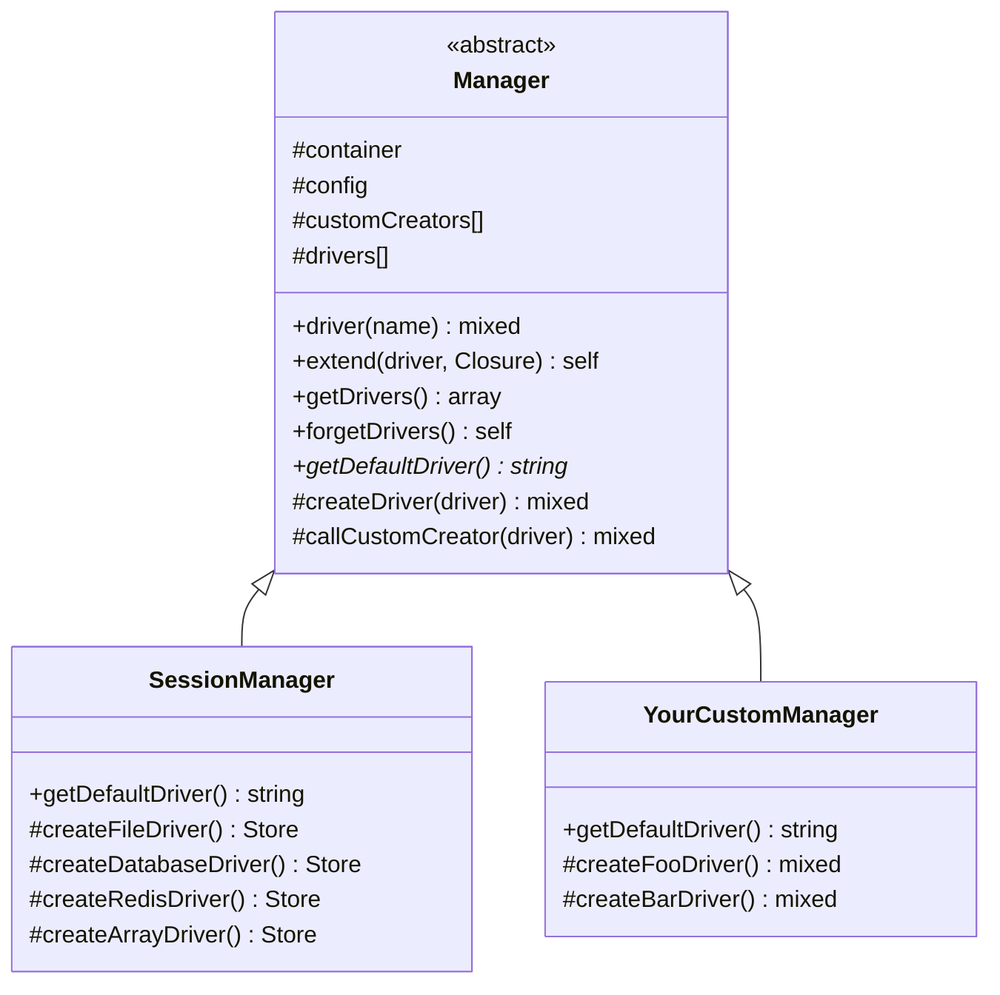

## What is Manager?

`Illuminate\Support\Manager` is an abstract class that has existed since Laravel 4.0. It provides the foundation for building systems that can switch between multiple "drivers" — cache backends, session stores, mail transports, and so on.

A "driver" is a backend implementation that satisfies the same interface while using a different underlying technology. For sessions, the available drivers are `file`, `cookie`, `database`, and `redis`. The active driver is chosen by a single `driver` key in the configuration file.



## Which classes use Manager?

Not every class with "Manager" in its name extends `Illuminate\Support\Manager`. Some provide their own equivalent implementation.

| Class | Extends `Manager`? |
|---|---|
| `Illuminate\Session\SessionManager` | ✅ Yes |
| `Illuminate\Cache\CacheManager` | ❌ No (custom implementation) |
| `Illuminate\Queue\QueueManager` | ❌ No (custom implementation) |
| `Laravel\Socialite\SocialiteManager` | ✅ Yes |

Classes that do not extend `Manager` still follow the same `extend()` pattern conceptually. Understanding the `Manager` class therefore gives you a mental model that applies across the entire framework.

## How it works

### driver() — resolving a driver

Calling `driver()` follows this sequence:

```mermaid
flowchart TD
    A["Call driver(name)"] --> B{Is there a cached<br>instance in drivers[]?}
    B -- yes --> C["Return cached instance"]
    B -- no --> D{Is there a registered<br>entry in customCreators[]?}
    D -- yes --> E["Call callCustomCreator()<br>to create the instance"]
    D -- no --> F{"Does createXxxDriver()<br>method exist?"}
    F -- yes --> G["Call createXxxDriver()"]
    F -- no --> H["Throw InvalidArgumentException"]
    E --> I["Cache in drivers[] and return"]
    G --> I
```

The driver name is converted to a method name using `Str::studly()`.

```php
// From Illuminate\Support\Manager::createDriver()
protected function createDriver($driver)
{
    if (isset($this->customCreators[$driver])) {
        return $this->callCustomCreator($driver);
    }

    $method = 'create'.Str::studly($driver).'Driver';

    if (method_exists($this, $method)) {
        return $this->$method();
    }

    throw new InvalidArgumentException("Driver [$driver] not supported.");
}
```

So the `file` driver maps to `createFileDriver()`, and a driver named `my-custom` maps to `createMyCustomDriver()`.

### extend() — registering a custom driver

Pass a driver name and a closure to `extend()` to register a custom driver. The closure receives the container instance.

```php
use Illuminate\Support\Facades\Session;

Session::extend('redis-cluster', function ($app) {
    return new RedisClusterSessionHandler(
        $app->make('redis'),
        $app['config']['session'],
    );
});
```

`extend()` binds the closure to `$this` (the manager), so you can access the manager's properties and methods from inside the closure.

```php
// From Illuminate\Support\Manager::extend()
public function extend($driver, Closure $callback)
{
    try {
        $callback = $callback->bindTo($this, static::class) ?? throw new RuntimeException;
    } catch (Throwable) {
        $callback = $callback->bindTo(null, static::class);
    }

    $this->customCreators[$driver] = $callback;

    return $this;
}
```

### __call — proxying to the default driver

`Manager` implements `__call`, so any method call that does not exist on the manager itself is forwarded to the default driver automatically.

```php
public function __call($method, $parameters)
{
    return $this->driver()->$method(...$parameters);
}
```

This is how `SessionManager::get('key')` works — you call the method on the manager, and it is transparently delegated to the active session driver.

## SessionManager as a reference implementation

`Illuminate\Session\SessionManager` shows the full pattern in practice.

```php
namespace Illuminate\Session;

use Illuminate\Support\Manager;

class SessionManager extends Manager
{
    // Required: return the name of the default driver
    public function getDefaultDriver()
    {
        return $this->config->get('session.driver');
    }

    // Create the "file" driver
    protected function createFileDriver()
    {
        return $this->createNativeDriver();
    }

    // Create the "database" driver
    protected function createDatabaseDriver()
    {
        $table = $this->config->get('session.table');
        $lifetime = $this->config->get('session.lifetime');

        return $this->buildSession(new DatabaseSessionHandler(
            $this->getDatabaseConnection(), $table, $lifetime, $this->container
        ));
    }

    // Create the "redis" driver
    protected function createRedisDriver()
    {
        $handler = $this->createCacheHandler('redis');
        // ...
        return $this->buildSession($handler);
    }
}
```

## Building a custom Manager

Here is a notification service example.

<Steps>
  <Step title="Extend Manager">
    ```php
    namespace App\Notifications;

    use Illuminate\Support\Manager;

    class NotificationManager extends Manager
    {
        public function getDefaultDriver(): string
        {
            return $this->config->get('notifications.driver', 'slack');
        }

        protected function createSlackDriver(): SlackNotifier
        {
            return new SlackNotifier(
                $this->config->get('notifications.slack'),
            );
        }

        protected function createEmailDriver(): EmailNotifier
        {
            return new EmailNotifier(
                $this->config->get('notifications.email'),
            );
        }

        protected function createLogDriver(): LogNotifier
        {
            return new LogNotifier(
                $this->container->make('log'),
            );
        }
    }
    ```
  </Step>
  <Step title="Register in a service provider">
    ```php
    namespace App\Providers;

    use App\Notifications\NotificationManager;
    use Illuminate\Support\ServiceProvider;

    class NotificationServiceProvider extends ServiceProvider
    {
        public function register(): void
        {
            $this->app->singleton(NotificationManager::class, function ($app) {
                return new NotificationManager($app);
            });
        }
    }
    ```
  </Step>
  <Step title="Add a custom driver at runtime">
    ```php
    // In AppServiceProvider::boot() or a dedicated provider

    $manager = app(NotificationManager::class);

    $manager->extend('teams', function ($app) {
        return new TeamsNotifier(
            $app['config']['notifications.teams'],
        );
    });
    ```
  </Step>
  <Step title="Use it">
    ```php
    $manager = app(NotificationManager::class);

    // Use the default driver
    $manager->send('Hello');

    // Request a specific driver
    $manager->driver('email')->send('Hello');

    // Resolved drivers are cached — same instance returned each time
    $manager->driver('slack');
    ```
  </Step>
</Steps>

## MultipleInstanceManager

`Illuminate\Support\MultipleInstanceManager` was added in Laravel 10. Where `Manager` manages driver *types* (like `file` or `redis`), `MultipleInstanceManager` manages named *instances* — multiple independently configured instances of the same logical resource.

### Comparison with Manager

| | `Manager` | `MultipleInstanceManager` |
|---|---|---|
| Unit managed | Driver type (`file`, `redis`, …) | Named instance (`mailer1`, `mailer2`, …) |
| Configuration | One default driver | Per-instance configuration |
| Typical use case | Session, cache | Mail, logging, multiple DB connections |
| Resolution method | `driver()` | `instance()` |

### Required methods

Three abstract methods must be implemented.

```php
// From the source
abstract public function getDefaultInstance();
abstract public function setDefaultInstance($name);
abstract public function getInstanceConfig($name);
```

`getInstanceConfig()` must return an array that includes a `driver` key (or whatever key `$driverKey` is set to).

### Resolution flow

```mermaid
flowchart TD
    A["Call instance(name)"] --> B["Use getDefaultInstance() if name is null"]
    B --> C{Cached in<br>instances[]?}
    C -- yes --> D["Return cached instance"]
    C -- no --> E["getInstanceConfig(name)"]
    E --> F{Config contains<br>driver key?}
    F -- no --> G["Throw RuntimeException"]
    F -- yes --> H{customCreators[]<br>has an entry?}
    H -- yes --> I["callCustomCreator(config)"]
    H -- no --> J["Call createXxxDriver(config)"]
    I --> K["Cache in instances[] and return"]
    J --> K
```

### Example: an SMS gateway package

This example shows a manager that supports multiple independently configured SMS gateways.

```php
namespace App\Sms;

use Illuminate\Support\MultipleInstanceManager;

class SmsManager extends MultipleInstanceManager
{
    public function getDefaultInstance(): string
    {
        return $this->config->get('sms.default', 'primary');
    }

    public function setDefaultInstance($name): void
    {
        $this->config->set('sms.default', $name);
    }

    // Return the configuration array for a named instance
    public function getInstanceConfig($name): array
    {
        return $this->config->get("sms.gateways.{$name}");
    }

    // The $config array is passed automatically by resolve()
    protected function createTwilioDriver(array $config): TwilioSmsGateway
    {
        return new TwilioSmsGateway(
            $config['account_sid'],
            $config['auth_token'],
        );
    }

    protected function createVonageDriver(array $config): VonageSmsGateway
    {
        return new VonageSmsGateway(
            $config['api_key'],
            $config['api_secret'],
        );
    }
}
```

The corresponding configuration file:

```php
// config/sms.php
return [
    'default' => 'primary',

    'gateways' => [
        'primary' => [
            'driver' => 'twilio',
            'account_sid' => env('TWILIO_ACCOUNT_SID'),
            'auth_token' => env('TWILIO_AUTH_TOKEN'),
        ],
        'backup' => [
            'driver' => 'vonage',
            'api_key' => env('VONAGE_API_KEY'),
            'api_secret' => env('VONAGE_API_SECRET'),
        ],
        'marketing' => [
            'driver' => 'twilio',
            'account_sid' => env('TWILIO_MARKETING_SID'),
            'auth_token' => env('TWILIO_MARKETING_TOKEN'),
        ],
    ],
];
```

You select an instance by name using `instance()`.

```php
$sms = app(SmsManager::class);

// Default instance (primary → twilio)
$sms->send('+819012345678', 'Your code: 123456');

// Select a specific instance
$sms->instance('backup')->send('+819012345678', 'Your code: 123456');

// Use the marketing gateway
$sms->instance('marketing')->send('+819012345678', 'Campaign notice');
```

<Tip>
  `MultipleInstanceManager` supports `extend()` and `__call` in the same way as `Manager`. Unknown method calls are forwarded to the default instance automatically.
</Tip>

## Managing the driver cache

### Manager

```php
// Get all resolved drivers
$drivers = $manager->getDrivers();

// Clear the entire driver cache
$manager->forgetDrivers();
```

### MultipleInstanceManager

```php
// Forget a specific instance
$manager->forgetInstance('backup');

// Forget the default instance
$manager->forgetInstance();

// Forget multiple instances at once
$manager->forgetInstance(['primary', 'backup']);

// Unset and clear an instance
$manager->purge('backup');
```

## Summary

- `Manager` manages driver *types*. Implement `createXxxDriver()` methods and use `extend()` to add new ones.
- `MultipleInstanceManager` manages named *instances*. Use it when a package needs to support multiple independently configured connections.
- Not every "Manager" class in Laravel extends `Illuminate\Support\Manager`. `CacheManager` and `QueueManager` are notable exceptions with their own implementations.

<Card title="The Macroable trait" icon="puzzle-piece" href="/en/advanced/macroable">
  Learn how to add custom methods to existing Laravel classes using the Macroable trait.
</Card>
