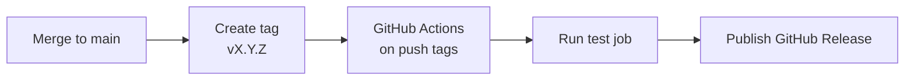

If you want to maintain a Laravel package for years, define your changelog and release process first. A repeatable process prevents missed breaking-change communication and keeps releases independent from one maintainer.

<Info>
  This page is a companion to [Laravel Package Development](/en/advanced/package-development). For Laravel/PHP compatibility strategy, read [Package Version Compatibility Management](/en/advanced/package-versioning).
</Info>

## How to write `CHANGELOG.md`

Your changelog is the primary source users read to understand what changed in each release. Use [Keep a Changelog](https://keepachangelog.com/en/1.1.0/) so your categories stay consistent across versions.

### Baseline rules

- Use `## [x.y.z] - YYYY-MM-DD` for version headers
- Use `Added / Changed / Deprecated / Removed / Fixed / Security`
- Add compare links at the bottom so users can inspect diffs
- Keep upcoming work in `## [Unreleased]`

```markdown
# CHANGELOG

All notable changes to this project will be documented in this file.

The format is based on [Keep a Changelog](https://keepachangelog.com/en/1.1.0/),
and this project adheres to [Semantic Versioning](https://semver.org/spec/v2.0.0.html).

## [Unreleased]

### Added
- Add `Package::warmCache()` for preloading metadata.

## [2.1.0] - 2026-05-10

### Added
- Add Laravel 13 support.

### Changed
- Improve default cache key generation for tagged cache stores.

### Deprecated
- Deprecate `Package::legacyHandle()` and schedule removal in v3.0.

### Fixed
- Fix null handling in `Package::resolveTenant()`.

## [2.0.0] - 2026-03-01

### Removed
- Drop Laravel 11 support.

### Security
- Harden signed URL validation against malformed host headers.

[Unreleased]: https://github.com/vendor/package/compare/v2.1.0...HEAD
[2.1.0]: https://github.com/vendor/package/compare/v2.0.0...v2.1.0
[2.0.0]: https://github.com/vendor/package/releases/tag/v2.0.0
```

<Tip>
  Reuse the same changelog text in your GitHub Release notes. Keeping one source of truth prevents drift between README, release notes, and social announcements.
</Tip>

## Semantic Versioning (SemVer)

[Semantic Versioning](https://semver.org/spec/v2.0.0.html) uses `MAJOR.MINOR.PATCH`:

- **MAJOR**: backward-incompatible changes
- **MINOR**: backward-compatible feature additions
- **PATCH**: backward-compatible bug fixes

### Laravel package examples

For Laravel 13 support, classification depends on your actual compatibility policy.

| Change | Recommended bump |
|---|---|
| Keep Laravel 12 support and add `^13.0` | MINOR |
| Drop Laravel 11/12 support and require only `^13.0` | MAJOR |
| Fix a Laravel-13-specific bug | PATCH |

Always check the official [Laravel 13 upgrade guide](https://laravel.com/docs/13.x/upgrade). If your package depends on APIs with breaking changes, you need to redesign compatibility policy before release.

<Warning>
  Raising the minimum PHP version or removing public APIs is a breaking change from the user's point of view. Treat it as a MAJOR release even when it happens during Laravel major support work.
</Warning>

## Git tags and GitHub Releases

Start by creating and pushing a version tag.

```bash
git tag v2.1.0
git push origin v2.1.0
```

Then open GitHub Releases, select tag `v2.1.0`, and publish. Copy the `## [2.1.0]` section from `CHANGELOG.md` as release notes.

<Steps>
  <Step title="Merge release-ready changes into main">
    Merge only after your test suite passes.
  </Step>
  <Step title="Create and push a version tag">
    Use the `vX.Y.Z` format and push the tag to `origin`.
  </Step>
  <Step title="Publish a GitHub Release">
    Use the tag as title and paste the corresponding changelog section.
  </Step>
</Steps>

## Automate releases with GitHub Actions

Use the `push: tags:` trigger to publish releases from tags. With `softprops/action-gh-release`, you can automate GitHub Release creation after tests pass.



```yaml
name: release

on:
  push:
    tags:
      - "v*.*.*"

permissions:
  contents: write

jobs:
  test:
    runs-on: ubuntu-latest
    steps:
      - uses: actions/checkout@v4
      - uses: shivammathur/setup-php@v2
        with:
          php-version: "8.3"
      - run: composer install --no-interaction --prefer-dist
      - run: vendor/bin/pest

  release:
    needs: test
    runs-on: ubuntu-latest
    steps:
      - uses: actions/checkout@v4
      - name: Publish GitHub Release
        uses: softprops/action-gh-release@v2
        with:
          generate_release_notes: true
```

<Info>
  Keep `needs: test` on the release job so failed tests block publication. This gate is critical in both manual and automated release flows.
</Info>

## Handling breaking changes

Ship breaking changes in phases. Deprecate first, remove in the next MAJOR version, and provide migration instructions.

### 1. Mark deprecated APIs in code

```php
<?php

namespace Vendor\Package;

class Client
{
    /**
     * @deprecated Use handle() instead. Will be removed in v3.0.
     */
    public function legacyHandle(array $payload): array
    {
        trigger_error(
            'Client::legacyHandle() is deprecated. Use Client::handle().',
            E_USER_DEPRECATED
        );

        return $this->handle($payload);
    }

    public function handle(array $payload): array
    {
        return $payload;
    }
}
```

### 2. Document migration guidance

Document actionable steps in `UPGRADE.md` or a dedicated migration page.

```markdown
## Upgrading from v2 to v3

- Replace `legacyHandle()` with `handle()`.
- Update PHP to 8.3+.
- Update Laravel constraint to `^13.0`.
```

### 3. Keep major-to-major migration notes

When you cut a MAJOR release, cross-link changelog `Removed` entries and migration docs. Users can quickly see both what changed and how to update.

## Related pages

<Columns cols={3}>
  <Card title="Laravel Package Development" icon="box" href="/en/advanced/package-development">
    Review implementation fundamentals centered on service providers.
  </Card>
  <Card title="Package Version Compatibility Management" icon="git-branch" href="/en/advanced/package-versioning">
    Organize your compatibility decisions for Laravel/PHP and SemVer.
  </Card>
  <Card title="Testing Laravel packages with Orchestra Testbench" icon="flask-conical" href="/en/advanced/package-testing">
    Learn the test strategy you should run before every release.
  </Card>
</Columns>
