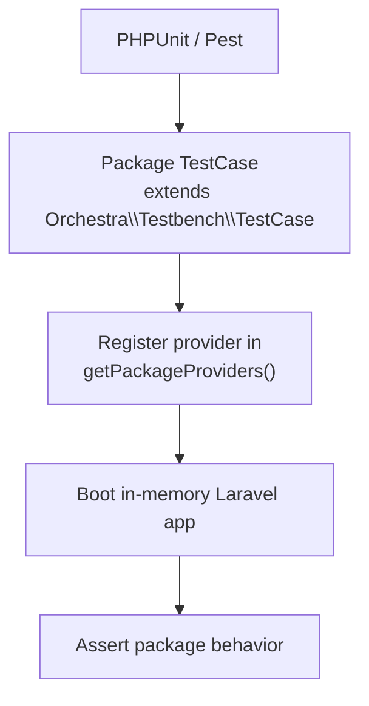

## What is Orchestra Testbench?

[Orchestra Testbench](https://github.com/orchestral/testbench) is a Laravel testing helper designed for package development. By extending `Orchestra\Testbench\TestCase`, you can test your package in isolation while still booting a Laravel application context.

Laravel's package documentation also recommends Testbench for package testing workflows. See [Laravel Package Development](/en/advanced/package-development).



## Setup

<Steps>
  <Step title="Install Testbench">
    ```bash
    composer require --dev orchestra/testbench
    ```
  </Step>
  <Step title="Create your base TestCase">
    ```php
    <?php
    
    namespace Vendor\Package\Tests;
    
    use Orchestra\Testbench\TestCase as BaseTestCase;
    use Vendor\Package\PackageServiceProvider;
    
    abstract class TestCase extends BaseTestCase
    {
        /**
         * $app is the Laravel application instance booted by Testbench.
         */
        protected function getPackageProviders($app): array
        {
            return [
                PackageServiceProvider::class,
            ];
        }
    }
    ```
  </Step>
  <Step title="Add aliases or environment overrides if needed">
    ```php
    protected function getPackageAliases($app): array
    {
        return [
            'Package' => \Vendor\Package\Facades\Package::class,
        ];
    }
    
    protected function defineEnvironment($app): void
    {
        // Override config values for tests
        $app['config']->set('package.enabled', true);
    }
    ```
  </Step>
</Steps>

## Writing your first tests

Start by testing package bootstrap behavior: provider registration, facade calls, and configuration values.

```php
<?php

namespace Vendor\Package\Tests\Feature;

use Vendor\Package\Facades\Package;
use Vendor\Package\PackageServiceProvider;
use Vendor\Package\Tests\TestCase;

class PackageBootstrapTest extends TestCase
{
    public function test_service_provider_is_registered(): void
    {
        $this->assertTrue($this->app->providerIsLoaded(PackageServiceProvider::class));
    }

    public function test_facade_returns_expected_value(): void
    {
        // Verify behavior through the facade
        $this->assertSame('ok', Package::status());
    }

    public function test_package_config_is_available(): void
    {
        // Assert the value configured in defineEnvironment()
        $this->assertTrue(config('package.enabled'));
    }
}
```

## Filesystem and database testing

For database tests, configure SQLite in-memory in `defineEnvironment()` and load your package migrations.

```php
<?php

namespace Vendor\Package\Tests;

use Orchestra\Testbench\TestCase as BaseTestCase;

abstract class TestCase extends BaseTestCase
{
    protected function defineEnvironment($app): void
    {
        // Use SQLite in-memory for fast tests
        $app['config']->set('database.default', 'testing');
        $app['config']->set('database.connections.testing', [
            'driver' => 'sqlite',
            'database' => ':memory:',
            'prefix' => '',
        ]);
    }

    protected function setUp(): void
    {
        parent::setUp();

        // Load package migrations
        $this->loadMigrationsFrom(__DIR__.'/../database/migrations');
    }
}
```

```php
public function test_it_persists_data(): void
{
    \DB::table('widgets')->insert(['name' => 'test']);

    $this->assertDatabaseHas('widgets', ['name' => 'test']);
}
```

## Testing across Laravel versions

Testbench major versions align with Laravel major versions. Check the official [Version Compatibility](https://packages.tools/testbench) table for updates.

| Laravel | Testbench |
|---|---|
| 12.x | 10.x |
| 13.x | 11.x |

Use a GitHub Actions matrix to keep compatibility verified continuously. For strategy details, see [Package Version Compatibility Management](/en/advanced/package-versioning).

```yaml
strategy:
  fail-fast: false
  matrix:
    php: [8.3, 8.4]
    laravel: ["^12.0", "^13.0"]
    include:
      - laravel: "^13.0"
        testbench: "^11.0"
      - laravel: "^12.0"
        testbench: "^10.0"
```

## Summary

Testbench gives you a reliable, app-like test environment for package development without creating a full Laravel app manually. By covering providers, config, facades, and database behavior, you reduce regressions before release.

## Related pages

<Columns cols={2}>
  <Card title="Laravel package development" icon="box" href="/en/advanced/package-development">
    Review package implementation fundamentals centered on service providers.
  </Card>
  <Card title="Package version compatibility management" icon="git-branch" href="/en/advanced/package-versioning">
    Learn versioning strategy and CI matrix design for Laravel and Testbench.
  </Card>
</Columns>
