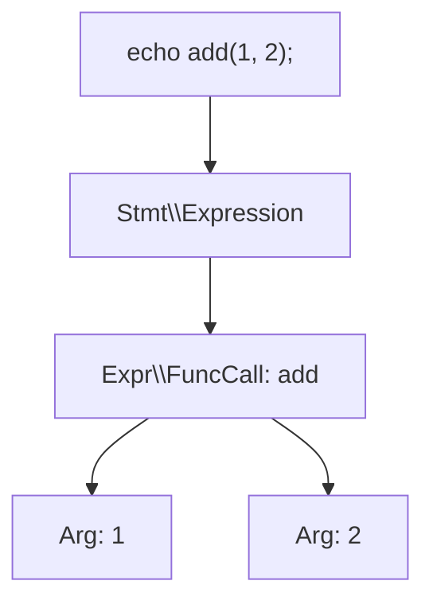

## What Is PHP AST?

An AST (Abstract Syntax Tree) is a tree structure that decomposes source code into meaningful syntax structures.

When you build code generation tools, static analysis tools, or automated refactoring tools, AST is almost always a required foundation. Even transformations that are fragile with string replacement can be handled safely at syntax-unit level with AST, such as function calls, class declarations, and `use` statements.



## PHP Internal AST

Since PHP 7, the Zend Engine compiles PHP code by first transforming it into an internal AST, then compiling it into opcodes.

- Even one-line code executed with `php -r` goes through the same internal compilation pipeline
- OPcache caches and reuses the resulting opcodes
- In normal application development, you rarely manipulate this internal AST directly

So when you want to edit code via AST, the practical approach is to use a userland AST library rather than the internal runtime AST.

## The `nikic/PHP-Parser` Package

[`nikic/PHP-Parser`](https://github.com/nikic/PHP-Parser) is the standard library for parsing, traversing, and regenerating PHP code as AST. Its README and official docs describe this three-step flow as the baseline.

### Installation

```bash
composer require nikic/php-parser
```

### Basic Parsing Example (Code to AST)

```php
<?php

use PhpParser\Error;
use PhpParser\ParserFactory;

$code = <<<'CODE'
<?php
function greet(string $name): void {
    echo "Hello, {$name}";
}
CODE;

$parser = (new ParserFactory())->createForNewestSupportedVersion();

try {
    $ast = $parser->parse($code);
} catch (Error $error) {
    echo "Parse error: {$error->getMessage()}\n";
    return;
}
```

### Traverse and Modify AST with the NodeVisitor Pattern

```php
<?php

use PhpParser\Node;
use PhpParser\NodeTraverser;
use PhpParser\NodeVisitorAbstract;

$traverser = new NodeTraverser();

$traverser->addVisitor(new class extends NodeVisitorAbstract {
    public function leaveNode(Node $node)
    {
        if ($node instanceof Node\Scalar\Int_) {
            return new Node\Scalar\String_((string) $node->value);
        }
    }
});

$modifiedAst = $traverser->traverse($ast);
```

When you extend `NodeVisitorAbstract`, you can implement only the hooks you need (`enterNode` / `leaveNode`). For complex transforms, a common flow is collecting context in `enterNode` and replacing nodes in `leaveNode`.

### Regenerate Code with Pretty Printer

```php
<?php

use PhpParser\PrettyPrinter;

$prettyPrinter = new PrettyPrinter\Standard();
$newCode = $prettyPrinter->prettyPrintFile($modifiedAst);

echo $newCode;
```

With this flow, your target becomes code as syntax trees, not code as plain strings.

## Usage in Laravel/Chisel

[`laravel/chisel`](/en/blog/chisel-introduction) is a library that removes optional starter-kit parts in a post-processing step. In `composer.json`, it depends on `nikic/php-parser` 5.x.

In Chisel's `Laravel\Chisel\Ast\Source`, AST editing is executed with this sequence.

1. Parse source with `ParserFactory::createForNewestSupportedVersion()`
2. Add multiple visitors (such as `RemoveImportVisitor`) to `NodeTraverser` and transform
3. Write back with `PhpParser\PrettyPrinter\Standard` using `printFormatPreserving()` to preserve original formatting

With this design, removal of `use` statements, traits, and interfaces can be done safely as syntax operations rather than text replacement.

## Use Cases

AST makes the following development tasks easier.

- Code generation CLI (syntax-aware edits after scaffolding)
- Static analysis tools (detecting specific syntax and rule violations)
- Automated refactoring (semi-automated API migration and renaming)
- Post-processing project templates (feature removal/replacement like Chisel)

## Summary

PHP AST is not a feature you use every day in typical Laravel app development.

However, if you build tools or packages, AST is a strong foundation for resilient and reproducible code changes. Start by trying the Parser, Visitor, and Pretty Printer of `nikic/php-parser` in a small CLI tool.
