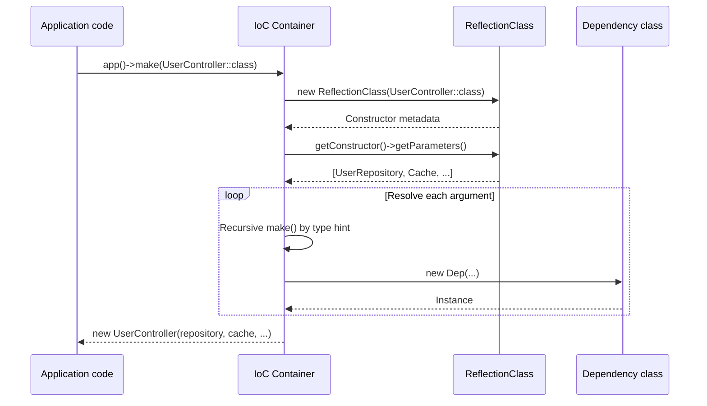

## What is the PHP Reflection API?

The PHP Reflection API is a built-in PHP feature that lets you inspect and retrieve metadata about classes, methods, properties, functions, and parameters at runtime. You can discover what arguments a constructor expects, which attributes are attached to a method, and much more — all without modifying the source code.

Laravel relies heavily on the Reflection API inside `Illuminate/Container/Container.php` to power automatic dependency resolution, PHP attribute reading, and method injection.

## Core classes

| Class | Primary use |
|---|---|
| `ReflectionClass` | Entry point for inspecting a class |
| `ReflectionMethod` | Retrieve arguments, access modifiers, and attributes of a method |
| `ReflectionProperty` | Retrieve type, default value, and attributes of a property |
| `ReflectionParameter` | Retrieve type hints and default values of method/function arguments |
| `ReflectionFunction` | Inspect functions and closures |
| `ReflectionAttribute` | Retrieve the class name and arguments of an attribute |

### ReflectionClass — inspecting a class

```php
$ref = new ReflectionClass(UserController::class);

$ref->getName();          // Fully-qualified class name
$ref->getShortName();     // Class name only
$ref->isInstantiable();   // Whether the class can be instantiated
$ref->getConstructor();   // Returns the constructor as a ReflectionMethod
$ref->getMethods();       // Returns all methods as ReflectionMethod[]
$ref->getProperties();    // Returns all properties as ReflectionProperty[]
$ref->getAttributes();    // Returns attributes on the class as ReflectionAttribute[]
```

### ReflectionParameter — inspecting constructor arguments

```php
$ref = new ReflectionClass(UserController::class);
$constructor = $ref->getConstructor();

if ($constructor) {
    foreach ($constructor->getParameters() as $param) {
        $param->getName();           // Parameter name
        $param->getType();           // Type hint (ReflectionType)
        $param->isOptional();        // Whether the parameter is optional
        $param->isVariadic();        // Whether the parameter is variadic
        $param->getDefaultValue();   // Default value (if present)
    }
}
```

## The Laravel container and the Reflection API

Laravel's IoC container uses the Reflection API to implement constructor injection — the automatic resolution of dependencies. Here is how `app()->make(SomeClass::class)` and dependency injection work under the hood.



### The container's `build()` method (simplified)

The actual `build()` method in `Container.php` looks approximately like this.

```php
// Simplified version of Illuminate\Container\Container::build()
public function build($concrete)
{
    // 1. Inspect the class with ReflectionClass
    $reflector = new ReflectionClass($concrete);

    // Non-instantiable classes (interfaces, abstract classes) throw an error
    if (! $reflector->isInstantiable()) {
        throw new BindingResolutionException("[$concrete] is not instantiable.");
    }

    // 2. Get the constructor
    $constructor = $reflector->getConstructor();

    // No constructor means no dependencies — instantiate directly
    if (is_null($constructor)) {
        return new $concrete;
    }

    // 3. Fetch all constructor parameters
    $dependencies = $constructor->getParameters();

    // 4. Resolve each parameter recursively
    $instances = $this->resolveDependencies($dependencies);

    return new $concrete(...$instances);
}

protected function resolveDependencies(array $dependencies): array
{
    $results = [];

    foreach ($dependencies as $dependency) {
        // Resolve class-typed parameters via the container
        $className = Util::getParameterClassName($dependency);

        $results[] = is_null($className)
            ? $this->resolvePrimitive($dependency)  // Primitive types
            : $this->resolveClass($dependency, $className); // Class types
    }

    return $results;
}
```

<Info>
  `Util::getParameterClassName()` extracts the type name string from the result of `$parameter->getType()`. It wraps the `ReflectionNamedType` returned by `ReflectionParameter::getType()` into a convenient helper.
</Info>

## Reading PHP attributes

Since PHP 8.0, the Reflection API lets you retrieve attributes attached to classes, methods, and properties. Laravel uses this mechanism to process queue attributes and Eloquent attributes.

<Tip>
  See [PHP Attributes](/en/advanced/php-attributes) for a detailed explanation of PHP attributes and how Laravel integrates them.
</Tip>

### Basic pattern for reading attributes

```php
use ReflectionClass;

// 1. Get attributes on a class
$ref = new ReflectionClass(ProcessOrder::class);
$attrs = $ref->getAttributes(Queue::class); // Fetch only a specific attribute

foreach ($attrs as $attr) {
    $instance = $attr->newInstance(); // Instantiate the attribute class
    echo $instance->queue;            // Read the attribute's properties
}

// 2. Get all attributes (no filter)
$allAttrs = $ref->getAttributes();

foreach ($allAttrs as $attr) {
    echo $attr->getName();           // Attribute class name (FQCN)
    print_r($attr->getArguments());  // Constructor arguments
}
```

### How Laravel reads the Queue attribute (simplified)

```php
// Simplified from ReadsQueueAttributes inside the InteractsWithQueue trait
protected function setJobInstanceForQueue(object $job): void
{
    $reflection = new ReflectionClass($job);

    foreach ($reflection->getAttributes(Queue::class) as $attribute) {
        $instance = $attribute->newInstance();
        $job->queue = $instance->queue instanceof \UnitEnum
            ? $instance->queue->value
            : $instance->queue;
    }
}
```

### Reading attributes on methods

```php
$ref = new ReflectionClass(UserController::class);

foreach ($ref->getMethods() as $method) {
    $attrs = $method->getAttributes(Route::class);

    foreach ($attrs as $attr) {
        $route = $attr->newInstance();
        echo "{$method->getName()} => {$route->path}";
    }
}
```

## Practical examples for package development

### Checking whether a class implements an interface

Dynamically verify that a class implements a specific interface.

```php
use ReflectionClass;

function isQueueable(string $class): bool
{
    $ref = new ReflectionClass($class);

    return $ref->implementsInterface(\Illuminate\Contracts\Queue\ShouldQueue::class);
}
```

### Auto-registering routes from attributes

A pattern that combines attributes with Reflection to collect routes automatically.

```php
// Custom Route attribute definition
#[\Attribute(\Attribute::TARGET_METHOD)]
class Route
{
    public function __construct(
        public string $method,
        public string $path,
    ) {}
}

// Used in a controller
class UserController
{
    #[Route('GET', '/users')]
    public function index() { /* ... */ }

    #[Route('POST', '/users')]
    public function store() { /* ... */ }
}

// Service provider that auto-registers routes from attributes
class AttributeRouteServiceProvider extends ServiceProvider
{
    public function boot(Router $router): void
    {
        $ref = new ReflectionClass(UserController::class);

        foreach ($ref->getMethods(\ReflectionMethod::IS_PUBLIC) as $method) {
            foreach ($method->getAttributes(Route::class) as $attr) {
                $route = $attr->newInstance();
                $router->addRoute(
                    $route->method,
                    $route->path,
                    [UserController::class, $method->getName()],
                );
            }
        }
    }
}
```

### Method injection — calling with auto-resolved arguments

Laravel's `call()` method uses Reflection to resolve arguments automatically. Here is a simplified implementation.

```php
use ReflectionFunction;
use ReflectionMethod;

function callWithDependencies(callable $callable, Container $container): mixed
{
    if (is_array($callable)) {
        [$object, $method] = $callable;
        $ref = new ReflectionMethod($object, $method);
        $params = $ref->getParameters();
    } else {
        $ref = new ReflectionFunction($callable);
        $params = $ref->getParameters();
    }

    $args = [];
    foreach ($params as $param) {
        $type = $param->getType()?->getName();
        $args[] = $type ? $container->make($type) : null;
    }

    return $callable(...$args);
}

// Usage
callWithDependencies([new UserController(), 'index'], app());
```

### Collecting property default values

Retrieve the default values of a configuration class via Reflection.

```php
use ReflectionClass;
use ReflectionProperty;

function getDefaults(string $class): array
{
    $ref = new ReflectionClass($class);
    $defaults = [];

    foreach ($ref->getProperties(ReflectionProperty::IS_PUBLIC) as $prop) {
        if ($prop->hasDefaultValue()) {
            $defaults[$prop->getName()] = $prop->getDefaultValue();
        }
    }

    return $defaults;
}

class DatabaseConfig
{
    public string $driver = 'mysql';
    public int $port = 3306;
    public bool $strict = true;
}

// ['driver' => 'mysql', 'port' => 3306, 'strict' => true]
$defaults = getDefaults(DatabaseConfig::class);
```

## Performance considerations

The Reflection API parses class metadata every time it runs, so it carries a cost. Caching results is a best practice for production code.

```php
class ReflectionCache
{
    private static array $cache = [];

    public static function getClass(string $class): \ReflectionClass
    {
        return self::$cache[$class] ??= new \ReflectionClass($class);
    }
}

// Usage
$ref = ReflectionCache::getClass(UserController::class);
```

<Warning>
  PHP's OPcache does not cache Reflection results. Consider building your own cache when inspecting a large number of classes in a loop. Note that Laravel's container itself reuses `ReflectionClass` instances within the same request.
</Warning>

## Next steps

<Columns cols={2}>
  <Card title="PHP Attributes" icon="tag" href="/en/advanced/php-attributes">
    Learn about PHP attributes that are read via ReflectionClass::getAttributes().
  </Card>
  <Card title="Package development" icon="package" href="/en/advanced/package-development">
    Learn how to build Laravel packages that leverage the Reflection API.
  </Card>
</Columns>
