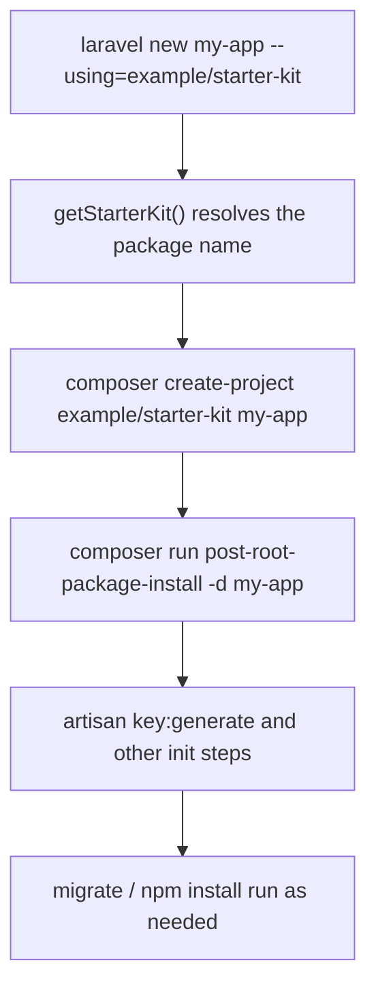

## Overview

A starter kit is a template project that gets unpacked via `create-project` when someone runs `laravel new`. Laravel 13 ships four official starter kits — React, Vue, Svelte, and Livewire — each bundling authentication scaffolding and an initial UI layer.

Building your own starter kit follows the same pattern: start from a Laravel application, shape it to your needs, and publish it as a Composer package.

- Official documentation: [Starter Kits](https://laravel.com/docs/starter-kits)
- Official example: [laravel/react-starter-kit](https://github.com/laravel/react-starter-kit)
- Related page: [Laravel Console Starter](/en/packages/laravel-console-starter/index)

## Setting Up the Template Project

### Initialize a Laravel project

Start by creating the Laravel project that will become your template, then remove any sample code you do not want distributed. Next, give the package a unique name in `composer.json`.

```json
{
    "name": "example/starter-kit",
    "type": "project",
    "require": {
        "php": "^8.3",
        "laravel/framework": "^13.0"
    }
}
```

This `name` value is the identifier users will pass to `--using` when creating a new project.

```bash
laravel new my-app --using=example/starter-kit
```

### Configuring composer.json scripts

After `laravel new` runs, Composer executes the scripts defined in the starter kit's `composer.json`. At a minimum, include `post-root-package-install` and `post-create-project-cmd`.

```json
"scripts": {
    "post-root-package-install": [
        "@php -r \"file_exists('.env') || copy('.env.example', '.env');\""
    ],
    "post-create-project-cmd": [
        "@php artisan key:generate --ansi",
        "@php -r \"file_exists('database/database.sqlite') || touch('database/database.sqlite');\"",
        "@php artisan migrate --graceful --ansi"
    ]
}
```

This example is based on the [laravel/react-starter-kit composer.json](https://github.com/laravel/react-starter-kit/blob/main/composer.json). If your kit uses a database, you can use it as-is.

### Using .gitattributes

Use `export-ignore` to keep files in your repository that should not be included in the generated project delivered to users.

```gitattributes
LICENSE export-ignore
composer.lock export-ignore
README.md export-ignore
```

See the [official .gitattributes example](https://github.com/laravel/react-starter-kit/blob/main/.gitattributes) for a complete reference.

## Publishing to Packagist

To let users install your kit with `--using`, you need to register it on Packagist.

<Steps>
  <Step title="Create a public GitHub repository">
    Make sure the `name` in `composer.json` matches the repository URL, then push the project publicly.
  </Step>
  <Step title="Register on Packagist">
    Submit the repository URL at [Packagist](https://packagist.org/). Once approved, `example/starter-kit` becomes resolvable by Composer.
  </Step>
  <Step title="Document the install command in your README">
    Add the following command to your README so users know how to use the kit.

    ```bash
    laravel new my-app --using=example/starter-kit
    ```
  </Step>
</Steps>

## The `laravel new` Workflow

The `laravel/installer` `NewCommand` switches the `create-project` target to the specified starter kit and runs the initialization commands in sequence.



Relevant sections of [NewCommand.php](https://github.com/laravel/installer/blob/master/src/NewCommand.php):

- [--using option definition](https://github.com/laravel/installer/blob/958a4e7c1386199a63d3c5e49a18b2e5c2ad1600/src/NewCommand.php#L119)
- [`create-project` and `post-root-package-install` execution](https://github.com/laravel/installer/blob/958a4e7c1386199a63d3c5e49a18b2e5c2ad1600/src/NewCommand.php#L521-L569)
- [`getStarterKit()` implementation](https://github.com/laravel/installer/blob/958a4e7c1386199a63d3c5e49a18b2e5c2ad1600/src/NewCommand.php#L1237-L1255)

## Choosing a Frontend Stack

Laravel 13's official kits offer React, Vue, Svelte, and Livewire, but your starter kit is not required to follow that layout. Choose the CSS framework, component library, and authentication approach that best fits your use case.

| Option | Main stack | Best suited for |
| --- | --- | --- |
| Official React / Vue / Svelte / Livewire | Inertia 3 or Livewire 4 with official defaults | Teams that want an experience close to official |
| Custom frontend | Any CSS or component library | Existing design systems or alternative CSS bases |
| Simple Blade kit | Blade-centric, minimal frontend dependencies | Lightweight setup with fast onboarding |
| Custom auth kit | Auth beyond Fortify (e.g., Socialite-focused) | Projects that need a specific authentication strategy |

<Info>
  Community starter kits commonly adopt a different CSS base from the official kits. Feel free to design the authentication layer around your own requirements rather than assuming Fortify.
</Info>

## Maintaining Across Versions

A starter kit is not a one-time effort. You need to keep it compatible as Laravel and PHP evolve.

### Keeping up with Laravel and PHP updates

Update the version constraints in `composer.json` first, then verify compatibility in CI.

```json
"require": {
    "php": "^8.3",
    "laravel/framework": "^13.0"
}
```

For Laravel major releases, revisit `laravel/framework` and all related dependencies together.

### Updating frontend dependencies regularly

Frontend dependencies move fast. A monthly update cycle is a safe default.

- Tailwind CSS
- Component libraries (shadcn/ui, shadcn-vue, shadcn-svelte, Flux UI)
- Inertia / Livewire related packages

### Compatibility testing

At a minimum, add these checks to your CI pipeline.

- `composer install` succeeds
- `php artisan test` passes
- `npm install && npm run build` passes

## Best Practices

- **Lock in the package name early**: Changing it after publishing on Packagist is costly.
- **Base your scripts on the official examples**: Deviating from the expected initialization flow increases the chance of failed installs.
- **Set up `.gitattributes` from the start**: Keeping distribution artifacts out of generated projects reduces noise for your users.
- **Schedule regular upgrades**: Establish a process to follow new Laravel releases quickly.
- **Read the related guides**: [Package Development](/en/advanced/package-development) and [Package Version Compatibility](/en/advanced/package-versioning) together provide a solid foundation for design decisions.
