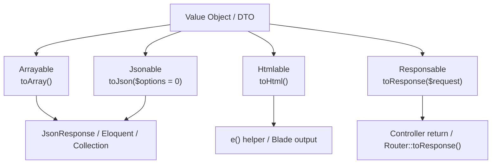

## What are Support contracts?

`Illuminate\Contracts\Support` contains small but important interfaces used across Laravel internals.  
`Arrayable`, `Jsonable`, `Htmlable`, and `Responsable` are especially useful when you want Value Objects, DTOs, and response objects to plug into Laravel behavior naturally.



<Info>
  All signatures in this page are verified against the Laravel `13.x` branch in `laravel/framework`.
</Info>

## 1) Arrayable

### Interface definition

```php
interface Arrayable
{
    public function toArray();
}
```

### Implementation example

```php
use Illuminate\Contracts\Support\Arrayable;

final class Money implements Arrayable
{
    public function __construct(
        public readonly int $amount,
        public readonly string $currency,
    ) {}

    public function toArray(): array
    {
        return [
            'amount' => $this->amount,
            'currency' => $this->currency,
        ];
    }
}
```

### Laravel core usage

- `Illuminate\Database\Eloquent\Model` implements `Arrayable` and provides `toArray()`
- `Illuminate\Http\JsonResponse::setData()` detects `Arrayable` and encodes `toArray()` output

### Package-development usage points

- Keep DTO / Value Object normalization in one place
- Let your objects flow through APIs that expect plain arrays without extra adapter code

## 2) Jsonable

### Interface definition

```php
interface Jsonable
{
    public function toJson($options = 0);
}
```

### Implementation example

```php
use Illuminate\Contracts\Support\Jsonable;

final class ApiPayload implements Jsonable
{
    public function __construct(
        private array $data,
    ) {}

    public function toJson($options = 0): string
    {
        return json_encode([
            'data' => $this->data,
            'generated_at' => now()->toIso8601String(),
        ], $options | JSON_THROW_ON_ERROR);
    }
}
```

### Laravel core usage

- `Model` also implements `Jsonable` and provides `toJson($options = 0)`
- `JsonResponse::setData()` gives `Jsonable` priority and calls `toJson()`

### Package-development usage points

- Define strict JSON output shape for webhooks, API payloads, and logging
- Avoid implicit serializer behavior and keep domain-specific JSON explicit

## 3) Htmlable

### Interface definition

```php
interface Htmlable
{
    public function toHtml();
}
```

### Implementation example

```php
use Illuminate\Contracts\Support\Htmlable;

final class BadgeHtml implements Htmlable
{
    public function __construct(
        private string $label,
    ) {}

    public function toHtml(): string
    {
        $escaped = e($this->label);

        return "<span class=\"badge\">{$escaped}</span>";
    }
}
```

### Laravel core usage

- `Illuminate\Support\HtmlString` implements `Htmlable`
- The `e()` helper returns `toHtml()` directly when given an `Htmlable` instance

### Package-development usage points

- Encapsulate trusted HTML fragments in dedicated objects
- Keep your Blade rendering boundaries clear when using `{!! ... !!}`

<Tip>
  Inside `Htmlable` implementations, escape untrusted input with `e()` before embedding values into HTML.
</Tip>

## 4) Responsable

### Interface definition

```php
interface Responsable
{
    public function toResponse($request);
}
```

### Implementation example

```php
use Illuminate\Contracts\Support\Responsable;

final class ExportCsvResponse implements Responsable
{
    public function __construct(
        private array $rows,
        private string $filename = 'export.csv',
    ) {}

    /**
     * @param \Illuminate\Http\Request $request
     */
    public function toResponse($request)
    {
        return response()->streamDownload(function () {
            $stream = fopen('php://output', 'w');

            foreach ($this->rows as $row) {
                fputcsv($stream, $row);
            }

            fclose($stream);
        }, $this->filename, [
            'Content-Type' => 'text/csv',
        ]);
    }
}
```

### Laravel core usage

- `Illuminate\Routing\Router::toResponse()` first checks for `Responsable` and calls `toResponse($request)`
- `Illuminate\Http\Resources\Json\JsonResource` implements `Responsable`, so you can directly `return UserResource::make($user);`

### Package-development usage points

- Move HTTP response assembly out of controllers and into dedicated objects
- Return DTO-like objects directly from controllers while keeping presentation logic isolated

## Implementation decision guide

<Steps>
  <Step title="You need reusable array conversion">
    Implement `Arrayable` and centralize normalization logic in `toArray()`.
  </Step>
  <Step title="You need controlled JSON output">
    Implement `Jsonable` and make `toJson($options)` your explicit serialization contract.
  </Step>
  <Step title="You need HTML fragment output">
    Implement `Htmlable` and return rendering-safe strings via `toHtml()`.
  </Step>
  <Step title="You need direct controller return objects">
    Implement `Responsable` and encapsulate response creation in `toResponse($request)`.
  </Step>
</Steps>

## Next pages to read

<Columns cols={2}>
  <Card title="The Macroable trait" icon="puzzle-piece" href="/en/advanced/macroable">
    Learn the extension pattern for adding methods to existing classes.
  </Card>
  <Card title="The Conditionable trait" icon="git-branch" href="/en/advanced/conditionable">
    Learn conditional fluent chains with `when()` and `unless()`.
  </Card>
  <Card title="tap() helper / Tappable" icon="hand-point-up" href="/en/advanced/tap">
    Learn side-effect-friendly chaining while returning the original value.
  </Card>
  <Card title="The Dumpable trait" icon="bug" href="/en/advanced/dumpable">
    Learn how to add `dump()` / `dd()` style debugging to your own objects.
  </Card>
</Columns>
