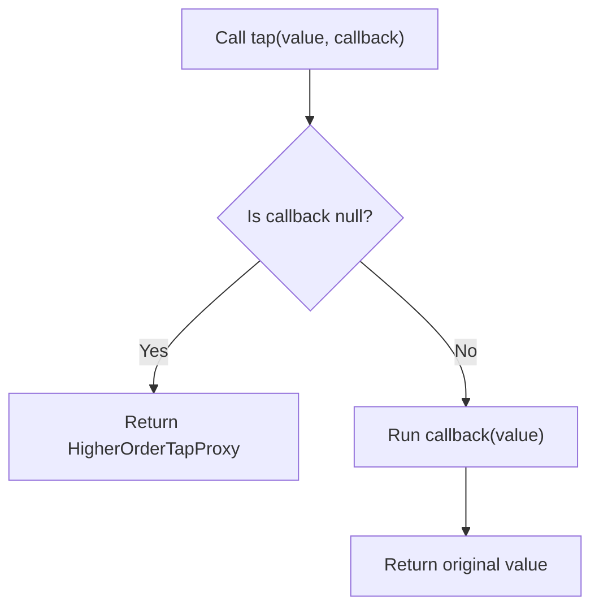

## What is tap()?

`tap()` is a helper for "using a value and still returning that same value." Use it when you want to insert side effects.

The implementation in `Illuminate\Support\helpers.php` is simple:

```php
function tap($value, $callback = null)
{
    if (is_null($callback)) {
        return new HigherOrderTapProxy($value);
    }

    $callback($value);

    return $value;
}
```



<Info>
  `tap()` ignores the callback's return value. It always returns the original value.
</Info>

## Basic usage

The most basic pattern is: receive a value, run some logic, then return the original value.

```php
use App\Models\User;

$user = tap(User::query()->latest()->firstOrFail(), function (User $model) {
    $model->update(['last_seen_at' => now()]);
});

// Returns $user regardless of update()'s return value
```

If you omit the callback, `tap()` returns a `HigherOrderTapProxy`, so you can chain method calls directly.

```php
$updatedUser = tap($user)->update([
    'name' => $name,
    'email' => $email,
]);

// Returns the original User instance, not update()'s return value
```

## Common use cases

### Insert debug output

```php
$result = tap($query->get(), function ($users) {
    logger()->debug('Fetched users', ['count' => $users->count()]);
});
```

### Insert logging or event dispatch in the middle of a chain

```php
$order = tap(Order::create($payload), function (Order $order) {
    event(new OrderCreated($order));
    logger()->info('Order created', ['id' => $order->id]);
});
```

### Trigger side effects without changing the return value

```php
$response = tap($service->handle($request), function ($response) {
    \Illuminate\Support\Facades\Cache::increment('service_handle_success_total');
});
```

<Tip>
  If you need to transform the return value, use `with()` or normal variable assignment. `tap()` stays readable when you keep it focused on side effects.
</Tip>

## What is the Tappable trait?

If you `use Illuminate\Support\Traits\Tappable`, your class gets a `tap()` method.

```php
trait Tappable
{
    public function tap($callback = null)
    {
        return tap($this, $callback);
    }
}
```

In other words, it only provides an instance-method version of `tap()`.

```php
use Illuminate\Support\Traits\Tappable;

class ReportBuilder
{
    use Tappable;
}

$builder = new ReportBuilder();

$builder = $builder->tap(function (ReportBuilder $instance) {
    logger()->debug('builder initialized');
});
```

## Using it in package development

`Tappable` is useful when you want to insert side effects into a fluent API chain. When combined with `Macroable` and `Conditionable`, you can build highly extensible builder APIs in the Laravel style.

<Steps>
  <Step title="Create a fluent class">
    ```php
    use Illuminate\Support\Traits\Conditionable;
    use Illuminate\Support\Traits\Macroable;
    use Illuminate\Support\Traits\Tappable;

    class QueryPresetBuilder
    {
        use Macroable;
        use Conditionable;
        use Tappable;

        protected array $filters = [];

        public function where(string $key, mixed $value): static
        {
            $this->filters[$key] = $value;

            return $this;
        }

        public function toArray(): array
        {
            return $this->filters;
        }
    }
    ```
  </Step>
  <Step title="Combine Macroable, Conditionable, and Tappable">
    ```php
    QueryPresetBuilder::macro('forActiveUsers', function () {
        /** @var QueryPresetBuilder $this */
        return $this->where('active', true);
    });

    $filters = (new QueryPresetBuilder)
        ->forActiveUsers()
        ->when($request->filled('role'), fn ($builder) => $builder->where('role', $request->role))
        ->tap(fn ($builder) => logger()->debug('current filters', $builder->toArray()))
        ->toArray();
    ```
  </Step>
</Steps>

Related pages:

- [The Macroable trait](/en/advanced/macroable)
- [The Conditionable trait](/en/advanced/conditionable)

## Usage in Laravel core

Laravel itself uses `tap()` and `Tappable` in real code:

- `Illuminate\Routing\Router` uses both `Macroable` and `Tappable`
- `Router::respondWithRoute()` uses `tap($route)->bind(...)` (without a callback), then still returns the original `$route`
- `Router::prepareResponse()` uses `tap(..., fn (...) => event(...))` to dispatch an event after response conversion
- `Illuminate\Testing\Fluent\Concerns\Has` implements assertion helpers with a `->tap(...)->first(...)->etc()` chain

```php
// From Illuminate\Routing\Router
$route = tap($this->routes->getByName($name))->bind($this->currentRequest);

return tap(static::toResponse($request, $response), function ($response) use ($request) {
    $this->events->dispatch(new ResponsePrepared($request, $response));
});
```

<Info>
  `tap()` is a small helper by itself, but when you combine it with `Macroable` and `Conditionable`, it becomes much easier to build the readable method chains you often see in Laravel.
</Info>

## Next steps

<Columns cols={2}>
  <Card title="The Macroable trait" icon="puzzle-piece" href="/en/advanced/macroable">
    Learn how to add custom methods to existing classes.
  </Card>
  <Card title="The Conditionable trait" icon="git-branch" href="/en/advanced/conditionable">
    Learn conditional method chains with `when()` and `unless()`.
  </Card>
</Columns>
