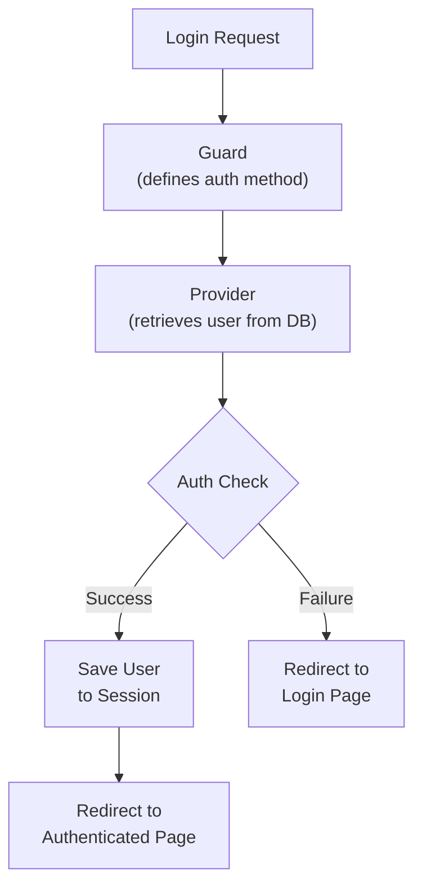

## What is authentication?

Authentication is the process of verifying who a user is. In a web application, this typically means accepting an email address and password, verifying the credentials against the database, and then storing user identity in the session for subsequent requests.

Laravel's authentication system is built around two concepts:

- **Guards** — define how users are authenticated per request. The default `session` guard uses the session and cookies to maintain state.
- **Providers** — define how users are retrieved from storage. The default provider uses Eloquent.

<Info>
  The authentication configuration file is `config/auth.php`. For most applications the defaults work without any changes.
</Info>



## Setting up authentication with a starter kit

The fastest way to add authentication to a new application is to choose a starter kit when running `laravel new`. It scaffolds login, registration, password reset, and email verification automatically.

<Steps>
  <Step title="Create a new application">
    Run the installer and choose a starter kit when prompted:

    ```shell
    laravel new my-app
    ```

    Choose from **React**, **Vue**, **Livewire**, or **Svelte** depending on your preferred frontend stack.
  </Step>

  <Step title="Install frontend dependencies">
    ```shell
    cd my-app
    npm install && npm run build
    ```
  </Step>

  <Step title="Run migrations">
    Confirm your database settings in `.env`, then run:

    ```shell
    php artisan migrate
    ```

    This creates the `users` table along with the other default tables.
  </Step>

  <Step title="Start the development server">
    ```shell
    composer run dev
    ```

    Visit `http://localhost:8000`. You'll see **Register** and **Log in** links in the navigation. Open `/register` to create an account.
  </Step>
</Steps>

A starter kit gives you these pages out of the box:

| Feature | URL |
| --- | --- |
| Registration | `/register` |
| Login | `/login` |
| Password reset | `/forgot-password` |
| Email verification | `/email/verify` |
| Profile settings | `/settings/profile` |

<Tip>
  All generated code — controllers, routes, and views — lives inside your own application. You're free to modify it however you need.
</Tip>

## The Auth facade

Use the `Auth` facade to work with the authenticated user in any part of your application.

### Retrieving the current user

```php
use Illuminate\Support\Facades\Auth;

// Get the authenticated user
$user = Auth::user();

// Get only the user's ID
$id = Auth::id();
```

Inside a controller, you can also retrieve the user from the `Request` object:

```php
<?php

namespace App\Http\Controllers;

use Illuminate\Http\Request;

class DashboardController extends Controller
{
    public function index(Request $request)
    {
        $user = $request->user();

        return view('dashboard', ['user' => $user]);
    }
}
```

### Checking authentication status

`Auth::check()` returns `true` if a user is logged in:

```php
use Illuminate\Support\Facades\Auth;

if (Auth::check()) {
    // User is authenticated
} else {
    // User is a guest
}
```

In Blade templates, use the `@auth` and `@guest` directives:

```blade
@auth
    <p>Hello, {{ Auth::user()->name }}</p>
    <a href="/logout">Log out</a>
@endauth

@guest
    <a href="/login">Log in</a>
    <a href="/register">Register</a>
@endguest
```

## Protecting routes

Apply the `auth` middleware to any route that requires authentication:

```php
// routes/web.php

Route::get('/dashboard', function () {
    return view('dashboard');
})->middleware('auth');
```

Unauthenticated users are redirected to `/login` automatically.

Protect multiple routes at once with a group:

```php
Route::middleware('auth')->group(function () {
    Route::get('/dashboard', [DashboardController::class, 'index']);
    Route::get('/profile', [ProfileController::class, 'show']);
    Route::get('/settings', [SettingsController::class, 'index']);
});
```

<Warning>
  Remember to apply the `auth` middleware to every route that should be private. Omitting it leaves the route accessible to unauthenticated users.
</Warning>

### Guest-only routes

Use the `guest` middleware to redirect already-logged-in users away from pages like login and registration:

```php
Route::middleware('guest')->group(function () {
    Route::get('/login', [AuthController::class, 'showLogin']);
    Route::get('/register', [AuthController::class, 'showRegister']);
});
```

## Manual authentication

If you're not using a starter kit, you can authenticate users manually with `Auth::attempt()`:

```php
<?php

namespace App\Http\Controllers;

use Illuminate\Http\Request;
use Illuminate\Http\RedirectResponse;
use Illuminate\Support\Facades\Auth;

class LoginController extends Controller
{
    public function login(Request $request): RedirectResponse
    {
        $credentials = $request->validate([
            'email'    => ['required', 'email'],
            'password' => ['required'],
        ]);

        if (Auth::attempt($credentials)) {
            // Regenerate the session to prevent session fixation attacks
            $request->session()->regenerate();

            return redirect()->intended('/dashboard');
        }

        return back()->withErrors([
            'email' => 'The provided credentials do not match our records.',
        ])->onlyInput('email');
    }
}
```

`Auth::attempt()` accepts an array of credentials and automatically compares the password against its stored hash — pass the plain-text password directly.

To support "remember me" functionality, pass `true` as the second argument:

```php
Auth::attempt($credentials, $request->boolean('remember'));
```

<Info>
  Even when building authentication from scratch, review how the starter kit implements it. It's a solid reference for secure implementation.
</Info>

## Logging out

Call `Auth::logout()` and then invalidate the session and regenerate the CSRF token:

```php
<?php

namespace App\Http\Controllers;

use Illuminate\Http\Request;
use Illuminate\Http\RedirectResponse;
use Illuminate\Support\Facades\Auth;

class LogoutController extends Controller
{
    public function logout(Request $request): RedirectResponse
    {
        Auth::logout();

        $request->session()->invalidate();
        $request->session()->regenerateToken();

        return redirect('/');
    }
}
```

Use a POST route for logout:

```php
Route::post('/logout', [LogoutController::class, 'logout'])->middleware('auth');
```

In Blade, submit a form to trigger the POST request:

```blade
<form method="POST" action="/logout">
    @csrf
    <button type="submit">Log out</button>
</form>
```

## Quick reference

| Task | How |
| --- | --- |
| Add authentication quickly | Use a starter kit (`laravel new`) |
| Get the current user | `Auth::user()` / `$request->user()` |
| Check login status | `Auth::check()` |
| Protect a route | `->middleware('auth')` |
| Log in manually | `Auth::attempt($credentials)` |
| Log out | `Auth::logout()` |

## Next steps

<Card title="Starter kits" icon="rocket" href="/en/starter-kits">
  Explore the available starter kits and learn how to customise them.
</Card>
