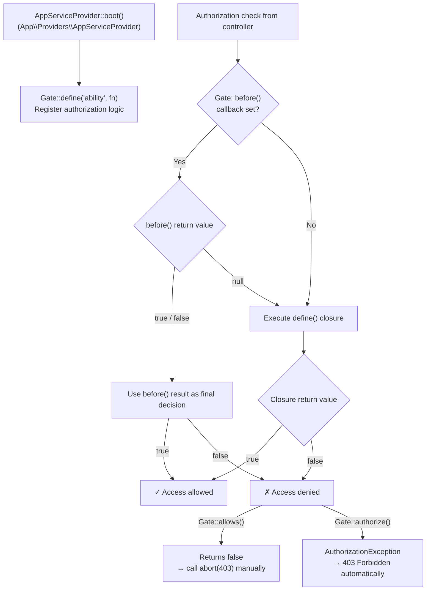
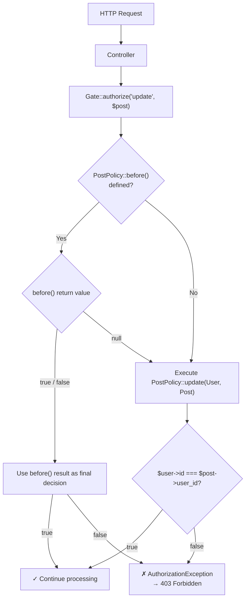
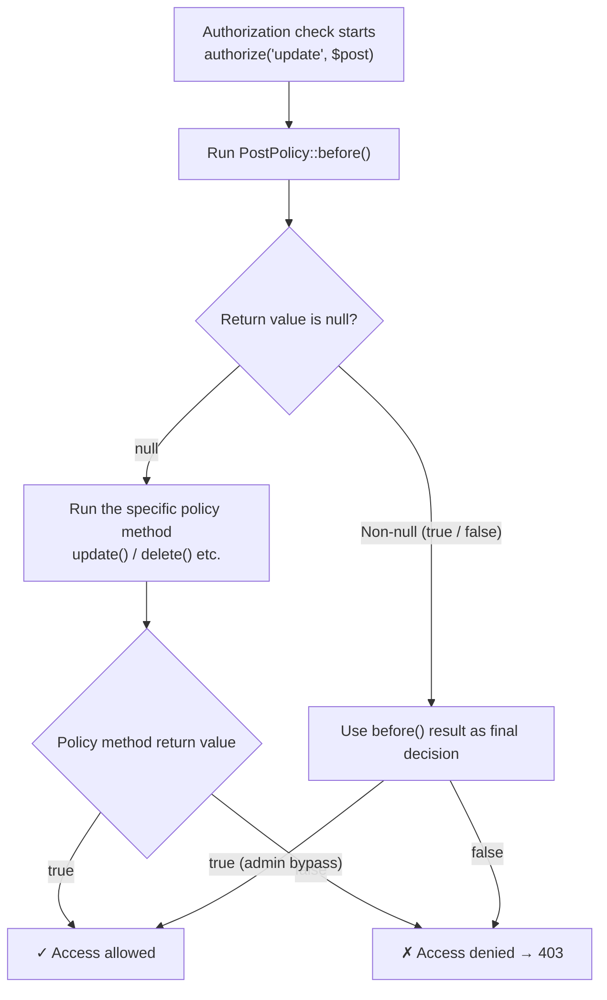

## Gates vs. policies

Laravel provides two primary tools for authorization: **gates** and **policies**.

- **Gates** are closures. Use them for simple checks that aren't tied to a specific model, such as "can this user access the admin dashboard?"
- **Policies** are classes. Use them to group authorization logic around a particular model or resource.

Most applications use both. Gates handle broad, model-independent checks; policies handle per-resource rules.

## Gates

### Gate authorization flow



### Defining gates

Define gates inside the `boot` method of `App\Providers\AppServiceProvider` using the `Gate` facade. Gates receive the authenticated user as their first argument, plus any additional arguments you pass:

```php
use App\Models\Post;
use App\Models\User;
use Illuminate\Support\Facades\Gate;

/**
 * Bootstrap any application services.
 */
public function boot(): void
{
    Gate::define('update-post', function (User $user, Post $post) {
        return $user->id === $post->user_id;
    });
}
```

### Checking gates

Call `Gate::allows` or `Gate::denies` in a controller to guard an action:

```php
<?php

namespace App\Http\Controllers;

use App\Models\Post;
use Illuminate\Http\RedirectResponse;
use Illuminate\Http\Request;
use Illuminate\Support\Facades\Gate;

class PostController extends Controller
{
    /**
     * Update the given post.
     */
    public function update(Request $request, Post $post): RedirectResponse
    {
        if (! Gate::allows('update-post', $post)) {
            abort(403);
        }

        // Update the post...

        return redirect('/posts');
    }
}
```

To throw an exception automatically instead of calling `abort`, use `Gate::authorize`:

```php
Gate::authorize('update-post', $post);

// Continues if authorized, throws AuthorizationException if not...
```

### Gate responses

Return a detailed `Response` from a gate instead of a boolean to include an error message:

```php
use App\Models\User;
use Illuminate\Auth\Access\Response;
use Illuminate\Support\Facades\Gate;

Gate::define('edit-settings', function (User $user) {
    return $user->isAdmin
        ? Response::allow()
        : Response::deny('You must be an administrator.');
});
```

Inspect the full response with `Gate::inspect`:

```php
$response = Gate::inspect('edit-settings');

if ($response->allowed()) {
    // Authorized...
} else {
    echo $response->message();
}
```

## Policies

### Policy authorization flow



### Generating policies

Create a policy class with Artisan:

```shell
php artisan make:policy PostPolicy --model=Post
```

Policy classes live in `app/Policies`. The `--model` flag pre-fills CRUD method stubs.

### Auto-discovery

Laravel automatically discovers policies by convention. A model at `App\Models\Post` is paired with a policy at `App\Policies\PostPolicy`. To register a policy explicitly, call `Gate::policy` inside `AppServiceProvider::boot`:

```php
use App\Models\Post;
use App\Policies\PostPolicy;
use Illuminate\Support\Facades\Gate;

Gate::policy(Post::class, PostPolicy::class);
```

### Writing policy methods

Each method receives the authenticated user and, usually, the model instance. Return a boolean (or a `Response`) to allow or deny:

```php
<?php

namespace App\Policies;

use App\Models\Post;
use App\Models\User;

class PostPolicy
{
    /**
     * Determine whether the user can update the post.
     */
    public function update(User $user, Post $post): bool
    {
        return $user->id === $post->user_id;
    }

    /**
     * Determine whether the user can delete the post.
     */
    public function delete(User $user, Post $post): bool
    {
        return $user->id === $post->user_id;
    }
}
```

### Policy responses

Return a `Response` to attach a custom message to a denial:

```php
use App\Models\Post;
use App\Models\User;
use Illuminate\Auth\Access\Response;

public function update(User $user, Post $post): Response
{
    return $user->id === $post->user_id
        ? Response::allow()
        : Response::deny('You do not own this post.');
}
```

### Actions without a model instance

Some policy methods, like `create`, don't operate on an existing model. Define them with only the user argument:

```php
/**
 * Determine whether the user can create posts.
 */
public function create(User $user): bool
{
    return $user->role === 'author';
}
```

### Guest users

By default, gates and policies return `false` for unauthenticated users. To allow guests through to the policy, mark the user argument as nullable:

```php
public function update(?User $user, Post $post): bool
{
    return $user?->id === $post->user_id;
}
```

### Policy filters

To give a user unrestricted access before any other checks run, define a `before` method on the policy:

```php
public function before(User $user, string $ability): bool|null
{
    if ($user->isAdministrator()) {
        return true;
    }

    return null; // Fall through to the specific policy method
}
```

Returning `null` from `before` delegates to the specific policy method.

### Before callback execution order



## Authorizing actions using policies

### Via the user model

The `User` model exposes `can` and `cannot` methods. Pass the ability and the model instance:

```php
if ($request->user()->can('update', $post)) {
    // Authorized...
}

if ($request->user()->cannot('delete', $post)) {
    abort(403);
}
```

For actions without a model instance (like `create`), pass the policy class instead:

```php
if ($request->user()->can('create', Post::class)) {
    // ...
}
```

### Via the Gate facade

```php
use Illuminate\Support\Facades\Gate;

if (Gate::allows('update', $post)) {
    // ...
}

Gate::authorize('update', $post); // Throws on denial
```

### Via middleware

Use the `can` middleware to guard routes:

```php
use App\Models\Post;

Route::put('/posts/{post}', function (Post $post) {
    // The current user may update the post...
})->middleware('can:update,post');
```

For actions without a model instance:

```php
Route::post('/posts', function () {
    // The current user may create posts...
})->middleware('can:create,App\Models\Post');
```

### Via Blade templates

Use `@can`, `@cannot`, and `@canany` directives in Blade views:

```blade
@can('update', $post)
    <a href="{{ route('posts.edit', $post) }}">Edit</a>
@endcan

@cannot('delete', $post)
    <p>You cannot delete this post.</p>
@endcannot

@canany(['update', 'delete'], $post)
    <div class="post-actions">...</div>
@endcanany
```

## A complete example

<Steps>
  <Step title="Generate the policy">
    ```shell
    php artisan make:policy PostPolicy --model=Post
    ```
  </Step>

  <Step title="Define authorization rules">
    ```php
    <?php

    namespace App\Policies;

    use App\Models\Post;
    use App\Models\User;

    class PostPolicy
    {
        public function create(User $user): bool
        {
            return $user->role === 'author';
        }

        public function update(User $user, Post $post): bool
        {
            return $user->id === $post->user_id;
        }

        public function delete(User $user, Post $post): bool
        {
            return $user->id === $post->user_id || $user->isAdmin();
        }
    }
    ```
  </Step>

  <Step title="Protect the controller">
    ```php
    <?php

    namespace App\Http\Controllers;

    use App\Models\Post;
    use Illuminate\Http\Request;
    use Illuminate\Http\RedirectResponse;

    class PostController extends Controller
    {
        public function store(Request $request): RedirectResponse
        {
            $this->authorize('create', Post::class);

            $post = Post::create($request->validated());

            return redirect()->route('posts.show', $post);
        }

        public function update(Request $request, Post $post): RedirectResponse
        {
            $this->authorize('update', $post);

            $post->update($request->validated());

            return redirect()->route('posts.show', $post);
        }

        public function destroy(Post $post): RedirectResponse
        {
            $this->authorize('delete', $post);

            $post->delete();

            return redirect()->route('posts.index');
        }
    }
    ```
  </Step>

  <Step title="Protect views">
    ```blade
    @can('update', $post)
        <a href="{{ route('posts.edit', $post) }}">Edit</a>
    @endcan

    @can('delete', $post)
        <form method="POST" action="{{ route('posts.destroy', $post) }}">
            @csrf
            @method('DELETE')
            <button type="submit">Delete</button>
        </form>
    @endcan
    ```
  </Step>
</Steps>

<Tip>
  The `$this->authorize` method in a controller automatically throws an `AuthorizationException` (HTTP 403) if the check fails. You don't need to call `abort(403)` manually.
</Tip>
