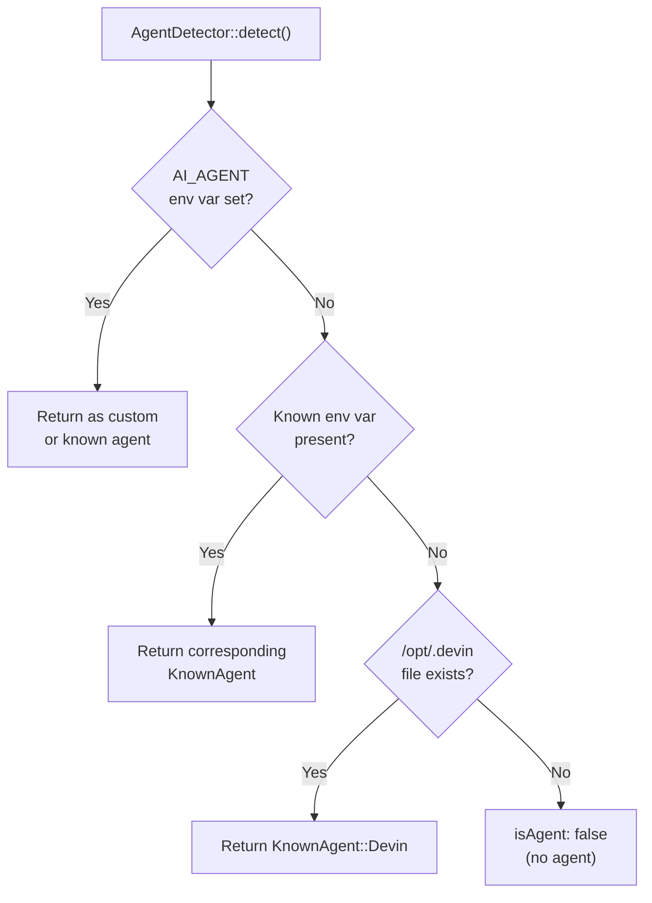

## Introduction

[laravel/agent-detector](https://github.com/laravel/agent-detector) is a lightweight PHP utility that detects whether your code is running inside an AI agent or an automated development environment. It was published as an official Laravel package in January 2026.

As AI agents become deeply integrated into modern development workflows, knowing which environment your code is running in becomes increasingly valuable. Real-world use cases include adjusting log verbosity, applying different rate limits, or returning agent-specific responses depending on whether the caller is a human or an AI agent.



## Installation

```bash
composer require laravel/agent-detector
```

Requires PHP 8.2 or higher.

## Basic Usage

Call `AgentDetector::detect()` to receive an `AgentResult` object.

```php
use Laravel\AgentDetector\AgentDetector;
use Laravel\AgentDetector\KnownAgent;

$result = AgentDetector::detect();

if ($result->isAgent) {
    echo "Running inside: {$result->name}";
}

// Check for a specific known agent
if ($result->knownAgent() === KnownAgent::Claude) {
    echo "Hello from Claude!";
}
```

You can also use the standalone function:

```php
use function Laravel\AgentDetector\detectAgent;

$result = detectAgent();
```

### AgentResult properties

| Property / Method | Type | Description |
|-------------------|------|-------------|
| `$result->isAgent` | `bool` | `true` when running inside an AI agent |
| `$result->name` | `?string` | Agent name (e.g. `"claude"`). `null` when not an agent |
| `$result->knownAgent()` | `?KnownAgent` | Returns the matching `KnownAgent` enum case, or `null` for unknown agents |

## Supported Agents

| Agent | Detection method (env var / filesystem) |
|-------|----------------------------------------|
| Custom | `AI_AGENT` env var (any value) |
| GitHub Copilot | `AI_AGENT=github-copilot`, `AI_AGENT=github-copilot-cli`, `COPILOT_MODEL`, `COPILOT_ALLOW_ALL`, `COPILOT_GITHUB_TOKEN`, `COPILOT_CLI` |
| Cursor | `CURSOR_AGENT` |
| Claude | `CLAUDECODE` or `CLAUDE_CODE` |
| Cowork | `CLAUDE_CODE_IS_COWORK` (together with `CLAUDECODE` or `CLAUDE_CODE`) |
| Gemini | `GEMINI_CLI` |
| Codex | `CODEX_SANDBOX`, `CODEX_CI`, or `CODEX_THREAD_ID` |
| Augment CLI | `AUGMENT_AGENT` |
| AMP | `AMP_CURRENT_THREAD_ID` |
| Opencode | `OPENCODE_CLIENT` or `OPENCODE` |
| Replit | `REPL_ID` |
| Devin | `/opt/.devin` file exists |
| Antigravity | `ANTIGRAVITY_AGENT` |
| Pi | `PI_CODING_AGENT` |
| Kiro CLI | `KIRO_AGENT_PATH` |
| v0 | `AI_AGENT=v0` |

Detection priority is: `AI_AGENT` env var → known env vars → filesystem check.

## Custom Agent Configuration

Set the `AI_AGENT` environment variable to any value to identify a custom agent:

```bash
AI_AGENT=my-custom-agent php your-script.php
```

```php
$result = AgentDetector::detect();

// $result->isAgent === true
// $result->name    === 'my-custom-agent'
// $result->knownAgent() === null (unknown agent)
```

## Practical Use Cases

### Detecting AI agents in middleware

Determine the execution context in a Laravel middleware and branch logic accordingly:

```php
<?php

namespace App\Http\Middleware;

use Closure;
use Illuminate\Http\Request;
use Laravel\AgentDetector\AgentDetector;

class DetectAiAgent
{
    public function handle(Request $request, Closure $next): mixed
    {
        $agent = AgentDetector::detect();

        if ($agent->isAgent) {
            // Store the agent name as a request attribute
            $request->attributes->set('ai_agent', $agent->name);
        }

        return $next($request);
    }
}
```

### Verbose logging for AI agent environments

```php
use Laravel\AgentDetector\AgentDetector;
use Illuminate\Support\Facades\Log;

$agent = AgentDetector::detect();

if ($agent->isAgent) {
    Log::withContext(['ai_agent' => $agent->name])
        ->debug('Agent request received', $request->all());
} else {
    Log::info('User request received');
}
```

### Applying different rate limits for AI agents

Use agent detection to apply stricter rate limits for automated requests:

```php
<?php

namespace App\Http\Middleware;

use Closure;
use Illuminate\Http\Request;
use Illuminate\Routing\Middleware\ThrottleRequests;
use Laravel\AgentDetector\AgentDetector;

class ThrottleByAiAgent
{
    public function handle(Request $request, Closure $next): mixed
    {
        $agent = AgentDetector::detect();

        // AI agents: 10 requests per minute; humans: 60
        $maxAttempts = $agent->isAgent ? 10 : 60;

        return app(ThrottleRequests::class)->handle(
            $request,
            $next,
            $maxAttempts,
        );
    }
}
```

### Switching behaviour in console commands

Output verbose progress when an Artisan command is executed by an agent:

```php
use Laravel\AgentDetector\AgentDetector;

public function handle(): void
{
    $agent = AgentDetector::detect();

    if ($agent->isAgent) {
        $this->info("Running in {$agent->name} environment — verbose mode enabled.");
    }

    // Processing...
}
```

## Summary

`laravel/agent-detector` wraps a set of straightforward environment variable checks and a filesystem check into a clean, zero-configuration API. A single call to `AgentDetector::detect()` is all you need.

As AI agents become a standard part of development workflows, understanding who — or what — is executing your code will only grow in importance. From logging and rate limiting to customised responses, this package provides the foundation for making your Laravel application agent-aware.

<Card title="laravel/agent-detector repository" icon="github" href="https://github.com/laravel/agent-detector">
  Source code and the latest list of supported agents.
</Card>
