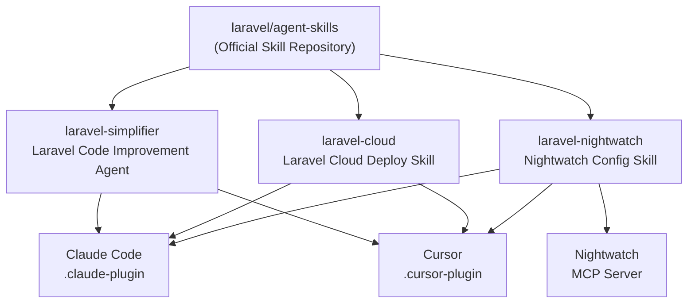

<Info>
  `laravel/agent-skills` is an actively developed repository as of April 2026. The current plugin version is `1.0.0`, but additions and changes are expected going forward.
</Info>

## What is laravel/agent-skills?

[laravel/agent-skills](https://github.com/laravel/agent-skills) is a collection of AI agent skills and plugins officially managed by Laravel. Taylor Otwell himself is listed as the author, and it is being developed as an official Laravel marketplace.

The repository started as a place to host Claude Code skills, but was later renamed to `agent-skills` and expanded to provide plugins for both **Claude Code** and **Cursor**.

This skill set enables AI agents to understand Laravel best practices and autonomously operate official services like Laravel Cloud and Nightwatch when building Laravel applications with AI assistance.



## Repository Structure

The repository is organized into directories per skill (plugin), and each directory contains configuration files for both Claude Code and Cursor.

```
laravel/agent-skills/
├── laravel/                      # Laravel code improvement agent
│   ├── .claude-plugin/
│   │   └── plugin.json           # Claude Code plugin definition
│   ├── .cursor-plugin/
│   │   └── plugin.json           # Cursor plugin definition
│   └── agents/
│       └── laravel-simplifier.md # Agent system prompt
├── laravel-cloud/                # Laravel Cloud deploy skill
│   ├── .claude-plugin/
│   │   └── plugin.json
│   ├── .cursor-plugin/
│   │   └── plugin.json
│   └── skills/
│       └── deploying-laravel-cloud/
└── laravel-nightwatch/           # Laravel Nightwatch config skill
    ├── .claude-plugin/
    │   └── plugin.json
    ├── .cursor-plugin/
    │   └── plugin.json
    ├── .mcp.json                 # Nightwatch MCP server config
    └── skills/
        └── configure-nightwatch/
```

## Available Plugins

### laravel — Code Quality Improvement Agent

**laravel-simplifier** is an agent that reviews recently changed PHP/Laravel code and improves its clarity, consistency, and maintainability without altering functionality. It lives in the `laravel/` directory in the repository, and is specified as `laravel-simplifier@laravel` when installing.

Key capabilities:

- Applying Laravel conventions and PSR-12 standards
- Reducing unnecessary complexity and nesting
- Improving variable and function name readability
- Consolidating related logic
- Using `match` expressions to clarify conditional branches

By default, the agent only targets "recently changed code." Invoke it at the end of a coding session and it will automatically identify the changed areas and suggest refactoring.

```
> Review recent changes using the laravel-simplifier agent
```

### laravel-cloud — Deploy and Infrastructure Management Skill

**laravel-cloud** is a skill that assists with deployments and resource management on [Laravel Cloud](https://cloud.laravel.com). It has deep knowledge of `cloud` CLI command patterns and guides you through the deployment process step by step.

Key capabilities:

- Guiding initial deployments and existing app deployment workflows
- Managing infrastructure resources: databases, cache, domains, buckets, and more
- Operation checklists for multi-step tasks
- Operations aligned with Cloud CLI CRUD command patterns

```
> Deploy my app to Laravel Cloud
> Set up a database and cache for the staging environment
```

### laravel-nightwatch — Monitoring Configuration Skill

**laravel-nightwatch** is a skill that assists with configuring data collection, sampling rates, filtering rules, and redaction policies for [Laravel Nightwatch](https://nightwatch.laravel.com).

It also bundles a **Nightwatch MCP server**, allowing AI agents to directly view and interact with Nightwatch issues.

| Feature | Description |
|---------|-------------|
| Setup & Configuration | Guides you through setting up Nightwatch in your app |
| Sampling & Filtering | Control data volume with rule configuration |
| PII Redaction | Redaction policies to protect sensitive data |
| Event Optimization | Optimize event collection for production environments |
| MCP Integration | View issues, check stack traces, update status, add comments |

```
> Configure Nightwatch sampling rates for production
> Set up PII redaction for Nightwatch
```

## Installation

### Claude Code

Install using Claude Code's marketplace feature:

```bash
# Add the marketplace
/plugin marketplace add laravel/agent-skills

# Install individual plugins
/plugin install laravel-simplifier@laravel
/plugin install laravel-cloud@laravel
/plugin install laravel-nightwatch@laravel
```

<Tip>
  You can install only the plugins you need. You don't have to install all of them.
</Tip>

### Cursor

For Cursor, search for **Laravel** in the plugin marketplace panel and install from there.

<Steps>
  <Step title="Open Cursor">
    Open the "Plugins" panel from the Cursor sidebar or settings.
  </Step>
  <Step title="Search for Laravel">
    Type "**Laravel**" in the search bar.
  </Step>
  <Step title="Install the plugins you need">
    Install whichever of `laravel`, `laravel-cloud`, and `laravel-nightwatch` you want.
  </Step>
</Steps>

## Usage Examples

### Automate Code Review with laravel-simplifier

Invoke it at the end of a coding session to automatically refine the code you've written to align with Laravel best practices:

```
> Review recent changes using the laravel-simplifier agent
```

The agent works autonomously, identifies the changed files, and presents improvement suggestions. Unless explicitly told otherwise, it only targets recently changed code.

### Deploy to Laravel Cloud

Give deployment instructions in natural language. The agent will combine the appropriate `cloud` CLI commands and execute them:

```
> Deploy my app to Laravel Cloud
> Set up a database and cache for the staging environment
> Add a custom domain to my production environment
```

### Investigate Issues with Nightwatch

Because the Nightwatch MCP server is integrated, you can ask the AI to investigate issues directly:

```
> Show me the latest errors in Nightwatch
> What's the stack trace for issue #42?
> Mark issue #42 as resolved
```

## How Plugins Work

Each plugin is defined in `.claude-plugin/plugin.json` or `.cursor-plugin/plugin.json`. Agent definitions (`.md` files) contain system prompts that specify in detail how the AI should behave.

A portion of the laravel-simplifier prompt:

```
You are an expert PHP/Laravel code simplification specialist focused on 
enhancing code clarity, consistency, and maintainability while preserving 
exact functionality...
```

Skills provide the AI with additional knowledge in the form of context files (Markdown documents). For example, the laravel-cloud skill contains detailed instructions and caveats for Cloud CLI operations, guiding the AI to avoid executing deployments incorrectly.

## Future Outlook

The `laravel/agent-skills` repository is being built out as an **official marketplace of AI skills covering the entire Laravel ecosystem**.

Currently, three plugins are available — Laravel, Laravel Cloud, and Laravel Nightwatch — but the following expansions are expected:

- Support for other official Laravel packages (Forge, Vapor, Cashier, Sanctum, etc.)
- Support for AI tools beyond Claude Code and Cursor, such as GitHub Copilot
- Addition of community-contributed third-party skills (marketplace model)

As AI-assisted development becomes a standard workflow, the Laravel team's official provision and management of AI skills is poised to significantly raise the quality bar across the entire ecosystem.

<Card title="laravel/agent-skills Repository" icon="github" href="https://github.com/laravel/agent-skills">
  For full details and installation instructions, see the official repository README.
</Card>

<Card title="Laravel Cloud" icon="cloud" href="https://cloud.laravel.com">
  The official Laravel hosting service that pairs with the laravel-cloud skill.
</Card>

<Card title="Laravel Nightwatch" icon="eye" href="https://nightwatch.laravel.com">
  The official Laravel error monitoring service that pairs with the laravel-nightwatch skill.
</Card>
