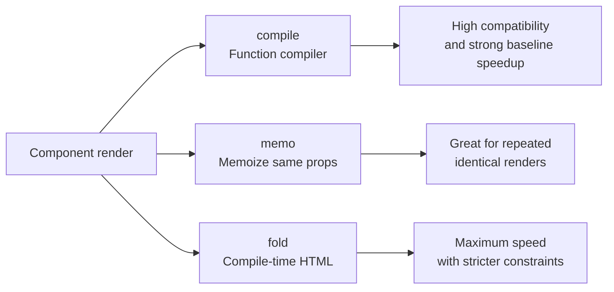

<Info>
  This article is based on the official [livewire/blaze](https://github.com/livewire/blaze) README. At the moment, Blaze does not have a dedicated page on laravel.com docs.
</Info>

## What is Blaze?

[Blaze](https://github.com/livewire/blaze) is an official Livewire package for speeding up Blade component rendering. It targets not only Livewire-related usage, but also regular anonymous Blade components.

The README benchmark for 25,000 anonymous component renders reports **500ms → 13ms** (about **97.4% reduction**). Across different scenarios, the reported reduction is around 91–97%.

## Three optimization strategies

Blaze provides three strategies: `compile` (default), `memo`, and `fold`.



### How to choose

| Strategy | Choose it when | Benefits | Trade-offs |
|---|---|---|---|
| `compile` | You want the default safe starting point | Broad compatibility and major speedups | You still need to verify Blaze limitations |
| `memo` | You render the same component with the same props repeatedly (icons, badges) | Cuts repeated runtime work after first render | Does not work with components that have slots |
| `fold` | You want the highest performance on mostly static UI | Removes almost all runtime overhead | Dynamic/global-state usage can cause subtle bugs |

If you are unsure, start with **`compile`**, profile real bottlenecks, then selectively apply `memo` or `fold`.

## Installation and activation

```bash
composer require livewire/blaze:^1.0
```

You can enable Blaze in two ways.

### 1) Add `@blaze` to individual components

```blade
@blaze

<button {{ $attributes }}>
    {{ $slot }}
</button>
```

Enable specific strategies when needed:

```blade
@blaze(memo: true)
@blaze(fold: true)
```

### 2) Use `Blaze::optimize()` for directory-level activation

```php
use Livewire\Blaze\Blaze;

public function boot(): void
{
    Blaze::optimize()
        ->in(resource_path('views/components'));
}
```

After activation, clear compiled views:

```bash
php artisan view:clear
```

<Tip>
  `@blaze` is useful for incremental trials. `Blaze::optimize()` is better for broader rollout. The README recommends starting with limited directories and expanding gradually.
</Tip>

## Limitations

These limitations are explicitly listed in the README:

- Class-based components are not supported
- The `$component` variable is not available
- View composers / creators / lifecycle events do not fire
- Auto-injected `View::share()` variables are not supported (use `$__env->shared('key')` manually)
- Cross-boundary `@aware` between Blade and Blaze has constraints (both parent and child need Blaze)
- Rendering Blaze components through `view()` does not work (use component tags)

## Compatibility with Flux UI

The Blaze README states that when you use [Flux UI](https://fluxui.dev/docs/installation), **installing Blaze is enough** and no extra configuration is required.

## How Blaze gets its speed

In standard Blade rendering, each component render goes through Blade's normal pipeline, including component resolution and attribute handling. Blaze `compile` converts templates into optimized PHP functions and calls them directly, which removes most pipeline overhead.

Conceptually, the README describes this difference:

- Standard Blade: full rendering pipeline each time
- Blaze `compile`: direct call to compiled functions
- Blaze `fold`: embeds HTML at compile time to remove even more runtime work

`fold` can deliver the best performance, but you need to be careful with authentication/request/session/time-dependent logic and other global state patterns. Apply it selectively with profiling and behavior checks.
