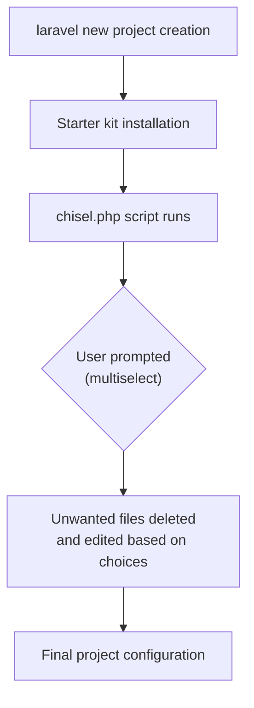
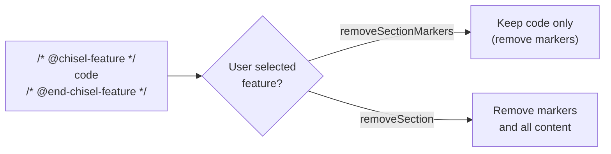

<Info>
  This article is based on source code research. Laravel Chisel is in early development with its v0.1 tag released in May 2026.
</Info>

## What is Laravel Chisel?

[Laravel Chisel](https://github.com/laravel/chisel) provides primitives for building **post-install scripts** that remove unwanted features from Laravel starter kits. Compatible starter kits include a `chisel.php` script that defines the optional features and the file mutations needed to remove them.

Starter kits come bundled with many features, but not every project needs all of them. Chisel solves this by providing a way to interactively configure your project after installation — keeping only the features you need.



## Why Is It Needed?

Laravel starter kits bundle many features together, but not all features are needed in every project. For example:

- Projects that don't need email verification
- Projects that don't use passkey authentication
- Configurations that don't need certain Livewire components

Previously, developers had to manually remove unwanted features. With Chisel, **customization is handled through interactive prompts at install time**.

## Defining a chisel.php Script

Starter kits that use Chisel place a `chisel.php` file at the project root. This file defines which features are optional.

```php
<?php

require getenv('LARAVEL_INSTALLER_AUTOLOADER');

use Laravel\Chisel\Chisel;
use Laravel\Chisel\Question;

return Chisel::script(dirname(__DIR__))
    ->questions([
        Question::multiselect(
            name: 'auth_features',
            label: 'Which authentication features would you like to enable?',
            options: [
                'email-verification' => 'Email verification',
            ],
            hint: 'Use space to select, enter to confirm.',
        ),
    ])
    ->selected('auth_features', 'email-verification',
        then: function (Chisel $c) {
            // Selected: keep the code, just remove the markers
            $c->files(
                'resources/js/pages/settings/profile.tsx',
                'app/Providers/FortifyServiceProvider.php',
            )->removeSectionMarkers('email-verification');
        },
        else: function (Chisel $c) {
            // Not selected: remove all related files and features
            $c->php('app/Models/User.php')
                ->removeImport('Illuminate\Contracts\Auth\MustVerifyEmail')
                ->removeInterface('MustVerifyEmail');

            $c->file('config/fortify.php')->removeLinesContaining('Features::emailVerification()');

            $c->files(
                'app/Providers/FortifyServiceProvider.php',
                'resources/js/pages/settings/profile.tsx',
            )->removeSection('email-verification');

            $c->files(
                'resources/js/components/email-verification-notice.tsx',
                'resources/js/pages/auth/verify-email.tsx',
                'tests/Feature/Auth/EmailVerificationTest.php',
                'tests/Feature/Auth/VerificationNotificationTest.php',
            )->delete();
        },
    );
```

## Script Definition Methods

| Method | Purpose |
|--------|---------|
| `Chisel::script($directory)` | Create a script definition |
| `Question::multiselect(...)` | Define a multiselect question |
| `questions([...])` | Set the script's questions |
| `questions()` | Retrieve the registered questions |
| `collectAnswers()` | Begin collecting answers for registered questions |
| `apply($callback)` | Register an unconditional mutation step |
| `selected($key, $value, then:, else:)` | Branch on a multiselect answer |
| `selectedAny($key, $values, then:, else:)` | Branch when any of the given values are selected |
| `selectedAll($key, $values, then:, else:)` | Branch when all of the given values are selected |
| `chisel($answers)` | Execute the registered mutations |

## Collecting Answers

`collectAnswers()` returns a pending answer collector. All methods are fluent and can be called in any order. When non-interactive, defaults are used automatically.

An external Artisan command uses [Laravel Prompts](https://laravel.com/docs/prompts) to display the prompts and pass the answers to Chisel.

```php
use Illuminate\Console\Command;
use Laravel\Chisel\Chisel;
use Laravel\Chisel\Question;
use RuntimeException;

use function Laravel\Prompts\multiselect;

class InstallFeatures extends Command
{
    protected $signature = 'install:features
        {--answers= : JSON string of answers to skip interactive prompts}';

    public function handle(): void
    {
        $script = require base_path('chisel.php');

        $providedAnswers = $this->option('answers') === null
            ? []
            : json_decode((string) $this->option('answers'), true, 512, JSON_THROW_ON_ERROR);

        $answers = $script
            ->collectAnswers()
            ->onQuestion(fn (Question $question) => match ($question->type) {
                'multiselect' => multiselect(
                    label: $question->label,
                    options: $question->options,
                    default: $question->default ?? [],
                    required: $question->required,
                    hint: $question->hint,
                ),
                default => throw new RuntimeException("Unsupported question type [{$question->type}]."),
            })
            ->interactive($this->input->isInteractive())
            ->withAnswers($providedAnswers);

        $script->chisel($answers);

        $chisel = Chisel::in(base_path());

        $chisel->npm()->install();
        $chisel->npm()->run('build');
    }
}
```

| Method | Purpose |
|--------|---------|
| `onQuestion($callback)` | Handle question prompts |
| `interactive($interactive)` | Configure whether missing answers are prompted interactively |
| `withAnswers($answers)` | Provide pre-collected answers to skip prompting |

## File Mutations

`file($path)` targets a single file. `files(...$paths)` targets multiple files.

| Method | Purpose |
|--------|---------|
| `replace($search, $replace)` | Replace a string |
| `removeLinesContaining($content)` | Remove lines containing a string |
| `removeSectionMarkers($tag)` | Strip section markers, keep the content |
| `removeSection($tag)` | Remove section markers and the content inside them |
| `delete()` | Delete the targeted files |

## PHP AST-Based Mutations

`php($path)` provides AST-based edits. Changes are saved automatically when the object is destroyed.

| Method | Purpose |
|--------|---------|
| `removeImport($class)` | Remove a `use` statement |
| `removeTrait($trait)` | Remove a trait usage from the class |
| `removeInterface($interface)` | Remove an implemented interface |

## Section Markers

Wrap optional code in comment pairs:

```php
/* @chisel-passkeys */
Fortify::authenticateUsingPasskeys();
/* @end-chisel-passkeys */
```

JSX files may use block comments with braces:

```tsx
{
    /* @chisel-passkeys */
}
<PasskeyButton />;
{
    /* @end-chisel-passkeys */
}
```

- `removeSectionMarkers('passkeys')` — removes the markers, keeps the code
- `removeSection('passkeys')` — removes both the markers and the content

The `chisel-` marker prefix is added automatically.



## npm Support

| Method | Purpose |
|--------|---------|
| `npm()->install()` | Install dependencies using the detected package manager |
| `npm()->run($script, ...$arguments)` | Run a package manager script |
| `npm()->remove(...$packages)` | Remove packages using the detected package manager |

The `npm()` method detects npm, yarn, pnpm, and bun automatically.

## Current Status

- **GitHub Repository**: [laravel/chisel](https://github.com/laravel/chisel)
- **Release**: v0.1 (published May 2026)
- **Development history**: 3 months of private development before public release

Chisel is not a package for end users to install directly in their Laravel apps — it is a **library used internally by starter kits**. In the future, Laravel's official starter kits are expected to ship with Chisel-powered post-install scripts.

<Card title="laravel/chisel Repository" icon="github" href="https://github.com/laravel/chisel">
  Source code and the latest API reference.
</Card>

<Card title="Laravel Starter Kits Official Documentation" icon="book-open" href="https://laravel.com/docs/starter-kits">
  For how to use the starter kits themselves, refer to the official documentation.
</Card>
