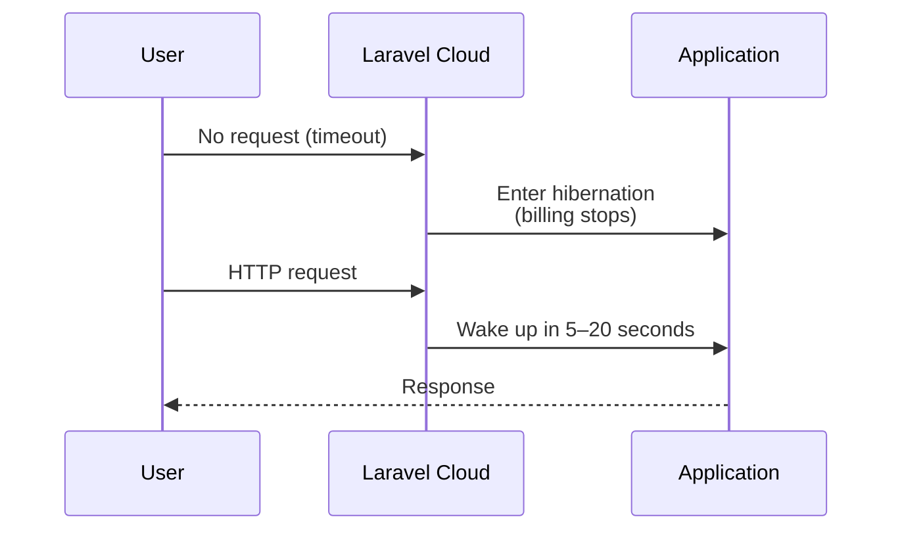

## What is hibernation

Laravel Cloud **hibernation** is the legacy behavior that puts your environment into a dormant state when no HTTP requests arrive within a timeout window.  
On modern Flex compute, this has been succeeded by the faster **Scale to Zero** model.

Legacy Flex hibernation can still reduce compute cost while dormant, but wake-up from HTTP requests typically takes 5–20 seconds. The new Scale to Zero starts in **under 500ms** and can also auto-start for scheduled tasks and queue processing while the app is sleeping.

<Warning>
  For new Laravel Cloud projects, treat **Scale to Zero** as the safer default instead of legacy hibernation. For the full picture with Managed Queues and current pricing, see [Laravel Cloud — A practical guide to Laravel's dedicated PaaS](/en/blog/laravel-cloud).
</Warning>



## What changed with Scale to Zero

With Scale to Zero on new Flex compute, major limitations of legacy hibernation are now reduced.

| Category | Legacy Hibernation | New Scale to Zero |
|---|---|---|
| Wake-up on HTTP request | 5–20 seconds | Under 500ms |
| Scheduled Tasks | Not executed while sleeping | Auto-starts and executes while sleeping |
| Queue processing | Not executed while sleeping | Auto-starts while sleeping. Managed Queues are recommended |
| Recommended use | Cost-saving in legacy Flex setups | Current default architecture |

<Info>
  Legacy hibernation pauses scheduler and queue processing while asleep. Scale to Zero resolves this in most cases; queue processing is most reliable when combined with Managed Queues to ensure app sleep does not block job handling.
</Info>

## Enabling legacy hibernation

<Steps>
  <Step title="Open the App compute cluster">
    From your environment's infrastructure canvas dashboard, click on the App compute cluster.
  </Step>
  <Step title="Enable the Hibernation toggle">
    Turn on the **Hibernation** toggle.
  </Step>
  <Step title="Save and redeploy">
    Click **Save and Redeploy** to apply the change.

    <Warning>
      Changing the toggle alone does not activate hibernation. A Save and Redeploy is required.
    </Warning>
  </Step>
</Steps>

<Tip>
  For newly enabled environments, use the App cluster **Scale to Zero** toggle instead. The limitations below primarily describe legacy hibernation behavior.
</Tip>

## Limitations during legacy hibernation

When hibernation is enabled and the environment is hibernating, the following features do not run.

| Feature | Behavior while hibernating |
|---|---|
| HTTP request handling | Stopped (processed after wake-up) |
| Task Scheduler | Not executed |
| Queue workers | Not executed |
| Custom background processes | Not executed |

<Info>
  These processes resume automatically after the environment wakes up. Scheduled jobs that were due while the environment was hibernating are not retroactively executed.
</Info>

Hibernation also has these constraints:

- Only **Flex compute** sizes support hibernation. Pro compute sizes cannot hibernate.
- Hibernation operates at the **environment level**. When an environment hibernates, all compute clusters in that environment hibernate, including Worker clusters.

## Common causes of unwanted wake-ups

Any HTTP request will wake the environment, including those you did not intend to trigger:

- **Bots and crawlers** — Search engines and security scanners automatically crawl pages.
- **Slack and Teams link previews** — Messaging apps fetch page metadata when a URL is shared.
- **WordPress scanners** — Automated scripts probe paths like `/wp-admin` looking for WordPress installations.
- **PHP file probing** — Automated attacks scan for accessible PHP files.

Laravel Cloud's `*.laravel.cloud` domains have an `X-Robots-Tag: noindex, nofollow` header to reduce indexing, but once a domain is discovered, this cannot fully prevent automated requests. Custom domains do not receive the `noindex` header.

<Tip>
  Using a less predictable domain name reduces the chance of bots discovering your vanity domain.
</Tip>

## Path Blocking to prevent unwanted wake-ups

**Path Blocking** lets Laravel Cloud block requests to specific file extensions and paths while the environment is hibernating, so those requests do not trigger a wake-up.

The following extensions and paths are blocked by default:

**Blocked extensions:**

```
.php, .php3, .php4, .php5, .php6, .php7, .php8,
.phtml, .pht, .phps, .env, .git
```

**Blocked paths:**

```
/wp-admin, /wp-content, /wp-includes, /wp-json
```

Requests matching these patterns receive a response without waking the environment.

<Info>
  Laravel applications do not use `.php` extension-based routing, so blocking these extensions has no impact on normal application behavior.
</Info>

## Good fit vs. poor fit for legacy hibernation

<Columns cols={2}>
  <Card title="Good fit" icon="check">
    - **Staging and development environments** — Significant cost reduction since 24/7 uptime is not required.
    - **Personal blogs and portfolios** — Low traffic and occasional access.
    - **Demo or proof-of-concept apps** — On-demand wake-up is sufficient.
    - **Low-frequency internal tools** — Limited usage windows.
  </Card>
  <Card title="Poor fit" icon="xmark">
    - **Workloads relying on Task Scheduler** — `schedule:run` does not execute while hibernating.
    - **Workloads requiring regular queue processing** — Queue workers stop during hibernation.
    - **Production apps with strict latency requirements** — 5–20 second wake-up time may be unacceptable.
    - **Apps using WebSockets** — Connections cannot be maintained and hibernation may be delayed.
  </Card>
</Columns>

<Warning>
  If your application depends on scheduled tasks running reliably (email delivery, data aggregation, etc.), enabling hibernation will break those tasks. Either keep hibernation disabled, or use an external scheduler (such as GitHub Actions) to send periodic requests and keep the environment running.
</Warning>

<Info>
  In Scale to Zero, this is largely improved: Scheduled Tasks can auto-run while sleeping, and queue workloads can continue reliably when you use Managed Queues.
</Info>

## Summary

Hibernation can still reduce costs on legacy Flex setups, but Scale to Zero is now the practical default.

- Legacy Flex bills by active runtime and enters sleep after timeout.
- Legacy hibernation wake-up takes 5–20 seconds.
- Scale to Zero starts in under 500ms.
- In Scale to Zero, Scheduled Tasks and Managed Queues can run while sleeping.
- Use Path Blocking to prevent bot-triggered wake-ups.
- Only Flex compute supports these sleep models.

## Related pages

<Columns cols={2}>
  <Card title="Scheduling" icon="calendar" href="/en/scheduling">
    Task Scheduler configuration and how it works with Laravel Cloud.
  </Card>
  <Card title="Queues" icon="list" href="/en/queues">
    Queue worker configuration and how to manage workers on Laravel Cloud.
  </Card>
  <Card title="Laravel Cloud overview" icon="cloud" href="/en/blog/laravel-cloud">
    See Managed Queues, Scale to Zero, and pricing changes in one place.
  </Card>
</Columns>
