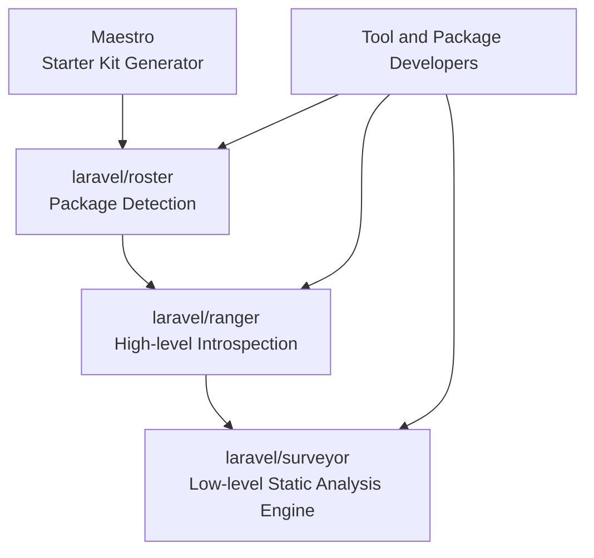
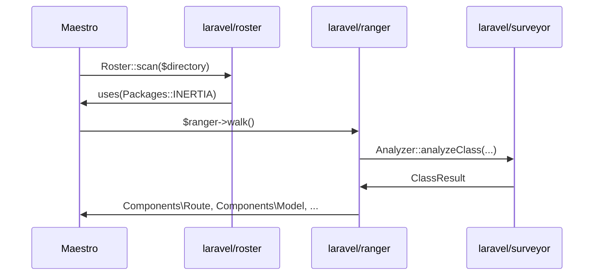
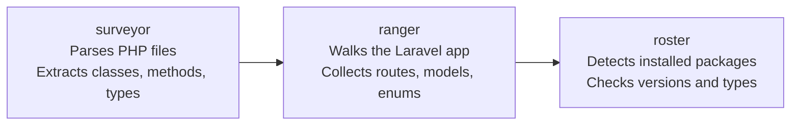

<Info>
  This article is based on the official README files and source code of each repository. All three packages are pre-release Beta versions as of April 2026.
</Info>

<Warning>
  surveyor, ranger, and roster are all currently in **Beta**. Their APIs are subject to change before the v1.0.0 release. Use with caution in production environments.
</Warning>

## Overview

In 2026, Laravel released three packages centered around code analysis. While each can be used independently, they form an interconnected **code analysis ecosystem**.



| Package | Role | Installation |
|---------|------|-------------|
| `laravel/surveyor` | PHP static analysis engine | `composer require laravel/surveyor` |
| `laravel/ranger` | Full Laravel application introspection | `composer require laravel/ranger` |
| `laravel/roster` | Ecosystem package detection | `composer require laravel/roster --dev` |

Let's look at each package in detail.

---

## laravel/surveyor — Static Analysis Engine

[laravel/surveyor](https://github.com/laravel/surveyor) is a powerful (mostly) static analysis tool that parses PHP files and extracts detailed metadata about classes, methods, properties, return types, and more — making this information available in a structured format for use by other tools and packages.

### Installation

```bash
composer require laravel/surveyor
```

### Basic usage

#### Analyzing a file

```php
use Laravel\Surveyor\Analyzer\Analyzer;

$analyzer = app(Analyzer::class);

// Analyze a file by path
$result = $analyzer->analyze('/path/to/your/File.php');

// Access the analyzed scope
$scope = $result->analyzed();

// Access the class result
$classResult = $result->result();
```

#### Analyzing a class directly

```php
$result = $analyzer->analyzeClass(\App\Models\User::class);
$classResult = $result->result();
```

### Working with ClassResult

```php
$classResult = $analyzer->analyzeClass(App\Models\User::class)->result();

// Class information
$name = $classResult->name();            // 'App\Models\User'
$namespace = $classResult->namespace();  // 'App\Models'
$filePath = $classResult->filePath();

// Inheritance
$extends = $classResult->extends();
$implements = $classResult->implements();

// Method information
$method = $classResult->getMethod('store');
$returnType = $method->returnType();
$parameters = $method->parameters();
$rules = $method->validationRules(); // Extracts validation rules from the method body

// Property information
$property = $classResult->getProperty('email');
$type = $property->type;
$visibility = $property->visibility; // 'public', 'protected', or 'private'

// All public methods and properties
$publicMethods = $classResult->publicMethods();
$publicProperties = $classResult->publicProperties();
```

### Type system

Surveyor includes a comprehensive type system for representing PHP types.

```php
use Laravel\Surveyor\Types\Type;

// Primitive types
$stringType = Type::string();
$intType = Type::int();
$boolType = Type::bool();
$nullType = Type::null();

// Union types (e.g. string|null)
$unionType = Type::union(Type::string(), Type::null());

// Type checking
use Laravel\Surveyor\Types\StringType;

if (Type::is($returnType, StringType::class)) {
    // Handle string return type
}
```

### Caching

Cache analysis results to improve performance when analyzing files repeatedly.

```php
use Laravel\Surveyor\Analyzer\AnalyzedCache;

// Enable disk caching
AnalyzedCache::enableDiskCache(storage_path('surveyor-cache'));

// Clear the cache
AnalyzedCache::clear();
```

You can also configure caching via environment variables:

```env
SURVEYOR_CACHE_ENABLED=true
SURVEYOR_CACHE_DIR=/path/to/cache
```

### Eloquent model analysis

Surveyor provides special support for Eloquent models, automatically detecting relationships, attributes, accessors, and cast definitions.

```php
$result = $analyzer->analyzeClass(App\Models\User::class)->result();

// Database attributes are automatically detected
$emailProperty = $result->getProperty('email');

// Identify relationship methods
$method = $result->getMethod('posts');
if ($method->isModelRelation()) {
    // This is a relationship method
}
```

<Info>
  Surveyor attempts a brief database connection when analyzing Eloquent models, so it is not purely static analysis. Performance and memory usage are still being improved, and contributions in those areas are welcome.
</Info>

---

## laravel/ranger — High-level Introspection

[laravel/ranger](https://github.com/laravel/ranger) wraps Surveyor and provides a high-level introspection library that walks through your entire Laravel application, collecting information about routes, models, enums, broadcast events, environment variables, and Inertia.js components.

### Installation

```bash
composer require laravel/ranger
```

### Basic usage

Register callbacks that fire as each component is discovered. Each callback receives a detailed DTO.

```php
use Laravel\Ranger\Ranger;
use Laravel\Ranger\Components;
use Illuminate\Support\Collection;

$ranger = app(Ranger::class);

// Called for each route discovered
$ranger->onRoute(function (Components\Route $route) {
    echo $route->uri();
});

// Called for each model discovered
$ranger->onModel(function (Components\Model $model) {
    foreach ($model->getAttributes() as $name => $type) {
        // Process attribute names and types
    }
});

// Called for each enum discovered
$ranger->onEnum(function (Components\Enum $enum) {
    //
});

// Called for each broadcast event discovered
$ranger->onBroadcastEvent(function (Components\BroadcastEvent $event) {
    //
});

// Called once after all routes have been collected
$ranger->onRoutes(function (Collection $routes) {
    //
});

// Called once after all models have been collected
$ranger->onModels(function (Collection $models) {
    //
});

// Walk through the application and trigger all callbacks
$ranger->walk();
```

### What Ranger collects

| Collector | Description |
|-----------|-------------|
| **Routes** | All registered routes with URIs, parameters, HTTP verbs, controllers, validation rules, and possible responses |
| **Models** | Eloquent models with their attributes, types, and relationships |
| **Enums** | PHP backed enums with their cases and values |
| **Broadcast Events** | Events implementing `ShouldBroadcast` with their payloads |
| **Broadcast Channels** | Registered broadcast channels |
| **Environment Variables** | Variables defined in your `.env` file |
| **Inertia Shared Data** | Globally shared Inertia.js props |
| **Inertia Components** | Inertia.js page components with their expected props |

---

## laravel/roster — Package Detection

[laravel/roster](https://github.com/laravel/roster) detects which Laravel ecosystem packages are installed in a project and provides an easy-to-use API to work with that data. It is ideal for package developers and tool authors who need to know "Is this project using Inertia?" or "What version of Livewire is installed?"

### Installation

```bash
composer require laravel/roster --dev
```

### Basic usage

```php
use Laravel\Roster\Roster;
use Laravel\Roster\Packages;

// Scan a directory and get the roster
$roster = Roster::scan($directory);

// All installed packages
$roster->packages();

// Production-only packages
$roster->packages()->production();

// Dev-only packages
$roster->packages()->dev();

// Check if a specific package is installed
$roster->uses(Packages::INERTIA);   // bool
$roster->uses(Packages::LIVEWIRE);  // bool

// Check with a version constraint
$roster->usesVersion(Packages::INERTIA, '2.0.0', '>=');  // Inertia >= 2.0.0?
$roster->usesVersion(Packages::LIVEWIRE, '3.0.0', '>='); // Livewire >= 3.0.0?

// Detect the JavaScript package manager in use
$packageManager = $roster->nodePackageManager(); // 'npm', 'yarn', 'bun', etc.
```

---

## Real-world use cases

### Starter kit generation (Maestro)

[Laravel Maestro](https://github.com/laravel/maestro) uses Roster internally to understand a project's package configuration before generating a starter kit. It checks questions like "Is this project using Inertia?" and "What JavaScript package manager is in use?" to select the appropriate starter kit variant.



### Building a package compatibility checker

When developing a package that should behave differently depending on what the user has installed, Roster makes it easy:

```php
use Laravel\Roster\Roster;
use Laravel\Roster\Packages;

$roster = Roster::scan(base_path());

if ($roster->uses(Packages::INERTIA)) {
    // Handle Inertia-specific logic
    if ($roster->usesVersion(Packages::INERTIA, '2.0.0', '>=')) {
        // Handle Inertia v2+ specific logic
    }
}

if ($roster->uses(Packages::LIVEWIRE)) {
    // Handle Livewire-specific logic
}

// Tailor install instructions to the detected package manager
$pm = $roster->nodePackageManager();
echo "Run: {$pm} install your-package";
```

### Auto-generating application documentation

Ranger lets you build tools that automatically collect and document an application's routes, models, and enums:

```php
use Laravel\Ranger\Ranger;
use Laravel\Ranger\Components;

$ranger = app(Ranger::class);
$docs = [];

$ranger->onRoute(function (Components\Route $route) use (&$docs) {
    $docs['routes'][] = [
        'uri' => $route->uri(),
        // Validation rules and response types are also available
    ];
});

$ranger->onModel(function (Components\Model $model) use (&$docs) {
    $docs['models'][] = [
        'attributes' => $model->getAttributes(),
    ];
});

$ranger->walk();

// $docs now contains structured information about the entire application
```

---

## Summary

surveyor, ranger, and roster provide a new foundation for **programmatic code analysis** in the Laravel ecosystem.



These packages are primarily aimed at **package developers and tool authors** rather than end users. However, they are already being used internally by official Laravel tools like Maestro, and broader adoption across the ecosystem is expected as they mature toward v1.0.0.

<Columns cols={3}>
  <Card title="laravel/surveyor" icon="github" href="https://github.com/laravel/surveyor">
    PHP static analysis engine
  </Card>
  <Card title="laravel/ranger" icon="github" href="https://github.com/laravel/ranger">
    High-level introspection library
  </Card>
  <Card title="laravel/roster" icon="github" href="https://github.com/laravel/roster">
    Package detection tool
  </Card>
</Columns>
