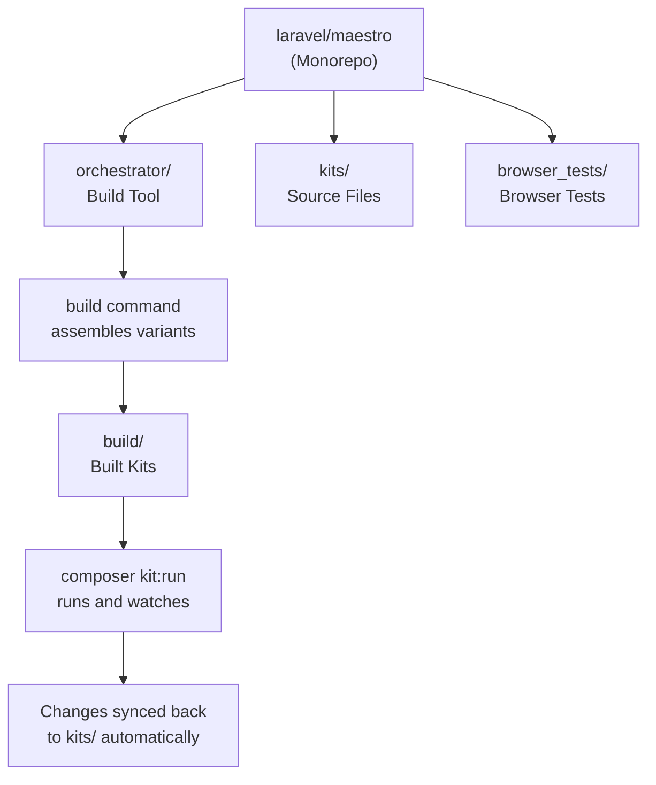
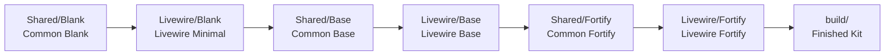

<Info>
  This article is based on source code research. No official documentation exists yet, and the repository is pre-release as of April 2026.
</Info>

## What is Maestro?

[Laravel Maestro](https://github.com/laravel/maestro) is a monorepo-style orchestrator for centrally managing Laravel's collection of [starter kits](https://laravel.com/starter-kits).

Laravel's starter kits come in multiple stacks — React, Vue, Svelte (Inertia), and Livewire — each combined with different authentication methods (Fortify, WorkOS) and options (Teams, Blank), resulting in 15+ variants. Maestro manages all of these variants in a single repository and provides a mechanism to automatically propagate changes to each individual starter kit repository.



## What Problem Does It Solve?

When starter kits are split across many variants, applying a single fix to all of them becomes tedious. For example, fixing a validation issue in an authentication form and opening separate PRs for React, Vue, Svelte, and Livewire is inefficient.

Maestro solves this with a **shared layer and variant layer hierarchy**. The orchestrator determines which layer a change belongs to and applies it to the most appropriate place automatically.

## Starter Kit Variants

The starter kits managed by Maestro are organized into two stacks.

### Livewire Stack (6 variants)

| Variant | Description |
|---------|-------------|
| Blank | Minimal setup with no authentication |
| Fortify | Authentication via Laravel Fortify |
| Fortify (Multi-file Components) | Blade views split into separate component files |
| Fortify (Teams) | Fortify authentication + Teams support |
| WorkOS | Authentication via WorkOS |
| WorkOS (Teams) | WorkOS authentication + Teams support |

### Inertia Stack (15 variants)

A combination of 3 frameworks (React, Vue, Svelte) × Blank/Fortify/WorkOS × with or without Teams, for a total of 15 variants.

## Repository Structure

```
laravel/maestro/
├── orchestrator/    # Laravel app that manages the build
│   ├── app/Console/Commands/BuildCommand.php
│   ├── app/Enums/StarterKit.php
│   └── scripts/
├── kits/            # Starter kit source files
│   ├── Shared/      # Files common to all variants
│   ├── Livewire/    # Livewire-specific files
│   └── Inertia/     # Inertia-specific files (React/Vue/Svelte)
└── browser_tests/   # Browser tests
    ├── bootstrap/
    ├── common/
    └── teams/
```

The `orchestrator` directory is itself a Laravel application that manages building and running the starter kits.

## The File Layer System

The core of Maestro is its "layer stacking" approach to assembling starter kits. For the Livewire (Fortify) variant, files are copied in the following order, with each later layer overwriting the previous one:



This hierarchy creates a clear rule: "fixes common to all kits go in `Shared/`, Livewire-specific fixes go in `Livewire/`."

## Contribution Workflow

Contributions to the starter kits are made in this Maestro repository, not in the individual starter kit repositories.

<Steps>
  <Step title="Navigate to the orchestrator directory and build a kit">
    ```bash
    cd orchestrator
    php artisan build
    ```
    An interactive prompt lets you select the target kit and authentication variant. You can also specify them directly with flags:

    ```bash
    php artisan build --kit=vue
    php artisan build --kit=react --workos
    php artisan build --kit=livewire --teams
    php artisan build --kit=vue --workos --teams
    ```
  </Step>
  <Step title="Run the built kit">
    ```bash
    composer kit:run
    ```
    This starts the Laravel development server and file watcher simultaneously. Changes made in the `build/` directory are automatically copied to the appropriate location in `kits/`.
  </Step>
  <Step title="Make changes and test">
    Edit files inside the `build/` directory. The watcher detects changes and automatically syncs them to the `kits/` directory.
  </Step>
  <Step title="Create a PR">
    Commit the changes to the `kits/` directory and open a PR. Once merged, Maestro will automatically push the changes to each individual starter kit repository.
  </Step>
</Steps>

<Warning>
  The `build/` directory is gitignored. Make all your changes inside `build/`, let the watcher sync them to `kits/`, and then commit from there.
</Warning>

## Other Development Commands

### Linting

```bash
# Run Pint on kits and browser_tests (PHP only)
composer kits:pint

# PHP lint + frontend lint for each Inertia variant
composer kits:lint

# Target a specific framework only
composer kits:lint -- --vue
composer kits:lint -- --react --svelte
```

### Browser Tests

```bash
# Run browser tests for all variants
composer kits:browser-tests

# Filter to a specific framework or variant
composer kits:browser-tests -- --vue
composer kits:browser-tests -- --livewire --fortify
```

Browser tests run with Pest + Playwright. The `browser_tests/` directory organizes tests in three layers: `bootstrap/` (shared config), `common/` (for Fortify), and `teams/` (for Teams).

### Filtering with Flags

Each command accepts `--livewire`, `--react`, `--svelte`, `--vue` flags and `--blank`, `--fortify`, `--workos`, `--teams` flags to narrow down the target:

```bash
# Check only the Fortify variants for Vue and Svelte
composer kits:check -- --vue --svelte --fortify

# Check only the WorkOS variants across all frameworks
composer kits:check -- --workos
```

## WorkOS Environment Variables

When building and running a WorkOS variant, set the WorkOS client ID and API key in `orchestrator/.env`. These values are copied into the `build/` directory's `.env` file at build time.

```bash
# orchestrator/.env
WORKOS_CLIENT_ID=your_client_id
WORKOS_API_KEY=your_api_key
```

## Current Development Status

- **GitHub Repository**: [laravel/maestro](https://github.com/laravel/maestro)
- **Official Release**: None (no version tags or releases published)
- **Latest Commit**: April 2026 (actively under development)
- **Required PHP Version**: ^8.2
- **Laravel Version**: ^13.0

Maestro is not an end-user package — it functions as **development infrastructure** for the Laravel team and contributors. The individual starter kit repositories (e.g. `laravel/starter-kit-react`) are generated and managed from this monorepo by Maestro.

<Card title="laravel/maestro Repository" icon="github" href="https://github.com/laravel/maestro">
  If you're interested in contributing to the starter kits, start by reading the Maestro README.
</Card>

<Card title="Laravel Starter Kits Official Documentation" icon="book-open" href="https://laravel.com/docs/starter-kits">
  For how to use the starter kits themselves, refer to the official documentation.
</Card>
