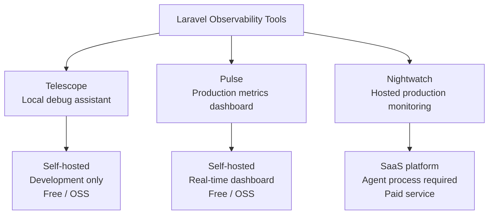
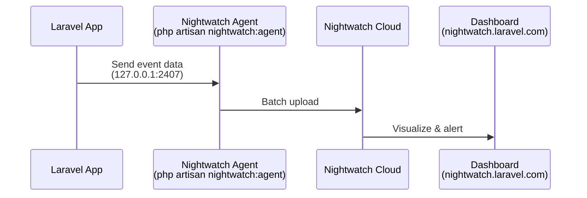
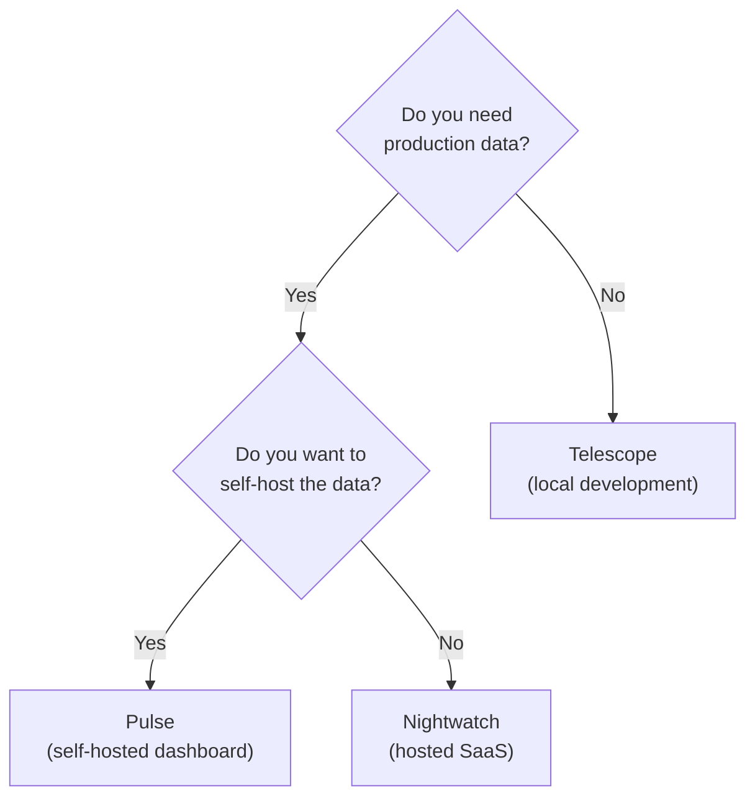

## What is Laravel Nightwatch

[Laravel Nightwatch](https://nightwatch.laravel.com) is a **hosted SaaS monitoring platform** for Laravel applications. It continuously collects telemetry from your production environment — HTTP requests, SQL queries, exceptions, queued jobs, logs, and scheduled tasks — and surfaces that data in a real-time cloud dashboard.

<Info>
  Nightwatch is a **paid service** (monthly subscription). A free plan is available, but it has a monthly event limit. Without the right configuration, the free plan fills up quickly. The settings in the "Free plan tips" section below are essential.
</Info>

---

## How Nightwatch differs from Telescope and Pulse

Nightwatch occupies a different role than the other Laravel observability tools. Here is how they compare.



| Tool | Purpose | Hosting | Environment |
|------|---------|---------|-------------|
| **Telescope** | Debug requests and queries while developing | Inside your app | Local development |
| **Pulse** | Aggregate performance metrics | Inside your app | Production / staging |
| **Nightwatch** | Real-time monitoring and alerting | Laravel-hosted SaaS | Production |

Nightwatch collects similar data to Telescope, but forwards it to the cloud via a sidecar agent process. This means historical data survives server restarts, and you can monitor multiple servers and applications from a single interface.

---

## Architecture

Nightwatch uses a lightweight agent process between your Laravel application and the Nightwatch cloud.



The agent listens locally on port `2407` (configurable), receives events from the Laravel application, and batches them to the Nightwatch cloud. The agent must run continuously alongside your application.

---

## Installation

### 1. Register an account and create an application

Visit [nightwatch.laravel.com](https://nightwatch.laravel.com), register for a free account, and create an organization and an application. After creating the application you will receive an **environment token**.

### 2. Install the package

```bash
composer require laravel/nightwatch
```

Unlike Telescope, you do **not** need the `--dev` flag. Nightwatch is designed for production use.

### 3. Add your token

Add the environment token to your `.env` file.

```ini
NIGHTWATCH_TOKEN=your-api-key
```

### 4. Start the agent

```bash
php artisan nightwatch:agent
```

The agent must run continuously in the background. Laravel Cloud, Laravel Forge, and Laravel Vapor each have dedicated setup guides. Forge users can use the official integration for automatic configuration.

Check the agent status at any time.

```bash
php artisan nightwatch:status
```

### 5. Disable Nightwatch in tests

Disable Nightwatch when running your test suite to avoid polluting your monitoring data.

```ini
# .env
NIGHTWATCH_ENABLED=false
```

You can also set it in `phpunit.xml` to keep it consistent across environments.

```xml
<php>
    <env name="APP_ENV" value="testing"/>
    <env name="NIGHTWATCH_ENABLED" value="false"/>
</php>
```

---

## Free plan tips

<Warning>
  **The free plan has a monthly event cap.** With the default settings (100 % sampling, all data collected) a moderately busy application will exhaust the free allowance within days. Apply the settings below before going to production.
</Warning>

### Lower the request sample rate

`NIGHTWATCH_REQUEST_SAMPLE_RATE` defaults to `1.0` (every request). Set it to `0.1` (10 %) to reduce the volume by 90 % while still getting a representative picture of your application's behavior.

```ini
# .env
NIGHTWATCH_REQUEST_SAMPLE_RATE=0.1
```

Keep exceptions and commands at full collection so you never miss a failure.

```ini
NIGHTWATCH_REQUEST_SAMPLE_RATE=0.1    # 10 % of requests
NIGHTWATCH_EXCEPTION_SAMPLE_RATE=1.0  # all exceptions (default)
NIGHTWATCH_COMMAND_SAMPLE_RATE=1.0    # all commands (default)
```

### Disable query collection

Database queries account for a large share of total events. Disabling them frees up your monthly allowance for higher-value events like exceptions, requests, and jobs.

```ini
# .env
NIGHTWATCH_IGNORE_QUERIES=true
```

### Other filtering options

You can also disable specific event categories you do not need.

```ini
NIGHTWATCH_IGNORE_CACHE_EVENTS=true
NIGHTWATCH_IGNORE_MAIL=true
NIGHTWATCH_IGNORE_NOTIFICATIONS=true
NIGHTWATCH_IGNORE_OUTGOING_REQUESTS=true
```

### Recommended free plan configuration

```ini
# .env — recommended minimum for the free plan
NIGHTWATCH_TOKEN=your-api-key
NIGHTWATCH_REQUEST_SAMPLE_RATE=0.1
NIGHTWATCH_IGNORE_QUERIES=true
```

These three settings are all you need to make Nightwatch practical on the free plan.

---

## Key features

### Request monitoring

Nightwatch records each HTTP request with response time, status code, and route details. Use the dashboard to identify slow endpoints and performance regressions over time.

### Exception tracking

Every unhandled exception is captured in real time, complete with a stack trace and an inline source code snippet. You can link exceptions to Linear issues directly from the dashboard.

### Log aggregation

Nightwatch integrates with Laravel's logging system. Structured log entries are forwarded alongside your application events.

```ini
# Minimum log level to collect (default: debug)
NIGHTWATCH_LOG_LEVEL=error
```

### Job and scheduled task monitoring

Track the execution history, success or failure status, and duration of queued jobs and scheduled tasks. Failures surface immediately without having to dig through log files.

### Deployment tracking

Deployments are recorded alongside your monitoring data. This makes it straightforward to correlate a spike in exceptions or a slowdown with a specific release.

### Alerts and notifications

Connect Slack or configure webhooks to receive real-time alerts when error rates spike or performance degrades.

---

## When to use Nightwatch vs. Telescope vs. Pulse



- **Local development** → Telescope
- **Aggregated production metrics on your own infrastructure** → Pulse
- **Detailed production traces and alerts without managing infrastructure** → Nightwatch

The three tools are not mutually exclusive. Running Pulse and Nightwatch together is a common production setup.

---

## Summary

Laravel Nightwatch gives production Laravel applications the same level of observability that Telescope provides locally — without needing to manage the monitoring infrastructure yourself. To get the most out of the free plan:

- Set `NIGHTWATCH_REQUEST_SAMPLE_RATE=0.1` to collect a representative 10 % sample of requests
- Set `NIGHTWATCH_IGNORE_QUERIES=true` to conserve your monthly event allowance
- Keep the agent running continuously using a process monitor

For full configuration options, see the [official start guide](https://nightwatch.laravel.com/docs/start-guide) and the [environment variable reference](https://nightwatch.laravel.com/docs/environment-variables).
