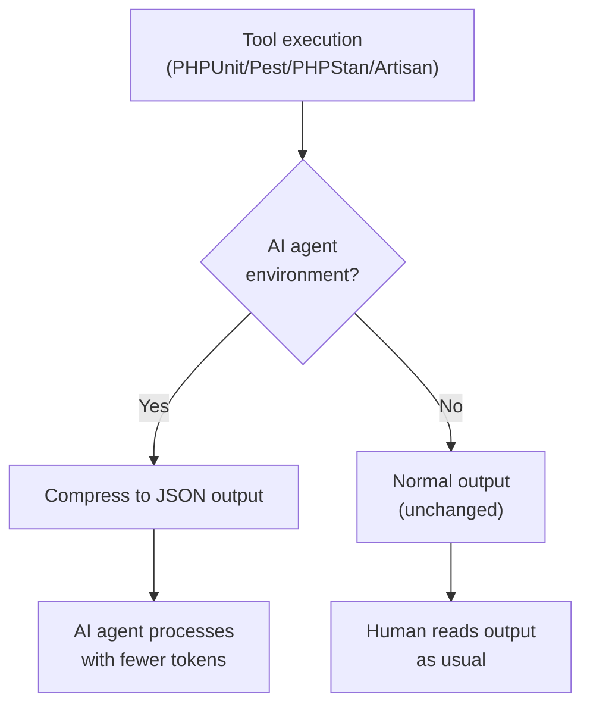

## Introduction

[laravel/pao](https://github.com/laravel/pao) is an agent-optimized output library for PHP development tools. **PAO (PHP Agent-Optimized output)** automatically converts the verbose, human-readable output of PHPUnit, Pest, Paratest, PHPStan, and Laravel Artisan into compact, structured JSON when running inside an AI agent.

As AI agents like GitHub Copilot move to token-based pricing, reducing tool output directly translates to lower costs. PAO was designed to solve this problem and is planned to be included as a default dependency in the Laravel starter kits.



## Why it matters

As AI agents become deeply integrated into development workflows, the token count of tool output has a direct impact on cost and response speed.

A project with 1,000 tests produces thousands of lines of PHPUnit output, but what an AI agent actually needs is just: pass/fail, count, and failure details. PAO compresses this to a single-digit JSON object.

- **Test output**: up to 99.8% token reduction
- **PHPStan output**: structured JSON with only the necessary information
- **Artisan output**: strips ANSI codes, box-drawing characters, and excess whitespace — up to 75% reduction

## Installation

Requires PHP 8.3+, and works with PHPUnit 12-13, Pest 4-5, Paratest, PHPStan, and Laravel 12+.

```bash
composer require laravel/pao --dev
```

That is all. PAO hooks into PHPUnit, Pest, Paratest, and PHPStan automatically through Composer's autoloader. In Laravel projects, a service provider is auto-discovered to clean Artisan command output.

<Info>
PAO only activates when it detects an AI agent environment. When you or your team run tools directly in the terminal, output is completely unchanged — same colours, same formatting, same experience.
</Info>

## Supported AI agents

PAO automatically detects the following AI agents.

| Agent | Detection method |
|-------|-----------------|
| GitHub Copilot | `COPILOT_MODEL` and related env vars |
| Claude Code | `CLAUDECODE` or `CLAUDE_CODE` |
| Cursor | `CURSOR_AGENT` |
| Gemini CLI | `GEMINI_CLI` |
| Devin | `/opt/.devin` file exists |
| Codex | `CODEX_SANDBOX` and related env vars |

## Before & After

### Test output (PHPUnit / Pest)

A test suite with 1,000 tests is transformed like this.

**Before (without PAO)**

```
PHPUnit 12.5.14 by Sebastian Bergmann and contributors.

.............................................................   61 / 1002 (  6%)
.............................................................  122 / 1002 ( 12%)
...
..........................                                    1002 / 1002 (100%)

Time: 00:00.321, Memory: 46.50 MB

OK (1002 tests, 1002 assertions)
```

**After (with PAO)**

```json
{
  "tool": "phpunit",
  "result": "passed",
  "tests": 1002,
  "passed": 1002,
  "duration_ms": 321
}
```

The output is constant-size regardless of how many tests you have. When tests fail, file paths, line numbers, and failure messages are included.

### Plugin output (coverage, profile)

Extra output from Pest plugins such as `--coverage` or `--profile` is captured, cleaned of ANSI codes and decorations, and included as a `raw` array.

```json
{
  "tool": "pest",
  "result": "passed",
  "tests": 1002,
  "passed": 1002,
  "duration_ms": 1520,
  "raw": [
    "Http/Controllers/Controller 100.0%",
    "Models/User 0.0%",
    "Total: 33.3 %"
  ]
}
```

### PHPStan output

```json
{
  "tool": "phpstan",
  "result": "failed",
  "errors": 2,
  "error_details": {
    "/app/Http/Controllers/Controller.php": [
      {
        "line": 9,
        "message": "Method Controller::index() should return int but returns string.",
        "identifier": "return.type"
      },
      {
        "line": 14,
        "message": "Call to an undefined method Controller::doesNotExist().",
        "identifier": "method.notFound"
      }
    ]
  }
}
```

### Laravel Artisan output

Commands like `php artisan about` have ANSI codes, box-drawing characters, dot separators, and excess whitespace stripped.

**Before (without PAO) — 2,111 characters**

```
  Environment ................................................................
  Application Name ................................................... Laravel
  Laravel Version ..................................................... 13.3.0
  PHP Version .......................................................... 8.5.4
  Debug Mode ......................................................... ENABLED
```

**After (with PAO) — 535 characters**

```
 Environment ..
 Application Name .. Laravel
 Laravel Version .. 13.3.0
 PHP Version .. 8.5.4
 Debug Mode .. ENABLED
```

Commands like `about`, `db:show`, and `migrate:status` benefit most, with up to 75% fewer tokens.

## Integration with Laravel starter kits

PAO is planned to be included as a default dependency in the Laravel starter kits. New projects created with the starter kit will have PAO installed automatically, so token-efficient AI agent development is available from the very first commit.

## Summary

`laravel/pao` requires no configuration and only activates in AI agent environments, meaning it has zero impact on existing development workflows. If you are using an AI agent to work on a PHP or Laravel project, installing PAO is a straightforward way to reduce token costs and speed up agent responses.

<Card title="laravel/pao repository" icon="github" href="https://github.com/laravel/pao">
  Source code and the latest list of supported tools and agents.
</Card>
