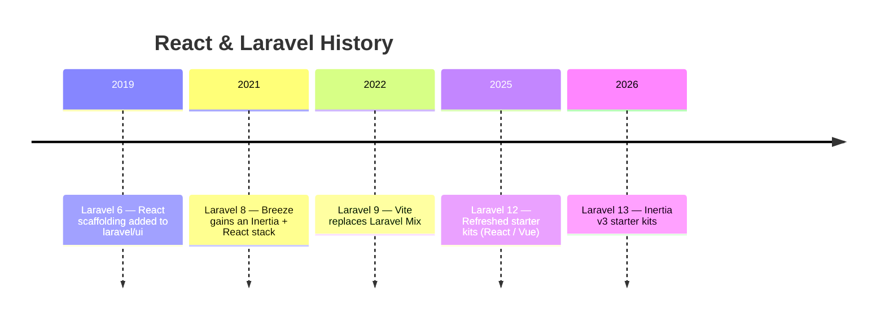
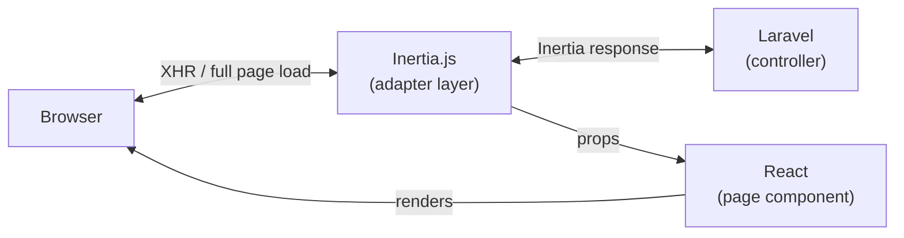

## What is React?

React is a JavaScript library for building user interfaces, developed and maintained by Meta (formerly Facebook). It is known for its **component-based** architecture and declarative UI description — from small interactive widgets to full single-page applications.

The core of React is the **virtual DOM**: when state changes, React computes the difference and updates only the affected parts of the real DOM, so you never need to manipulate the DOM by hand.

<Info>
  This page covers React 19 paired with Inertia v3. Laravel 13 starter kits use this combination by default.
</Info>

### JSX and TSX

React components are written in **JSX** (JavaScript XML) — an HTML-like syntax embedded directly in JavaScript.

```jsx
// JSX example
function Greeting({ name }) {
    return <h1>Hello, {name}!</h1>
}
```

The starter kit uses **TypeScript** (`.tsx`) by default. Type annotations improve IDE auto-complete and catch bugs early.

```tsx
// TSX example (TypeScript)
type Props = {
    name: string
}

function Greeting({ name }: Props) {
    return <h1>Hello, {name}!</h1>
}
```

<Tip>
  The Laravel React starter kit uses TypeScript + TSX as the standard. All examples on this page follow that convention.
</Tip>

---

## React in the Laravel Ecosystem

### History

React's history with Laravel is shorter than Vue's, but it now has equal — or even top-billing — status in the official starter kits.



**Laravel 6 (2019)** extracted authentication scaffolding into the `laravel/ui` package and added a React scaffold alongside the Vue one. At the time Vue was dominant, and the React option had little visibility.

When **Laravel Breeze (2021)** added an Inertia + React stack, real adoption began. With the **Laravel 12 (2025)** starter kit refresh, React moved to full parity with Vue — and is listed first in the interactive prompt.

### The modern approach: Inertia × React

The mainstream way to use React with Laravel today is **Inertia × React**. Inertia lets you pass data directly from a Laravel controller to a React component — no REST API required. This "modern monolith" architecture delivers SPA-like UX without a separate API layer.



---

## Setup

### Via starter kit (recommended)

For new projects, the starter kit is the fastest path.

```shell
laravel new my-app
```

Select **React** at the interactive prompt. The following are set up for you automatically:

- `inertiajs/inertia-laravel` (server-side adapter)
- `@inertiajs/react` (client-side adapter)
- `react` + `react-dom` (React 19 core)
- `@vitejs/plugin-react` (Vite plugin)
- TypeScript + `@types/react`
- Tailwind CSS + shadcn/ui component library
- `HandleInertiaRequests` middleware
- Authentication pages (login, register) built with Inertia + React + TypeScript

### Manual installation

To add React to an existing project, install the server-side and client-side packages separately.

```shell
# Server side (PHP)
composer require inertiajs/inertia-laravel

# Client side (JavaScript)
npm install @inertiajs/react react react-dom
npm install --save-dev @vitejs/plugin-react @types/react @types/react-dom typescript
```

Add the React plugin to `vite.config.ts`:

```ts
import { defineConfig } from 'vite'
import laravel from 'laravel-vite-plugin'
import react from '@vitejs/plugin-react'

export default defineConfig({
    plugins: [
        laravel({
            input: ['resources/css/app.css', 'resources/js/app.tsx'],
            refresh: true,
        }),
        react(),
    ],
})
```

Bootstrap the Inertia app in `resources/js/app.tsx`:

```tsx
import { createInertiaApp } from '@inertiajs/react'
import { createRoot } from 'react-dom/client'
import { resolvePageComponent } from 'laravel-vite-plugin/inertia-helpers'

createInertiaApp({
    resolve: (name) =>
        resolvePageComponent(
            `./pages/${name}.tsx`,
            import.meta.glob('./pages/**/*.tsx'),
        ),
    setup({ el, App, props }) {
        createRoot(el).render(<App {...props} />)
    },
})
```

<Info>
  For the full manual setup (root template, middleware registration, etc.) refer to the [Inertia documentation](https://inertiajs.com/installation).
</Info>

---

## Directory Structure

Starter kits place React page components under `resources/js/pages/`.

```
resources/js/
├── app.tsx            # Inertia app entry point
├── bootstrap.ts
├── components/        # Reusable UI components
│   ├── ui/            # shadcn/ui components
│   └── ...
├── hooks/             # Custom React hooks
├── layouts/           # Layout components
│   ├── app-layout.tsx
│   └── auth-layout.tsx
├── lib/               # Utility functions and configuration
├── pages/             # Inertia page components (mapped to controller names)
│   ├── auth/
│   │   ├── login.tsx
│   │   └── register.tsx
│   ├── dashboard.tsx
│   └── posts/
│       ├── index.tsx
│       ├── create.tsx
│       └── show.tsx
└── types/             # TypeScript type definitions
```

`Inertia::render('posts/index', [...])` maps to `resources/js/pages/posts/index.tsx`.

---

## Page Components

Inertia page components are ordinary React components. Data passed from a Laravel controller arrives as props.

### Controller

```php
// app/Http/Controllers/PostController.php
use Inertia\Inertia;
use App\Models\Post;

class PostController extends Controller
{
    public function index()
    {
        return Inertia::render('posts/index', [
            'posts' => Post::latest()->paginate(10),
        ]);
    }
}
```

### React page component

```tsx
// resources/js/pages/posts/index.tsx
import { Link } from '@inertiajs/react'

type Post = {
    id: number
    title: string
    created_at: string
}

type Props = {
    posts: {
        data: Post[]
        // paginate(10) also provides pagination metadata:
        // current_page, last_page, per_page, total, etc.
    }
}

export default function PostsIndex({ posts }: Props) {
    return (
        <div>
            <h1>Posts</h1>
            {posts.data.map((post) => (
                <article key={post.id}>
                    <h2>
                        <Link href={`/posts/${post.id}`}>{post.title}</Link>
                    </h2>
                    <p>{post.created_at}</p>
                </article>
            ))}
        </div>
    )
}
```

Receive props as function arguments and the data from your controller is immediately available — no REST API needed.

---

## The `Link` Component

Use `<Link>` from `@inertiajs/react` to navigate between pages via XHR, avoiding full browser reloads.

```tsx
import { Link } from '@inertiajs/react'

export default function PostsIndex() {
    return (
        <div>
            {/* Basic link */}
            <Link href="/posts">All posts</Link>

            {/* DELETE via a button */}
            <Link href="/posts/1" method="delete" as="button">
                Delete
            </Link>

            {/* Preload on hover */}
            <Link href="/posts/1" preload>
                View post
            </Link>
        </div>
    )
}
```

`<Link>` looks just like a regular `<a>` tag, but Inertia swaps only the page component behind the scenes, giving you instant, SPA-like navigation.

---

## `useForm` Hook

Use the `useForm` hook from `@inertiajs/react` for form handling. It manages form state, submission, and validation error display with minimal boilerplate.

### Controller

```php
// app/Http/Controllers/PostController.php
class PostController extends Controller
{
    public function store(Request $request)
    {
        $validated = $request->validate([
            'title'   => ['required', 'string', 'max:255'],
            'content' => ['required', 'string'],
        ]);

        Post::create($validated + ['user_id' => auth()->id()]);

        return redirect()->route('posts.index')
            ->with('success', 'Post created.');
    }
}
```

### React form component

```tsx
// resources/js/pages/posts/create.tsx
import { useForm } from '@inertiajs/react'
import { FormEventHandler } from 'react'

export default function PostCreate() {
    const { data, setData, post, processing, errors } = useForm({
        title: '',
        content: '',
    })

    const submit: FormEventHandler = (e) => {
        e.preventDefault()
        post('/posts')
    }

    return (
        <form onSubmit={submit}>
            <div>
                <label>Title</label>
                <input
                    type="text"
                    value={data.title}
                    onChange={(e) => setData('title', e.target.value)}
                />
                {errors.title && <p className="error">{errors.title}</p>}
            </div>

            <div>
                <label>Content</label>
                <textarea
                    value={data.content}
                    onChange={(e) => setData('content', e.target.value)}
                />
                {errors.content && <p className="error">{errors.content}</p>}
            </div>

            <button type="submit" disabled={processing}>
                {processing ? 'Submitting…' : 'Create post'}
            </button>
        </form>
    )
}
```

Key properties and methods returned by `useForm`:

| Property / Method | Description |
|-------------------|-------------|
| `data` | The form data object |
| `setData(field, value)` | Update a field's value |
| `errors` | Validation errors keyed by field name |
| `processing` | `true` while a request is in flight (use to disable the submit button) |
| `isDirty` | `true` when the form differs from its initial values |
| `post(url)` | Submit via POST |
| `put(url)` | Submit via PUT (for updates) |
| `delete(url)` | Submit via DELETE |
| `reset()` | Reset the form to its initial values |

When validation errors come back, `useForm` preserves the entered values and surfaces the errors.

---

## Shared Data

Data that every page needs — the authenticated user, flash messages, etc. — belongs in the `share()` method of your `HandleInertiaRequests` middleware.

```php
// app/Http/Middleware/HandleInertiaRequests.php
use Illuminate\Http\Request;
use Inertia\Middleware;

class HandleInertiaRequests extends Middleware
{
    public function share(Request $request): array
    {
        return array_merge(parent::share($request), [
            'auth' => [
                'user' => $request->user()
                    ? $request->user()->only('id', 'name', 'email')
                    : null,
            ],
            'flash' => [
                'success' => $request->session()->get('success'),
                'error'   => $request->session()->get('error'),
            ],
        ]);
    }
}
```

Access shared data in any React component with the `usePage()` hook:

```tsx
import { usePage } from '@inertiajs/react'

type SharedProps = {
    auth: {
        user: { id: number; name: string; email: string } | null
    }
    flash: {
        success: string | null
        error: string | null
    }
}

export default function AppHeader() {
    const { auth, flash } = usePage<SharedProps>().props

    return (
        <>
            <header>
                {auth.user ? (
                    <span>{auth.user.name}</span>
                ) : (
                    <span>Guest</span>
                )}
            </header>

            {flash.success && (
                <div className="alert-success">{flash.success}</div>
            )}
        </>
    )
}
```

<Info>
  Shared data is included in every request, so keep it minimal. Wrap values in `fn()` for lazy evaluation — they're only resolved when actually accessed.
</Info>

---

## React Hooks Essentials

Here are the React hooks you'll reach for most often when building with Inertia × React.

### `useState` — Local state management

```tsx
import { useState } from 'react'

export default function Counter() {
    const [count, setCount] = useState(0)
    const [isOpen, setIsOpen] = useState(false)

    return (
        <div>
            <p>{count}</p>
            <button onClick={() => setCount(count + 1)}>+1</button>
            <button onClick={() => setIsOpen(!isOpen)}>Toggle</button>
        </div>
    )
}
```

### `useEffect` — Side effects

```tsx
import { useState, useEffect } from 'react'

export default function Timer() {
    const [seconds, setSeconds] = useState(0)

    useEffect(() => {
        const timer = setInterval(() => {
            setSeconds((s) => s + 1)
        }, 1000)

        // Cleanup function
        return () => clearInterval(timer)
    }, []) // Empty array = run once on mount

    return <p>Elapsed: {seconds}s</p>
}
```

### `useMemo` and `useCallback` — Performance optimization

```tsx
import { useMemo, useCallback } from 'react'
import { router } from '@inertiajs/react'

type Post = { id: number; title: string; published: boolean }
type Props = { posts: Post[] }

export default function PostsList({ posts }: Props) {
    // Memoize derived value (only recalculates when posts changes)
    const publishedPosts = useMemo(
        () => posts.filter((post) => post.published),
        [posts],
    )

    // Memoize function (only recreated when dependencies change)
    const handleClick = useCallback((id: number) => {
        router.visit(`/posts/${id}`)
    }, [])

    return (
        <ul>
            {publishedPosts.map((post) => (
                <li key={post.id} onClick={() => handleClick(post.id)}>
                    {post.title}
                </li>
            ))}
        </ul>
    )
}
```

---

## TypeScript Support

The React starter kit ships with TypeScript enabled by default. Combining Inertia's type definitions with TypeScript gives you type-safe props across the stack.

### Global type definitions

The starter kit defines shared data types in `resources/js/types/index.d.ts`:

```ts
// resources/js/types/index.d.ts
export interface User {
    id: number
    name: string
    email: string
    email_verified_at?: string
}

export type PageProps<T extends Record<string, unknown> = Record<string, unknown>> = T & {
    auth: {
        user: User
    }
}
```

### Using types in page components

```tsx
import { PageProps } from '@/types'

type Post = {
    id: number
    title: string
    content: string
}

export default function PostsIndex({ auth, posts }: PageProps<{ posts: Post[] }>) {
    return (
        <div>
            <p>Logged in as: {auth.user.name}</p>
            {posts.map((post) => (
                <article key={post.id}>
                    <h2>{post.title}</h2>
                </article>
            ))}
        </div>
    )
}
```

---

## Summary

React pairs naturally with Laravel through Inertia, especially in the "modern monolith" setup. TypeScript support makes it a strong choice for larger applications.

| Piece | Role |
|-------|------|
| Laravel controller | Routing, data retrieval, validation |
| `Inertia::render()` | Pass data from the controller to a React component |
| React page component | Receive props and render the UI |
| `useForm` | Form state management, submission, error display |
| `Link` component | Client-side navigation without full reloads |
| `usePage().props` | Access shared data from any component |
| TypeScript | Type-safe props and improved IDE auto-complete |

With Inertia × React you get the productivity of Laravel's backend combined with React's powerful ecosystem. Run `laravel new` and pick React to get authentication pages, TypeScript, Tailwind, and shadcn/ui out of the box.

<Card title="Inertia.js Documentation" icon="book-open" href="https://inertiajs.com">
  See the official Inertia v3 docs for the full feature reference.
</Card>
