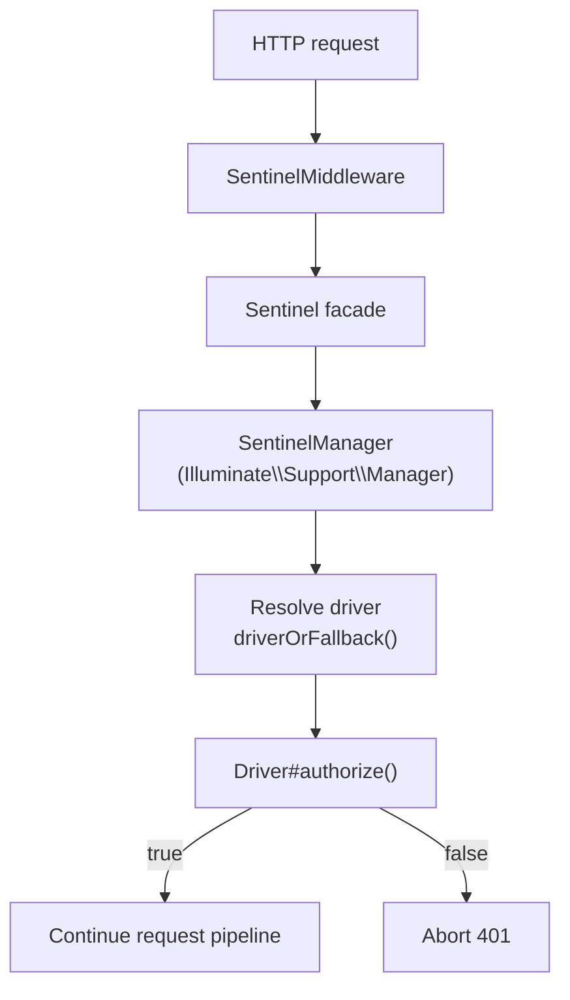

<Info>
  This article is based on source code investigation of the `1.x` line. The package currently has no dedicated official documentation site and remains an early-stage package.
</Info>

## What is Laravel Sentinel

[Laravel Sentinel](https://github.com/laravel/sentinel) is a route protection middleware package that uses a driver-based authorization model.

From the repository's `composer.json`, the package is authored by Taylor Otwell and Mior Muhammad Zaki, and currently targets `PHP ^8.0` with `illuminate/container` support up to Laravel `^13.0`.

Its primary role is protecting internal tool routes such as Telescope, Horizon, and Pulse by applying `SentinelMiddleware` to routes and delegating access checks to a selected driver.

## Position in the Laravel ecosystem

Sentinel sits in a specific gap between standard app authentication and package dashboard protection:

- It is **not** a full authentication system like Breeze, Jetstream, or Fortify.
- It is **not** an authorization policy layer for your domain models.
- It is a lightweight **route-access guard framework** for operational and admin surfaces.

In practical terms, Sentinel gives official and third-party Laravel packages a reusable mechanism for protecting tool routes without hard-coding one authentication strategy.

## Why this package exists

Historically, tools like Telescope and Horizon commonly relied on `Gate` checks. That model depends on user authentication context and can be inconsistent for route-level access boundaries.

Sentinel moves the concern into middleware and driver abstractions, so access decisions are request-centric and reusable across multiple tool routes.

## Architecture highlights from the repository

Sentinel is intentionally small but follows a strong Laravel-native pattern:

- `SentinelMiddleware` executes route protection and aborts with `401` when denied.
- `SentinelManager` extends `Illuminate\Support\Manager` and resolves drivers.
- Drivers implement `authorize(Request $request): bool`.
- `driverOrFallback()` safely falls back to the default driver if a named driver cannot be resolved.

This makes extension simple: you can register custom drivers via `Sentinel::extend()` and keep protection rules centralized.

## Default behavior and operational caveat

The default `Laravel` driver is focused on local-environment protection logic.  
That means production-grade access policies generally require a custom driver tailored to your environment and trust model.

If you adopt Sentinel, treat the default driver as a baseline and explicitly design your production authorization behavior.

## When Sentinel is useful

Sentinel is a good fit when you want:

- One shared route protection layer for multiple internal tools.
- Driver-based authorization logic that you can swap by environment or route group.
- Package-friendly middleware integration without locking into one auth implementation.

## Summary

`laravel/sentinel` is an early but important ecosystem package: a compact driver-based route protection layer that can standardize access control for Laravel operational tools.

Its ecosystem value is architectural rather than feature-heavy — it provides a reusable primitive that package authors and platform teams can build on.

<Card title="laravel/sentinel repository" icon="github" href="https://github.com/laravel/sentinel">
  Review the latest source and branch activity directly in the official repository.
</Card>
