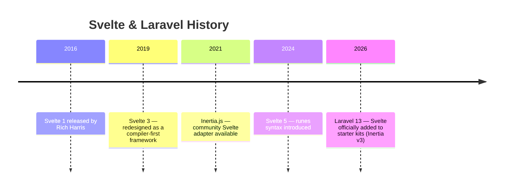
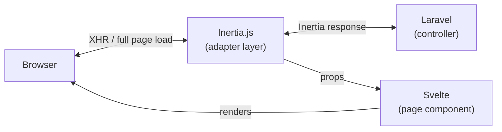

## What is Svelte?

Svelte occupies a unique position among JavaScript frameworks. While React and Vue operate as **runtime libraries**, Svelte works as a **compiler**. At build time it transforms your components into plain JavaScript — no framework runtime ships to the browser.

The defining feature of Svelte is that it **doesn't use a Virtual DOM**. When state changes, code generated by the Svelte compiler updates the DOM directly. The result is extremely lean, fast UIs.

<Info>
  This page covers Svelte 5 paired with Inertia v3. Laravel 13 starter kits use this combination by default.
</Info>

### Svelte 5 Runes

Svelte 5 (released 2024) introduced a new reactivity system called **Runes** — special functions like `$state`, `$derived`, and `$effect` that declare reactive state explicitly. Unlike Svelte 4's implicit reactivity, runes are predictable and easy to reason about.

```svelte
<script lang="ts">
    let count = $state(0)

    function increment() {
        count++
    }
</script>

<button onclick={increment}>{count}</button>
```

<Tip>
  The Laravel Svelte starter kit uses Svelte 5 + TypeScript as the standard. All examples on this page follow that convention.
</Tip>

---

## Svelte in the Laravel Ecosystem

### History

Svelte's relationship with Laravel is the newest of the three frontend options — the **official starter kit** was the first formal support.



With **Laravel 13 (2026)** adding Svelte to the starter kits, Svelte became an official frontend choice in the Laravel ecosystem — on equal footing with Vue and React, selectable from the `laravel new` interactive prompt.

Svelte is still largely unknown to Laravel developers, but its **compiler-powered lightweight bundles** and **concise syntax** mean you'll write noticeably less code compared to Vue or React.

### The modern approach: Inertia × Svelte

The mainstream way to use Svelte with Laravel today is **Inertia × Svelte**. Inertia lets you pass data directly from a Laravel controller to a Svelte component — no REST API required. This "modern monolith" architecture delivers SPA-like UX without a separate API layer.



---

## Setup

### Via starter kit (recommended)

For new projects, the starter kit is the fastest path.

```shell
laravel new my-app
```

Select **Svelte** at the interactive prompt. The following are set up for you automatically:

- `inertiajs/inertia-laravel` (server-side adapter)
- `@inertiajs/svelte` (client-side adapter)
- `svelte` + `@sveltejs/vite-plugin-svelte` (Svelte 5 core and Vite plugin)
- TypeScript + `svelte-check`
- Tailwind CSS + shadcn-svelte component library
- `HandleInertiaRequests` middleware
- Authentication pages (login, register — implemented with Inertia + Svelte + TypeScript)

### Manual installation

To add Svelte to an existing project, install the server-side and client-side packages separately.

```shell
# Server side (PHP)
composer require inertiajs/inertia-laravel

# Client side (JavaScript)
npm install @inertiajs/svelte @inertiajs/vite svelte
npm install --save-dev @sveltejs/vite-plugin-svelte svelte-check typescript
```

Add the Svelte plugin and the Inertia Vite plugin to `vite.config.ts`:

```ts
import { defineConfig } from 'vite'
import laravel from 'laravel-vite-plugin'
import { svelte } from '@sveltejs/vite-plugin-svelte'
import inertia from '@inertiajs/vite'

export default defineConfig({
    plugins: [
        laravel({
            input: ['resources/css/app.css', 'resources/js/app.ts'],
            refresh: true,
        }),
        svelte(),
        inertia(),
    ],
})
```

Bootstrap the Inertia app in `resources/js/app.ts`. The `@inertiajs/vite` plugin handles page resolution and mounting automatically, so a minimal entry point is all you need.

```ts
import { createInertiaApp } from '@inertiajs/svelte'

createInertiaApp()
```

<Info>
  For the full manual setup (root template, middleware registration) see the [Inertia documentation](https://inertiajs.com/installation).
</Info>

---

## Directory Structure

The starter kit places Svelte page components in `resources/js/pages/`.

```
resources/js/
├── app.ts             # Inertia app entry point
├── components/        # Reusable UI components
│   └── ui/            # shadcn-svelte components
├── layouts/           # Layout components
│   ├── AppLayout.svelte
│   └── AuthLayout.svelte
├── lib/               # Utilities and Svelte rune modules
├── pages/             # Inertia page components (mapped to controller names)
│   ├── auth/
│   │   ├── Login.svelte
│   │   └── Register.svelte
│   ├── Dashboard.svelte
│   └── posts/
│       ├── Index.svelte
│       ├── Create.svelte
│       └── Show.svelte
└── types/             # TypeScript type definitions
```

`Inertia::render('posts/Index', [...])` maps to `resources/js/pages/posts/Index.svelte`.

---

## Svelte File Structure

A `.svelte` file consists of three blocks: **`<script>`, template, and `<style>`**.

```svelte
<script lang="ts">
    // Logic (TypeScript)
    let name = $state('Laravel')
</script>

<!-- Template (HTML-like syntax) -->
<h1>Hello, {name}!</h1>

<style>
    /* Scoped CSS — applies only to this component */
    h1 {
        color: #ff2d20;
    }
</style>
```

The structure resembles Vue's Single File Component (SFC), but with even less boilerplate. `<style>` is scoped by default, so class name collisions are never a concern.

### Template Syntax

#### Interpolation

Use `{}` to embed JavaScript values or expressions in your template.

```svelte
<script lang="ts">
    let name = $state('World')
    let count = $state(3)
</script>

<p>Hello, {name}!</p>
<p>Double is {count * 2}</p>
```

#### `{#if}` — Conditional rendering

```svelte
<script lang="ts">
    let isLoggedIn = $state(false)
    let role = $state('editor')
</script>

{#if isLoggedIn}
    <p>Welcome back!</p>
{:else if role === 'admin'}
    <p>Logged in as administrator</p>
{:else}
    <a href="/login">Log in</a>
{/if}
```

Equivalent to Vue's `v-if` / `v-else` or React's ternary expressions.

#### `{#each}` — List rendering

```svelte
<script lang="ts">
    type Post = { id: number; title: string }
    let posts = $state<Post[]>([
        { id: 1, title: 'First post' },
        { id: 2, title: 'Second post' },
    ])
</script>

<ul>
    {#each posts as post (post.id)}
        <li>{post.title}</li>
    {/each}
</ul>
```

The `(post.id)` key hint enables efficient DOM diffing — equivalent to Vue's `v-for :key` or React's `Array.map()` with a `key` prop.

#### `bind:` — Two-way binding

`bind:value` synchronises a form element with a reactive variable in both directions.

```svelte
<script lang="ts">
    let title = $state('')
    let agreed = $state(false)
    let role = $state('viewer')
</script>

<!-- Text input -->
<input bind:value={title} type="text" />
<p>Typing: {title}</p>

<!-- Checkbox -->
<input bind:checked={agreed} type="checkbox" />
<p>Agreed: {agreed}</p>

<!-- Select -->
<select bind:value={role}>
    <option value="viewer">Viewer</option>
    <option value="editor">Editor</option>
    <option value="admin">Admin</option>
</select>
```

Equivalent to Vue's `v-model`. In React you would need an `onChange` handler for every field — Svelte's `bind:` replaces all of that with a single declarative attribute.

---

## Page Components

Inertia page components are regular Svelte components. Data passed from a Laravel controller arrives as props.

### Controller

```php
// app/Http/Controllers/PostController.php
use Inertia\Inertia;
use App\Models\Post;

class PostController extends Controller
{
    public function index()
    {
        return Inertia::render('posts/Index', [
            'posts' => Post::latest()->paginate(10),
        ]);
    }
}
```

### Svelte page component

In Svelte 5, use the `$props()` rune to receive props.

```svelte
<!-- resources/js/pages/posts/Index.svelte -->
<script lang="ts">
    import { Link } from '@inertiajs/svelte'

    type Post = {
        id: number
        title: string
        created_at: string
    }

    type Props = {
        posts: {
            data: Post[]
        }
    }

    let { posts }: Props = $props()
</script>

<div>
    <h1>Posts</h1>
    {#each posts.data as post (post.id)}
        <article>
            <h2>
                <Link href={`/posts/${post.id}`}>{post.title}</Link>
            </h2>
            <p>{post.created_at}</p>
        </article>
    {/each}
</div>
```

Receive the props with `$props()` and use them directly in the template — no REST API required.

---

## `Link` Component

The `<Link>` component from `@inertiajs/svelte` performs page transitions over XHR, avoiding full browser reloads.

```svelte
<script lang="ts">
    import { Link } from '@inertiajs/svelte'
</script>

<!-- Basic link -->
<Link href="/posts">All posts</Link>

<!-- Link that sends a DELETE request -->
<Link href="/posts/1" method="delete" as="button">
    Delete
</Link>

<!-- Prefetch on hover -->
<Link href="/posts/1" preload>View post</Link>
```

It looks like a plain `<a>` tag, but Inertia swaps only the page component underneath — giving you SPA-like navigation without a full reload.

---

## `useForm` Hook

Use the `useForm` hook from `@inertiajs/svelte` for form handling. It manages form state, submission, and validation error display with minimal code.

### Controller

```php
// app/Http/Controllers/PostController.php
class PostController extends Controller
{
    public function store(Request $request)
    {
        $validated = $request->validate([
            'title'   => ['required', 'string', 'max:255'],
            'content' => ['required', 'string'],
        ]);

        Post::create($validated + ['user_id' => auth()->id()]);

        return redirect()->route('posts.index')
            ->with('success', 'Post created.');
    }
}
```

### Svelte form component

```svelte
<!-- resources/js/pages/posts/Create.svelte -->
<script lang="ts">
    import { useForm } from '@inertiajs/svelte'

    const form = useForm({
        title: '',
        content: '',
    })

    function submit(e: SubmitEvent) {
        e.preventDefault()
        form.post('/posts')
    }
</script>

<form onsubmit={submit}>
    <div>
        <label>Title</label>
        <input type="text" bind:value={form.data.title} />
        {#if form.errors.title}
            <p class="error">{form.errors.title}</p>
        {/if}
    </div>

    <div>
        <label>Content</label>
        <textarea bind:value={form.data.content}></textarea>
        {#if form.errors.content}
            <p class="error">{form.errors.content}</p>
        {/if}
    </div>

    <button type="submit" disabled={form.processing}>
        {form.processing ? 'Submitting...' : 'Create post'}
    </button>
</form>
```

Key properties returned by `useForm`:

| Property / Method | Description |
|-------------------|-------------|
| `form.data` | Form data object |
| `form.errors` | Validation errors (keyed by field name) |
| `form.processing` | `true` while submitting (use to disable the button) |
| `form.isDirty` | `true` when data has changed from initial values |
| `form.post(url)` | Submit via POST |
| `form.put(url)` | Submit via PUT (update) |
| `form.delete(url)` | Submit via DELETE |
| `form.reset()` | Reset form to initial values |

When validation errors are returned, `useForm` preserves the entered data and displays the errors. Combined with `bind:value`, this produces a seamless form experience.

---

## Shared Data

Data needed on every page (logged-in user, flash messages) is defined in the `HandleInertiaRequests` middleware's `share()` method.

```php
// app/Http/Middleware/HandleInertiaRequests.php
use Illuminate\Http\Request;
use Inertia\Middleware;

class HandleInertiaRequests extends Middleware
{
    public function share(Request $request): array
    {
        return array_merge(parent::share($request), [
            'auth' => [
                'user' => $request->user()
                    ? $request->user()->only('id', 'name', 'email')
                    : null,
            ],
            'flash' => [
                'success' => $request->session()->get('success'),
                'error'   => $request->session()->get('error'),
            ],
        ]);
    }
}
```

Access shared data from any Svelte component using `usePage()`.

```svelte
<script lang="ts">
    import { usePage } from '@inertiajs/svelte'

    type SharedProps = {
        auth: {
            user: { id: number; name: string; email: string } | null
        }
        flash: {
            success: string | null
            error: string | null
        }
    }

    const page = usePage<SharedProps>()
</script>

<header>
    {#if page.props.auth.user}
        <span>{page.props.auth.user.name}</span>
    {:else}
        <span>Guest</span>
    {/if}
</header>

{#if page.props.flash.success}
    <div class="alert-success">{page.props.flash.success}</div>
{/if}
```

<Info>
  Shared data is included with every request, so keep it to the minimum necessary. Use `fn()` lazy evaluation so data is only computed when accessed.
</Info>

---

## Svelte 5 Reactivity (Runes)

The essential Svelte 5 runes you need when building with Inertia × Svelte.

### `$state` — Reactive state

```svelte
<script lang="ts">
    let count = $state(0)
    let isOpen = $state(false)
    let items = $state<string[]>([])
</script>

<p>{count}</p>
<button onclick={() => count++}>+1</button>
<button onclick={() => isOpen = !isOpen}>Toggle</button>
```

Variables declared with `$state` are automatically reactive. When the value changes the DOM updates automatically. No `.value` property to access — just assign directly.

### `$derived` — Derived values

```svelte
<script lang="ts">
    let posts = $state<{ title: string; published: boolean }[]>([])

    let publishedPosts = $derived(posts.filter(p => p.published))

    let summary = $derived.by(() => {
        const total = posts.length
        const published = publishedPosts.length
        return `${published} of ${total} published`
    })
</script>

<p>{summary}</p>
```

`$derived` re-evaluates automatically when its dependencies change — equivalent to Vue's `computed` or React's `useMemo`.

### `$effect` — Side effects

```svelte
<script lang="ts">
    let query = $state('')

    $effect(() => {
        console.log('Query changed:', query)

        return () => {
            console.log('Cleanup')
        }
    })
</script>

<input bind:value={query} placeholder="Search..." />
```

`$effect` runs whenever the `$state` variables it reads change. Unlike React's `useEffect`, there is no dependency array — Svelte tracks accessed `$state` variables automatically.

---

## shadcn-svelte Components

The starter kit includes [shadcn-svelte](https://www.shadcn-svelte.com/), a Svelte port of the shadcn/ui component library. Components are copied into your project so you can customise them freely.

### Adding components

```shell
npx shadcn-svelte@latest add button
npx shadcn-svelte@latest add input
npx shadcn-svelte@latest add card
```

Each command places the component source code in `resources/js/components/ui/`.

### Usage

```svelte
<script lang="ts">
    import { Button } from '@/components/ui/button'
    import { Input } from '@/components/ui/input'
    import * as Card from '@/components/ui/card'
    import { useForm } from '@inertiajs/svelte'

    const form = useForm({ email: '', password: '' })

    function submit(e: SubmitEvent) {
        e.preventDefault()
        form.post('/login')
    }
</script>

<Card.Root class="w-96">
    <Card.Header>
        <Card.Title>Log in</Card.Title>
    </Card.Header>
    <Card.Content>
        <form onsubmit={submit} class="space-y-4">
            <Input
                type="email"
                bind:value={form.data.email}
                placeholder="Email address"
            />
            {#if form.errors.email}
                <p class="text-sm text-red-500">{form.errors.email}</p>
            {/if}

            <Input
                type="password"
                bind:value={form.data.password}
                placeholder="Password"
            />

            <Button type="submit" disabled={form.processing} class="w-full">
                {form.processing ? 'Signing in...' : 'Sign in'}
            </Button>
        </form>
    </Card.Content>
</Card.Root>
```

The starter kit ships with Button, Input, Card, Dialog, Dropdown, and more. Add any additional component with `npx shadcn-svelte@latest add`.

---

## Summary

Svelte pairs naturally with Laravel through Inertia, especially in the "modern monolith" setup. Its compiler-based design keeps bundle sizes small, and runes make reactivity explicit and easy to follow.

| Piece | Role |
|-------|------|
| Laravel controller | Routing, data retrieval, validation |
| `Inertia::render()` | Pass data from the controller to a Svelte component |
| Svelte page component | Receive props with `$props()` and render the UI |
| `useForm` | Form state management, submission, error display |
| `Link` component | Client-side navigation without full reloads |
| `usePage().props` | Access shared data from any component |
| shadcn-svelte | Standard component library |

With Inertia × Svelte you get the productivity of Laravel's backend combined with Svelte's compact, compiler-optimised frontend. Run `laravel new` and pick Svelte to get authentication pages, TypeScript, Tailwind, and shadcn-svelte out of the box.

<Card title="Inertia.js Documentation" icon="book-open" href="https://inertiajs.com">
  See the official Inertia v3 docs for the full feature reference.
</Card>
