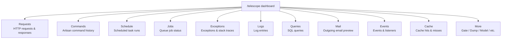
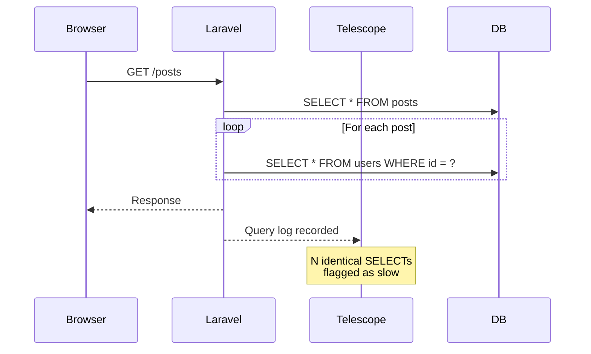

## What is Laravel Telescope

[Laravel Telescope](https://github.com/laravel/telescope) gives you a real-time window into your Laravel application. Open `/telescope` in the browser and you can see every HTTP request, SQL query, exception, queued job, outgoing email, cache operation, and more — all without touching your code.

<Warning>
  Telescope is a **development-only** tool. Always install it with the `--dev` flag to prevent it from being deployed to production.
</Warning>

Instead of scattering `dd()` calls and log statements, Telescope lets you observe what is happening from a single dashboard. This article walks through installation, the most useful watchers, and a practical debugging example.

---

## Installation

### Installing as a development dependency

```shell
composer require laravel/telescope --dev
```

The `--dev` flag adds Telescope to `require-dev` in `composer.json`. Running `composer install --no-dev` on your production server will skip it entirely.

Next, publish the assets and run the migrations.

```shell
php artisan telescope:install

php artisan migrate
```

`telescope:install` creates the following files.

- `config/telescope.php` — watcher configuration
- `app/Providers/TelescopeServiceProvider.php` — authorization gate and entry filtering
- `public/vendor/telescope/` — dashboard assets

After the migration, visit `/telescope` to open the dashboard.

### Keeping Telescope out of production

Because you installed with `--dev`, Telescope will not be auto-discovered in environments where it is not installed. To make this explicit, remove the `TelescopeServiceProvider` from `bootstrap/providers.php` and register it manually in `AppServiceProvider` instead.

```php
// app/Providers/AppServiceProvider.php

public function register(): void
{
    if ($this->app->environment('local') && class_exists(\Laravel\Telescope\TelescopeServiceProvider::class)) {
        $this->app->register(\Laravel\Telescope\TelescopeServiceProvider::class);
        $this->app->register(TelescopeServiceProvider::class);
    }
}
```

Also exclude it from auto-discovery in `composer.json`.

```json
"extra": {
    "laravel": {
        "dont-discover": [
            "laravel/telescope"
        ]
    }
}
```

With this setup, Telescope only registers in the `local` environment and never affects production code paths.

---

## Dashboard overview

After installing, the `/telescope` dashboard is organized into watchers — one per type of application activity.



Click any entry to see full details. For requests, the detail view shows every SQL query, cache operation, and event that occurred during that request.

---

## Key watchers

### Requests — full HTTP request and response details

Every incoming request is recorded with its URL, method, response status, execution time, request payload, session data, and authenticated user. When a request returns an unexpected status or takes too long, this is the first place to look.

### Queries — SQL and N+1 detection

The query watcher records every SQL statement along with its execution time. Slow queries are highlighted.

<Tip>
  You can adjust the slow query threshold in `config/telescope.php`. The default is 100 milliseconds.

  ```php
  'watchers' => [
      Watchers\QueryWatcher::class => [
          'enabled' => env('TELESCOPE_QUERY_WATCHER', true),
          'slow' => 100,
      ],
  ],
  ```
</Tip>

When a posts listing page fires one query per post to fetch the author's name, you will see dozens of nearly identical SELECT statements in the query list for that request. That is the N+1 problem made visible.

```php
// N+1 — one extra query per post
$posts = Post::all();
foreach ($posts as $post) {
    echo $post->user->name;
}

// Fixed with eager loading — two queries total
$posts = Post::with('user')->get();
```

### Exceptions — stack traces in the browser

Reportable exceptions are recorded with their full stack trace. When something throws locally, you can check the Exceptions tab instead of switching to the terminal.

### Mail — preview outgoing email

The mail watcher shows a rendered preview of every email your application sends, along with the recipients and subject. You can also download the email as an `.eml` file.

<Info>
  Pairing Telescope with a local SMTP catcher like [Mailpit](https://mailpit.axllent.org/) gives you the most complete local email workflow.
</Info>

### Jobs — queue job tracking

Dispatched, processed, and failed jobs all appear here with their payload and, for failures, the full exception. Essential when debugging async processes that are hard to observe otherwise.

### Cache — hit and miss tracking

Every cache read (hit or miss), write, and delete is recorded. Use this when you suspect a cache key is not being set or is expiring sooner than expected.

### Commands and Schedule — execution history

The command watcher records arguments, options, exit codes, and output for every Artisan command run. The schedule watcher shows which scheduled tasks ran and whether they completed successfully.

### Events — event and listener tracing

Dispatched events and their listeners are recorded here. Useful when debugging event-driven flows where it is not obvious whether an event fired or which listener handled it.

---

## Configuring filtering

The `filter` closure in `TelescopeServiceProvider::register` controls which entries are recorded. The default records everything in the `local` environment and only exceptions, failed jobs, scheduled tasks, and slow queries elsewhere.

```php
use Laravel\Telescope\IncomingEntry;
use Laravel\Telescope\Telescope;

public function register(): void
{
    $this->hideSensitiveRequestDetails();

    Telescope::filter(function (IncomingEntry $entry) {
        if ($this->app->environment('local')) {
            return true;
        }

        return $entry->isReportableException() ||
            $entry->isFailedJob() ||
            $entry->isScheduledTask() ||
            $entry->isSlowQuery() ||
            $entry->hasMonitoredTag();
    });
}
```

If certain watchers produce too much noise, disable them individually in `config/telescope.php`.

```php
'watchers' => [
    Watchers\CacheWatcher::class => false, // disabled
    Watchers\QueryWatcher::class => true,
    // ...
],
```

---

## Data pruning

The `telescope_entries` table fills up quickly. Schedule the `telescope:prune` command to run daily.

```php
use Illuminate\Support\Facades\Schedule;

Schedule::command('telescope:prune')->daily();
```

By default, entries older than 24 hours are deleted. Use `--hours` to adjust the retention period.

```php
Schedule::command('telescope:prune --hours=48')->daily();
```

---

## Production access control

In non-local environments, the dashboard is protected by an authorization gate defined in `TelescopeServiceProvider`. Modify the gate to allow access to specific users.

```php
use App\Models\User;

protected function gate(): void
{
    Gate::define('viewTelescope', function (User $user) {
        return in_array($user->email, [
            'developer@example.com',
        ]);
    });
}
```

<Warning>
  Verify that `APP_ENV=production` is set in your production environment. If it remains `local`, the Telescope dashboard is publicly accessible.
</Warning>

---

## Practical example: finding and fixing N+1 queries

Here is a typical debugging flow using Telescope.



<Steps>
  <Step title="Find the slow request">
    Open `/telescope` and go to the Requests tab. Sort by duration to find the slowest request.
  </Step>
  <Step title="Inspect the query list">
    Click the request to open its detail view. In the Queries section, look for a pattern of identical SELECT statements repeating many times.
  </Step>
  <Step title="Add eager loading and verify">
    Add `with()` to the Eloquent query in your code. Reload the page and check the Requests detail again. The query count should drop from N+1 to 2.
  </Step>
</Steps>

This entire investigation takes place in the browser without adding any debug code to the application.

---

## Summary

| Watcher | Primary use |
|---------|-------------|
| Requests | Full HTTP request and response details |
| Queries | N+1 detection and slow query identification |
| Exceptions | Exception recording with stack traces |
| Mail | Outgoing email preview |
| Jobs | Queue job status and failure tracking |
| Cache | Cache hit/miss visibility |
| Commands | Artisan command execution history |
| Events | Event and listener tracing |
| Schedule | Scheduled task run results |

Telescope replaces ad hoc debugging with a persistent, structured view of your application's activity. The query-to-request relationship is especially valuable for performance work. Keep it running in your local environment and you will spend less time guessing and more time building.

<Card title="Laravel Telescope documentation" icon="book-open" href="https://laravel.com/docs/telescope">
  Filtering, tagging, and the full watcher configuration reference.
</Card>
