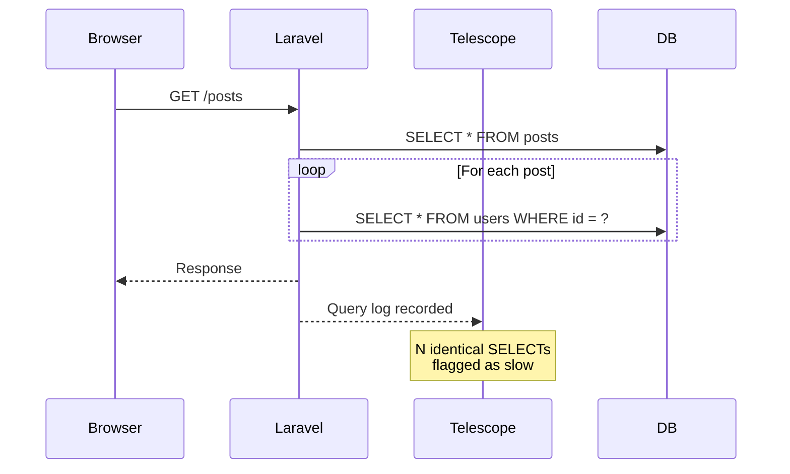

For installation and watcher configuration, see the [guide page](/en/telescope). This post covers practical patterns for getting the most out of Telescope during local development.

Telescope is a **local development tool**. For production monitoring, use [Laravel Pulse](/en/pulse) or [Laravel Nightwatch](/en/blog/nightwatch-introduction).

---

## A systematic workflow for N+1 detection

Telescope makes N+1 debugging a structured three-step process rather than a guessing game.



<Steps>
  <Step title="Find the slow request">
    Open `/telescope` and go to the Requests tab. Sort by duration to find the slowest request.
  </Step>
  <Step title="Inspect the query list">
    Click the request to open its detail view. Look for a pattern of nearly identical SELECT statements repeating many times.
  </Step>
  <Step title="Add eager loading and verify">
    Add `with()` to the Eloquent query in your code. Reload the page and check the Requests detail again. The query count should drop from N+1 to 2.
  </Step>
</Steps>

```php
// N+1 — one extra query per post
$posts = Post::all();
foreach ($posts as $post) {
    echo $post->user->name;
}

// Fixed with eager loading — two queries total
$posts = Post::with('user')->get();
```

The entire investigation takes place in the browser without adding any debug code to the application.

---

## Tag-based tracking for targeted filtering

Telescope supports **tags** on entries. Calling `Telescope::tag()` lets you attach arbitrary strings to entries, which you can then use to filter the dashboard to exactly what you care about.

This is especially useful when you want to isolate all activity related to a specific user ID or order ID.

```php
use Laravel\Telescope\IncomingEntry;
use Laravel\Telescope\Telescope;

// Override the tags method in TelescopeServiceProvider
Telescope::tag(function (IncomingEntry $entry) {
    if ($entry->type === 'request') {
        return array_filter([
            'status:' . $entry->content['response_status'],
            auth()->check() ? 'user:' . auth()->id() : null,
        ]);
    }

    return [];
});
```

With this in place, typing `user:42` into the search bar on `/telescope/requests` instantly filters to only that user's requests.

### Automatic model tags

You can also implement the `HasTags` contract on a model so that Telescope automatically tags every entry associated with that model.

```php
class Order extends Model implements \Laravel\Telescope\Contracts\HasTags
{
    public function telescopeTags(): array
    {
        return ['order:' . $this->id];
    }
}
```

---

## Using the Dump watcher

Using `dump()` in a controller pollutes the HTML response and breaks JSON APIs. The Telescope Dump watcher solves this by capturing `dump()` output in the dashboard rather than inline in the response.

Open the Dump tab in `/telescope` first, then call `dump()` in your code.

```php
public function index()
{
    $users = User::with('posts')->get();
    dump($users->first()->toArray()); // appears in Telescope Dump tab, not in response
    return response()->json($users);
}
```

Unlike `dd()`, the Dump watcher does not halt execution. You can leave `dump()` calls in place while running a series of requests and review all the captured output at once.

---

## Pairing Telescope with Mailpit

The Mail watcher shows rendered previews of outgoing emails directly in the Telescope dashboard. Combine it with [Mailpit](https://mailpit.axllent.org/) for the most complete local email workflow.

```ini
# .env
MAIL_MAILER=smtp
MAIL_HOST=127.0.0.1
MAIL_PORT=1025
```

Telescope gives you the HTML and text body of each email. Mailpit additionally shows headers, attachments, and spam scores, and lets you forward test emails to a real inbox when needed.

<Tip>
  Always use a local SMTP catcher in development to prevent accidentally sending emails to real addresses.
</Tip>

---

## Debugging event-driven flows

When debugging event-driven code, the two most common questions are "did the event fire?" and "which listener handled it?". The Events watcher answers both without requiring any log statements.

If a listener is not being called, check the Telescope Events tab:

- Event appears but no listener is shown → the listener is not registered (check `EventServiceProvider`)
- Event does not appear at all → the `event()` call is not being reached

```php
event(new OrderShipped($order));
// → Check /telescope/events to confirm OrderShipped was dispatched
// → Confirm SendShippingConfirmation listener appears in the entry
```

---

## Queue job debugging with sync driver

Async jobs are hard to trace because they run in a separate process. Temporarily switching to the sync queue driver makes jobs run inline during the request, so they appear in the same Telescope request entry as the controller that dispatched them.

```ini
# .env (local debugging only)
QUEUE_CONNECTION=sync
```

Failed jobs show the full stack trace in the Jobs tab. This is faster than checking `queue:failed` entries and reconstructing the context manually.

---

## HTTP client request inspection

When integrating with external APIs, the HTTP Client watcher records every outgoing `Http::` request with its URL, headers, response status, body, and duration.

```php
$response = Http::get('https://api.example.com/users');
// → Check /telescope/client-requests for the full request and response
```

This eliminates the need for `dd($response->json())` calls when investigating unexpected API responses.

---

## Summary

| Technique | What it solves |
|-----------|---------------|
| N+1 workflow | Find and fix query problems without debug code |
| Tag-based tracking | Filter to a specific user or model instantly |
| Dump watcher | Capture dump output without breaking responses |
| Mailpit pairing | Complete local email debugging without real sends |
| Events watcher | Confirm event firing and listener registration visually |
| Jobs + sync driver | Trace async jobs inline with their dispatching request |
| HTTP client watcher | Inspect outgoing API calls without `dd()` |

<Columns cols={2}>
  <Card title="Laravel Telescope guide" icon="telescope" href="/en/telescope">
    Installation and watcher configuration reference.
  </Card>
  <Card title="Laravel Nightwatch" icon="moon" href="/en/blog/nightwatch-introduction">
    For production monitoring, use Nightwatch.
  </Card>
</Columns>
