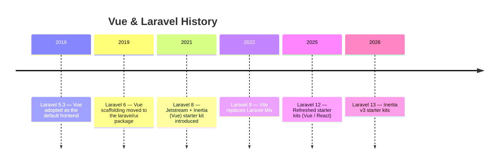
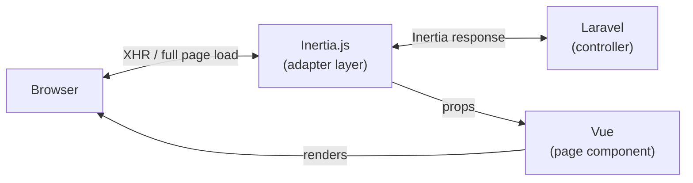

## What is Vue.js?

Vue.js (Vue) is a progressive JavaScript framework for building user interfaces. "Progressive" means you can start small and add features as you need them — from sprinkling reactivity into an existing HTML page to building a full SPA.

The core of Vue is **reactivity**: when your data changes, the DOM updates automatically. You never need to manually track which element to update and when.

<Info>
  This page covers Vue 3 paired with Inertia v3. Laravel 13 starter kits use this combination by default.
</Info>

### Options API vs Composition API

Vue 3 offers two styles for writing components: **Options API** and **Composition API**.

**Options API** is the traditional style carried over from Vue 2. You define your component using an options object with keys like `data`, `methods`, `computed`, and `mounted`.

```vue
<!-- Options API example -->
<script>
export default {
    data() {
        return { count: 0 }
    },
    methods: {
        increment() {
            this.count++
        }
    }
}
</script>

<template>
    <button @click="increment">{{ count }}</button>
</template>
```

**Composition API** was introduced in Vue 3. Combined with `<script setup>` syntax, it lets you write more concise components with better logic reuse and TypeScript support.

```vue
<!-- Composition API (<script setup>) example -->
<script setup>
import { ref } from 'vue'

const count = ref(0)

function increment() {
    count.value++
}
</script>

<template>
    <button @click="increment">{{ count }}</button>
</template>
```

<Tip>
  The Inertia × Laravel starter kits use Composition API with `<script setup>` as the standard style. All examples on this page follow that convention.
</Tip>

---

## Vue in the Laravel Ecosystem

### History

Vue and Laravel go way back. **Laravel 5.3 (2016)** adopted Vue as the default frontend framework. The generated `package.json` included Vue, and a sample `resources/js/components/ExampleComponent.vue` shipped with every new project.



**Laravel 6 (2019)** extracted authentication scaffolding into the separate `laravel/ui` package, taking the Vue scaffolding with it. Today, the recommended approach is to choose Inertia + Vue through the `laravel new` starter kit prompt.

### The modern approach: Inertia × Vue

The mainstream way to use Vue with Laravel is **Inertia × Vue**. Inertia lets you pass data directly from a Laravel controller to a Vue component — no API design required. This "modern monolith" architecture gives you SPA-like UX without the overhead of a separate API layer.



---

## Setup

### Via starter kit (recommended)

For new projects, the starter kit is the fastest path.

```shell
laravel new my-app
```

Select **Vue** at the interactive prompt. The following are set up for you automatically:

- `inertiajs/inertia-laravel` (server-side adapter)
- `@inertiajs/vue3` (client-side adapter)
- `vue` (Vue 3 core)
- `@vitejs/plugin-vue` (Vite plugin)
- `HandleInertiaRequests` middleware
- Authentication pages (login, register) built with Inertia + Vue

### Manual installation

To add Vue to an existing project, install the server-side and client-side packages separately.

```shell
# Server side (PHP)
composer require inertiajs/inertia-laravel

# Client side (JavaScript)
npm install @inertiajs/vue3 vue
npm install --save-dev @vitejs/plugin-vue
```

Add the Vue plugin to `vite.config.js`:

```js
import { defineConfig } from 'vite'
import laravel from 'laravel-vite-plugin'
import vue from '@vitejs/plugin-vue'

export default defineConfig({
    plugins: [
        laravel({
            input: ['resources/css/app.css', 'resources/js/app.js'],
            refresh: true,
        }),
        vue({
            template: {
                transformAssetUrls: {
                    base: null,
                    includeAbsolute: false,
                },
            },
        }),
    ],
})
```

Bootstrap the Inertia app in `resources/js/app.js`:

```js
import { createApp, h } from 'vue'
import { createInertiaApp } from '@inertiajs/vue3'
import { resolvePageComponent } from 'laravel-vite-plugin/inertia-helpers'

createInertiaApp({
    resolve: (name) =>
        resolvePageComponent(
            `./pages/${name}.vue`,
            import.meta.glob('./pages/**/*.vue'),
        ),
    setup({ el, App, props, plugin }) {
        createApp({ render: () => h(App, props) })
            .use(plugin)
            .mount(el)
    },
})
```

<Info>
  For the full manual setup (root template, middleware registration, etc.) refer to the [Inertia documentation](https://inertiajs.com/installation).
</Info>

---

## Directory Structure

Starter kits place Vue page components under `resources/js/pages/`.

```
resources/js/
├── app.js             # Inertia app entry point
├── bootstrap.js
├── components/        # Reusable UI components
│   ├── NavBar.vue
│   └── ...
├── layouts/           # Layout components
│   ├── AppLayout.vue
│   └── AuthLayout.vue
└── pages/             # Inertia page components (mapped to controller names)
    ├── Auth/
    │   ├── Login.vue
    │   └── Register.vue
    ├── Dashboard.vue
    └── Posts/
        ├── Index.vue
        ├── Create.vue
        └── Show.vue
```

`Inertia::render('Posts/Index', [...])` maps to `resources/js/pages/Posts/Index.vue`.

---

## Page Components

Inertia page components are ordinary Vue components. Data passed from a Laravel controller arrives as props.

### Controller

```php
// app/Http/Controllers/PostController.php
use Inertia\Inertia;
use App\Models\Post;

class PostController extends Controller
{
    public function index()
    {
        return Inertia::render('Posts/Index', [
            'posts' => Post::latest()->paginate(10),
        ]);
    }
}
```

### Vue page component

```vue
<!-- resources/js/pages/Posts/Index.vue -->
<script setup>
import { Link } from '@inertiajs/vue3'

defineProps({
    posts: Object,
})
</script>

<template>
    <div>
        <h1>Posts</h1>
        <article v-for="post in posts.data" :key="post.id">
            <h2>
                <Link :href="`/posts/${post.id}`">{{ post.title }}</Link>
            </h2>
            <p>{{ post.created_at }}</p>
        </article>
    </div>
</template>
```

Declare props with `defineProps()` and the data from your controller is immediately available in the template — no REST API needed.

---

## The `Link` Component

Use `<Link>` from `@inertiajs/vue3` to navigate between pages via XHR, avoiding full browser reloads.

```vue
<script setup>
import { Link } from '@inertiajs/vue3'
</script>

<template>
    <!-- Basic link -->
    <Link href="/posts">All posts</Link>

    <!-- DELETE via a button -->
    <Link href="/posts/1" method="delete" as="button" type="button">
        Delete
    </Link>

    <!-- Preload on hover -->
    <Link href="/posts/1" preload>View post</Link>
</template>
```

`<Link>` looks just like a regular `<a>` tag, but Inertia swaps only the page component behind the scenes, giving you instant, SPA-like navigation.

---

## `useForm` Helper

Use the `useForm` helper from `@inertiajs/vue3` for form handling. It manages form state, submission, and validation error display with minimal boilerplate.

### Controller

```php
// app/Http/Controllers/PostController.php
class PostController extends Controller
{
    public function store(Request $request)
    {
        $validated = $request->validate([
            'title'   => ['required', 'string', 'max:255'],
            'content' => ['required', 'string'],
        ]);

        Post::create($validated + ['user_id' => auth()->id()]);

        return redirect()->route('posts.index')
            ->with('success', 'Post created.');
    }
}
```

### Vue form component

```vue
<!-- resources/js/pages/Posts/Create.vue -->
<script setup>
import { useForm } from '@inertiajs/vue3'

const form = useForm({
    title: '',
    content: '',
})

function submit() {
    form.post('/posts')
}
</script>

<template>
    <form @submit.prevent="submit">
        <div>
            <label>Title</label>
            <input v-model="form.title" type="text" />
            <p v-if="form.errors.title" class="error">{{ form.errors.title }}</p>
        </div>

        <div>
            <label>Content</label>
            <textarea v-model="form.content"></textarea>
            <p v-if="form.errors.content" class="error">{{ form.errors.content }}</p>
        </div>

        <button type="submit" :disabled="form.processing">
            {{ form.processing ? 'Submitting…' : 'Create post' }}
        </button>
    </form>
</template>
```

Key properties and methods returned by `useForm`:

| Property / Method | Description |
|-------------------|-------------|
| `form.data` | The form data object |
| `form.errors` | Validation errors keyed by field name |
| `form.processing` | `true` while a request is in flight (use to disable the submit button) |
| `form.isDirty` | `true` when the form differs from its initial values |
| `form.post(url)` | Submit via POST |
| `form.put(url)` | Submit via PUT (for updates) |
| `form.delete(url)` | Submit via DELETE |
| `form.reset()` | Reset the form to its initial values |

When validation errors come back, `useForm` preserves the entered values and surfaces the errors. Combined with `v-model`, you get a seamless form experience.

---

## Shared Data

Data that every page needs — the authenticated user, flash messages, etc. — belongs in the `share()` method of your `HandleInertiaRequests` middleware.

```php
// app/Http/Middleware/HandleInertiaRequests.php
use Illuminate\Http\Request;
use Inertia\Middleware;

class HandleInertiaRequests extends Middleware
{
    public function share(Request $request): array
    {
        return array_merge(parent::share($request), [
            'auth' => [
                'user' => $request->user()
                    ? $request->user()->only('id', 'name', 'email')
                    : null,
            ],
            'flash' => [
                'success' => $request->session()->get('success'),
                'error'   => $request->session()->get('error'),
            ],
        ]);
    }
}
```

Access shared data in any Vue component with `usePage()`:

```vue
<script setup>
import { computed } from 'vue'
import { usePage } from '@inertiajs/vue3'

const page = usePage()

const user = computed(() => page.props.auth.user)
const flash = computed(() => page.props.flash)
</script>

<template>
    <header>
        <span v-if="user">{{ user.name }}</span>
        <span v-else>Guest</span>
    </header>

    <div v-if="flash.success" class="alert-success">
        {{ flash.success }}
    </div>
</template>
```

<Info>
  Shared data is included in every request, so keep it minimal. Wrap values in `fn()` for lazy evaluation — they're only resolved when actually accessed.
</Info>

---

## Vue 3 Reactivity Essentials

Here are the Vue 3 reactivity APIs you'll reach for most often when building with Inertia × Vue.

### `ref` — Reactive primitive values

```vue
<script setup>
import { ref } from 'vue'

const count = ref(0)
const isOpen = ref(false)

// Access with .value in script; template unwraps automatically
count.value++
</script>

<template>
    <p>{{ count }}</p>
    <button @click="isOpen = !isOpen">Toggle</button>
</template>
```

### `computed` — Derived state

```vue
<script setup>
import { ref, computed } from 'vue'

const posts = ref([])

const publishedPosts = computed(() =>
    posts.value.filter(post => post.published)
)
</script>
```

### `onMounted` — Run code after mount

```vue
<script setup>
import { onMounted } from 'vue'

onMounted(() => {
    console.log('Component mounted')
})
</script>
```

---

## Summary

Vue.js is a natural fit for Laravel, especially in the Inertia "modern monolith" setup.

| Piece | Role |
|-------|------|
| Laravel controller | Routing, data retrieval, validation |
| `Inertia::render()` | Pass data from the controller to a Vue component |
| Vue page component | Receive props and render the UI |
| `useForm` | Form state management, submission, error display |
| `Link` component | Client-side navigation without full reloads |
| `usePage().props` | Access shared data from any component |

With Inertia × Vue you get the simplicity of Laravel's backend and the reactivity of Vue's UI in one cohesive stack. Run `laravel new` and pick Vue to get authentication pages and the full setup out of the box.

<Card title="Inertia.js Documentation" icon="book-open" href="https://inertiajs.com">
  See the official Inertia v3 docs for the full feature reference.
</Card>
