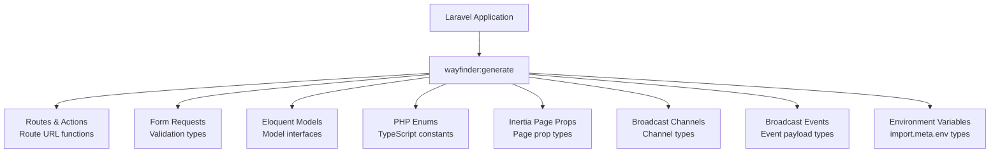

## What is Wayfinder?

**Laravel Wayfinder** is a package that bridges your Laravel backend and TypeScript frontend with zero friction. It automatically generates fully typed TypeScript functions from your controllers and routes, so you can call Laravel endpoints directly as functions from your frontend code.

No more hardcoded URLs, no more manually managing route parameters, no more keeping the frontend in sync with backend changes by hand.

<Info>
  Wayfinder is in beta (currently v0.1.x). The API may change before v1.0.0 is released. All breaking changes are recorded in the [CHANGELOG](https://github.com/laravel/wayfinder/blob/main/CHANGELOG.md).
</Info>

---

## Wayfinder vs. Ziggy

### What is Ziggy?

[Ziggy](https://github.com/tighten/ziggy) has been a widely used route helper in the Laravel ecosystem for years. It exposes Laravel route definitions to JavaScript so you can generate URLs like `route('posts.show', { id: 1 })`.

### Why Wayfinder replaces it

Ziggy represents route names and parameters as strings, which limits TypeScript compatibility. A typo in a route name or a wrong parameter name only surfaces as a runtime error.

Wayfinder takes a TypeScript-first approach and generates controller methods as **importable functions**.

| Feature | Ziggy | Wayfinder |
|---------|-------|-----------|
| Route reference | `route('posts.show', { id: 1 })` | `import { show } from "@/actions/..."` |
| Type safety | Limited type definitions | Full TypeScript types |
| IDE support | Weak autocomplete | Full autocomplete and type checking |
| Tree shaking | All routes in bundle | Only used routes bundled |
| Generation timing | Injected at runtime | Statically generated at build time |

Wayfinder ships as the default in Inertia-based Laravel starter kits (React, Vue, and Svelte).

---

## Installation

### 1. Install the server-side package via Composer

```bash
composer require laravel/wayfinder
```

### 2. Install the Vite plugin via npm

```bash
npm i -D @laravel/vite-plugin-wayfinder
```

### 3. Add the plugin to `vite.config.js`

```ts
import { wayfinder } from "@laravel/vite-plugin-wayfinder";
import { defineConfig } from "vite";
import laravel from "laravel-vite-plugin";

export default defineConfig({
    plugins: [
        laravel({
            input: ["resources/js/app.ts"],
            refresh: true,
        }),
        wayfinder(),
    ],
});
```

With the Vite plugin in place, TypeScript files are automatically regenerated whenever PHP or route files change while the dev server is running.

---

## Generating TypeScript definitions

Run the `wayfinder:generate` Artisan command to generate TypeScript files.

```bash
php artisan wayfinder:generate
```

By default, three directories are created under `resources/js`:

```
resources/js/
├── actions/         # Functions for controller actions
│   └── App/Http/Controllers/
│       └── PostController.ts
├── routes/          # Functions for named routes
│   └── post.ts
└── wayfinder/       # Type definition files
    └── types.ts
```

<Tip>
  The generated files are fully regenerated on every build, so it's a good idea to add them to `.gitignore`. Exclude all three directories: `wayfinder`, `actions`, and `routes`.
</Tip>

To change the output directory, use the `--path` option:

```bash
php artisan wayfinder:generate --path=resources/js/api
```

You can also generate only actions or only routes:

```bash
php artisan wayfinder:generate --skip-actions  # routes only
php artisan wayfinder:generate --skip-routes   # actions only
```

---

## Basic usage

### Importing and using actions

Here's an example that generates the URL for the `show` method on `PostController`.

```ts
import { show } from "@/actions/App/Http/Controllers/PostController";

show(1);
// { url: "/posts/1", method: "get" }
```

When you only need the URL string, use `.url()`:

```ts
show.url(1); // "/posts/1"
```

You can also target a specific HTTP method:

```ts
show.head(1); // { url: "/posts/1", method: "head" }
```

### Passing parameters

Wayfinder functions accept parameters in several formats:

```ts
import { update } from "@/actions/App/Http/Controllers/PostController";

// Single parameter
show(1);
show({ id: 1 });

// Multiple parameters
update([1, 2]);
update({ post: 1, author: 2 });
update({ post: { id: 1 }, author: { id: 2 } });
```

If the route uses explicit key binding (`/posts/{post:slug}`), you can pass the bound value:

```ts
// For a route like /posts/{post:slug}
show("my-new-post");
show({ slug: "my-new-post" });
```

### Importing an entire controller

You can import the whole controller and call methods on it:

```ts
import PostController from "@/actions/App/Http/Controllers/PostController";

PostController.show(1);
PostController.index();
```

<Warning>
  Importing the entire controller disables tree shaking, so all actions are included in the bundle. Import actions individually to keep your final bundle size small.
</Warning>

### Single-action controllers

For invokable controllers, call the imported function directly:

```ts
import StorePostController from "@/actions/App/Http/Controllers/StorePostController";

StorePostController(); // { url: "/posts", method: "post" }
```

### Named routes

To access routes by name, use the files under `routes/`:

```ts
import { show } from "@/routes/post";

// For a route named `post.show`
show(1); // { url: "/posts/1", method: "get" }
```

### Query parameters

All Wayfinder functions accept a `query` option to append query parameters:

```ts
import { show } from "@/actions/App/Http/Controllers/PostController";

show(1, { query: { page: 1, sort_by: "name" } });
// { url: "/posts/1?page=1&sort_by=name", method: "get" }
```

Use `mergeQuery` to merge with the current URL's query string:

```ts
// Current URL: /posts/1?page=1&sort_by=category&q=shirt

show.url(1, { mergeQuery: { page: 2, sort_by: "name" } });
// "/posts/1?page=2&sort_by=name&q=shirt"

// Pass null to remove a parameter
show.url(1, { mergeQuery: { sort_by: null } });
// "/posts/1?page=1&q=shirt"
```

### Form variant

For traditional HTML forms, generate with the `--with-form` flag and use the `.form` variant:

```bash
php artisan wayfinder:generate --with-form
```

```tsx
import { store, update } from "@/actions/App/Http/Controllers/PostController";

// React example
const Page = () => (
    <form {...store.form()}>
        {/* <form action="/posts" method="post"> */}
    </form>
);

const EditPage = () => (
    <form {...update.form(1)}>
        {/* <form action="/posts/1?_method=PATCH" method="post"> */}
    </form>
);
```

---

## Using Wayfinder with Inertia

Combining Inertia's form helper with Wayfinder lets you submit forms without writing a single URL string:

```ts
import { useForm } from "@inertiajs/react";
import { store } from "@/actions/App/Http/Controllers/PostController";

const form = useForm({ name: "My Post" });

form.submit(store()); // submits to POST /posts
```

The `Link` component works the same way:

```tsx
import { Link } from "@inertiajs/react";
import { show } from "@/actions/App/Http/Controllers/PostController";

const Nav = () => (
    <Link href={show(1)}>View post</Link>
);
```

---

## Bundled with starter kits

When you run `laravel new` and choose React, Vue, or Svelte, Wayfinder is set up automatically. The starter kit includes:

- Composer package `laravel/wayfinder`
- npm package `@laravel/vite-plugin-wayfinder`
- Plugin already configured in `vite.config.js`
- Generated directories already in `.gitignore`

You can also add Wayfinder to an existing project manually using the steps above.

---

## Handling reserved JavaScript keywords

Controller methods named after reserved words like `delete` or `import` get a `Method` suffix:

```ts
// Controller has a delete method
import { deleteMethod } from "@/actions/App/Http/Controllers/PostController";

deleteMethod(1); // { url: "/posts/1", method: "delete" }
```

---

## Current status (v0.1.x)

The current stable release is on the `v0.1.x` branch. As of early 2026, the latest version is **v0.1.15**.

### v0.1.x changelog highlights

| Version | Highlights |
|---------|-----------|
| v0.1.15 | Laravel 13 support, Blade view crash fix |
| v0.1.13 | TypeScript strict-mode compatibility for query parameters |
| v0.1.7 | Frontend-specified URL default parameters |
| v0.1.6 | Vite plugin added |
| v0.1.5 | PHP 8.2 support, cached route support |
| v0.1.0 | Initial release |

---

## What's coming in the `next` branch

The `next` branch contains the next major version, which significantly expands on v0.1.x.

<Warning>
  The `next` branch is installable with the `dev-next` constraint, but the API is subject to major changes. Not recommended for production.
</Warning>

```bash
composer require laravel/wayfinder:dev-next
```

### Much broader TypeScript generation

Where v0.1.x covers only routes and controller actions, the next version generates TypeScript for all of the following:



### TypeScript types from Form Requests

```php
class StorePostRequest extends FormRequest
{
    public function rules(): array
    {
        return [
            'title'   => ['required', 'string', 'max:255'],
            'content' => ['required', 'string'],
            'tags'    => ['nullable', 'array'],
            'tags.*'  => ['string'],
        ];
    }
}
```

The above Form Request generates the following type:

```ts
export type Request = {
    title: string;
    content: string;
    tags?: string[] | null;
};
```

### TypeScript types from Eloquent models

```php
class User extends Model
{
    protected $casts = [
        'email_verified_at' => 'datetime',
        'is_admin' => 'boolean',
    ];

    public function posts(): HasMany
    {
        return $this->hasMany(Post::class);
    }
}
```

The above model generates types in `types.d.ts`:

```ts
export namespace App.Models {
    export type User = {
        id: number;
        name: string;
        email: string;
        email_verified_at: string | null;
        is_admin: boolean;
        posts: App.Models.Post[];
    };
}
```

### PHP Enums as TypeScript constants

```php
enum PostStatus: string
{
    case Draft = 'draft';
    case Published = 'published';
    case Archived = 'archived';
}
```

Both a type and constants are generated:

```ts
// Type definition (types.d.ts)
export namespace App.Enums {
    export type PostStatus = "draft" | "published" | "archived";
}

// Constants (App/Enums/PostStatus.ts)
export const Draft = "draft";
export const Published = "published";
export const Archived = "archived";

export const PostStatus = { Draft, Published, Archived } as const;
```

### Output directory restructure

In v0.1.x, output is split across `actions/`, `routes/`, and `wayfinder/`. In the next version, everything is consolidated under `resources/js/wayfinder`:

```
resources/js/wayfinder/
├── App/Http/Controllers/
│   └── PostController.ts    # Action functions (actions/ removed)
├── routes/
│   └── post.ts              # Named routes (unchanged)
├── broadcast-channels.ts    # Broadcast channels
├── broadcast-events.ts      # Broadcast events
└── types.d.ts               # All type definitions (was types.ts)
```

### Key changes from v0.1.x to next

- Import paths change from `@/actions/...` to `@/wayfinder/...`
- `--skip-actions`, `--skip-routes`, and `--with-form` flags removed in favor of a config file
- `types.ts` renamed to `types.d.ts`

---

## Summary

Laravel Wayfinder redesigns the "call Laravel routes from JavaScript" experience that Ziggy provided, but with TypeScript-first architecture. By generating importable functions, it delivers full type safety, IDE autocomplete, and tree shaking out of the box.

The current v0.1.x release already handles routes and controller actions with complete type safety, and ships as the default in Inertia-based Laravel starter kits. The `next` branch is evolving toward a far more comprehensive type-safe foundation — covering Form Requests, Eloquent models, Enums, Inertia page props, and more.

<Card title="Laravel Wayfinder on GitHub" icon="github" href="https://github.com/laravel/wayfinder">
  Source code, CHANGELOG, and issues.
</Card>

<Card title="Vite Plugin Wayfinder" icon="bolt" href="https://github.com/laravel/vite-plugin-wayfinder">
  Vite plugin configuration options.
</Card>
