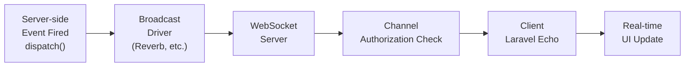

## How broadcasting works

Broadcasting lets your server notify the browser the moment something happens — an order ships, a message arrives, a file finishes processing — without the browser polling for updates.

The flow is:

1. Something happens on the server (a model updates, a job completes).
2. Your code fires a Laravel event that implements `ShouldBroadcast`.
3. Laravel queues a broadcast job and sends the event payload to a WebSocket server.
4. The browser, connected to the same WebSocket server via Laravel Echo, receives the event and updates the UI.

<Info>
  Broadcasting is built on top of Laravel's event system. Events and listeners are the foundation — broadcasting adds a delivery channel. Make sure you're comfortable with [events and listeners](/en/events) before continuing.
</Info>



## Setup

Broadcasting is disabled in new Laravel apps. Enable it with:

```shell
php artisan install:broadcasting
```

This creates `config/broadcasting.php` and `routes/channels.php`, and prompts you to choose a driver.

<Info>
  Before any events can be broadcast, you need a running queue worker. Broadcasting dispatches jobs asynchronously to avoid slowing down your HTTP responses.

  ```shell
  php artisan queue:work
  ```
</Info>

## Laravel Reverb

Reverb is Laravel's official self-hosted WebSocket server, introduced in Laravel 11. It's the recommended driver for most applications — no external service account required.

### Install Reverb

The quickest path installs everything at once:

```shell
php artisan install:broadcasting --reverb
```

Or install manually:

```shell
composer require laravel/reverb
php artisan reverb:install
```

### Environment variables

```ini
BROADCAST_CONNECTION=reverb

REVERB_APP_ID=my-app
REVERB_APP_KEY=my-app-key
REVERB_APP_SECRET=my-app-secret
REVERB_HOST=localhost
REVERB_PORT=8080
REVERB_SCHEME=http

VITE_REVERB_APP_KEY="${REVERB_APP_KEY}"
VITE_REVERB_HOST="${REVERB_HOST}"
VITE_REVERB_PORT="${REVERB_PORT}"
VITE_REVERB_SCHEME="${REVERB_SCHEME}"
```

### Start the Reverb server

```shell
php artisan reverb:start
```

In production, manage this process with Supervisor or a similar daemon manager.

## Channel types

| Channel | Class | Access |
|---|---|---|
| **Public** | `Channel` | Anyone can subscribe, no authentication |
| **Private** | `PrivateChannel` | Authenticated users only; requires an authorization callback |
| **Presence** | `PresenceChannel` | Like private, but exposes who else is in the channel |

## Creating a broadcast event

```shell
php artisan make:event OrderStatusUpdated
```

Implement `ShouldBroadcast` on the generated class:

```php
<?php

namespace App\Events;

use App\Models\Order;
use Illuminate\Broadcasting\Channel;
use Illuminate\Broadcasting\InteractsWithSockets;
use Illuminate\Broadcasting\PrivateChannel;
use Illuminate\Contracts\Broadcasting\ShouldBroadcast;
use Illuminate\Queue\SerializesModels;

class OrderStatusUpdated implements ShouldBroadcast
{
    use InteractsWithSockets, SerializesModels;

    public function __construct(
        public Order $order,
    ) {}

    public function broadcastOn(): Channel
    {
        return new PrivateChannel('orders.' . $this->order->id);
    }
}
```

By default, all `public` properties are included in the broadcast payload. Limit the data with `broadcastWith()`:

```php
public function broadcastWith(): array
{
    return [
        'order_id' => $this->order->id,
        'status'   => $this->order->status,
        'updated'  => $this->order->updated_at->toIso8601String(),
    ];
}
```

Override the event name clients listen for with `broadcastAs()`:

```php
public function broadcastAs(): string
{
    return 'order.status.updated';
}
```

When using a custom name, prefix it with `.` in JavaScript to bypass Echo's default namespace:

```js
Echo.private(`orders.${orderId}`)
    .listen('.order.status.updated', (e) => {
        console.log(e);
    });
```

## Authorizing private channels

Private and presence channels require a server-side authorization check before a client can subscribe. Define authorization callbacks in `routes/channels.php`:

```php
use App\Models\Order;
use App\Models\User;
use Illuminate\Support\Facades\Broadcast;

Broadcast::channel('orders.{orderId}', function (User $user, int $orderId) {
    return $user->id === Order::findOrNew($orderId)->user_id;
});
```

Return `true` (or any truthy value) to allow the subscription; return `false` to deny it. The first parameter is always the authenticated user; subsequent parameters match the wildcards in the channel name.

### Route model binding in channels

Use the model type instead of an ID and Laravel resolves it automatically:

```php
Broadcast::channel('orders.{order}', function (User $user, Order $order) {
    return $user->id === $order->user_id;
});
```

### Channel classes

When your `channels.php` grows, move authorization logic into dedicated classes:

```shell
php artisan make:channel OrderChannel
```

```php
<?php

namespace App\Broadcasting;

use App\Models\Order;
use App\Models\User;

class OrderChannel
{
    public function join(User $user, Order $order): bool
    {
        return $user->id === $order->user_id;
    }
}
```

Register it in `routes/channels.php`:

```php
use App\Broadcasting\OrderChannel;

Broadcast::channel('orders.{order}', OrderChannel::class);
```

## Firing broadcast events

Fire a broadcast event the same way you fire any other Laravel event:

```php
use App\Events\OrderStatusUpdated;

OrderStatusUpdated::dispatch($order);
```

Exclude the current user from receiving their own broadcast (useful in chat or collaborative editing):

```php
broadcast(new OrderStatusUpdated($order))->toOthers();
```

<Warning>
  `toOthers()` requires the event class to use the `InteractsWithSockets` trait.
</Warning>

## Receiving events with Laravel Echo

### Install Echo and set up the client

```shell
npm install --save-dev laravel-echo pusher-js
```

Configure Echo in `resources/js/bootstrap.js`:

```js
import Echo from 'laravel-echo';
import Pusher from 'pusher-js';

window.Pusher = Pusher;

window.Echo = new Echo({
    broadcaster: 'reverb',
    key: import.meta.env.VITE_REVERB_APP_KEY,
    wsHost: import.meta.env.VITE_REVERB_HOST,
    wsPort: import.meta.env.VITE_REVERB_PORT ?? 80,
    wssPort: import.meta.env.VITE_REVERB_PORT ?? 443,
    forceTLS: (import.meta.env.VITE_REVERB_SCHEME ?? 'https') === 'https',
    enabledTransports: ['ws', 'wss'],
});
```

Build your assets after updating the config:

```shell
npm run build
```

### Listening for events

```js
// Public channel — no authentication required
Echo.channel('announcements')
    .listen('AnnouncementPublished', (e) => {
        console.log(e.announcement);
    });

// Private channel — requires authorization
Echo.private(`orders.${orderId}`)
    .listen('OrderStatusUpdated', (e) => {
        document.getElementById('order-status').textContent = e.status;
    });

// Presence channel — track who's online
Echo.join(`chat.${roomId}`)
    .here((users) => {
        console.log('Currently in room:', users);
    })
    .joining((user) => {
        console.log(user.name, 'joined');
    })
    .leaving((user) => {
        console.log(user.name, 'left');
    })
    .listen('MessagePosted', (e) => {
        appendMessage(e.message);
    });
```

### React and Vue hooks

If you're using a React or Vue starter kit, Echo ships composable hooks:

```js
// React
import { useEcho, useEchoPublic } from '@laravel/echo-react';

// Private channel
useEcho(`orders.${orderId}`, 'OrderStatusUpdated', (e) => {
    setStatus(e.status);
});

// Public channel
useEchoPublic('announcements', 'AnnouncementPublished', (e) => {
    addAnnouncement(e.announcement);
});
```

The hook unsubscribes automatically when the component unmounts.

## End-to-end example: real-time order status

<Steps>
  <Step title="Enable broadcasting and start services">
    ```shell
    php artisan install:broadcasting --reverb
    php artisan reverb:start
    php artisan queue:work
    ```
  </Step>

  <Step title="Create the broadcast event">
    ```shell
    php artisan make:event OrderStatusUpdated
    ```

    ```php
    <?php

    namespace App\Events;

    use App\Models\Order;
    use Illuminate\Broadcasting\InteractsWithSockets;
    use Illuminate\Broadcasting\PrivateChannel;
    use Illuminate\Contracts\Broadcasting\ShouldBroadcast;
    use Illuminate\Queue\SerializesModels;

    class OrderStatusUpdated implements ShouldBroadcast
    {
        use InteractsWithSockets, SerializesModels;

        public function __construct(public Order $order) {}

        public function broadcastOn(): PrivateChannel
        {
            return new PrivateChannel('orders.' . $this->order->id);
        }

        public function broadcastWith(): array
        {
            return [
                'order_id' => $this->order->id,
                'status'   => $this->order->status,
            ];
        }
    }
    ```
  </Step>

  <Step title="Authorize the channel">
    ```php
    // routes/channels.php
    use App\Models\Order;
    use App\Models\User;
    use Illuminate\Support\Facades\Broadcast;

    Broadcast::channel('orders.{order}', function (User $user, Order $order) {
        return $user->id === $order->user_id;
    });
    ```
  </Step>

  <Step title="Fire the event when the order changes">
    ```php
    use App\Events\OrderStatusUpdated;

    $order->update(['status' => 'shipped']);

    OrderStatusUpdated::dispatch($order);
    ```
  </Step>

  <Step title="Listen for the event in the browser">
    ```js
    Echo.private(`orders.${orderId}`)
        .listen('OrderStatusUpdated', (e) => {
            document.getElementById('status-badge').textContent = e.status;
        });
    ```
  </Step>
</Steps>

<Tip>
  Verify your `VITE_REVERB_*` environment variables are set before running `npm run build`. Vite inlines these values at build time — they won't be updated by changing `.env` after the build.
</Tip>
