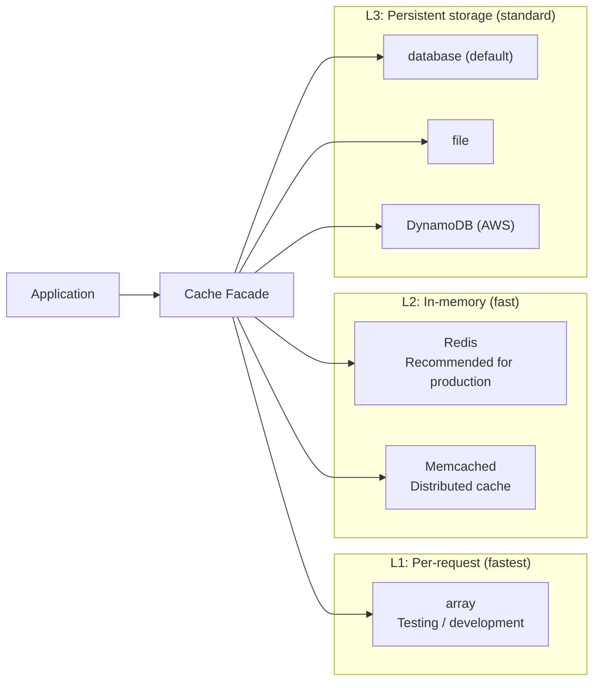
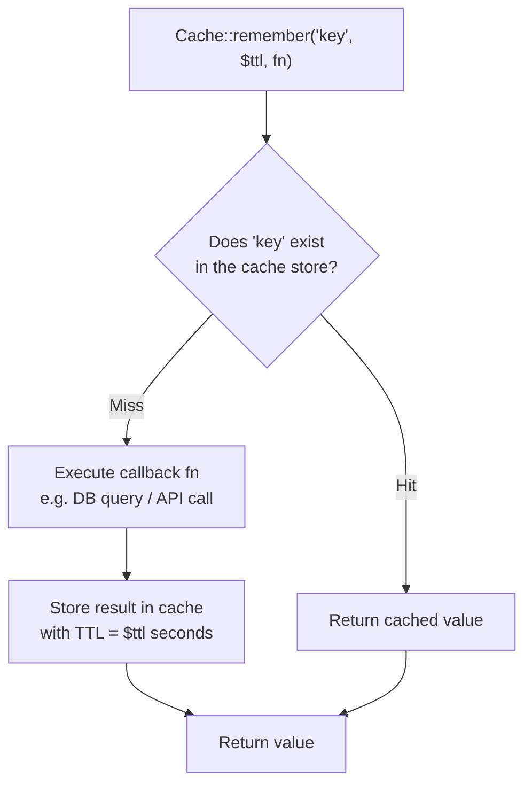
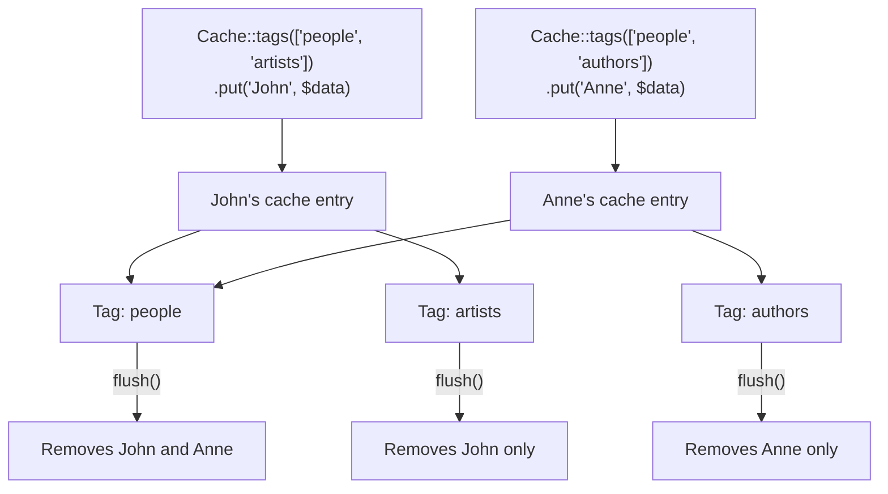

## What is caching?

Some tasks—database queries, external API calls, heavy computations—take time on every request. Caching stores the result so future requests return the data instantly from a fast store like Redis or Memcached.

Laravel provides a unified caching API that works across multiple backends, so you can switch drivers without changing your application code.

## Configuration

Cache configuration lives in `config/cache.php`. Set the default driver with the `CACHE_STORE` environment variable:

```ini
CACHE_STORE=database
# CACHE_STORE=redis
# CACHE_STORE=memcached
```

### Cache driver hierarchy

Choose a driver based on the speed and infrastructure requirements of your application:



### Database driver

The `database` driver stores cached data in a database table. New Laravel projects include the migration automatically. If yours doesn't, create the table:

```shell
php artisan make:cache-table
php artisan migrate
```

### Redis driver

Install Predis and set the driver:

```shell
composer require predis/predis
```

```ini
CACHE_STORE=redis
REDIS_HOST=127.0.0.1
REDIS_PORT=6379
```

## Retrieving items

Use the `Cache` facade to interact with the cache:

```php
use Illuminate\Support\Facades\Cache;

$value = Cache::get('key');

// With a default value if the key is missing:
$value = Cache::get('key', 'default');

// With a closure as the default (only runs if the key is missing):
$value = Cache::get('key', function () {
    return DB::table('settings')->value('theme');
});
```

Check whether a key exists:

```php
if (Cache::has('key')) {
    // ...
}
```

Retrieve and immediately delete an item:

```php
$value = Cache::pull('key');
```

### Accessing multiple stores

Switch stores on the fly with `Cache::store`:

```php
$value = Cache::store('redis')->get('foo');
Cache::store('file')->put('bar', 'baz', 600);
```

## Storing items

```php
// Store for 10 seconds
Cache::put('key', 'value', 10);

// Store for 10 minutes using a DateTime
Cache::put('key', 'value', now()->addMinutes(10));

// Store indefinitely
Cache::put('key', 'value');

// Store only if the key doesn't already exist (atomic)
Cache::add('key', 'value', $seconds);
```

### Retrieve and store (remember)

The most common caching pattern: retrieve from cache, or compute and store if missing:

```php
$users = Cache::remember('users', $seconds, function () {
    return DB::table('users')->get();
});
```

### How remember() works



Store the result forever if it doesn't exist:

```php
$users = Cache::rememberForever('users', function () {
    return DB::table('users')->get();
});
```

### Stale-while-revalidate (flexible)

Serve a slightly stale value while recomputing in the background, so no user waits for recalculation:

```php
// Fresh for 5 seconds, stale-but-served for up to 10 seconds
$users = Cache::flexible('users', [5, 10], function () {
    return DB::table('users')->get();
});
```

## Removing items

```php
// Remove a specific key
Cache::forget('key');

// Retrieve and delete in one step
$value = Cache::pull('key');

// Clear the entire cache store
Cache::flush();
```

## Incrementing and decrementing

Atomically adjust integer values without a full read-write cycle:

```php
Cache::add('api_calls', 0, now()->addHour());

Cache::increment('api_calls');
Cache::increment('api_calls', 5);

Cache::decrement('api_calls');
Cache::decrement('api_calls', 2);
```

## Cache tags

Tags let you group related cache items and flush them together. Tags require a driver that supports them (Redis or Memcached):

```php
// Store with tags
Cache::tags(['people', 'artists'])->put('John', $john, $seconds);
Cache::tags(['people', 'authors'])->put('Anne', $anne, $seconds);

// Retrieve with tags
$john = Cache::tags(['people', 'artists'])->get('John');

// Flush all items tagged with 'people'
Cache::tags('people')->flush();
```

### How cache tags work

Items tagged with multiple tags can be flushed by any of their tags:



## Atomic locks

Atomic locks prevent race conditions when multiple processes compete to perform the same task. The lock is released automatically when the closure finishes, even if an exception is thrown:

```php
use Illuminate\Support\Facades\Cache;

$lock = Cache::lock('processing-order-'.$orderId, 10);

if ($lock->get()) {
    try {
        // Process the order exclusively...
    } finally {
        $lock->release();
    }
}
```

Use `block` to wait for a lock to become available:

```php
Cache::lock('foo', 10)->block(5, function () {
    // Wait up to 5 seconds, then run exclusively...
});
```

### Locks across processes

Acquire a lock in one process and release it in another by passing a token:

```php
// Process 1: acquire and capture the token
$lock = Cache::lock('processing', 120);
$token = $lock->acquire();

// Hand the $token to the job/process that will release it...

// Process 2: release using the token
Cache::restoreLock('processing', $token)->release();
```

## Caching in practice

<Steps>
  <Step title="Identify slow queries">
    Find database calls or API requests that run on every page load with similar inputs.
  </Step>

  <Step title="Wrap with remember">
    ```php
    public function featuredProducts(): Collection
    {
        return Cache::remember('featured-products', now()->addMinutes(30), function () {
            return Product::where('featured', true)
                ->orderByDesc('created_at')
                ->limit(10)
                ->get();
        });
    }
    ```
  </Step>

  <Step title="Invalidate when data changes">
    ```php
    public function update(Request $request, Product $product): RedirectResponse
    {
        $product->update($request->validated());

        Cache::forget('featured-products');

        return redirect()->route('products.index');
    }
    ```
  </Step>
</Steps>

## Cache drivers compared

| Driver | Best for | Notes |
|---|---|---|
| `database` | Simple apps | No extra infrastructure; slower than in-memory |
| `redis` | Production | Fast, supports tags and atomic locks |
| `memcached` | Production | Fast; no persistence |
| `file` | Development | Stores data in files; no memory pressure |
| `array` | Testing | In-memory, never persists between requests |

<Tip>
  For production Redis caching, consider [Laravel Octane](https://laravel.com/docs/octane) paired with Redis to maximize throughput. Use the `array` driver in tests so nothing leaks between test runs.
</Tip>
