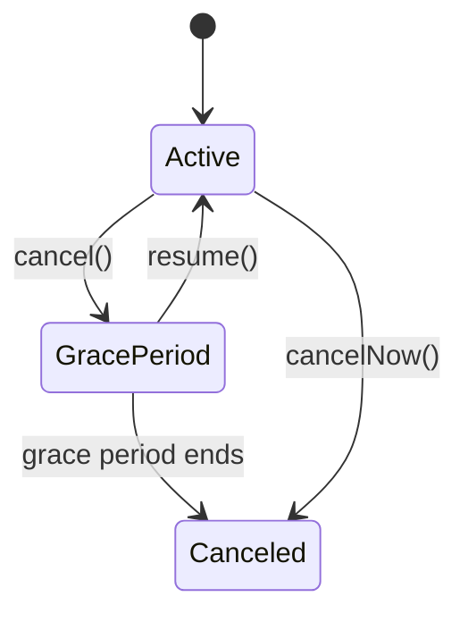

## Overview

Laravel Cashier (Stripe) is Laravel's official package for Stripe billing. You can use it to create and manage subscriptions, run one-time charges, retrieve invoices, and handle Stripe webhooks through a fluent API.

## Installation and configuration

Install Cashier and run its database migrations.

```shell
composer require laravel/cashier
php artisan vendor:publish --tag="cashier-migrations"
php artisan migrate
```

Add the `Billable` trait to your billable model.

```php
<?php

namespace App\Models;

use Illuminate\Foundation\Auth\User as Authenticatable;
use Laravel\Cashier\Billable;

class User extends Authenticatable
{
    use Billable;
}
```

Set Stripe keys in `.env`.

```ini
STRIPE_KEY=your-stripe-key
STRIPE_SECRET=your-stripe-secret
STRIPE_WEBHOOK_SECRET=your-stripe-webhook-secret
```

## Customer management

Use `createOrGetStripeCustomer()` when you want to safely fetch or create the Stripe customer record.

```php
$stripeCustomer = $user->createOrGetStripeCustomer();
```

Use `createAsStripeCustomer()` when you explicitly want to create a customer first.

```php
$stripeCustomer = $user->createAsStripeCustomer();
```

## Subscriptions

### Create a subscription

Create a subscription with `newSubscription()` and `create()`.
Pass a Payment Method ID (for example, from Stripe.js) as `$paymentMethodId`.

```php
$user->newSubscription('default', 'price_monthly')
    ->create($paymentMethodId);
```

`price_monthly` is an example. Use the actual Stripe Price ID from your Stripe dashboard.

### Check status

Use `subscribed()` to check whether a user currently has an active subscription.

```php
if ($user->subscribed('default')) {
    // Active subscription...
}
```

### Cancel and resume

```php
$user->subscription('default')->cancel();

if ($user->subscription('default')->onGracePeriod()) {
    // The user is on the grace period...
}

$user->subscription('default')->resume();
```



## One-time charges

Use `charge()` for one-time billing. Pass the amount in the lowest currency denomination (for example, `100` means `$1.00` in USD). Use a Stripe Payment Method ID as `$paymentMethodId`.

```php
use Exception;

try {
    $payment = $user->charge(100, $paymentMethodId);
} catch (Exception $e) {
    // Charge failed...
}
```

## Invoices

Retrieve invoices with `invoices()`.

```php
$invoices = $user->invoices();
```

To generate downloadable PDFs, install `dompdf/dompdf` and call `downloadInvoice()`. Pass an invoice ID from the `invoices()` collection as `$invoiceId`.

```shell
composer require dompdf/dompdf
```

```php
return $user->downloadInvoice($invoiceId);
```

## Webhook setup

Cashier automatically registers a Stripe webhook route and uses `/stripe/webhook` by default. Configure this URL in your Stripe dashboard.

You can create the webhook through Artisan.

```shell
php artisan cashier:webhook
```

Exclude `stripe/*` from CSRF protection.

```php
->withMiddleware(function (Middleware $middleware): void {
    $middleware->preventRequestForgery(except: [
        'stripe/*',
    ]);
})
```

Set `STRIPE_WEBHOOK_SECRET` in `.env` so Cashier can validate webhook signatures.
