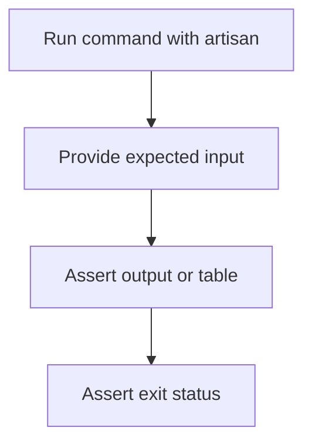

# Console Tests

Laravel provides a fluent API for testing Artisan commands, including interactive prompts and command output.

<Info>
This page follows Laravel's latest console testing APIs, including `expectsSearch` for Laravel Prompts search interactions.
</Info>

## Introduction

Use the test runner's `artisan` method to execute a command and chain expectations:

<Tabs>
  <Tab title="Pest">

  ```php
  test('question command', function () {
      $this->artisan('question')
          ->expectsQuestion('What is your name?', 'Taylor Otwell')
          ->expectsQuestion('Which language do you prefer?', 'PHP')
          ->expectsOutput('Your name is Taylor Otwell and you prefer PHP.')
          ->doesntExpectOutput('Your name is Taylor Otwell and you prefer Ruby.')
          ->assertExitCode(0);
  });
  ```

  </Tab>
  <Tab title="PHPUnit">

  ```php
  public function test_question_command(): void
  {
      $this->artisan('question')
          ->expectsQuestion('What is your name?', 'Taylor Otwell')
          ->expectsQuestion('Which language do you prefer?', 'PHP')
          ->expectsOutput('Your name is Taylor Otwell and you prefer PHP.')
          ->doesntExpectOutput('Your name is Taylor Otwell and you prefer Ruby.')
          ->assertExitCode(0);
  }
  ```

  </Tab>
</Tabs>



## Success / Failure Expectations

Use exit-status assertions to verify whether a command succeeded or failed:

```php
$this->artisan('inspire')->assertExitCode(0);
$this->artisan('inspire')->assertSuccessful();
$this->artisan('inspire')->assertFailed();
```

## Input / Output Expectations

### Input expectations

You can mock user interactions with questions and searchable prompts:

```php
$this->artisan('example')
    ->expectsQuestion('What is your name?', 'Taylor Otwell')
    ->expectsSearch('What is your name?', search: 'Tay', answers: [
        'Taylor Otwell',
        'Taylor Swift',
        'Darian Taylor',
    ], answer: 'Taylor Otwell')
    ->assertExitCode(0);
```

### Output expectations

Use output assertions to verify exact strings, partial strings, and table rendering:

```php
$this->artisan('users:all')
    ->expectsOutput('The expected output')
    ->doesntExpectOutput('Unexpected output')
    ->expectsOutputToContain('expected')
    ->expectsTable([
        'ID',
        'Email',
    ], [
        [1, 'taylor@example.com'],
        [2, 'abigail@example.com'],
    ])
    ->assertExitCode(0);
```

## Confirmation Expectations

For yes/no prompts, use `expectsConfirmation`:

```php
$this->artisan('module:import')
    ->expectsConfirmation('Do you really wish to run this command?', 'no')
    ->assertExitCode(1);
```

## Console Events

By default, `CommandStarting` and `CommandFinished` are not dispatched during tests.

Use `WithConsoleEvents` when you need to assert console event behavior:

```php
<?php

namespace Tests\Feature;

use Illuminate\Foundation\Testing\WithConsoleEvents;
use Tests\TestCase;

class ConsoleEventTest extends TestCase
{
    use WithConsoleEvents;
}
```

<Tip>
Use `WithConsoleEvents` only in tests that require event assertions, so normal tests stay faster.
</Tip>
