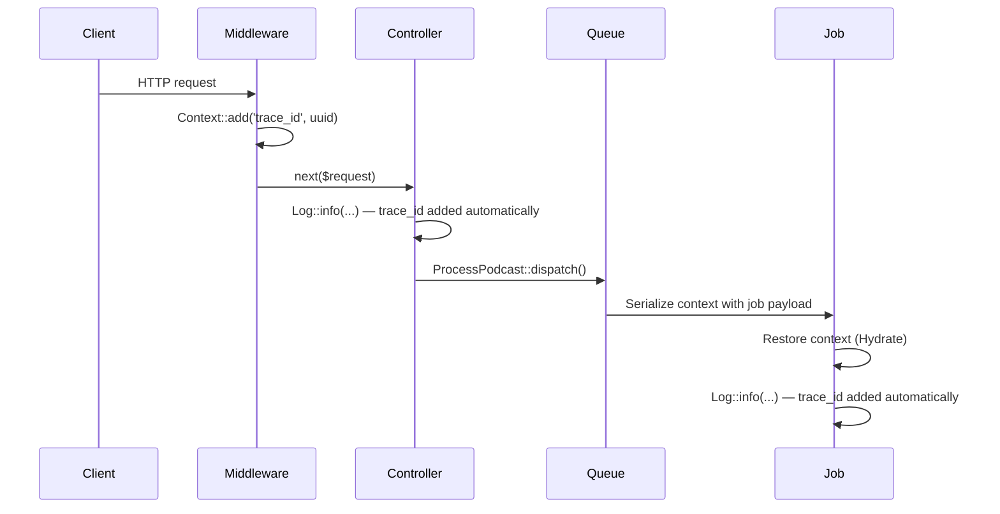

## What is Context?

Laravel's Context feature lets you record and share information across the lifecycle of a request, queued job, or console command. Any data you add through the `Illuminate\Support\Facades\Context` facade is automatically appended as metadata to every log entry your application writes.

This keeps shared information — such as a trace ID — clearly separated from data passed to individual log calls. Context is especially useful for distributed systems where you need to trace a single request through multiple layers, including queued jobs.

### Context propagation flow



## Basic usage

The most common pattern is to set a `trace_id` in middleware so every log entry throughout the request includes it automatically.

<Steps>
  <Step title="Create the middleware">
    ```shell
    php artisan make:middleware AddContext
    ```
  </Step>

  <Step title="Add a trace ID to the context">
    ```php
    <?php

    namespace App\Http\Middleware;

    use Closure;
    use Illuminate\Http\Request;
    use Illuminate\Support\Facades\Context;
    use Illuminate\Support\Str;
    use Symfony\Component\HttpFoundation\Response;

    class AddContext
    {
        public function handle(Request $request, Closure $next): Response
        {
            Context::add('url', $request->url());
            Context::add('trace_id', Str::uuid()->toString());

            return $next($request);
        }
    }
    ```
  </Step>

  <Step title="Register the middleware globally">
    ```php
    // bootstrap/app.php
    ->withMiddleware(function (Middleware $middleware) {
        $middleware->append(\App\Http\Middleware\AddContext::class);
    })
    ```
  </Step>
</Steps>

After this, every log entry includes `url` and `trace_id` automatically:

```php
Log::info('User authenticated.', ['auth_id' => Auth::id()]);
```

```text
User authenticated. {"auth_id":27} {"url":"https://example.com/login","trace_id":"e04e1a11-e75c-4db3-b5b5-cfef4ef56697"}
```

## Writing to the context

### add — store a value

```php
use Illuminate\Support\Facades\Context;

Context::add('key', 'value');

// Add multiple values at once
Context::add([
    'first_key'  => 'value',
    'second_key' => 'value',
]);
```

`add` overwrites any existing value for the same key. To add a value only when the key does not already exist, use `addIf`:

```php
Context::add('key', 'first');
Context::addIf('key', 'second');

Context::get('key');
// "first" — not overwritten
```

### increment / decrement — manage counters

```php
Context::increment('records_added');
Context::increment('records_added', 5);

Context::decrement('records_added');
Context::decrement('records_added', 5);
```

### when — conditional writes

The `when` method calls the first closure when the condition is `true`, and the second when it is `false`:

```php
use Illuminate\Support\Facades\Auth;
use Illuminate\Support\Facades\Context;

Context::when(
    Auth::user()->isAdmin(),
    fn ($context) => $context->add('permissions', Auth::user()->permissions),
    fn ($context) => $context->add('permissions', []),
);
```

### push — append to a stack

Context supports ordered lists called stacks. Items are stored in the order they are added:

```php
Context::push('breadcrumbs', 'first_value');
Context::push('breadcrumbs', 'second_value', 'third_value');

Context::get('breadcrumbs');
// ['first_value', 'second_value', 'third_value']
```

Stacks are useful for capturing a history of events during a request. For example, recording every SQL query:

```php
use Illuminate\Support\Facades\Context;
use Illuminate\Support\Facades\DB;

// Registered in AppServiceProvider boot()
DB::listen(function ($event) {
    Context::push('queries', [$event->time, $event->sql]);
});
```

## Retrieving context

### get / all

```php
$value = Context::get('key');

// Retrieve everything
$data = Context::all();
```

### only / except — retrieve a subset

```php
$data = Context::only(['first_key', 'second_key']);

$data = Context::except(['first_key']);
```

### pull / pop — retrieve and remove

`pull` returns the value and removes it from the context in one step:

```php
$value = Context::pull('key');
```

`pop` removes and returns the last item from a stack:

```php
Context::push('breadcrumbs', 'first_value', 'second_value');

Context::pop('breadcrumbs');
// 'second_value'

Context::get('breadcrumbs');
// ['first_value']
```

### remember — retrieve or set a default

Returns the stored value if it exists; otherwise runs the closure, stores the result, and returns it:

```php
$permissions = Context::remember(
    'user-permissions',
    fn () => $user->permissions,
);
```

### has / missing — check for a key

```php
if (Context::has('key')) {
    // ...
}

if (Context::missing('key')) {
    // ...
}
```

<Info>
  `has` returns `true` even when the stored value is `null`. It checks whether the key is registered, not whether the value is truthy.
</Info>

## Removing context

```php
Context::add(['first_key' => 1, 'second_key' => 2]);

Context::forget('first_key');

Context::all();
// ['second_key' => 2]

// Forget multiple keys at once
Context::forget(['first_key', 'second_key']);
```

## Scoped context

`scope` temporarily modifies the context for the duration of a closure, then restores it to its original state automatically. Use it when you need extra information in your logs for a single isolated operation without affecting the rest of the request.

```php
use Illuminate\Support\Facades\Context;
use Illuminate\Support\Facades\Log;

Context::add('trace_id', 'abc-999');
Context::addHidden('user_id', 123);

Context::scope(
    function () {
        Context::add('action', 'adding_friend');

        $userId = Context::getHidden('user_id');

        Log::debug("Adding user [{$userId}] to friends list.");
        // Adding user [987] to friends list.  {"trace_id":"abc-999","user_name":"taylor_otwell","action":"adding_friend"}
    },
    data: ['user_name' => 'taylor_otwell'],
    hidden: ['user_id' => 987],
);

// After the scope, original values are restored
Context::all();
// ['trace_id' => 'abc-999']

Context::allHidden();
// ['user_id' => 123]
```

<Warning>
  If you mutate an object stored in the context inside a scoped closure, that mutation persists outside the scope. Primitive values are safely restored.
</Warning>

## Hidden context

Store data that should never appear in log output using the hidden context. Hidden values are only accessible through the dedicated `*Hidden` methods and are not written to logs.

```php
use Illuminate\Support\Facades\Context;

Context::addHidden('key', 'value');

Context::getHidden('key');
// 'value'

Context::get('key');
// null — not accessible through regular get
```

The hidden API mirrors the standard context API:

```php
Context::addHidden(/* ... */);
Context::addHiddenIf(/* ... */);
Context::pushHidden(/* ... */);
Context::getHidden(/* ... */);
Context::pullHidden(/* ... */);
Context::popHidden(/* ... */);
Context::onlyHidden(/* ... */);
Context::exceptHidden(/* ... */);
Context::allHidden(/* ... */);
Context::hasHidden(/* ... */);
Context::missingHidden(/* ... */);
Context::forgetHidden(/* ... */);
```

## Passing context to queued jobs

When you dispatch a job to the queue, the current context is automatically serialized and stored with the job payload. When the job runs, the context is restored so any `trace_id` or other values from the original request are available throughout job execution.

```php
// Set in middleware
Context::add('trace_id', Str::uuid()->toString());

// Dispatched in a controller
ProcessPodcast::dispatch($podcast);
```

```php
class ProcessPodcast implements ShouldQueue
{
    use Queueable;

    public function handle(): void
    {
        Log::info('Processing podcast.', ['podcast_id' => $this->podcast->id]);
    }
}
```

```text
Processing podcast. {"podcast_id":95} {"url":"https://example.com/login","trace_id":"e04e1a11-e75c-4db3-b5b5-cfef4ef56697"}
```

The `trace_id` from the HTTP request appears in the queued job's log entry.

### Dehydrating — customize context before dispatch

`Context::dehydrating` registers a closure that runs just before a job is serialized. Use it to capture runtime configuration values that should travel with the job.

```php
// AppServiceProvider.php

use Illuminate\Log\Context\Repository;
use Illuminate\Support\Facades\Config;
use Illuminate\Support\Facades\Context;

public function boot(): void
{
    Context::dehydrating(function (Repository $context) {
        $context->addHidden('locale', Config::get('app.locale'));
    });
}
```

<Warning>
  Inside a `dehydrating` callback, use only the `$context` repository argument — never the `Context` facade. Using the facade modifies the current process's context, not the job payload.
</Warning>

### Hydrated — restore context when a job starts

`Context::hydrated` registers a closure that runs after the context is restored on the queue worker. Use it to apply the restored values back to your application's configuration.

```php
// AppServiceProvider.php

use Illuminate\Log\Context\Repository;
use Illuminate\Support\Facades\Config;
use Illuminate\Support\Facades\Context;

public function boot(): void
{
    Context::hydrated(function (Repository $context) {
        if ($context->hasHidden('locale')) {
            Config::set('app.locale', $context->getHidden('locale'));
        }
    });
}
```

<Warning>
  Inside a `hydrated` callback, use only the `$context` repository argument — never the `Context` facade.
</Warning>

## Summary

<AccordionGroup>
  <Accordion title="Context vs Log::withContext">
    | | `Context` | `Log::withContext` |
    | --- | --- | --- |
    | Scope | All log channels | Current channel only |
    | Queue propagation | Automatic (Dehydrate/Hydrate) | None |
    | Hidden data | Supported | Not supported |
    | Best for | Distributed tracing | Channel-specific metadata |
  </Accordion>

  <Accordion title="What belongs in hidden context">
    Hidden context is never written to logs, making it the right place for:

    - Session IDs or user IDs you don't want in log files
    - API keys or auth tokens that must travel to queue workers
    - Locale and other configuration values needed on the queue
    - Internal flags or state not relevant to log readers
  </Accordion>

  <Accordion title="Common dehydrate / hydrate patterns">
    1. **Locale propagation**: Save `app.locale` as hidden context during dehydration; restore it with `Config::set` during hydration.
    2. **Tenant ID**: Pass the active tenant identifier to queue workers in multi-tenant applications.
    3. **Auth state**: Carry authenticated user information into queued jobs that need it.
  </Accordion>
</AccordionGroup>
