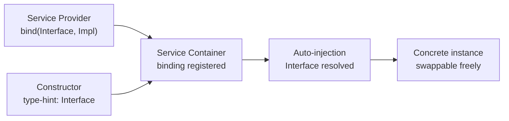

## What are contracts?

Laravel's "contracts" are a set of interfaces that define the core services provided by the framework. For example, `Illuminate\Contracts\Queue\Queue` defines the methods needed for queueing jobs, while `Illuminate\Contracts\Mail\Mailer` defines the methods needed for sending email.

Each contract has a corresponding implementation provided by the framework. Laravel ships a queue implementation with a variety of drivers and a mailer implementation powered by [Symfony Mailer](https://symfony.com/doc/current/mailer.html).

All Laravel contracts live in [their own GitHub repository](https://github.com/illuminate/contracts), which provides a quick reference for all available contracts and a single, decoupled package you can use when building packages that interact with Laravel services.

<Info>
  Contracts are plain PHP interfaces. Laravel resolves the concrete implementation from the service container and injects it wherever you type-hint the interface.
</Info>

## Contracts vs. facades

[Facades](/en/facades) and helper functions let you use Laravel's services without type-hinting anything. In most cases, each facade has an equivalent contract.

| Aspect | Facades | Contracts |
|---|---|---|
| Declaring dependencies | Not required — call from anywhere | Declared explicitly in the constructor |
| Testing | Mock via `shouldReceive()` | Swap via any standard mock library |
| Primary use | Convenience inside your application | Package development, explicit dependency management |
| Readability | One import line | Dependencies visible in the constructor |

<Tip>
  Unlike facades, which require no constructor parameter, contracts let you define explicit dependencies. Some developers prefer this explicitness; others prefer the convenience of facades. **In general, most applications can use facades without issue during development.**
</Tip>

## When to use contracts

Both contracts and facades produce robust, testable Laravel applications—they are not mutually exclusive. You can use facades in some parts of your application and contracts in others.

Contracts are particularly useful when:

- **Building packages that work with multiple PHP frameworks** — use `illuminate/contracts` to define your integration with Laravel services without requiring Laravel's concrete implementations in your `composer.json`.
- **You want explicit dependencies** — a glance at the constructor tells you exactly what a class depends on.
- **You need to swap implementations** — binding a different concrete class in the service container is straightforward when you depend on an interface.

## How to use contracts

Getting a contract implementation is simple. Laravel resolves controllers, event listeners, middleware, queued jobs, and route closures through the [service container](/en/service-container). Type-hint the interface in the constructor of the class being resolved, and the container injects the right value automatically.



For example, this event listener type-hints the `Illuminate\Contracts\Redis\Factory` contract:

```php
<?php

namespace App\Listeners;

use App\Events\OrderWasPlaced;
use App\Models\User;
use Illuminate\Contracts\Redis\Factory;

class CacheOrderInformation
{
    /**
     * Create the event listener.
     */
    public function __construct(
        protected Factory $redis,
    ) {}

    /**
     * Handle the event.
     */
    public function handle(OrderWasPlaced $event): void
    {
        // ...
    }
}
```

When the event listener is resolved, the service container reads the type-hint and injects the appropriate value.

## Defining your own contracts

You can define custom contracts to clarify dependencies between components in your application.

<Steps>
  <Step title="Define the interface">
    Create an interface in `app/Contracts`:

    ```php
    <?php

    namespace App\Contracts;

    interface PaymentGateway
    {
        public function charge(int $amount, string $token): bool;

        public function refund(string $transactionId): bool;
    }
    ```
  </Step>
  <Step title="Create the implementation">
    Write a class that implements the contract:

    ```php
    <?php

    namespace App\Services;

    use App\Contracts\PaymentGateway;

    class StripePaymentGateway implements PaymentGateway
    {
        public function charge(int $amount, string $token): bool
        {
            // Stripe API logic...
            return true;
        }

        public function refund(string $transactionId): bool
        {
            // Stripe API logic...
            return true;
        }
    }
    ```
  </Step>
  <Step title="Bind the contract in a service provider">
    Register the binding in a [service provider](/en/service-providers):

    ```php
    use App\Contracts\PaymentGateway;
    use App\Services\StripePaymentGateway;

    $this->app->singleton(PaymentGateway::class, StripePaymentGateway::class);
    ```
  </Step>
  <Step title="Type-hint in your controller or service">
    ```php
    <?php

    namespace App\Http\Controllers;

    use App\Contracts\PaymentGateway;
    use Illuminate\Http\Request;

    class OrderController extends Controller
    {
        public function __construct(
            protected PaymentGateway $payment,
        ) {}

        public function store(Request $request)
        {
            $this->payment->charge(
                $request->amount,
                $request->payment_token
            );

            // ...
        }
    }
    ```
  </Step>
</Steps>

This pattern means switching from Stripe to another provider only requires changing the binding in one place—no changes to the controller.

## Contract reference

A quick reference for the most commonly used contracts and their corresponding facades:

| Contract | Facade |
|---|---|
| `Illuminate\Contracts\Auth\Access\Gate` | `Gate` |
| `Illuminate\Contracts\Auth\Factory` | `Auth` |
| `Illuminate\Contracts\Bus\Dispatcher` | `Bus` |
| `Illuminate\Contracts\Cache\Factory` | `Cache` |
| `Illuminate\Contracts\Cache\Repository` | `Cache::driver()` |
| `Illuminate\Contracts\Config\Repository` | `Config` |
| `Illuminate\Contracts\Console\Kernel` | `Artisan` |
| `Illuminate\Contracts\Container\Container` | `App` |
| `Illuminate\Contracts\Encryption\Encrypter` | `Crypt` |
| `Illuminate\Contracts\Events\Dispatcher` | `Event` |
| `Illuminate\Contracts\Filesystem\Factory` | `Storage` |
| `Illuminate\Contracts\Filesystem\Filesystem` | `Storage::disk()` |
| `Illuminate\Contracts\Hashing\Hasher` | `Hash` |
| `Illuminate\Contracts\Mail\Mailer` | `Mail` |
| `Illuminate\Contracts\Notifications\Dispatcher` | `Notification` |
| `Illuminate\Contracts\Queue\Factory` | `Queue` |
| `Illuminate\Contracts\Queue\Queue` | `Queue::connection()` |
| `Illuminate\Contracts\Queue\ShouldQueue` | — |
| `Illuminate\Contracts\Redis\Factory` | `Redis` |
| `Illuminate\Contracts\Routing\ResponseFactory` | `Response` |
| `Illuminate\Contracts\Routing\UrlGenerator` | `URL` |
| `Illuminate\Contracts\Session\Session` | `Session::driver()` |
| `Illuminate\Contracts\Translation\Translator` | `Lang` |
| `Illuminate\Contracts\Validation\Factory` | `Validator` |
| `Illuminate\Contracts\View\Factory` | `View` |

The full list is available in the [illuminate/contracts](https://github.com/illuminate/contracts) repository.

<Card title="Facades" icon="layer-group" href="/en/facades">
  Review how facades work and how they compare to contracts.
</Card>
