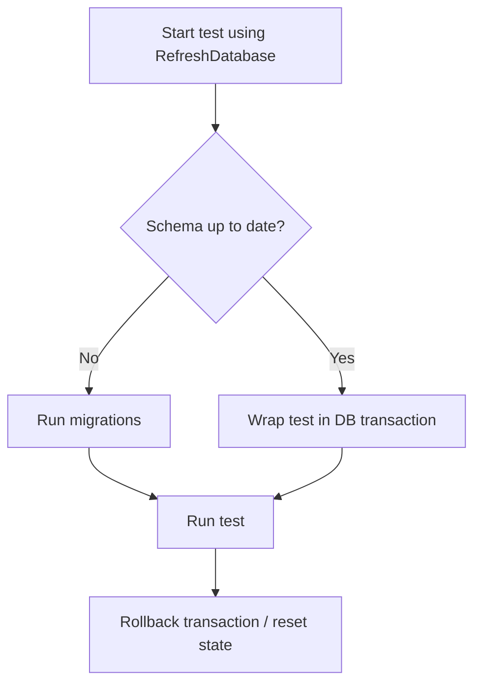

## Introduction

Laravel provides first-class support for testing database-driven applications. You can combine database reset traits, model factories, and test-specific assertions to write fast and reliable feature tests.

In most cases, start with `RefreshDatabase`. It keeps tests isolated while remaining faster than fully rebuilding the database every time.

## Resetting the database after each test

To prevent data from one test affecting another test, use one of Laravel's database reset traits.

<CodeGroup>
```php Pest
<?php

use Illuminate\Foundation\Testing\RefreshDatabase;

uses(RefreshDatabase::class);

test('basic example', function () {
    $response = $this->get('/');

    $response->assertOk();
});
```

```php PHPUnit
<?php

namespace Tests\Feature;

use Illuminate\Foundation\Testing\RefreshDatabase;
use Tests\TestCase;

class ExampleTest extends TestCase
{
    use RefreshDatabase;

    public function test_basic_example(): void
    {
        $response = $this->get('/');

        $response->assertOk();
    }
}
```
</CodeGroup>

`RefreshDatabase` checks whether the database schema is already up to date. If it is, Laravel runs each test in a transaction. If it is not, Laravel runs migrations first.



If you need a full reset strategy instead of transaction-based isolation, use the following traits:

| Trait | Behavior | When to use |
| --- | --- | --- |
| `RefreshDatabase` | Uses transactions if schema is current; migrates when needed | Default choice for most test suites |
| `DatabaseMigrations` | Runs migrations for each test | When you need migration-level lifecycle behavior in every test |
| `DatabaseTruncation` | Truncates tables between tests | When transactions are not suitable and truncation fits your DB workflow |

## Model factories

Before asserting behavior, you often need test data. Laravel model factories provide expressive defaults for creating Eloquent models.

For full factory definitions and advanced states / relationships, see [Eloquent Factories](/en/eloquent-factories).

<CodeGroup>
```php Pest
<?php

use App\Models\User;

test('models can be instantiated', function () {
    $user = User::factory()->create();

    expect($user->exists)->toBeTrue();
});
```

```php PHPUnit
<?php

namespace Tests\Feature;

use App\Models\User;
use Tests\TestCase;

class UserFactoryTest extends TestCase
{
    public function test_models_can_be_instantiated(): void
    {
        $user = User::factory()->create();

        $this->assertTrue($user->exists);
    }
}
```
</CodeGroup>

## Running seeders

Use the `seed()` method to populate data during tests. Without arguments, it runs `DatabaseSeeder`. You can also run a specific seeder class or an array of classes.

<CodeGroup>
```php Pest
<?php

use Database\Seeders\OrderStatusSeeder;
use Database\Seeders\TransactionStatusSeeder;
use Illuminate\Foundation\Testing\RefreshDatabase;

uses(RefreshDatabase::class);

test('orders can be created', function () {
    $this->seed();

    $this->seed(OrderStatusSeeder::class);

    $this->seed([
        OrderStatusSeeder::class,
        TransactionStatusSeeder::class,
    ]);

    // ...
});
```

```php PHPUnit
<?php

namespace Tests\Feature;

use Database\Seeders\OrderStatusSeeder;
use Database\Seeders\TransactionStatusSeeder;
use Illuminate\Foundation\Testing\RefreshDatabase;
use Tests\TestCase;

class OrderTest extends TestCase
{
    use RefreshDatabase;

    public function test_orders_can_be_created(): void
    {
        $this->seed();

        $this->seed(OrderStatusSeeder::class);

        $this->seed([
            OrderStatusSeeder::class,
            TransactionStatusSeeder::class,
        ]);

        // ...
    }
}
```
</CodeGroup>

You may also seed automatically for tests using `RefreshDatabase` by using attributes:

```php
<?php

namespace Tests;

use Illuminate\Foundation\Testing\Attributes\Seed;
use Illuminate\Foundation\Testing\TestCase as BaseTestCase;

#[Seed]
abstract class TestCase extends BaseTestCase
{
}
```

To run a specific seeder automatically, use `#[Seeder(...)]`:

```php
<?php

namespace Tests\Feature;

use Database\Seeders\OrderStatusSeeder;
use Illuminate\Foundation\Testing\Attributes\Seeder;
use Illuminate\Foundation\Testing\RefreshDatabase;
use Tests\TestCase;

#[Seeder(OrderStatusSeeder::class)]
class OrderStatusTest extends TestCase
{
    use RefreshDatabase;
}
```

## Available assertions

Laravel provides dedicated database assertions for both Pest and PHPUnit feature tests.

### `assertDatabaseCount`

Assert that a table contains the expected number of records.

<CodeGroup>
```php Pest
$this->assertDatabaseCount('users', 5);
```

```php PHPUnit
$this->assertDatabaseCount('users', 5);
```
</CodeGroup>

### `assertDatabaseEmpty`

Assert that a table contains no records.

<CodeGroup>
```php Pest
$this->assertDatabaseEmpty('users');
```

```php PHPUnit
$this->assertDatabaseEmpty('users');
```
</CodeGroup>

### `assertDatabaseHas`

Assert that a table contains records matching the given attributes.

<CodeGroup>
```php Pest
$this->assertDatabaseHas('users', [
    'email' => 'sally@example.com',
]);
```

```php PHPUnit
$this->assertDatabaseHas('users', [
    'email' => 'sally@example.com',
]);
```
</CodeGroup>

### `assertDatabaseMissing`

Assert that a table does not contain records matching the given attributes.

<CodeGroup>
```php Pest
$this->assertDatabaseMissing('users', [
    'email' => 'sally@example.com',
]);
```

```php PHPUnit
$this->assertDatabaseMissing('users', [
    'email' => 'sally@example.com',
]);
```
</CodeGroup>

### `assertSoftDeleted`

Assert that the given model has been soft deleted.

<CodeGroup>
```php Pest
$this->assertSoftDeleted($user);
```

```php PHPUnit
$this->assertSoftDeleted($user);
```
</CodeGroup>

### `assertNotSoftDeleted`

Assert that the given model has not been soft deleted.

<CodeGroup>
```php Pest
$this->assertNotSoftDeleted($user);
```

```php PHPUnit
$this->assertNotSoftDeleted($user);
```
</CodeGroup>

### `assertModelExists`

Assert that the given model (or collection of models) exists in the database.

<CodeGroup>
```php Pest
<?php

use App\Models\User;

$user = User::factory()->create();

$this->assertModelExists($user);
```

```php PHPUnit
<?php

use App\Models\User;

$user = User::factory()->create();

$this->assertModelExists($user);
```
</CodeGroup>

### `assertModelMissing`

Assert that the given model (or collection of models) does not exist in the database.

<CodeGroup>
```php Pest
<?php

use App\Models\User;

$user = User::factory()->create();
$user->delete();

$this->assertModelMissing($user);
```

```php PHPUnit
<?php

use App\Models\User;

$user = User::factory()->create();
$user->delete();

$this->assertModelMissing($user);
```
</CodeGroup>

### `expectsDatabaseQueryCount`

Call this at the beginning of a test to assert the exact total number of database queries executed.

<CodeGroup>
```php Pest
$this->expectsDatabaseQueryCount(5);

// Test...
```

```php PHPUnit
$this->expectsDatabaseQueryCount(5);

// Test...
```
</CodeGroup>
