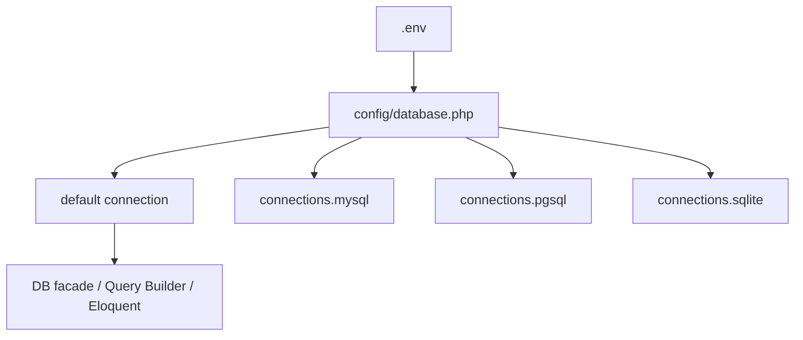
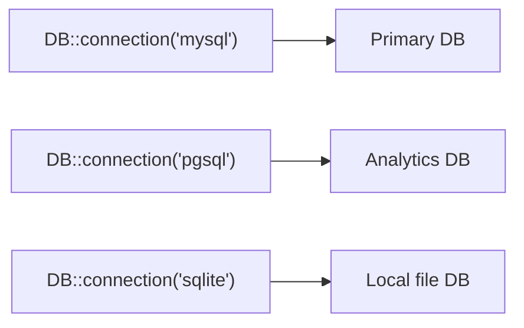

## Introduction

Laravel provides first-party support for these databases:

- MySQL / MariaDB
- PostgreSQL
- SQLite
- SQL Server

You can use the same connection setup across raw SQL, the Query Builder, and Eloquent ORM.

<Info>
  This page covers database connection fundamentals. For query composition, read [Query Builder](/en/query-builder). For schema management, read [Migrations](/en/migrations). For initial data, read [Database seeding](/en/seeding).
</Info>

## Configuration

Database configuration lives in `config/database.php`.
You choose the default connection with `default` and define each connection under `connections`.



```php
// config/database.php
'default' => env('DB_CONNECTION', 'sqlite'),

'connections' => [
    'mysql' => [
        'driver' => 'mysql',
        'host' => env('DB_HOST', '127.0.0.1'),
        'port' => env('DB_PORT', '3306'),
        'database' => env('DB_DATABASE', 'laravel'),
        'username' => env('DB_USERNAME', 'root'),
        'password' => env('DB_PASSWORD', ''),
    ],
],
```

At minimum, configure these environment variables:

```ini
DB_CONNECTION=mysql
DB_HOST=127.0.0.1
DB_PORT=3306
DB_DATABASE=app
DB_USERNAME=app_user
DB_PASSWORD=secret
```

For SQLite, set `DB_CONNECTION=sqlite` and point `DB_DATABASE` to your SQLite file path.

## Read and write connections

If you want to split reads (`SELECT`) and writes (`INSERT` / `UPDATE` / `DELETE`), define `read` and `write` hosts on the same connection.

```php
'mysql' => [
    'driver' => 'mysql',
    'read' => [
        'host' => ['10.0.0.10', '10.0.0.11'],
    ],
    'write' => [
        'host' => ['10.0.0.20'],
    ],
    'sticky' => true,

    'port' => env('DB_PORT', '3306'),
    'database' => env('DB_DATABASE', 'laravel'),
    'username' => env('DB_USERNAME', 'root'),
    'password' => env('DB_PASSWORD', ''),
],
```

When `sticky` is `true`, Laravel keeps subsequent reads on the write connection after a write occurs in the same request.

<Tip>
  Enable `sticky` when you use replicas and need read-after-write consistency in a single request cycle.
</Tip>

## Multiple database connections

You can define multiple connections in `config/database.php` and switch between them with `DB::connection()`.

```php
use Illuminate\Support\Facades\DB;

$users = DB::connection('sqlite')->select('select * from users');
$pdo = DB::connection('pgsql')->getPdo();
```



## Running SQL queries

The `DB` facade provides methods for each query type.

```php
use Illuminate\Support\Facades\DB;

$users = DB::select('select * from users where active = ?', [1]);

DB::insert('insert into users (name, email) values (?, ?)', ['Taylor', 'taylor@example.com']);

$affected = DB::update('update users set votes = 100 where name = ?', ['Taylor']);

$deleted = DB::delete('delete from sessions where user_id = ?', [1]);

DB::statement('drop table temporary_imports');
```

<Warning>
  Do not concatenate user input into SQL strings. Always pass bindings to prevent SQL injection.
</Warning>

## Listening for query events

Use `DB::listen()` in a service provider `boot()` method when you need SQL logs for debugging or profiling.

```php
use Illuminate\Database\Events\QueryExecuted;
use Illuminate\Support\Facades\DB;

public function boot(): void
{
    DB::listen(function (QueryExecuted $query) {
        logger()->debug('SQL executed', [
            'sql' => $query->toRawSql(),
            'time_ms' => $query->time,
        ]);
    });
}
```

## Transactions

Use `DB::transaction()` to treat multiple operations as one unit.
Laravel rolls back automatically if an exception is thrown.

```php
use Illuminate\Support\Facades\DB;

DB::transaction(function () {
    DB::update('update users set votes = 1');
    DB::delete('delete from posts where archived = 1');
});
```

If you need deadlock retries, pass the `attempts` argument.

```php
DB::transaction(function () {
    // ...
}, attempts: 5);
```

For manual control, use `beginTransaction`, `rollBack`, and `commit`.

```php
DB::beginTransaction();

try {
    DB::update('update accounts set balance = balance - 100 where id = ?', [1]);
    DB::update('update accounts set balance = balance + 100 where id = ?', [2]);

    DB::commit();
} catch (\Throwable $e) {
    DB::rollBack();
    throw $e;
}
```

## Next steps

<Card title="Query Builder" icon="table" href="/en/query-builder">
  Learn how to compose safe and expressive SQL queries on top of your connection setup.
</Card>

<Card title="Migrations" icon="hammer" href="/en/migrations">
  Learn how to version-control schema changes on your connected databases.
</Card>

<Card title="Database seeding" icon="seedling" href="/en/seeding">
  Learn how to populate reproducible data for local development and testing.
</Card>
