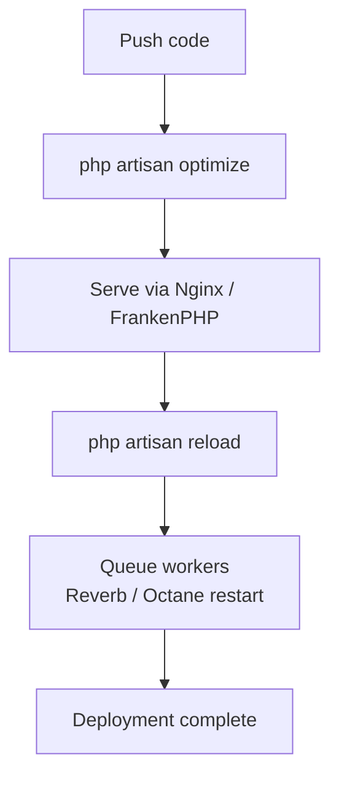

## Introduction

When you're ready to deploy your Laravel application to production, there are some important things you can do to make sure your application is running as efficiently as possible. This guide covers the key steps to a successful deployment.

## Deployment flow



## Server requirements

The Laravel framework requires **PHP 8.3 or higher** and the following PHP extensions:

| Extension | Purpose |
| --- | --- |
| Ctype | Character type checking |
| cURL | HTTP communication |
| DOM | XML/HTML DOM manipulation |
| Fileinfo | MIME type detection |
| Filter | Data filtering |
| Hash | Hashing functions |
| Mbstring | Multibyte string processing |
| OpenSSL | Encryption |
| PCRE | Regular expressions |
| PDO | Database connectivity |
| Session | Session management |
| Tokenizer | PHP token parsing |
| XML | XML processing |

## Server configuration

### Nginx

If you are deploying to a server running Nginx, use the following configuration as a starting point. Make sure your web server directs all requests to your application's `public/index.php` file. Never move `index.php` to the project root — serving from the root exposes sensitive configuration files to the public internet.

```nginx
server {
    listen 80;
    listen [::]:80;
    server_name example.com;
    root /srv/example.com/public;

    add_header X-Frame-Options "SAMEORIGIN";
    add_header X-Content-Type-Options "nosniff";

    index index.php;

    charset utf-8;

    location / {
        try_files $uri $uri/ /index.php?$query_string;
    }

    location = /favicon.ico { access_log off; log_not_found off; }
    location = /robots.txt  { access_log off; log_not_found off; }

    error_page 404 /index.php;

    location ~ ^/index\.php(/|$) {
        fastcgi_pass unix:/var/run/php/php8.3-fpm.sock;
        fastcgi_param SCRIPT_FILENAME $realpath_root$fastcgi_script_name;
        include fastcgi_params;
        fastcgi_hide_header X-Powered-By;
    }

    location ~ /\.(?!well-known).* {
        deny all;
    }
}
```

### FrankenPHP

[FrankenPHP](https://frankenphp.dev/) is a modern PHP application server written in Go. To serve a Laravel application with FrankenPHP, invoke its `php-server` command:

```shell
frankenphp php-server -r public/
```

For advanced features such as [Laravel Octane](https://laravel.com/docs/octane) integration, HTTP/3, modern compression, or packaging Laravel as a standalone binary, see the [FrankenPHP Laravel documentation](https://frankenphp.dev/docs/laravel/).

### Directory permissions

Laravel needs to write to the `bootstrap/cache` and `storage` directories. Ensure the web server process owner has write permission to these directories:

```shell
chmod -R 775 storage bootstrap/cache
chown -R www-data:www-data storage bootstrap/cache
```

## Optimization

When deploying to production, you should cache your configuration, events, routes, and views. Laravel provides a single `optimize` Artisan command that caches all of these at once. Run it as part of your deployment process:

```shell
php artisan optimize
```

To remove all cache files generated by `optimize` and clear the default cache driver:

```shell
php artisan optimize:clear
```

### Individual optimization commands

`optimize` runs the following commands. You can also run them individually when needed:

| Command | Description |
| --- | --- |
| `php artisan config:cache` | Combine all config files into a single cached file |
| `php artisan event:cache` | Cache auto-discovered event-to-listener mappings |
| `php artisan route:cache` | Cache route registrations for faster loading |
| `php artisan view:cache` | Precompile Blade views for faster responses |

<Info>
  After running `config:cache`, only call the `env()` function from within config files. Once configuration is cached, the `.env` file is not loaded, so `env()` calls outside config files will return `null`.
</Info>

## Reloading services

After deploying a new version, long-running services such as queue workers, Laravel Reverb, or Laravel Octane must be reloaded to pick up the new code. Laravel provides a single `reload` command that terminates these services:

```shell
php artisan reload
```

Configure a process monitor (such as Supervisor) to detect when reloadable processes exit and restart them automatically.

<Info>
  When deploying to [Laravel Cloud](https://cloud.laravel.com), graceful reloading of all services is handled automatically — you do not need to run the `reload` command.
</Info>

## Debug mode

The `debug` option in `config/app.php` controls how much error information is displayed to users. By default, it reads from the `APP_DEBUG` environment variable in your `.env` file.

<Warning>
  **In production, `APP_DEBUG` must always be set to `false`.** If `APP_DEBUG` is `true` in production, sensitive configuration values — including database credentials and secret keys — may be exposed to end users.
</Warning>

```ini
# .env (production)
APP_DEBUG=false
```

## The health route

Laravel includes a built-in health check route for monitoring your application's status. You can use it with uptime monitors, load balancers, or orchestration systems such as Kubernetes.

By default, the `/up` endpoint returns a `200` response if the application booted without exceptions, or `500` if an exception occurred during boot. Customize the URI in `bootstrap/app.php`:

```php
->withRouting(
    web: __DIR__.'/../routes/web.php',
    commands: __DIR__.'/../routes/console.php',
    health: '/status', // default is /up
)
```

When a request hits this route, Laravel dispatches an `Illuminate\Foundation\Events\DiagnosingHealth` event. You can listen for this event to perform additional checks — such as verifying database or cache connectivity — and throw an exception if a problem is detected.

## Deploying with Laravel Cloud or Forge

### Laravel Cloud

[Laravel Cloud](https://cloud.laravel.com) is a fully-managed, auto-scaling deployment platform purpose-built for Laravel. It provides managed compute, databases, caches, and object storage, and is fine-tuned by the Laravel creators to work seamlessly with the framework.

### Laravel Forge

[Laravel Forge](https://forge.laravel.com) is a VPS server management platform for Laravel applications. If you prefer to manage your own servers but want Nginx, MySQL, Redis, and other tools installed and configured automatically, Forge handles all of that on DigitalOcean, Linode, AWS, and other providers.

## Next steps

<Card title="Deployment — Official docs" icon="arrow-right" href="https://laravel.com/docs/deployment">
  Refer to the official Laravel documentation for the latest deployment configuration details.
</Card>
