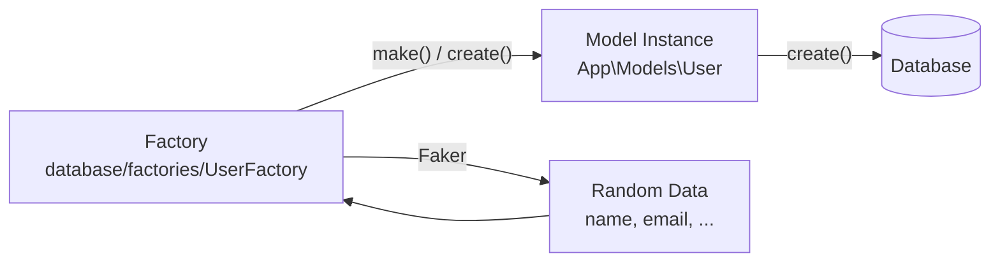
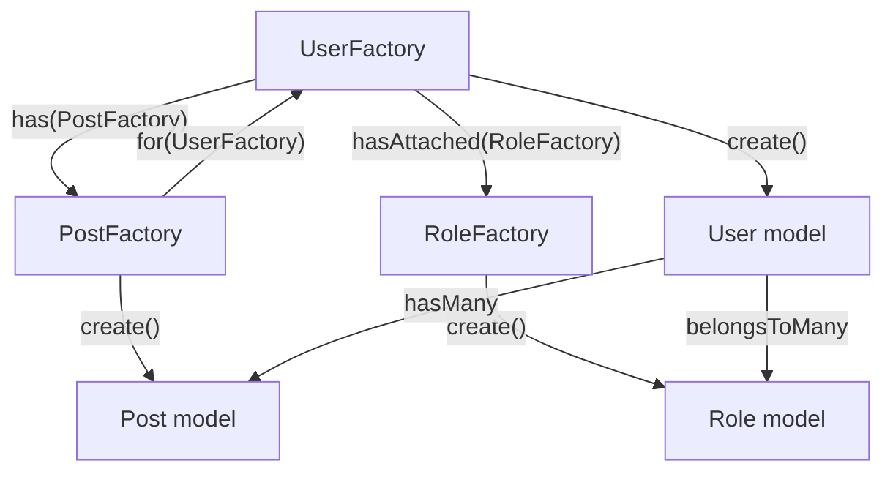

## Introduction

When testing your application or seeding your database, you need to insert records into the database. Instead of manually specifying the value of each column, Laravel lets you define a set of default attributes for each Eloquent model using **model factories**.

All new Laravel applications include `database/factories/UserFactory.php` as a starting example.

```php
namespace Database\Factories;

use Illuminate\Database\Eloquent\Factories\Factory;
use Illuminate\Support\Facades\Hash;
use Illuminate\Support\Str;

class UserFactory extends Factory
{
    public function definition(): array
    {
        return [
            'name' => fake()->name(),
            'email' => fake()->unique()->safeEmail(),
            'email_verified_at' => now(),
            'password' => static::$password ??= Hash::make('password'),
            'remember_token' => Str::random(10),
        ];
    }
}
```

Via the `fake()` helper, factories have access to the [Faker](https://github.com/FakerPHP/Faker) PHP library for generating random data.



<Info>
  Change your application's Faker locale by updating the `faker_locale` option in `config/app.php`.
</Info>

## Generating factories

Create a factory using the `make:factory` Artisan command:

```shell
php artisan make:factory PostFactory
```

The new factory class is placed in your `database/factories` directory.

### Model and factory discovery conventions

When your model uses the `HasFactory` trait, Laravel automatically finds the corresponding factory by looking in the `Database\Factories` namespace for a class named after the model suffixed with `Factory`.

If the naming convention doesn't apply, use the `UseFactory` attribute to specify the factory explicitly:

```php
use Illuminate\Database\Eloquent\Attributes\UseFactory;
use Database\Factories\Administration\FlightFactory;

#[UseFactory(FlightFactory::class)]
class Flight extends Model
{
    // ...
}
```

## Defining factories

### The `definition()` method

The `definition()` method returns the default attribute values for the model.

```php
namespace Database\Factories;

use Illuminate\Database\Eloquent\Factories\Factory;

class PostFactory extends Factory
{
    public function definition(): array
    {
        return [
            'user_id' => \App\Models\User::factory(),
            'title' => fake()->sentence(),
            'content' => fake()->paragraphs(3, true),
            'published_at' => fake()->optional()->dateTimeBetween('-1 year', 'now'),
        ];
    }
}
```

Commonly used Faker methods:

| Method | Example output |
| --- | --- |
| `fake()->name()` | `John Doe` |
| `fake()->email()` | `john@example.com` |
| `fake()->sentence()` | Random sentence |
| `fake()->paragraph()` | Random paragraph |
| `fake()->numberBetween(1, 100)` | Integer between 1 and 100 |
| `fake()->dateTime()` | Random datetime |
| `fake()->boolean()` | `true` or `false` |

## Factory states

State methods let you define discrete modifications that can be applied to your factories in any combination.

```php
class UserFactory extends Factory
{
    public function definition(): array
    {
        return [
            'name' => fake()->name(),
            'email' => fake()->unique()->safeEmail(),
            'account_status' => 'active',
        ];
    }

    public function suspended(): static
    {
        return $this->state(fn (array $attributes) => [
            'account_status' => 'suspended',
        ]);
    }

    public function admin(): static
    {
        return $this->state(fn (array $attributes) => [
            'is_admin' => true,
        ]);
    }
}
```

Apply states when instantiating the factory:

```php
$suspended = User::factory()->suspended()->create();
$admin = User::factory()->admin()->create();
```

### Trashed state

For soft-deletable models, use the built-in `trashed()` state:

```php
$user = User::factory()->trashed()->create();
```

## Factory callbacks

Register `afterMaking` and `afterCreating` callbacks to perform additional tasks after the model is made or created.

```php
namespace Database\Factories;

use App\Models\User;
use Illuminate\Database\Eloquent\Factories\Factory;

class UserFactory extends Factory
{
    public function configure(): static
    {
        return $this->afterMaking(function (User $user) {
            // Runs after make() — model not yet in the database
        })->afterCreating(function (User $user) {
            // Runs after create() — model is persisted
        });
    }

    // ...
}
```

You can also register callbacks inside state methods for state-specific side effects:

```php
public function withProfile(): static
{
    return $this->state(fn (array $attributes) => [])
        ->afterCreating(function (User $user) {
            $user->profile()->create([
                'bio' => fake()->paragraph(),
            ]);
        });
}
```

## Creating models

### make() — without persisting

```php
use App\Models\User;

$user = User::factory()->make();

$users = User::factory()->count(3)->make();
```

### create() — persists to the database

```php
$user = User::factory()->create();

$users = User::factory()->count(3)->create();
```

### Overriding attributes

Pass an array to `make()` or `create()` to override specific attributes:

```php
$user = User::factory()->make([
    'name' => 'Abigail Otwell',
]);

$user = User::factory()->create([
    'name' => 'Abigail Otwell',
    'email' => 'abigail@example.com',
]);
```

You can also override inline using `state()`:

```php
$user = User::factory()->state([
    'name' => 'Abigail Otwell',
])->make();
```

<Info>
  Mass assignment protection is automatically disabled when creating models using factories.
</Info>

### Sequences

Use `Sequence` to alternate attribute values across multiple generated models:

```php
use App\Models\User;
use Illuminate\Database\Eloquent\Factories\Sequence;

$users = User::factory()
    ->count(10)
    ->state(new Sequence(
        ['admin' => 'Y'],
        ['admin' => 'N'],
    ))
    ->create();
// 5 users with admin='Y', 5 with admin='N'
```

The `sequence()` method is a shorthand:

```php
$users = User::factory()
    ->count(2)
    ->sequence(
        ['name' => 'First User'],
        ['name' => 'Second User'],
    )
    ->create();
```

Use a closure to compute values dynamically. The `$sequence->index` property contains the current iteration count:

```php
use Illuminate\Database\Eloquent\Factories\Sequence;

$users = User::factory()
    ->count(10)
    ->state(new Sequence(
        fn (Sequence $sequence) => ['name' => 'User ' . $sequence->index],
    ))
    ->create();
```

## Factory relationships



### Has many relationships

Use the `has()` method to create related models for a "has many" relationship:

```php
use App\Models\Post;
use App\Models\User;

$user = User::factory()
    ->has(Post::factory()->count(3))
    ->create();
```

Laravel's magic methods let you write this more concisely:

```php
$user = User::factory()->hasPosts(3)->create();

// With attribute overrides
$user = User::factory()
    ->hasPosts(3, ['published' => false])
    ->create();
```

### Belongs to relationships

Use the `for()` method to define the parent model for a "belongs to" relationship:

```php
use App\Models\Post;
use App\Models\User;

$posts = Post::factory()
    ->count(3)
    ->for(User::factory()->state(['name' => 'Jessica Archer']))
    ->create();

// Pass an existing model instance
$user = User::factory()->create();
$posts = Post::factory()->count(3)->for($user)->create();
```

Magic method version:

```php
$posts = Post::factory()
    ->count(3)
    ->forUser(['name' => 'Jessica Archer'])
    ->create();
```

### Many to many relationships

Use `hasAttached()` to create pivot table records alongside the related models:

```php
use App\Models\Role;
use App\Models\User;

$user = User::factory()
    ->hasAttached(
        Role::factory()->count(3),
        ['active' => true]  // pivot table attributes
    )
    ->create();
```

Magic method version:

```php
$user = User::factory()
    ->hasRoles(1, ['name' => 'Editor'])
    ->create();
```

### Polymorphic relationships

Polymorphic "morph many" relationships work the same as "has many":

```php
use App\Models\Post;

$post = Post::factory()->hasComments(3)->create();
```

Magic methods cannot be used for `morphTo` relationships. Use `for()` with the relationship name explicitly:

```php
$comments = Comment::factory()->count(3)->for(
    Post::factory(), 'commentable'
)->create();
```

### Defining relationships within factories

In `definition()`, assign a factory instance to a foreign key to automatically create the parent model:

```php
class PostFactory extends Factory
{
    public function definition(): array
    {
        return [
            'user_id' => \App\Models\User::factory(),
            'title' => fake()->sentence(),
            'content' => fake()->paragraph(),
        ];
    }
}
```

### Recycling an existing model

Use `recycle()` to reuse a single model instance across all relationships created by the factory:

```php
// Both Ticket and Flight use the same Airline instance
Ticket::factory()
    ->recycle(Airline::factory()->create())
    ->create();

// Pick randomly from a collection
$airlines = Airline::factory()->count(3)->create();
Ticket::factory()->count(10)->recycle($airlines)->create();
```

## Using factories in seeders

Call factories from `DatabaseSeeder` or any seeder class:

```php
namespace Database\Seeders;

use App\Models\User;
use Illuminate\Database\Seeder;

class DatabaseSeeder extends Seeder
{
    public function run(): void
    {
        User::factory()
            ->count(10)
            ->hasPosts(3)
            ->create();
    }
}
```

Run the seeders:

```shell
php artisan db:seed
```

## Using factories in tests

Combine factories with the `RefreshDatabase` trait to reset the database between tests:

```php
namespace Tests\Feature;

use App\Models\Post;
use App\Models\User;
use Illuminate\Foundation\Testing\RefreshDatabase;
use Tests\TestCase;

class PostTest extends TestCase
{
    use RefreshDatabase;

    public function test_user_can_view_their_posts(): void
    {
        $user = User::factory()->create();
        $posts = Post::factory()->count(3)->for($user)->create();

        $response = $this->actingAs($user)->get('/dashboard');

        $response->assertOk();
        $response->assertSee($posts->first()->title);
    }

    public function test_suspended_user_cannot_post(): void
    {
        $user = User::factory()->suspended()->create();

        $response = $this->actingAs($user)
            ->post('/posts', ['title' => 'Test post']);

        $response->assertForbidden();
    }
}
```

`RefreshDatabase` resets the database after each test so tests do not interfere with each other.

<Tip>
  The factory API is identical when using Pest. Use `uses(RefreshDatabase::class)` to reset the database between tests.
</Tip>

## Next steps

<Card title="Database seeding" icon="seedling" href="/en/seeding">
  Learn how to combine seeders and factories to populate the database with initial data.
</Card>

<Card title="Testing" icon="flask" href="/en/testing">
  Explore Laravel's testing tools and how RefreshDatabase works under the hood.
</Card>
