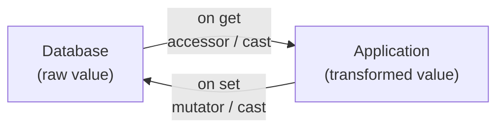

## Introduction

**Accessors**, **mutators**, and **attribute casting** let you transform Eloquent attribute values when you retrieve or set them on model instances.

- **Accessor** — transforms a raw database value before it reaches your application
- **Mutator** — transforms a value set by your application before it is stored in the database
- **Cast** — declaratively defines type conversion without writing accessor/mutator methods



## Defining an accessor

Create a `protected` method on your model whose name corresponds to the attribute in camelCase. The return type must be `Illuminate\Database\Eloquent\Casts\Attribute`.

```php
<?php

namespace App\Models;

use Illuminate\Database\Eloquent\Casts\Attribute;
use Illuminate\Database\Eloquent\Model;

class User extends Model
{
    /**
     * Get the user's first name.
     */
    protected function firstName(): Attribute
    {
        return Attribute::make(
            get: fn (string $value) => ucfirst($value),
        );
    }
}
```

The `get` closure receives the raw column value. Access the accessor via the snake_case property name.

```php
$user = User::find(1);

$firstName = $user->first_name; // ucfirst() applied
```

<Info>
  To include computed accessor values in JSON or array output, add them to the model's `$appends` property.
</Info>

### Building value objects from multiple attributes

The `get` closure accepts a second `$attributes` argument — an array of all current model attributes. Use it to build a value object from multiple columns.

```php
use App\Support\Address;
use Illuminate\Database\Eloquent\Casts\Attribute;

protected function address(): Attribute
{
    return Attribute::make(
        get: fn (mixed $value, array $attributes) => new Address(
            $attributes['address_line_one'],
            $attributes['address_line_two'],
        ),
    );
}
```

### Accessor caching

Eloquent automatically caches value objects returned from accessors so the same instance is returned on repeated access. To cache primitive values as well, call `shouldCache()`.

```php
protected function hash(): Attribute
{
    return Attribute::make(
        get: fn (string $value) => bcrypt(gzuncompress($value)),
    )->shouldCache();
}
```

To disable object caching, call `withoutObjectCaching()`.

```php
protected function address(): Attribute
{
    return Attribute::make(
        get: fn (mixed $value, array $attributes) => new Address(
            $attributes['address_line_one'],
            $attributes['address_line_two'],
        ),
    )->withoutObjectCaching();
}
```

## Defining a mutator

Add a `set` argument to `Attribute::make()`. Accessor and mutator can be defined in the same method.

```php
protected function firstName(): Attribute
{
    return Attribute::make(
        get: fn (string $value) => ucfirst($value),
        set: fn (string $value) => strtolower($value),
    );
}
```

Setting the attribute on the model triggers the `set` closure.

```php
$user = User::find(1);
$user->first_name = 'SALLY'; // strtolower() stores 'sally'
```

### Mutating multiple attributes

Return an array from the `set` closure to update multiple database columns at once.

```php
use App\Support\Address;
use Illuminate\Database\Eloquent\Casts\Attribute;

protected function address(): Attribute
{
    return Attribute::make(
        get: fn (mixed $value, array $attributes) => new Address(
            $attributes['address_line_one'],
            $attributes['address_line_two'],
        ),
        set: fn (Address $value) => [
            'address_line_one' => $value->lineOne,
            'address_line_two' => $value->lineTwo,
        ],
    );
}
```

## Attribute casting

Casts let you declare type conversions without writing accessor/mutator methods. Return an array from the model's `casts()` method.

```php
<?php

namespace App\Models;

use Illuminate\Database\Eloquent\Model;

class User extends Model
{
    protected function casts(): array
    {
        return [
            'is_admin'   => 'boolean',
            'score'      => 'float',
            'settings'   => 'array',
            'created_at' => 'datetime',
        ];
    }
}
```

### Built-in cast types

| Cast | Description |
|---|---|
| `integer` / `int` | Integer |
| `float` / `double` / `real` | Floating point |
| `decimal:<precision>` | Decimal with specified precision |
| `string` | String |
| `boolean` / `bool` | Boolean (handles `0`/`1`) |
| `array` | Serialize/deserialize JSON ↔ PHP array |
| `object` | Serialize/deserialize JSON ↔ stdClass |
| `collection` | JSON ↔ Laravel Collection |
| `date` | Carbon date |
| `datetime` | Carbon datetime |
| `immutable_date` | CarbonImmutable date |
| `immutable_datetime` | CarbonImmutable datetime |
| `timestamp` | Unix timestamp |
| `hashed` | Hash on save |
| `encrypted` | Encrypt on save |

<Warning>
  Attributes that are `null` will not be cast. Never define a cast (or an attribute) that has the same name as a relationship, and do not cast the model's primary key.
</Warning>

### Stringable casting

Use `AsStringable` to cast an attribute to a fluent `Illuminate\Support\Stringable` object.

```php
use Illuminate\Database\Eloquent\Casts\AsStringable;

protected function casts(): array
{
    return [
        'bio' => AsStringable::class,
    ];
}
```

## Array and JSON casting

The `array` cast automatically deserializes JSON columns to PHP arrays on retrieval and serializes them back on save.

```php
protected function casts(): array
{
    return [
        'options' => 'array',
    ];
}
```

```php
$user = User::find(1);

$options = $user->options; // PHP array

$user->options = array_merge($options, ['theme' => 'dark']); // serialized to JSON on save
$user->save();
```

Use the `->` operator to update a single JSON key.

```php
$user->update(['options->theme' => 'dark']);
```

### AsArrayObject and AsCollection

The standard `array` cast returns a primitive type — directly modifying an offset triggers a PHP error. Use `AsArrayObject` or `AsCollection` to avoid this.

```php
use Illuminate\Database\Eloquent\Casts\AsArrayObject;
use Illuminate\Database\Eloquent\Casts\AsCollection;

protected function casts(): array
{
    return [
        'options' => AsArrayObject::class,
        'tags'    => AsCollection::class,
    ];
}
```

Provide a custom collection class via `using()`.

```php
use App\Collections\TagCollection;
use Illuminate\Database\Eloquent\Casts\AsCollection;

protected function casts(): array
{
    return [
        'tags' => AsCollection::using(TagCollection::class),
    ];
}
```

## Date casting

`created_at` and `updated_at` are cast to Carbon by default. Cast additional date columns the same way.

```php
protected function casts(): array
{
    return [
        'published_at' => 'datetime',
        'expires_at'   => 'immutable_datetime',
    ];
}
```

Specify a format to control JSON serialization output.

```php
protected function casts(): array
{
    return [
        'published_at' => 'datetime:Y-m-d',
    ];
}
```

Override `serializeDate()` to apply a default format to all dates (does not affect database storage format).

```php
use DateTimeInterface;

protected function serializeDate(DateTimeInterface $date): string
{
    return $date->format('Y-m-d');
}
```

<Tip>
  Use `immutable_datetime` to receive a `CarbonImmutable` instance instead of `Carbon`. Operations on immutable objects return new instances, preventing accidental mutation of shared state.
</Tip>

## Enum casting

Cast attributes to PHP 8.1+ Backed Enums.

```php
<?php

namespace App\Enums;

enum ServerStatus: string
{
    case Provisioned = 'provisioned';
    case Ready       = 'ready';
    case Archived    = 'archived';
}
```

```php
use App\Enums\ServerStatus;

protected function casts(): array
{
    return [
        'status' => ServerStatus::class,
    ];
}
```

The backing value is stored in the database; retrieval returns the Enum instance.

```php
$server = Server::find(1);

if ($server->status === ServerStatus::Provisioned) {
    $server->status = ServerStatus::Ready;
    $server->save();
}
```

### Casting arrays of enums

Store multiple enum values in a single column using `AsEnumCollection`.

```php
use App\Enums\ServerStatus;
use Illuminate\Database\Eloquent\Casts\AsEnumCollection;

protected function casts(): array
{
    return [
        'statuses' => AsEnumCollection::of(ServerStatus::class),
    ];
}
```

## Query time casting

Apply casts dynamically during a query with `withCasts()`.

```php
use App\Models\Post;
use App\Models\User;

$users = User::select([
    'users.*',
    'last_posted_at' => Post::selectRaw('MAX(created_at)')
        ->whereColumn('user_id', 'users.id'),
])->withCasts([
    'last_posted_at' => 'datetime',
])->get();
```

## Custom casts

You can create your own cast classes by implementing the `CastsAttributes` interface with `get` and `set` methods.

```shell
php artisan make:cast AsJson
```

For full details on custom casts — including value object patterns, inbound-only casts, and Castables — see the advanced page below.

<Card title="Custom casts deep dive" icon="book" href="/en/advanced/eloquent-casts">
  Learn how to implement CastsAttributes, use Value Object patterns, inbound casting, and Castables.
</Card>

## Related pages

<Card title="Eloquent API resources" icon="link" href="/en/eloquent-resources">
  Transform Eloquent models into consistent JSON API responses using resource classes.
</Card>
