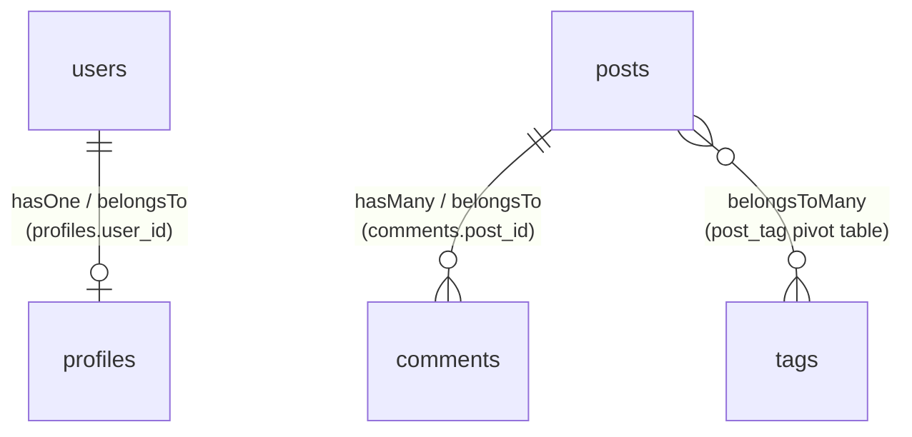

## Overview

Database tables are often related to one another. A blog post has many comments; an order belongs to a user. Eloquent makes it easy to define these relationships and query related data in a natural, expressive way.

Relationships are defined as methods on your Eloquent model classes.

<Info>
  Examples on this page use `User`, `Post`, `Comment`, and `Tag` models. Assume these models and their database tables already exist.
</Info>

The main relationship types Eloquent supports:

| Relationship | Description |
| --- | --- |
| `hasOne` | One-to-one (parent owns one child) |
| `belongsTo` | Inverse of one-to-one or one-to-many |
| `hasMany` | One-to-many (parent owns many children) |
| `belongsToMany` | Many-to-many (via a pivot table) |



## hasOne (one-to-one)

Use `hasOne` when a model owns exactly one related model. For example, a `User` has one `Profile`.

### Defining the relationship

```php
<?php

namespace App\Models;

use Illuminate\Database\Eloquent\Model;
use Illuminate\Database\Eloquent\Relations\HasOne;

class User extends Model
{
    public function profile(): HasOne
    {
        return $this->hasOne(Profile::class);
    }
}
```

Eloquent assumes the `profiles` table has a `user_id` foreign key based on the parent model name.

### Accessing the related model

Access the relationship as a property — Eloquent queries the database automatically:

```php
$user = User::find(1);
$profile = $user->profile;
```

<Tip>
  Calling a relationship method as a property is called a "dynamic relationship property". Eloquent runs the query and returns the result the first time you access it.
</Tip>

## belongsTo (inverse of hasOne)

`belongsTo` is the inverse of `hasOne`. Define it on the model that holds the foreign key — in this case, `Profile` belongs to `User`.

```php
<?php

namespace App\Models;

use Illuminate\Database\Eloquent\Model;
use Illuminate\Database\Eloquent\Relations\BelongsTo;

class Profile extends Model
{
    public function user(): BelongsTo
    {
        return $this->belongsTo(User::class);
    }
}
```

Eloquent uses the method name plus `_id` as the foreign key (`user_id`).

```php
$profile = Profile::find(1);
$user = $profile->user;

echo $user->name;
```

## hasMany (one-to-many)

`hasMany` is the most common relationship type. Use it when a parent model owns multiple child models — for example, a `Post` has many `Comment` records.

### Defining the relationship

```php
<?php

namespace App\Models;

use Illuminate\Database\Eloquent\Model;
use Illuminate\Database\Eloquent\Relations\HasMany;

class Post extends Model
{
    public function comments(): HasMany
    {
        return $this->hasMany(Comment::class);
    }
}
```

Eloquent assumes the `comments` table has a `post_id` foreign key.

### Accessing related records

A `hasMany` relationship returns a collection:

```php
$post = Post::find(1);

foreach ($post->comments as $comment) {
    echo $comment->body;
}
```

Chain query constraints by calling the relationship as a method:

```php
$recentComments = Post::find(1)
    ->comments()
    ->latest()
    ->take(5)
    ->get();
```

### Inverse relationship

To navigate from a comment back to its post, define `belongsTo` on `Comment`:

```php
<?php

namespace App\Models;

use Illuminate\Database\Eloquent\Model;
use Illuminate\Database\Eloquent\Relations\BelongsTo;

class Comment extends Model
{
    public function post(): BelongsTo
    {
        return $this->belongsTo(Post::class);
    }
}
```

```php
$comment = Comment::find(1);
echo $comment->post->title;
```

## belongsToMany (many-to-many)

Use a many-to-many relationship when both models can be associated with multiple instances of each other. For example, a `Post` can have many `Tag` records, and a `Tag` can belong to many posts.

### Table structure

Many-to-many relationships require a pivot table. For `Post` and `Tag`, create a `post_tag` pivot table:

```text
posts
    id - integer
    title - string

tags
    id - integer
    name - string

post_tag
    post_id - integer
    tag_id - integer
```

<Info>
  Eloquent infers the pivot table name by alphabetically combining the two model names: `post` + `tag` → `post_tag`.
</Info>

### Defining the relationship

```php
<?php

namespace App\Models;

use Illuminate\Database\Eloquent\Model;
use Illuminate\Database\Eloquent\Relations\BelongsToMany;

class Post extends Model
{
    public function tags(): BelongsToMany
    {
        return $this->belongsToMany(Tag::class);
    }
}
```

Define the inverse on `Tag` to navigate in both directions:

```php
<?php

namespace App\Models;

use Illuminate\Database\Eloquent\Model;
use Illuminate\Database\Eloquent\Relations\BelongsToMany;

class Tag extends Model
{
    public function posts(): BelongsToMany
    {
        return $this->belongsToMany(Post::class);
    }
}
```

### Retrieving related records

```php
$post = Post::find(1);

foreach ($post->tags as $tag) {
    echo $tag->name;
}
```

### Attaching and detaching

Use `attach()` to add a record to the pivot table, `detach()` to remove one:

```php
$post = Post::find(1);

// Add a tag
$post->tags()->attach($tagId);

// Remove a tag
$post->tags()->detach($tagId);

// Replace all current associations
$post->tags()->sync([$tagId1, $tagId2]);
```

<Tip>
  `sync()` removes any pivot rows not included in the given array and inserts the ones that are missing, leaving you with exactly the specified set of associations.
</Tip>

## Eager loading

### The N+1 problem

When you access a relationship as a property, Eloquent runs a separate query each time. Inside a loop this creates an N+1 problem:

```php
// 1 query to retrieve all posts
$posts = Post::all();

foreach ($posts as $post) {
    // 1 additional query per post to retrieve its user
    echo $post->user->name;
}
```

With 100 posts, this runs 101 queries, which has a significant impact on performance.

### Eager loading with `with()`

Use `with()` to load all related data in just two queries:

```php
// 2 queries total regardless of the number of posts
$posts = Post::with('user')->get();

foreach ($posts as $post) {
    // No additional queries
    echo $post->user->name;
}
```

The two queries are:

```sql
select * from posts

select * from users where id in (1, 2, 3, ...)
```

### Loading multiple relationships

Pass an array to eager-load several relationships at once:

```php
$posts = Post::with(['user', 'comments', 'tags'])->get();
```

### Nested eager loading

Use dot notation to eager-load nested relationships:

```php
// Load each post's comments and each comment's user
$posts = Post::with('comments.user')->get();
```

<Warning>
  Eager loading is essential for preventing performance problems. Make it a habit to use `with()` whenever you loop over models and access relationships.
</Warning>

## Next steps

<Card title="Authentication" icon="lock" href="/en/authentication">
  Learn how to add login and registration to your Laravel application.
</Card>
