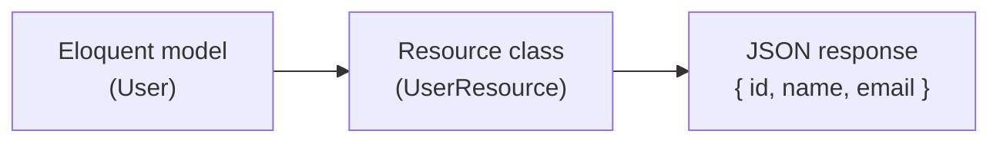
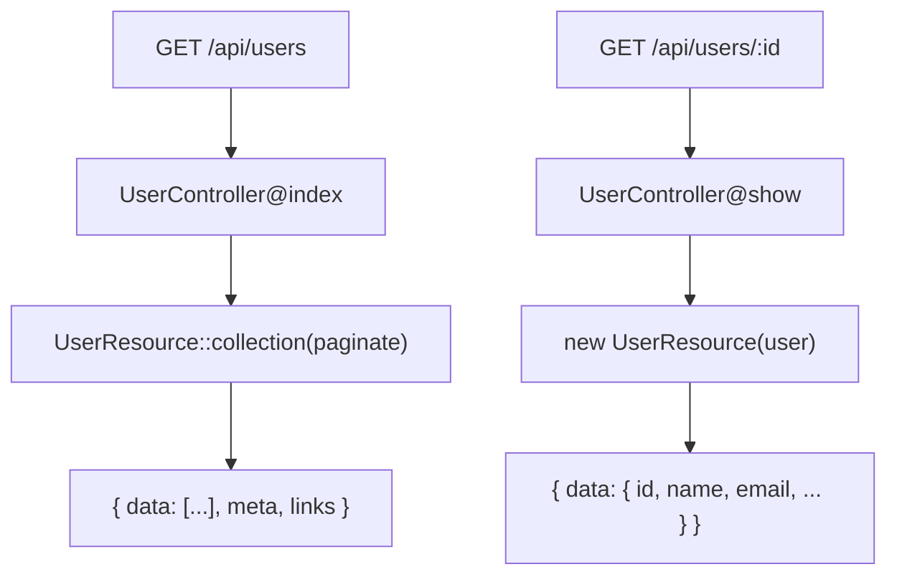

## What are API resources

When building an API, returning Eloquent models directly as JSON can expose unwanted columns or send more data than the client needs.

**Eloquent API resources** place a transformation layer between your models and JSON responses. The `toArray()` method lets you explicitly define what fields to include and in what format.



Key benefits:

- Full control over which fields appear in the response
- Field renaming and value formatting in one place
- Conditionally include or exclude fields
- Nest related resources for a consistent structure

## Generating a resource

Use the `make:resource` Artisan command to generate a resource class.

```shell
php artisan make:resource UserResource
```

The class is placed in `app/Http/Resources`.

```php
<?php

namespace App\Http\Resources;

use Illuminate\Http\Request;
use Illuminate\Http\Resources\Json\JsonResource;

class UserResource extends JsonResource
{
    public function toArray(Request $request): array
    {
        return [
            'id' => $this->id,
            'name' => $this->name,
            'email' => $this->email,
            'created_at' => $this->created_at,
            'updated_at' => $this->updated_at,
        ];
    }
}
```

You access model properties directly via `$this` because the resource proxies property access to the underlying model.

## Returning a resource from a controller

Return the resource from a route or controller method.

```php
use App\Http\Resources\UserResource;
use App\Models\User;

Route::get('/users/{user}', function (User $user) {
    return new UserResource($user);
});
```

Or use the model's `toResource()` convenience method, which discovers the matching resource class by convention.

```php
Route::get('/users/{user}', function (User $user) {
    return $user->toResource();
});
```

By default, the response wraps the data in a `data` key.

```json
{
  "data": {
    "id": 1,
    "name": "Jane Smith",
    "email": "jane@example.com",
    "created_at": "2024-01-15T10:00:00.000000Z",
    "updated_at": "2024-01-15T10:00:00.000000Z"
  }
}
```

## Resource collections

To return multiple models, use the `collection()` method.

```php
use App\Http\Resources\UserResource;
use App\Models\User;

Route::get('/users', function () {
    return UserResource::collection(User::all());
});
```

Or use the Eloquent collection's `toResourceCollection()` method.

```php
return User::all()->toResourceCollection();
```

### Custom collection resource

When you need to add metadata to the entire collection, generate a dedicated collection resource.

```shell
php artisan make:resource UserCollection
```

```php
<?php

namespace App\Http\Resources;

use Illuminate\Http\Request;
use Illuminate\Http\Resources\Json\ResourceCollection;

class UserCollection extends ResourceCollection
{
    public function toArray(Request $request): array
    {
        return [
            'data' => $this->collection,
            'links' => [
                'self' => route('users.index'),
            ],
        ];
    }
}
```

```php
Route::get('/users', function () {
    return new UserCollection(User::all());
});
```

## Transforming fields

Rename keys or transform values directly inside `toArray()`.

```php
public function toArray(Request $request): array
{
    return [
        'id' => $this->id,
        'full_name' => $this->name,                            // renamed
        'email_address' => $this->email,                       // renamed
        'role' => strtoupper($this->role),                     // transformed
        'registered_at' => $this->created_at->toDateString(),  // formatted
    ];
}
```

## Conditional fields

### when() — include a field based on a condition

Use `when()` to include a field only when a condition is true. When the condition is false, the key is removed entirely from the response.

```php
public function toArray(Request $request): array
{
    return [
        'id' => $this->id,
        'name' => $this->name,
        'email' => $this->email,
        'secret_token' => $this->when(
            $request->user()?->isAdmin(),
            $this->secret_token
        ),
    ];
}
```

### mergeWhen() — conditionally merge multiple fields

When several fields share the same condition, use `mergeWhen()` to add them together.

```php
public function toArray(Request $request): array
{
    return [
        'id' => $this->id,
        'name' => $this->name,
        $this->mergeWhen($request->user()?->isAdmin(), [
            'admin_note' => $this->admin_note,
            'internal_id' => $this->internal_id,
        ]),
    ];
}
```

### whenLoaded() — include a relationship only when loaded

Use `whenLoaded()` to avoid triggering unintended queries. The relationship is included only when it has already been eager-loaded.

```php
use App\Http\Resources\PostResource;

public function toArray(Request $request): array
{
    return [
        'id' => $this->id,
        'name' => $this->name,
        'email' => $this->email,
        'posts' => PostResource::collection($this->whenLoaded('posts')),
    ];
}
```

The controller decides which relationships to load.

```php
// Include posts in the response
return new UserResource($user->load('posts'));

// Exclude posts
return new UserResource($user);
```

### whenCounted() — conditionally include a relationship count

```php
public function toArray(Request $request): array
{
    return [
        'id' => $this->id,
        'name' => $this->name,
        'posts_count' => $this->whenCounted('posts'),
    ];
}
```

```php
return new UserResource($user->loadCount('posts'));
```

## Nested resources

Nest related resources to maintain a consistent response structure across your API.

```php
// app/Http/Resources/PostResource.php
class PostResource extends JsonResource
{
    public function toArray(Request $request): array
    {
        return [
            'id' => $this->id,
            'title' => $this->title,
            'body' => $this->body,
            'author' => new UserResource($this->whenLoaded('user')),
            'comments' => CommentResource::collection($this->whenLoaded('comments')),
            'published_at' => $this->published_at?->toDateString(),
        ];
    }
}
```

```php
$post = Post::with(['user', 'comments'])->findOrFail($id);

return new PostResource($post);
```

```json
{
  "data": {
    "id": 1,
    "title": "Getting started with API resources",
    "author": {
      "id": 5,
      "name": "Jane Smith",
      "email": "jane@example.com"
    },
    "comments": [
      { "id": 10, "body": "Great article!" }
    ]
  }
}
```

## Adding metadata

### with() — top-level metadata on a collection

Override the `with()` method to add metadata returned only when the resource is the outermost response.

```php
class UserCollection extends ResourceCollection
{
    public function toArray(Request $request): array
    {
        return parent::toArray($request);
    }

    public function with(Request $request): array
    {
        return [
            'meta' => [
                'version' => '1.0',
                'generated_at' => now()->toIso8601String(),
            ],
        ];
    }
}
```

```json
{
  "data": [...],
  "meta": {
    "version": "1.0",
    "generated_at": "2024-01-15T10:00:00+00:00"
  }
}
```

### additional() — add metadata dynamically in the controller

```php
return User::all()
    ->load('roles')
    ->toResourceCollection()
    ->additional(['meta' => [
        'total_admins' => User::where('role', 'admin')->count(),
    ]]);
```

## Pagination

Pass a paginator to a resource collection and Laravel automatically appends `meta` and `links` to the response.

```php
Route::get('/users', function () {
    return UserResource::collection(User::paginate(15));
});
```

Or use the paginator's `toResourceCollection()` method.

```php
return User::paginate(15)->toResourceCollection();
```

Response:

```json
{
  "data": [
    { "id": 1, "name": "Jane Smith" },
    { "id": 2, "name": "Bob Johnson" }
  ],
  "links": {
    "first": "https://example.com/users?page=1",
    "last": "https://example.com/users?page=5",
    "prev": null,
    "next": "https://example.com/users?page=2"
  },
  "meta": {
    "current_page": 1,
    "from": 1,
    "last_page": 5,
    "per_page": 15,
    "to": 15,
    "total": 72
  }
}
```

<Info>
  Paginated responses always include the `data` wrapper, even if you have called `withoutWrapping()`. This ensures the `meta` and `links` keys have a place to live alongside the data.
</Info>

## Disabling data wrapping

By default, the outermost resource is wrapped in a `data` key. To disable this, call `withoutWrapping()` in `AppServiceProvider`.

```php
use Illuminate\Http\Resources\Json\JsonResource;

public function boot(): void
{
    JsonResource::withoutWrapping();
}
```

<Warning>
  `withoutWrapping()` only affects the outermost wrapper. It will not remove any `data` keys you add manually inside your resource classes.
</Warning>

## Practical example: user API

The following example shows a complete user resource with an accompanying controller.



### UserResource

```php
<?php

namespace App\Http\Resources;

use Illuminate\Http\Request;
use Illuminate\Http\Resources\Json\JsonResource;

class UserResource extends JsonResource
{
    public function toArray(Request $request): array
    {
        return [
            'id' => $this->id,
            'name' => $this->name,
            'email' => $this->email,
            'avatar_url' => $this->avatar_url,
            'role' => $this->role,
            'created_at' => $this->when(
                $request->user()?->isAdmin(),
                $this->created_at->toDateString()
            ),
            'posts' => PostResource::collection($this->whenLoaded('posts')),
            'posts_count' => $this->whenCounted('posts'),
        ];
    }
}
```

### UserController

```php
<?php

namespace App\Http\Controllers\Api;

use App\Http\Resources\UserResource;
use App\Models\User;
use Illuminate\Http\Resources\Json\AnonymousResourceCollection;

class UserController extends Controller
{
    public function index(): AnonymousResourceCollection
    {
        $users = User::withCount('posts')->paginate(20);

        return UserResource::collection($users);
    }

    public function show(User $user): UserResource
    {
        $user->loadCount('posts')->load('posts');

        return new UserResource($user);
    }
}
```

## Related pages

<Card title="Eloquent relationships" icon="link" href="/en/eloquent-relationships">
  Learn how to define relationships and use eager loading.
</Card>

<Card title="Pagination" icon="list" href="/en/pagination">
  Combine pagination results with API resources.
</Card>
