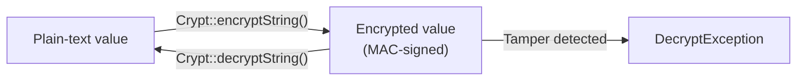

## What is the Crypt facade

Laravel's encryption services provide a simple, convenient interface for encrypting and decrypting text via **OpenSSL** using AES-256 and AES-128 encryption.

All of Laravel's encrypted values are signed using a **message authentication code (MAC)**.
This means that if an encrypted value is tampered with after encryption, it cannot be decrypted.



---

## Configuration

### Generating APP_KEY

Before using the encrypter, set the `key` option in `config/app.php`.
This value is driven by the `APP_KEY` environment variable.

Use `php artisan key:generate` to generate a cryptographically secure key using PHP's secure random bytes generator.

```shell
php artisan key:generate
```

The key is normally generated automatically during [Laravel's installation](/en/installation) and stored in your `.env` file.

```ini
APP_KEY=base64:J63qRTDLub5NuZvP+kb8YIorGS6qFYHKVo6u7179stY=
```

<Warning>
  Never expose your `APP_KEY`. If this key is compromised, all encrypted data in your application can be decrypted.
</Warning>

### Gracefully rotating encryption keys

Changing your encryption key logs out all authenticated user sessions because Laravel encrypts all cookies, including session cookies.
Data encrypted with your previous key also becomes unreadable.

To mitigate this, list your previous encryption keys in `APP_PREVIOUS_KEYS` as a comma-delimited string.

```ini
APP_KEY="base64:J63qRTDLub5NuZvP+kb8YIorGS6qFYHKVo6u7179stY="
APP_PREVIOUS_KEYS="base64:2nLsGFGzyoae2ax3EF2Lyq/hH6QghBGLIq5uL+Gp8/w="
```

Laravel always uses the current key for encryption. When decrypting, it first tries the current key and then falls back to previous keys in order.
This lets users continue using your application uninterrupted during key rotation.

---

## Encrypting a value

Use the `encryptString` method on the `Crypt` facade to encrypt a value.
The result uses OpenSSL with AES-256-CBC and is signed with a MAC.

```php
<?php

namespace App\Http\Controllers;

use Illuminate\Http\RedirectResponse;
use Illuminate\Http\Request;
use Illuminate\Support\Facades\Crypt;

class DigitalOceanTokenController extends Controller
{
    /**
     * Store a DigitalOcean API token for the user.
     */
    public function store(Request $request): RedirectResponse
    {
        $request->user()->fill([
            'token' => Crypt::encryptString($request->token),
        ])->save();

        return redirect('/secrets');
    }
}
```

<Tip>
  `encryptString` encrypts a string without serialization. Use `encrypt` for arrays and objects.
</Tip>

| Method | Use |
| --- | --- |
| `Crypt::encryptString($value)` | Encrypt a plain string |
| `Crypt::encrypt($value)` | Serialize then encrypt (supports arrays and objects) |

---

## Decrypting a value

Use the `decryptString` method to decrypt an encrypted value.
If the value cannot be decrypted — for example, because the MAC is invalid — a `DecryptException` is thrown.

```php
use Illuminate\Contracts\Encryption\DecryptException;
use Illuminate\Support\Facades\Crypt;

try {
    $decrypted = Crypt::decryptString($encryptedValue);
} catch (DecryptException $e) {
    // Handle invalid or tampered data
    abort(400, 'Invalid data.');
}
```

| Method | Use |
| --- | --- |
| `Crypt::decryptString($value)` | Decrypt to a plain string |
| `Crypt::decrypt($value)` | Decrypt and unserialize (supports arrays and objects) |

---

## Model casting

Use the `encrypted` cast on an Eloquent model to automatically encrypt and decrypt attributes.

```php
<?php

namespace App\Models;

use Illuminate\Database\Eloquent\Model;

class User extends Model
{
    protected function casts(): array
    {
        return [
            'secret_note'  => 'encrypted',            // plain string
            'profile_data' => 'encrypted:array',      // array
            'preferences'  => 'encrypted:collection', // collection
            'metadata'     => 'encrypted:object',     // object
            'settings'     => 'encrypted:json',       // JSON
        ];
    }
}
```

Once a cast is configured, encryption and decryption happen automatically when you get or set the attribute.

```php
// Automatically encrypted before saving to the database
$user->secret_note = 'My secret note';
$user->save();

// Automatically decrypted when retrieved
echo $user->secret_note; // 'My secret note'
```

<Info>
  The `encrypted:*` casts use `Crypt::encrypt` and `Crypt::decrypt` internally.
  Use a `text` or `longText` column type in your migrations to store encrypted values.
</Info>

---

## Practical example: storing personal information

A typical pattern for securely storing sensitive personal information such as ID numbers or financial data.

### Migration

```php
Schema::create('profiles', function (Blueprint $table) {
    $table->id();
    $table->foreignId('user_id')->constrained();
    $table->text('national_id')->nullable();   // encrypted values need text columns
    $table->text('bank_account')->nullable();
    $table->timestamps();
});
```

### Model

```php
<?php

namespace App\Models;

use Illuminate\Database\Eloquent\Model;

class Profile extends Model
{
    protected $fillable = ['user_id', 'national_id', 'bank_account'];

    protected function casts(): array
    {
        return [
            'national_id'  => 'encrypted',
            'bank_account' => 'encrypted',
        ];
    }
}
```

### Controller

```php
use App\Models\Profile;
use Illuminate\Http\Request;

class ProfileController extends Controller
{
    public function store(Request $request)
    {
        $request->validate([
            'national_id'  => ['required', 'string'],
            'bank_account' => ['required', 'string'],
        ]);

        // The model encrypts automatically before saving
        Profile::create([
            'user_id'      => $request->user()->id,
            'national_id'  => $request->national_id,
            'bank_account' => $request->bank_account,
        ]);

        return redirect('/profile');
    }

    public function show(Request $request)
    {
        $profile = $request->user()->profile;

        // The model decrypts automatically when accessed
        return view('profile.show', ['profile' => $profile]);
    }
}
```

---

## Summary

| Goal | How |
| --- | --- |
| Generate APP_KEY | `php artisan key:generate` |
| Encrypt a string | `Crypt::encryptString($value)` |
| Decrypt a string | `Crypt::decryptString($value)` |
| Encrypt arrays or objects | `Crypt::encrypt($value)` |
| Auto-encrypt model attributes | `'column' => 'encrypted'` cast |
| Rotate encryption keys safely | List old keys in `APP_PREVIOUS_KEYS` |

## Next steps

<Columns cols={2}>
  <Card title="Hashing" icon="lock" href="/en/hashing">
    Learn how to securely hash and verify passwords with Laravel's Hash facade.
  </Card>
  <Card title="Authorization" icon="shield" href="/en/authorization">
    Control access to your application using policies and gates.
  </Card>
</Columns>
