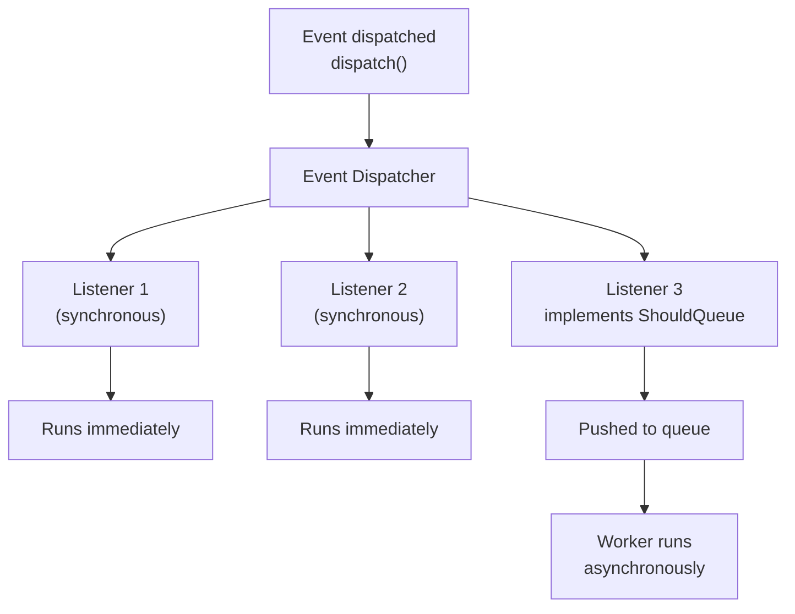

## What are events?

Laravel's event system implements the observer pattern. When something notable happens in your application—an order ships, a user registers—you dispatch an **event**. One or more **listeners** respond to that event independently.

This decouples your core business logic from side effects like sending emails or updating analytics. You can add, remove, or change listeners without touching the code that raised the event.



## Generating events and listeners

Use Artisan to scaffold events and listeners:

```shell
php artisan make:event OrderShipped

php artisan make:listener SendShipmentNotification --event=OrderShipped
```

Running the commands without arguments prompts you interactively for names.

## Registering events and listeners

### Event discovery (automatic)

By default, Laravel scans `app/Listeners` automatically and registers any listener method that begins with `handle` or `__invoke`. The event it listens to is determined by the type-hint in the method signature:

```php
use App\Events\OrderShipped;

class SendShipmentNotification
{
    /**
     * Handle the event.
     */
    public function handle(OrderShipped $event): void
    {
        // ...
    }
}
```

No manual registration needed. Cache the manifest before deploying to production:

```shell
php artisan event:cache

# Clear the cache
php artisan event:clear
```

### Manual registration

Register events manually inside `AppServiceProvider::boot` using the `Event` facade:

```php
use App\Events\OrderShipped;
use App\Listeners\SendShipmentNotification;
use Illuminate\Support\Facades\Event;

public function boot(): void
{
    Event::listen(
        OrderShipped::class,
        SendShipmentNotification::class,
    );
}
```

### Closure listeners

Register a closure directly for lightweight, one-off reactions:

```php
use App\Events\OrderShipped;
use Illuminate\Support\Facades\Event;

public function boot(): void
{
    Event::listen(function (OrderShipped $event) {
        // ...
    });
}
```

## Defining events

An event is a data container. It holds the information needed by listeners—nothing more:

```php
<?php

namespace App\Events;

use App\Models\Order;
use Illuminate\Broadcasting\InteractsWithSockets;
use Illuminate\Foundation\Events\Dispatchable;
use Illuminate\Queue\SerializesModels;

class OrderShipped
{
    use Dispatchable, InteractsWithSockets, SerializesModels;

    /**
     * Create a new event instance.
     */
    public function __construct(
        public Order $order,
    ) {}
}
```

`SerializesModels` ensures Eloquent models serialize correctly when the event is used with a queued listener.

## Defining listeners

Listeners receive the event in their `handle` method. The service container injects any constructor dependencies automatically:

```php
<?php

namespace App\Listeners;

use App\Events\OrderShipped;
use App\Services\ShipmentNotifier;

class SendShipmentNotification
{
    /**
     * Create the event listener.
     */
    public function __construct(
        protected ShipmentNotifier $notifier,
    ) {}

    /**
     * Handle the event.
     */
    public function handle(OrderShipped $event): void
    {
        $this->notifier->notify($event->order->user);
    }
}
```

Return `false` from `handle` to stop the event from propagating to other listeners.

## Dispatching events

Call `dispatch` on the event class:

```php
use App\Events\OrderShipped;

OrderShipped::dispatch($order);
```

Dispatch after the current database transaction commits, so listeners only run when the data is actually saved:

```php
use App\Events\OrderShipped;

OrderShipped::dispatchAfterCommit($order);
```

## Queued listeners

Listeners that send emails or call external APIs should run in the background. Implement `ShouldQueue` to push the listener onto the queue automatically:

```php
<?php

namespace App\Listeners;

use App\Events\OrderShipped;
use Illuminate\Contracts\Queue\ShouldQueue;
use Illuminate\Queue\InteractsWithQueue;

class SendShipmentNotification implements ShouldQueue
{
    use InteractsWithQueue;

    /**
     * The number of times the queued listener may be attempted.
     */
    public int $tries = 3;

    /**
     * Handle the event.
     */
    public function handle(OrderShipped $event): void
    {
        // Runs in a background queue worker...
    }

    /**
     * Handle a listener failure.
     */
    public function failed(OrderShipped $event, \Throwable $exception): void
    {
        // Clean up or notify on failure...
    }
}
```

Customize the queue connection and name:

```php
public string $connection = 'redis';
public string $queue = 'listeners';
```

### Queueable closure listeners

Wrap a closure with `queueable` to run it on the queue:

```php
use App\Events\OrderShipped;
use function Illuminate\Events\queueable;
use Illuminate\Support\Facades\Event;

Event::listen(queueable(function (OrderShipped $event) {
    // Runs in the background...
})->onQueue('notifications'));
```

## Event subscribers

An event subscriber is a single class that handles multiple events. Implement a `subscribe` method and register the class:

```php
<?php

namespace App\Listeners;

use App\Events\OrderPlaced;
use App\Events\OrderShipped;
use Illuminate\Events\Dispatcher;

class OrderEventSubscriber
{
    public function handleOrderPlaced(OrderPlaced $event): void
    {
        // ...
    }

    public function handleOrderShipped(OrderShipped $event): void
    {
        // ...
    }

    /**
     * Register the listeners for the subscriber.
     */
    public function subscribe(Dispatcher $events): void
    {
        $events->listen(OrderPlaced::class, [self::class, 'handleOrderPlaced']);
        $events->listen(OrderShipped::class, [self::class, 'handleOrderShipped']);
    }
}
```

Register the subscriber in `AppServiceProvider::boot`:

```php
use App\Listeners\OrderEventSubscriber;
use Illuminate\Support\Facades\Event;

Event::subscribe(OrderEventSubscriber::class);
```

## End-to-end example

<Steps>
  <Step title="Create the event">
    ```shell
    php artisan make:event OrderShipped
    ```

    ```php
    <?php

    namespace App\Events;

    use App\Models\Order;
    use Illuminate\Foundation\Events\Dispatchable;
    use Illuminate\Queue\SerializesModels;

    class OrderShipped
    {
        use Dispatchable, SerializesModels;

        public function __construct(
            public Order $order,
        ) {}
    }
    ```
  </Step>

  <Step title="Create the listener">
    ```shell
    php artisan make:listener SendShipmentNotification --event=OrderShipped
    ```

    ```php
    <?php

    namespace App\Listeners;

    use App\Events\OrderShipped;
    use App\Mail\OrderShippedMail;
    use Illuminate\Contracts\Queue\ShouldQueue;
    use Illuminate\Support\Facades\Mail;

    class SendShipmentNotification implements ShouldQueue
    {
        public function handle(OrderShipped $event): void
        {
            Mail::to($event->order->user->email)
                ->send(new OrderShippedMail($event->order));
        }
    }
    ```
  </Step>

  <Step title="Dispatch from the controller">
    ```php
    use App\Events\OrderShipped;
    use App\Models\Order;

    public function ship(Order $order): RedirectResponse
    {
        $order->update(['shipped_at' => now()]);

        OrderShipped::dispatch($order);

        return redirect()->route('orders.show', $order);
    }
    ```
  </Step>
</Steps>

## Testing events

Fake all events to assert they were dispatched without triggering listeners:

```php tab=Pest
use App\Events\OrderShipped;
use Illuminate\Support\Facades\Event;

test('order can be shipped', function () {
    Event::fake();

    $order = Order::factory()->create();

    $this->post("/orders/{$order->id}/ship");

    Event::assertDispatched(OrderShipped::class, function ($event) use ($order) {
        return $event->order->id === $order->id;
    });
});
```

```php tab=PHPUnit
use App\Events\OrderShipped;
use Illuminate\Support\Facades\Event;

public function test_order_can_be_shipped(): void
{
    Event::fake();

    $order = Order::factory()->create();

    $this->post("/orders/{$order->id}/ship");

    Event::assertDispatched(OrderShipped::class, function ($event) use ($order) {
        return $event->order->id === $order->id;
    });
}
```

<Card title="Queues" icon="list-check" href="/en/queues">
  Learn how to run queued listeners and background jobs at scale.
</Card>
